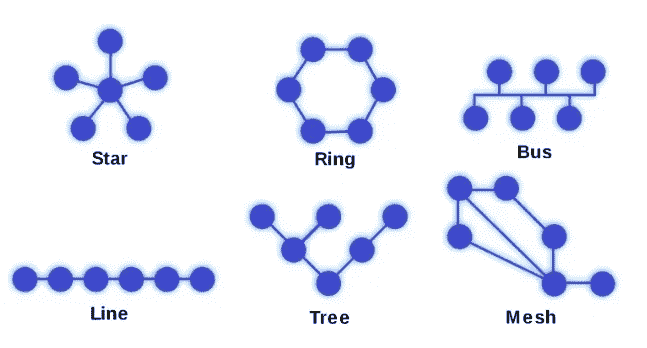

# 对网络的简要了解

> 原文：<https://medium.com/codex/a-brief-insight-into-networks-2171f1e9aea1?source=collection_archive---------4----------------------->

网络在当今世界已经变得不可或缺。他们将计算机相互连接，帮助建立数字结构。但是存在哪些类型的网络呢？他们表现如何？你应该知道哪些术语？在本文中，我将更详细地解释一些常见的技术术语。

[https://unsplash.com/photos/G66K_ERZRhM](https://unsplash.com/photos/G66K_ERZRhM)

这篇文章本身只涵盖了最基本的知识，并且只解释了一些技术术语来帮助你更好地在网络中找到自己的路。

> 如果你想了解更多关于网络和数据如何传输的知识，请阅读我的文章:[发送&接收——7 层 OSI 模型](/@sebastianstreng96/send-receive-the-7-layer-osi-model-e475829b999)

# 内容

*   什么是网络？
*   网络拓扑
*   IPv4 和 IPv6
*   互联网服务
*   结论

# 什么是网络？

网络是两台或多台计算机或其他电子设备的关联，支持数据交换和共享资源的使用。最简单的网络是对等网络，其中两台计算机通过电缆连接。

网络的主要任务是为参与者提供一个交换数据和共享资源的平台。这项任务如此重要，以至于没有网络，今天的日常生活和现代工作世界的大部分都是不可想象的。

网络是根据传输类型(有线或无线)及其范围来区分的。根据范围的不同，网络被称为 PAN、LAN、MAN、WAN 或 GAN。

*   **泛/WPAN —(无线)个域网:**
    如蓝牙、IrDA、WLANUSB，FireWire
    连接用户附近的电子设备。
*   **LAN/W-LAN —(无线)局域网:**
    如电脑、笔记本电脑、打印机；
    描述就其空间范围而言局限于局部区域的网络。
*   **城域网/WMAN —(无线)城域网:**
    例如城市、大学、写字楼；
    连接多个局域网的区域性宽带电信网络。
*   **广域网:网络:**
    如互联网，连接多个公司办公室；
    跨越国家甚至大洲的大规模网络。它们不连接单独的计算机，而是将其它网络如局域网或城域网相互连接
*   **GAN —全球区域网络:**
    例如国际公司全球各地的网络；
    能够跨越无限地理距离连接多个广域网的网络

# 网络拓扑

在计算机网络中，拓扑描述了几个设备之间的连接结构，以确保共享数据交换。网络的拓扑对于其故障安全也是决定性的。

[https://www . mbaknol . com/management-concepts/network-topology-and-types-of-network-topology/](https://www.mbaknol.com/management-concepts/network-topology-and-types-of-network-topologies/)

## 明星:

*   通信参与者围绕中心集线器以星形配置连接。
*   最常见的布线拓扑

> +简单的联网
> +简单的扩展
> +高可靠性
> +当网络节点是交换机时的高传输速率
> -高布线工作量
> -在故障或集线器过载的情况下出现电源故障
> -如果使用集线器，许多主机的低传输速率

## 戒指:

*   每台终端设备都恰好与另外两台设备相连
*   相反方向的内环可以防止完全失效
*   信息在参与者之间传递，直到到达目的地。

> +分布式控制
> +大网络范围
> +有保证的传输带宽
> +所有计算机都有相同的访问选项
> -耗时的故障排除
> -出现故障时，电源故障
> -高布线工作量

## 总线/线路:

*   1 根中央电缆
*   比如公交车站
*   每台计算机有单独的连接电缆

> +安装简单
> +布线工作量少
> +成本低
> -有限的执行长度
> -故障排除困难
> -频繁的数据冲突(因为只有一根电缆)
> -总线中断时完全断电

## 树:

*   每个终端设备连接到分配器，分配器相互连接
*   有一个根(第一个或上部节点),一条或多条边从该根发出

> +终端设备的故障没有后果
> +结构可扩展性
> +可能的大距离(组合)
> +对搜索和排序算法的良好适应性
> -如果根失败则完全失败
> -随着大小的增加延迟更差

## 网格:

*   分散式网络，其中所有网络节点都可以任意相互连接
*   连接采用最短的路线
*   如果连接中断，它仍然保持一个小弯路

> +分散控制
> +无限网络扩展
> +高可靠性
> -复杂管理
> -昂贵且高质量的网络

# IPv4 和 IPv6

# IPv4

IPv4 是互联网协议的名称，目前仍用于域的 IP 地址。这些 IP 地址在注册域时自动分配。IPv4 使用最多 12 个字符的 32 位地址，分为四个块，每个块包含三个字符

## IPv6

IPv6 地址长 128 位，由八个用冒号分隔的 16 位字段组成。每个字段必须包含一个十六进制数字，这与 IPv4 地址的十进制拆分表示法相反。

## 差异

> IP 代表互联网协议，通常指设备在网络上的特定位置。但是这个术语可能会引起混淆，因为有两种类型的 IP——IP v4，它创建于 1981 年；以及最近才全面实现的 IPv6。如果您有一个设备连接到您的家庭路由器或办公室计算机系统，您可能使用的是 IPv4 IP 地址。
> 
> 也就是说，两个版本实际上都属于一个类别——换句话说，它们都是 IP 地址。它们之间的主要区别是它们的大小(IPv4 是 32 位长，IPv6 是 128 位长)，但这对消费者来说还没有多少实际用途；典型的 IP 地址看起来就像由点分隔的数字串。由于现在大多数计算机都支持这两种协议，所以在网上浏览时使用哪种类型可能并不重要。"([https://inter lir . com/blog/2022/04/06/what-is-a-IP v4-address/](https://interlir.com/blog/2022/04/06/what-is-an-ipv4-address/))

# 互联网服务

## DNS —域名系统

它代表一个数据库，该数据库在 URL 的发音名称和相关联的 IP 地址之间建立连接。DNS 服务器代表其 DNS 客户端和 DNS 服务器执行作为递归查询的 DNS 客户端查询。DNS 缓存将结果临时存储在本地。

## 动态主机配置协议

可以自动或手动分配 IP 地址。
自动分配需要一个单独的协议— DHCP。主机必须联系 DHCP 服务器，通过以下过程获取 IP 地址:

*   终端站向 DHCP 服务器发送请求
*   DHCP 服务器从预先配置的可用地址池中选择一个地址，并在指定的时间段内将其分配给主机。这个时间段是可变的，可以配置

## Traceroute

它记录了数据包在网络上的路径。它由中间节点的 IP 地址序列和附加时间信息组成。

## 砰

它通过网络向指定的 IP 地址发送 ICMP 数据包回应，并等待回应形式的应答

# 结论

总之，网络可能非常复杂。为了了解网络的实际工作原理，有必要了解更多的相关协议，并对通过字节传输数据有一个基本的了解。本文展示了正在使用的网络拓扑、IPv4 和 IPv6 的区别以及众所周知的技术术语的实际含义。以后会有更多关于软件开发和网络技术的文章。感谢你阅读我的文章，如果你想了解更多，请关注我。

# 请查看我的其他文章:

*   [LINQ——如何避免 C#中的嵌套循环](/codex/linq-how-to-avoid-nested-loops-in-c-ed4ae19886e4)
*   [。Net C# —干净的架构&依赖-反转-原则](/dev-genius/net-c-clean-architecture-dependency-inversion-principle-7ea64f586c58)
*   [编程范例——简介](/dev-genius/programming-paradigms-a-very-short-brief-5324908640bd)
*   [C# —面向对象编程](/codex/c-object-oriented-programming-oop-2d92a5cd336f)
*   [C# —简单解释的单一责任](/@sebastianstreng96/c-single-responsibility-easily-explained-e3fabbf0d877)
*   [OCP——真正重要的是什么](/@sebastianstreng96/ocp-what-really-matters-610159d600dc)
*   [提高程序员积极性的 8 大技巧](/@sebastianstreng96/top-8-tips-to-improve-your-motivation-as-programmer-be63b2baaf7e)
*   [发送&接收——7 层 OSI 模型](/codex/send-receive-the-7-layer-osi-model-e475829b999)
*   [七层网络协议浅显易懂](/@sebastianstreng96/7-layer-network-protocols-easily-explained-e11e3e09f34d)