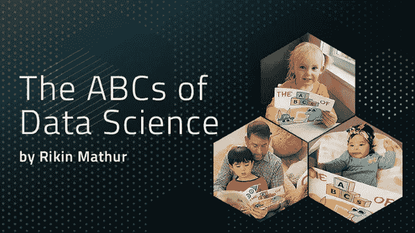
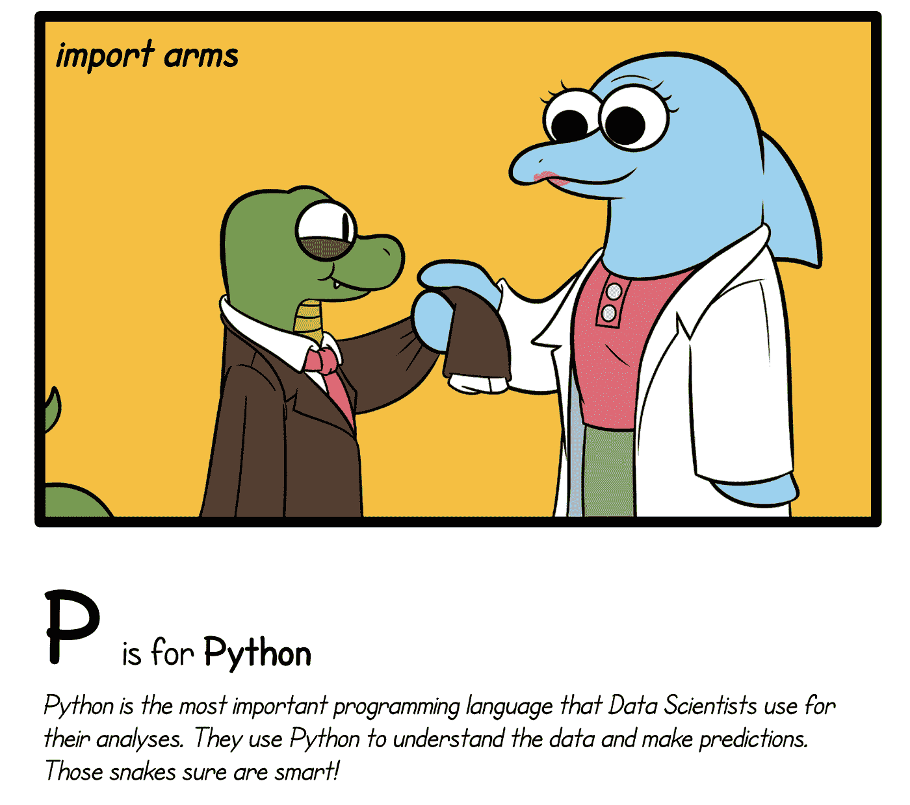
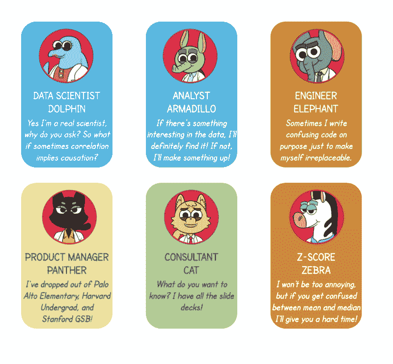
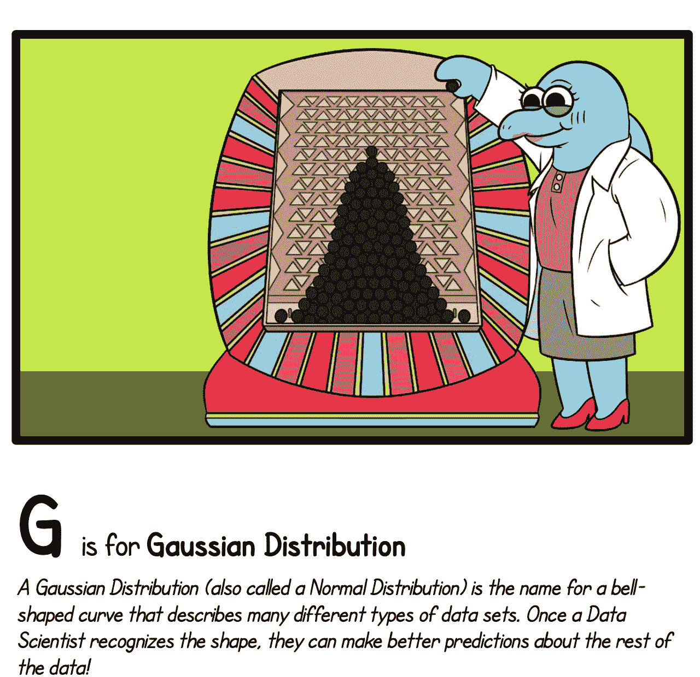

# 一本关于数据科学的儿童读物

> 原文：<https://medium.com/codex/a-childrens-book-about-data-science-e56f3a2ddce3?source=collection_archive---------2----------------------->

## [法典](http://medium.com/codex)

我 8 岁的侄子曾经问我，“我是做什么工作的？."我告诉他我是一名数据科学家。然后他问我“我有几个烧杯？”。除了认为孩子们会说一些最不可思议的事情，我很快意识到这个孩子对我做的事情一无所知。他为什么要这么做？这就是为什么我写了[数据科学基础知识](http://theabcsofdatascience.com)——在下一代中创造关于数据科学的曝光，因为它将是未来劳动力的一个关键学科。但也要讲几个笑话，取笑像我这样的人。

因此，如果您必须告诉某人我是做什么的，我将如何向朋友解释数据科学概念，而不是在现场？我可能会使用统计概念，如“平均”或“中位数”来解释一些概念。现在，给我侄子解释一下怎么样？很艰难，对吧？

数据科学基础知识—字母 P

我花了几个月(甚至几年，如果你算上我的第一个粗略笔记)写了《数据科学基础知识》,这本书充满了有趣的插图和数据科学的简单定义，孩子们可以相对容易地理解，但对成年人也非常重要。深入其中，我们的任务似乎很简单:字母表中的 26 个字母，26 个定义，以及一些有趣的插图。随着时间的推移，这本书变成了一个写定义的迭代过程(是的，我也写了迭代),我的朋友评论它，然后我重写，如此循环。这是这个夏天的故事，直到我们带来了一些更专业的数据科学家朋友，他们巩固了定义，并给了我们更多的插图想法。不管怎样，让我们看看里面是什么！

数据科学基础知识全明星办公室团队

写这本书时，我最喜欢的部分之一是那些带你经历这本书的旅程并真正赋予它生命的人物。**数据科学海豚**(不亚于神奇女侠，我是一个 DC 漫画家)在出演了由我的编辑撰写的 [**产品管理 ABC**](https://www.theabcsofproductmanagement.com/)之后，正在等待她的个人电影。我们真的想创造一些新角色作为协助 DS Dolphin 的旅程的一部分，并创造了分析师 Armadillo 和 Z-Score Zebra 来带领读者了解数据科学的定义。

我们来看一个定义:G 为高斯分布！

***高斯分布(也称为正态分布)是描述许多不同类型数据集的钟形曲线的名称。一旦数据科学家识别出形状，他们就可以对其余的数据做出更好的预测！***

当我开始写 G 的时候(我跳过了它，然后又回到了它)，我已经没有什么可说的了，真的，我很惊讶地发现用简单的词来表达它有多难。我们如何解释什么是分布，因为在书中 D 代表数据(不是分布)，我们是强调高斯分布的事实，还是解释高斯分布在所有统计学和数据科学中的重要性？我在写这些定义时学到的一件事(想象一个 9 或 10 岁的孩子正在读这本书)是，你只需要用简单的语言把它全部写出来。我认为我们最终得到的定义表达了这一点——“描述不同类型的数据集”，一种分布，以及“他们可以对其余的数据做出更好的预测”。正态分布通常使数据科学家更容易理解数据集的某些属性。

这本书现在在亚马逊上有售！首先，我强烈推荐去我们的[网站](http://theabcsofdatascience.com)看看里面的角色和一些有趣的定义！我们甚至在脸书上做了一个[现场阅读](https://www.facebook.com/565939282/videos/10159053323214283/)，希望这能给你更多关于我们为什么写这本书的背景。

那么，我们为什么要写这本书，为什么要写一本关于数据科学的儿童书籍呢？正如我们所知，数据科学是最受欢迎的职位之一，更不用说在技术领域了，这是有充分理由的:数据科学包括机器学习、人工智能、数学、统计、编程等，所有这些领域都将继续改变公司并塑造我们的未来。对我来说，重要的是我们要尽早开始，让孩子们从小学就开始好奇。最终，我们希望这本书能激励你的孩子、堂兄弟、侄女或侄子去学习数学或编程，如果我们幸运的话，能激励他们中的一个。

关于我:我是医疗保健 SAAS 公司 Komodo Health 的数据科学家和产品经理。我已经在几家公司使用分析和机器学习来帮助客户进行临床研究和药物开发，现在正在设法构建提供医疗保健解决方案的数据支持产品。

LinkedIn(随意伸手):【https://www.linkedin.com/in/rikinmathur/

insta gram:[instagram.com/rikinmathur](http://instagram.com/rikinmathur)