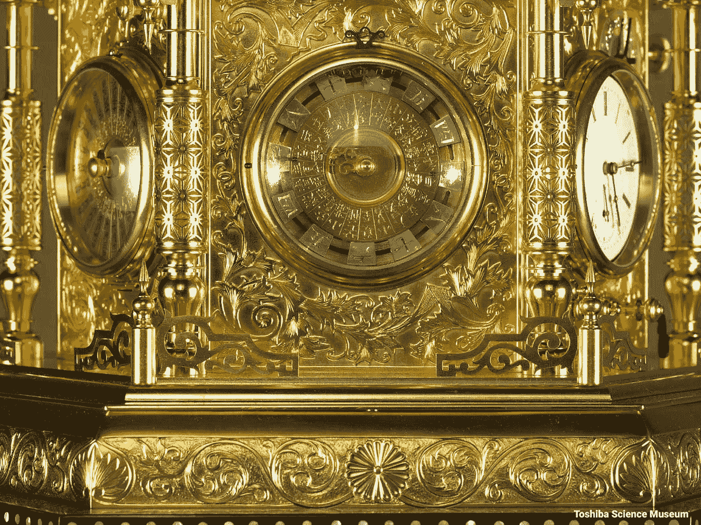

# 受日本兰乐学者田中久重启发的钟(上)

> 原文：<https://medium.com/codex/a-clock-inspired-by-hisashige-tanaka-a-japanese-rangaku-scholar-part-1-a666a9749cb2?source=collection_archive---------13----------------------->

小时候，我总是对数字和机械钟着迷。这个博客是关于展示一个由田中久志启发的时钟的演示。这篇博客是一系列博客文章的第一篇。

[田中久茂](https://museum.seiko.co.jp/en/knowledge/inventors_04/)

久茂是日本幕府时代和明治早期的日本幕府学者、工程师和发明家。1875 年，他创立了后来的东芝公司。他被称为“日本的托马斯·爱迪生”或“卡拉库里·吉门”。下面是久茂时钟提供的图片。想了解更多关于他的杰作，请点击 youtube 链接[这里](https://www.youtube.com/watch?v=ZTiPNqeMS8E)。

图片参考可用[此处](https://www.horobox.com/en/review-detail/the-flawless-genius-of-far-east-hisashige-tanaka)

Hisashige Tanaka 时钟使用日本特有的时间系统来计算时间。白天和夜间被分为 6 个部分。部分的绝对长度随季节而变化。在夏季，白天的长度比夜晚长，因此白天的时间段更长。时钟的时间会根据一年中的某一天而增减。

# 新时钟

新的时钟设计会有一点不同。圆形时钟，有 24 个代表 24 小时的指针。钟的上半部分代表白天，下半部分代表夜晚。点(-1，0)和(1，0)分别代表日照和日落。

该指数应该能够移动，以显示根据季节变化的时间。小时刻度不在中心，但有偏移。小时的指数根据一年中的日子和季节(时钟位置和在地球上的位置、高度和振幅)而扩展和收缩。在夏季，更多的指数出现在时钟的顶端。在冬天，情况正好相反。美国俄克拉荷马州斯蒂尔沃特的时钟模拟如下所示。

时钟的主要设计得益于微型计算机，可以演示动态行为。下面提供了一个演示(python 编程和多处理库的结合)。

# 下一步

下一步是将 24 个索引移动转换为 1 个移动。

*换句话说，一个旋转机芯应该能够协调整个时钟机芯。*

我最喜欢的音乐家埃尼奥·莫里康

谢了。