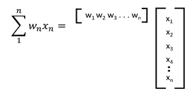
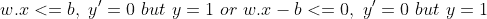

# 深入研究深度学习中的感知机模型

> 原文：<https://medium.com/codex/a-closer-look-into-the-perceptron-model-in-deep-learning-eea75fb4084?source=collection_archive---------15----------------------->

## 用步长增量学习算法在真实数据集上训练

# **内容**

1.[简介](#a95a)
2。[新车型的需求](#c8c8)
3。[感知器](#ea5b)
4。[算法是什么？](#3e9d)
5。[用 Python 实现我们的模型](#a423)

# 1.介绍

在我们之前的讨论中， [*人工智能和深度学习入门*](/codex/getting-started-with-artificial-intelligence-and-deep-learning-eb6d4694e652?source=friends_link&sk=c23ab7c45fc975e5a4f0034007b13d1d) ，我们开始构建一些基本概念，定义一些介绍性术语，并研究用手机玩具数据集对 *MP 神经元*进行训练。最后，我们为我们的神经元编写了一个 Python 类，给定一个训练数据集，它将实现*强力*算法。

从那里开始，我们现在将研究 MP 神经元和暴力算法的一些缺点，然后介绍一个新的模型。也是时候开始我们的技术在现实生活中的应用了，为此我们将加载并馈入我们的新模型，一个*乳腺癌预测数据集，*稍后详述。

所以让我们开始吧。


照片由 [Fotis Fotopoulos](https://unsplash.com/@ffstop?utm_source=unsplash&utm_medium=referral&utm_content=creditCopyText) 在 [Unsplash](https://unsplash.com/s/photos/machine-learning?utm_source=unsplash&utm_medium=referral&utm_content=creditCopyText) 上拍摄

# 2.对新模式的需求

为了讨论 MP 神经元模型的一些局限性，我们将再次查看我们的玩具数据集。


按作者分类的表格

我们可以从这里的数据中得出以下结论:

*   我们的数据集中的输入必须以*二进制、*二进制给出，这是现实生活数据中很少见到的特征。使用真实值的模型可以更好地训练，提供更高的精度，并使用更多样化的数据集。
*   输出也是*二进制。*这限制了我们可以处理的数据。在许多应用中，有些涉及到*自然语言处理，*我们可能不得不做所谓的*多类分类，*也就是说，我们的输出必须归入几个类别中的一个。要做到这一点，我们必须从前面定义的阈值概念(如果 sum > = threshold，output = 1，否则为 0)中找到一个变通方法，并处理概率。这个想法会在以后的帖子里详细阐述。
*   由于我们只限于二进制数据，所以我们所有的输入参数都具有相同的权重和同等的重要性，即价格或屏幕尺寸对输出的影响是同等的。然而，现实生活中的决策必须能够分配*、*权重，并确保更重要的属性得到充分的体现。例如，价格是许多人购买时最重要的方面。
*   我们的*蛮力*算法太原始，没有充分利用我们可用的*计算资源*。此外，我们的模型只需要学习一个参数，在我们的玩具数据集中预测的阈值，也仅限于整数值。然而，在深度学习中，同时处理数百万个取*实*值的参数是很常见的。在这种情况下，尝试每种组合是不可能的。即使在简单的数据集中，大量的样本也会使该算法效率低下。我们将在后面的旅程中看到，在这种情况下，数学解决方案会帮助我们。

# 3.感知器

既然我们已经讨论了对更新模型的需求，那么是时候引入*感知器了，*这是深度学习中更复杂但更基本的单元。这里最重要的升级是，我们可以对我们的输入进行加权表示，这使得神经元在训练过程中更加灵活。感知器模型如下图所示。


作者图片

我们可以看到，现在我们将对所有这些参数进行加权表示，并为每个`**xn**`定义一个权重`**wn**`，而不仅仅是输入`**x1**` 到`**xn**`。因为我们要处理更多的参数，建议开始使用矩阵和向量来表示。

我们的权重和输入值可以用以下格式表示:

重量:[w1 w2 w3 w4。。。wn]

输入值:[x1 x2 x3 x4。。。xn]

这里需要注意的是，这些权重不是给我们的，也不是我们数据的一部分。这些权重由我们的模型学习，即通过训练确定适当的值，以便我们的模型可以准确预测。在我们的模型中，


为了将这些输入关联到我们的输出，我们将遵循类似的方法。给定我们从`**w1x1**` 到`**wnxn**`的加权输入，我们可以取它们的总和。现在，如果这个总和大于给定的阈值，我们的模型将预测 1，否则为 0。这可以表示为，


# 4.算法是什么？

现在我们已经定义了我们的模型，是时候看看我们将用来训练我们的模型的学习算法了。由于我们没有任何特定的学习权重可以使用，我们将开始初始化我们所有的权重为 1。我们的阈值也是未知的，所以我们将其赋值为 0。

然后，我们将输入传递给模型，计算预测值，并将其与我们从数据中获得的真实值进行比较。这里，可能会出现两种不希望出现的情况。


让我们看看我们的学习算法能做些什么来纠正这一点。我们将考虑第一种情况。

这里有个小改动。我们将使用简写符号 **w.x** 来表示权重和输入的向量积。下图说明了这一点。



我们可以将上面的第一种情况改写为:



上式中，`*-b*` 可以表示为`**w₀x₀**`，其中`**w₀**= -b`和`**x₀**= 1`。

这样，我们以最简洁的方式写下我们的等式，如下所示:


现在是算法的关键。

如果神经元要正确预测，乘积 **w.x** 必须为> = 0。由于此时< = 0，我们需要给 **w.x** 加上一些*正数*，使其值增加并越过 0。所以我们需要的是，


我们需要确定这些正项是什么。因为我们只有输入数据，所以让我们看看如何从中获得一些正的量。给定我们的输入，我们可以得到它的和。


因此，我们可以对所有输入的平方求和，我们将得到一个正数，它可以添加到加权输入的总和中。即使它们仍然没有越过 0 的阈值，我们也可以肯定这是朝着正确方向的一步，因此这将在我们的学习算法中实现。

加上正项，我们的等式就变成了，


修改和分解，


或者


在哪里，


万一情况是这样，


更新应该是，


这样，所需的负项将是，


这是我们新的学习算法，即*步长增量*方法，我们遍历数据中的每个样本，将其传递给神经元，并更新我们的权重和阈值以与之匹配。一些样本点可能需要负增量，一些需要正增量，目标是找到平衡点，使我们的精度最大化。

在培训期间，我们将浏览所有示例，并对每个示例进行更新。有时，为了获得更好的结果，需要多次遍历整个数据，因此我们可以选择查看所有样本的次数。这个数字被称为*时代*，这是你在培训网络时会遇到的一个流行术语。

这里需要注意的是，我们为了更新而增加的正负项可能太大了。有时，通过将这个值乘以一个适当的分数(称为*学习率*)来缩小这个值是有帮助的。这确保了增量得到控制，从而使培训过程顺利进行。如果我们实现了学习率，我们的更新将如下所示。


这会将正负项缩小 *lr。*


现在我们已经看到了我们的算法是如何工作的，让我们看看它是如何实现的。我们将运行一个由直觉决定的设定次数的外部循环。对于循环的每次迭代，我们将运行一个内部循环，迭代每个数据样本并更新我们的权重。在每个时期之后，我们将计算训练数据本身的精确度。一旦整个过程完成，我们将找到精确度最高的砝码，然后*瞧！我们已经完成了学习。*

这里有一个旁注。我们提到了两个术语，*学习率*和*纪元*。这些属性属于*超参数*的类别。之所以这样称呼它们，是因为这些值控制着我们网络的结构，决定着我们的训练进度，但并不直接参与给定输入的输出计算。与经过*训练的砝码不同，*砝码经过*调整，*即尝试不同的组合，选择表现最佳的组合。对于 ML 从业者来说，超参数调整是非常关键的，以确保任何开发模型的最佳性能。如果网络经过仔细调整，并且训练过程平稳，没有任何干扰波动，就可以达到非常高的精确度。

# 5.用 Python 实现我们的模型

我们现在已经建立了我们的理论基础，并准备开始将这些概念付诸实践。让我们转到 Python，用步长增量学习算法实现我们的感知器模型。

对于那些刚刚踏上旅程并且还没有意识到的人来说，使用 *Google Colaboratory 构建和处理许多数据科学和 ML 项目是很常见的。这是谷歌研究院提供的一款产品，允许用户在浏览器上编写和执行代码，无需任何预先设置。Colab 允许用户连接到 Google 的计算引擎后端并利用其资源，因此您可以自由地处理复杂的项目，而不必担心任何系统需求。一个基于网络的交互环境，称为 *Jupyter Notebook，*用于构建代码和处理数据。所有内容都存储在您的硬盘上，因此您可以随时与他人分享。你可以在这里开始使用 Colab [。](https://colab.research.google.com/)*

在 Python 中，我们将实现我们上面看到的感知器模型，以解决从加州大学欧文分校机器学习库导入的*乳腺癌数据库*的分类问题。数据最初是从麦迪逊的威斯康星大学医院收集的。

数据集的性质是多变量的，即有几个输入参数将用于二进制分类成两类，*良性*(未检测到)或*恶性*(检测到)。

让我们训练我们的模型来准确预测这些数据。

我们将首先导入该任务所需的库。

```
import sklearn.datasetsimport numpy as npimport seaborn as snsimport pandas as pdfrom sklearn.model_selection import train_test_split
```

接下来，我们将从`sklearn.datasets`加载这些数据。两个变量 X 和 Y (NumPy 数组)将用于存储输入值及其相应的*基础事实*(真实分类值)。

```
breast_cancer = sklearn.datasets.load_breast_cancer()X = breast_cancer.dataY = breast_cancer.target
```

我们可以使用`pandas.Dataframe`以表格的方式可视化我们的数据。我们可以将目标值追加到表中名为 class 的列下，然后查看表的前 5 行。

```
data = pd.DataFrame(breast_cancer.data, columns = breast_cancer.feature_names)data['class'] = breast_cancer.targetdata.head()
```


按作者分类的表格

我们不想对我们的全部数据进行训练，相反，我们会忽略一些点，我们的模型只有在完成训练后才会看到这些点。这被称为*评估*数据，将作为我们模型的测试，看看它如何实际预测给定的新样本。

我们可以使用来自`sklearn` 的`train_test_split`来帮助我们拆分数据。

```
X_train, X_test, Y_train, Y_test = train_test_split(X,Y, test_size = 0.05, stratify = Y, random_state = 1)
```

我们将 X(输入)和标签传递给函数。此外，我们指定了几个参数。

*   `test_size` 将决定测试数据与我们整个数据集相比的大小。
*   `stratify = Y`确保 Y 的分布在训练和测试数据集中保持相等。我们不想在所有 Y 都等于 1 的情况下进行训练，然后传递一个正确输出为 0 的样本。
*   `random_state = 1`确保结果的重现性。每次调用该函数时，将返回具有相同样本的相同除法。

让我们打印出我们创建的所有数据集的大小。

```
print(X_train.shape, Y_train.shape, X_test.shape, Y_test.shape)**Output:** 
(540, 30) (540,) (29, 30) (29,)
```

我们的训练数据有 540 个不同的样本，30 个不同的输入参数。相应的，`X_train`中每个样本有 540 个不同的真标签。测试数据集的大小是 29 而不是 540。

好了，现在我们已经处理并准备好了用于训练的数据，让我们为我们的感知器模型构建一个类，它将训练数据作为输入来实现我们上面讨论的整个管道。

在这里写类的一个旁注。在深度学习中，将网络的整个结构集成到单个类中是一种很好的做法，我们可以实例化并调用我们的训练数据。虽然这需要程序员付出更多的努力，但将网络的全部功能捆绑到单个对象中，可以很容易地实例化、运行训练循环和预测任何给定的数据。此外，与我们将孤立的函数放在周围相比，调试的过程也简化了。当我们开始使用像 *PyTorch* 这样的流行库时，这种编写整洁和结构化代码的过程就有了回报，在这些库中，我们只需一行代码就可以轻松调用整个预先训练好的网络，并从父类继承构建我们自己的网络。

这是我们的感知器类和学习算法的实现。

我们的`__init__` 函数将两个参数`self.w`和`self.b`初始化为*无*。这些将被训练在我们的数据集上进行预测。对于具有 *n* 个参数的每个样本，`model`函数使用`self.w`和`self.b`返回预测。`predict` 函数帮助我们为整个数据中的每个样本调用`model` 函数，并将结果存储在一个将被返回的列表中。

`train` 函数是我们实现算法的地方。首先，我们需要确保`self.w`的大小与我们预测所需的参数或属性的数量相同(向量的大小必须相同)。我们初始化另外两个列表，一个存储我们得到的所有精度值，另一个存储我们在更新后得到的所有不同的权重。对于我们指定的`epochs` 的数量，我们将遍历每个样本(x)及其对应的标签并进行更新。在我们传递数据一次后，我们将使用来自`sklearn`的`accuracy_score` 计算精度，并将其添加到我们的精度列表中。此时的权重也存储在权重矩阵中。

保持最大准确度的连续计数，并且每当超过最大准确度时，存储该更新的权重和准确度。在所有时期完成后，最佳值被分配给权重。还可以绘制精度列表，以便进一步了解。

为了对我们现有的数据进行训练，让我们将它的类型改为 NumPy 数组。然后我们可以实例化这个类，并对我们的数据调用`train` 函数。在我们的训练完成后，我们将对测试数据进行预测，并计算准确性。

```
X_train_np = X_train.to_numpy()X_test_np = X_test.to_numpy()percep_model = Perceptron()percep_model.train(X_train_np,Y_train,epochs = 200,lr =0.5)y_prediction = percep_model.predict(X_test_np)print('Accuracy on test data is',accuracy_score(y_prediction,Y_test))
```

执行这段代码，我们得到以下输出和绘图。


按作者分类的图表

```
**Output:**
max accuracy occurs at epoch value equal to 185 and is equal to  0.9203703703703704Accuracy on test data is 0.896551724137931
```

至此，我们结束了感知器模型的实现。我们已经看到了如何导入外部数据集，并使用 *Pandas* 的基础知识来可视化它。在创建了训练和测试数据集之后，我们编写了一个类来实现整个训练管道。在以后的文章中，我们将在讨论感知器模型的一些局限性之后，介绍 *Sigmoid* 神经元。我们还将从组合几个神经元来形成一个完整的*神经网络*开始，并深入研究更复杂和有效的学习算法。在那之前，快乐训练！

## 引文(*乳腺癌威斯康星数据集*)

1.  O.L. Mangasarian 和 W. H. Wolberg:“通过线性
    规划进行癌症诊断”，《暹罗新闻》，第 23 卷，第 5 期，1990 年 9 月，第 1 页&第 18 页。
2.  William H. Wolberg 和 O.L. Mangasarian:“用于乳腺细胞学医疗诊断的多表面
    模式分离方法”，
    美国国家科学院学报，第 87 卷，
    1990 年 12 月，第 9193–9196 页。
3.  O.L. Mangasarian、R. Setiono 和 W.H. Wolberg:“通过线性规划的模式识别
    :理论和在医学诊断中的应用”，
    《大规模数值优化》，Thomas F. Coleman 和
    Li 编辑，SIAM Publications，费城，1990 年，第 22-30 页。
4.  K.P. Bennett & O. L. Mangasarian:“鲁棒线性规划
    两个线性不可分集合的判别”，最优化方法
    与软件 1，1992，23–34(戈登&违约科学出版社)。