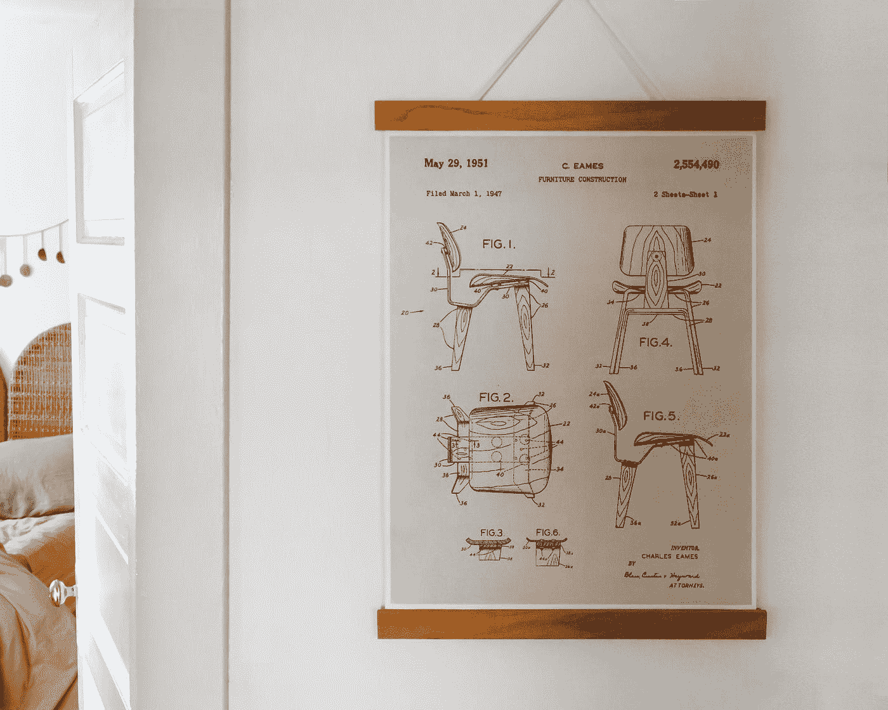

# 软件设计表示的比较

> 原文：<https://medium.com/codex/a-comparison-of-design-software-representation-b3ea5037479e?source=collection_archive---------14----------------------->

## 代表一些不可触摸的东西。

在 [Unsplash](https://unsplash.com?utm_source=medium&utm_medium=referral) 上由 [Dennis Scherdt](https://unsplash.com/@ahnako?utm_source=medium&utm_medium=referral) 拍照

对工程世界的一个相对年轻的贡献是软件工程。随着软件的发明，我们现在可以用程序和应用程序来做我们通常会做的工作或我们通常会执行的计算。尽管软件有很多好处，但它离不开…