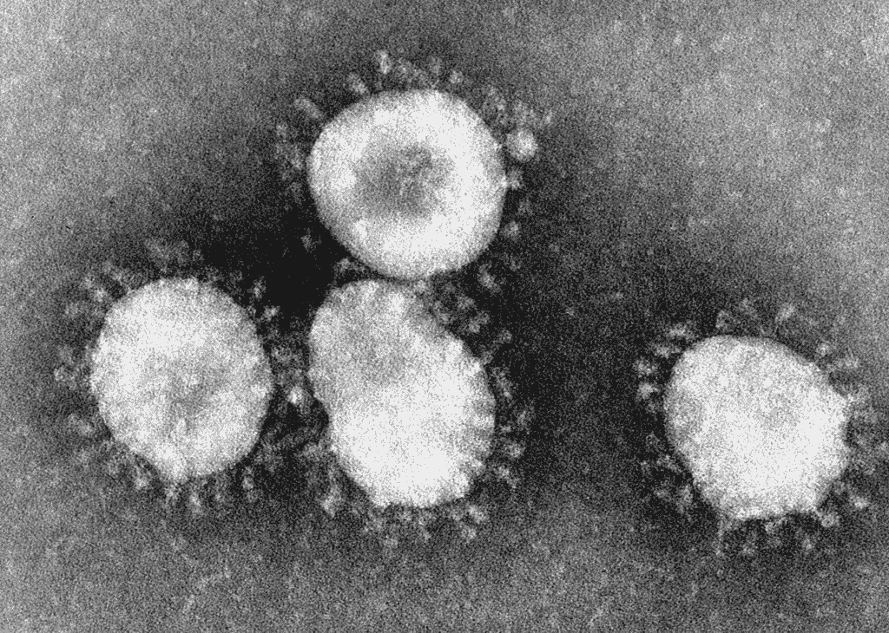

# 印度和尼泊尔冠状病毒第二次爆发的比较

> 原文：<https://medium.com/codex/a-comparison-of-india-and-nepals-second-surge-of-the-coronavirus-921cb1d53743?source=collection_archive---------7----------------------->

在我的上一篇文章中，我研究了尼泊尔冠状病毒第二次激增的严重性，以及社会的构成如何影响新病例和新死亡的数量。尼泊尔灾难性的 COV19 激增是由多种因素造成的。当印度遭遇第二次疫情时，人们越过北部开放的边境来到尼泊尔，并把疾病带到了那个地区…