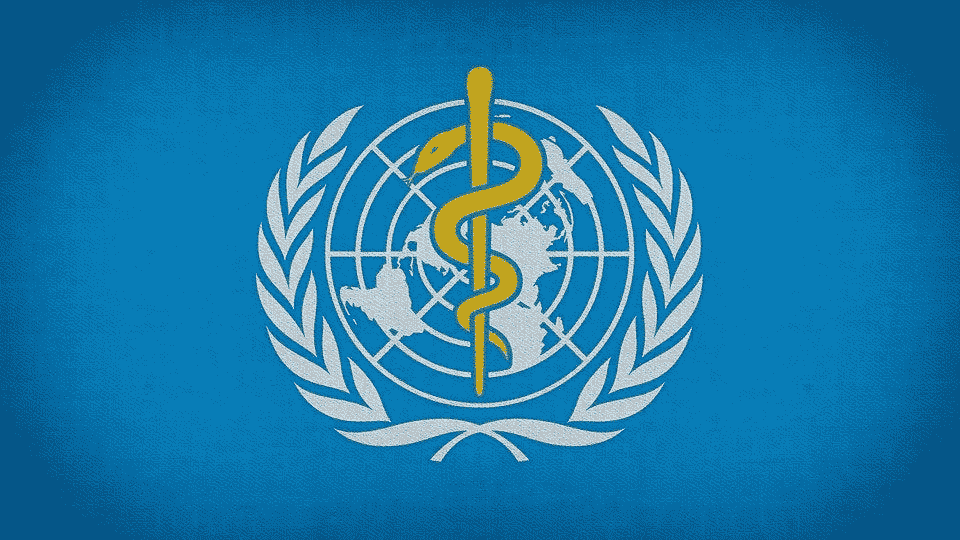

# 基于世界卫生组织数据的英国和美国预期寿命的比较

> 原文：<https://medium.com/codex/a-comparison-of-the-uk-and-uss-life-expectancy-based-on-world-health-organisation-data-c4eafaafc1f7?source=collection_archive---------11----------------------->

在我最近的一篇文章中，我分析了世界卫生组织对英国从 2000 年到 2015 年的预期寿命。尽管数据集很旧，但出于历史目的，检查数据集中任何国家的预期寿命仍然是有意义的。虽然我检查了英国的预期寿命，但任何用户都可以检查 193 个国家中的任何一个…