# React.js 初学者完全指南

> 原文：<https://medium.com/codex/a-complete-beginners-guide-for-react-js-852d3e4bae85?source=collection_archive---------12----------------------->

## 10 分钟内开始使用 React.js


# 目录

1.  *什么是反应？*
2.  *为什么学反应？*
3.  *入门指南！！*
4.  *文件夹结构*
5.  *你需要知道的基本概念*
6.  *结论*

# 什么是反应？

*   *React 是一个开源的* ***库*** *用于构建用户界面。*
*   *React 不是一个* **框架** *。*
*   *其唯一的重点是开发* ***UI*** *界面。*
*   React 不支持路由或 HTTP 请求，因为它只关注 UI。但是 React 可以毫不费力地与提供所需特性的其他库集成。
*   *React 由* ***脸书*** *创建并维护，拥有庞大的社区。*

# 为什么要反应？

*   React 有一个基于组件的架构。
*   React 对于编写可重用代码非常有用。
*   React 本质上是声明性的，这意味着我们从不与 DOM 交互，当我们改变状态时，UI 会更新。
*   *React 可以轻松集成到任何应用程序中。*
*   *React 可用于开发单个组件、页面或整个应用程序。*

# *‘这个’*关键字

> **‘this’**关键字会一次又一次的不断弹出，清楚的理解 react 和 js 中的用法很重要。
> 
> **“this”关键字通常引用 JavaScript 元素，这取决于其使用的范围或上下文。**
> 
> 参考本文:[https://medium . com/byte-size-react/what-is-this-in-react-25 c62c 31480](/byte-sized-react/what-is-this-in-react-25c62c31480)

# 开始

*开始使用 React 你所需要的只是*[*node . js*](https://nodejs.org/en/download/)*和你选择的文本编辑器。*

开始使用 React 的最好方法是使用`create-react-app` npm 包，它帮助你用所有必要的文件和配置建立全新的 React 项目。

```
npm install -g create-react-app
create-react-app helloworldornpx create-react-app helloworld
```

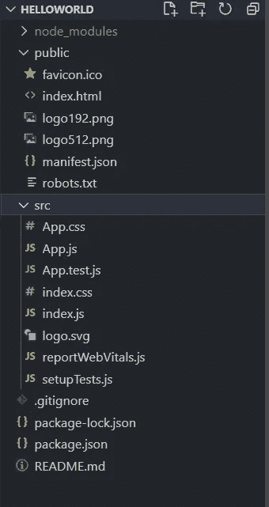

生成的文件

从创建的项目运行`npm start`来服务默认网页。

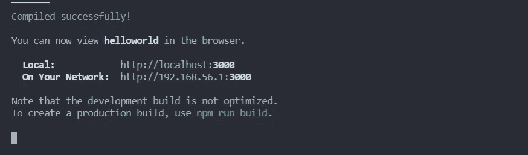

react 的默认服务端口是 3000

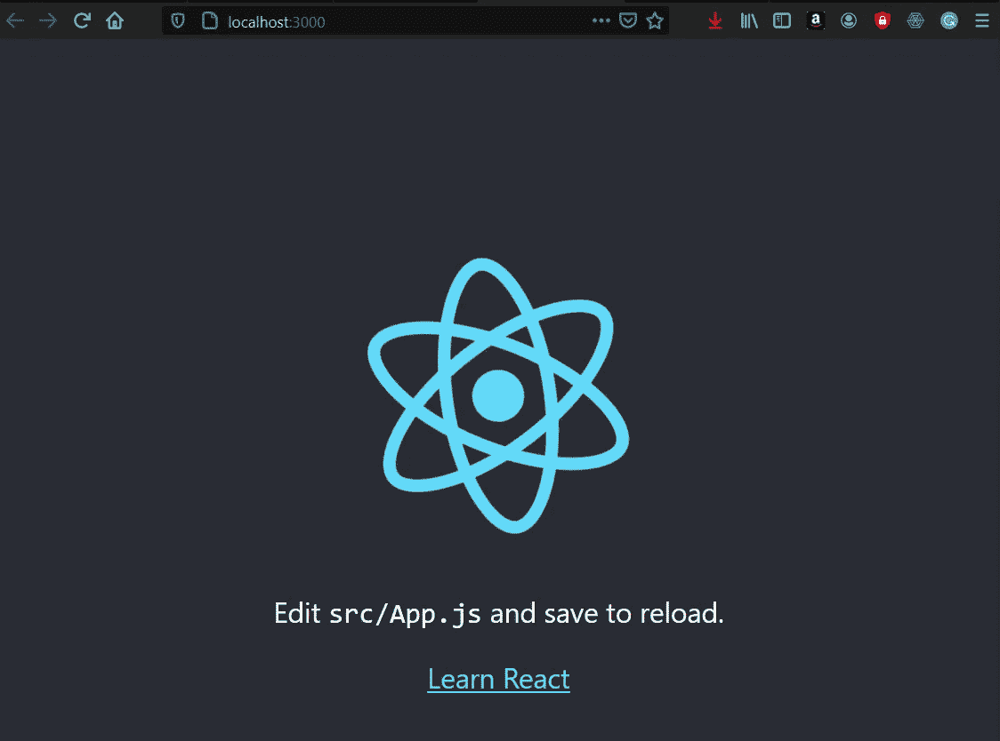

create-react-app 附带的默认页面

# 文件夹结构


生成的文件

**package.json :** 它保存了关于项目的元数据。配置对工作区中所有项目都可用的 [npm 包依赖关系](https://angular.io/guide/npm-packages)。

**node_modules:** 安装所有需要的依赖项的地方。

## **/公共:**

*   **manifest.json :** 创建 React App 的 PWA *(渐进式 Web 应用)*时需要这个文件。*(参考官方文档:*[*https://create-react-app . dev/docs/making-a-progressive-we b-app/*](https://create-react-app.dev/docs/making-a-progressive-web-app/)*)。*
*   **index.html:**它是我们网页的入口点，body 标签里只有一个 id='root '的 div 标签。它引用了 React 应用程序中的根组件。

## **/src:**

*   这是一个非常重要的文件夹，你可以在这里编写 React 应用的所有源代码。

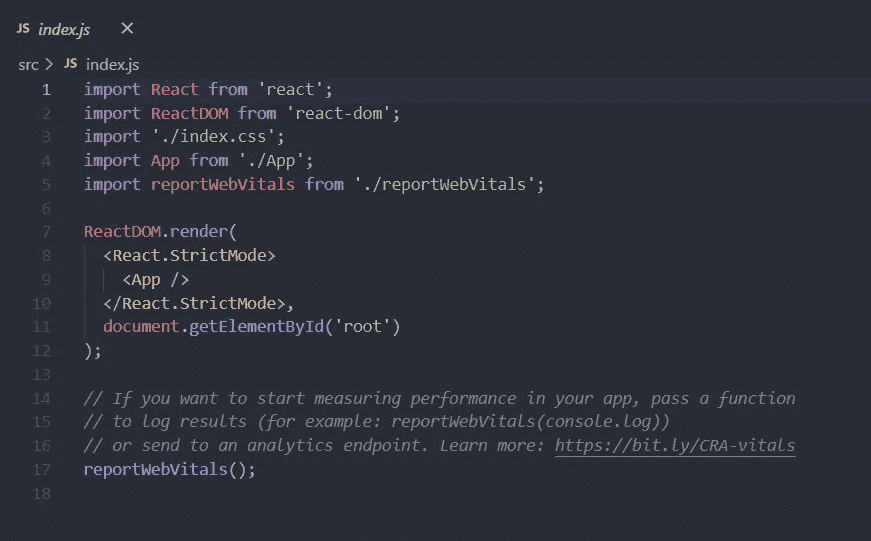

索引. js

**index.js:** 它是我们 React 应用程序的入口点，使用`react-dom`，我们在 index.html 文件中 id 为‘root’的< div >中呈现我们的 React 应用程序。

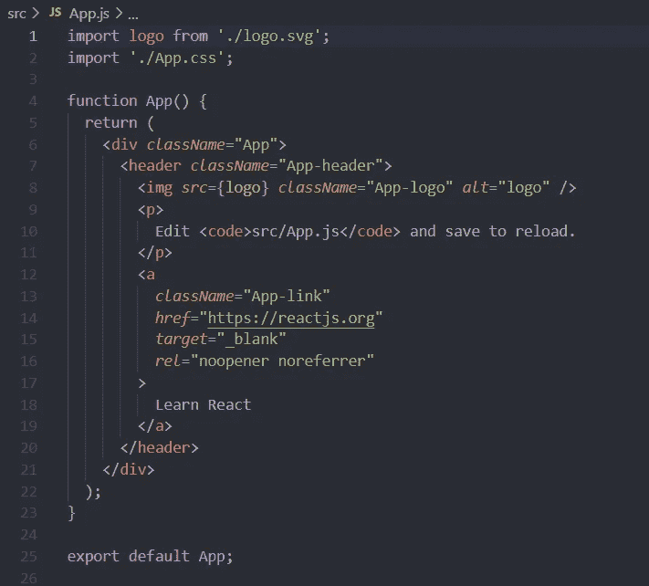

App.js

这是我们 React 应用程序的根组件。`create-react-app`我已经为你开发了一个虚拟页面。*(此处引用 App.css 文件，其中包含 App 组件的所有样式)。*

> 你一定注意到在 App.js 中返回了 JSX，而不是在标记中使用' class '属性，而是使用了' className '。这是因为 class 是 React 中的一个保留关键字，它用于声明一个 JS 类，所以用 className 代替，它的作用是一样的。

> 在开始开发你的应用程序之前，删除所有`create-react-app`生成的多余文件和代码。
> 
> 删除**logo192.png**和**logo512.png**、 **logo.svg** 文件及其声明&清空 **App.css** 并使 **App.js** 文件中的函数 App 返回`<div></div>`

# 你需要知道的基本概念

*   *JSX*
*   *组件:类组件&功能组件*
*   *道具*
*   *状态*
*   *事件处理*
*   *绑定事件处理程序*
*   *组件生命周期方法*

# JSX

JavaScript XML (JSX)是 JavaScript 语言语法的扩展，我们使用 JSX 来编写 React 中的元素和组件。

JSX 不是使用 React 的必要条件，每个 JSX 元素只是调用`React.createElement(component, props, ...children)`的语法糖

JSX 使代码更加简洁。

> 参考此文件:[https://reactjs.org/docs/react-without-jsx.html](https://reactjs.org/docs/react-without-jsx.html)

# 成分

组件代表用户界面的一部分，组件就像返回 React 元素的 JavaScript 函数。我们构建的所有组件都包含在根组件中。

带有 App function 的 App.js 表示根组件，它导出由 index.js 文件导入并声明为`**<App/>**`的 App 组件，该组件由 App 函数返回的 JSX 替换。

## **功能组件或无状态组件**

顾名思义，它本质上是无状态的，工作方式类似于 JavaScript 函数，它可能需要一些输入并返回描述 UI 的 JSX。

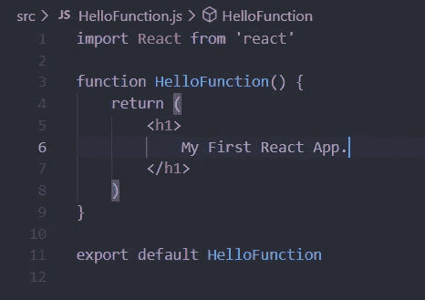

在 src 文件夹中创建一个文件 **HelloFunction.js**

这个 HelloFunction()返回`<h1>My First React App.</h1>`，在 App.js 中导入这个函数并添加标签`<HelloFunction/>`

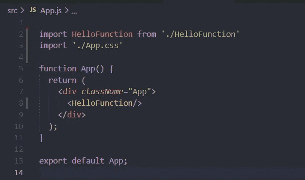

App.js

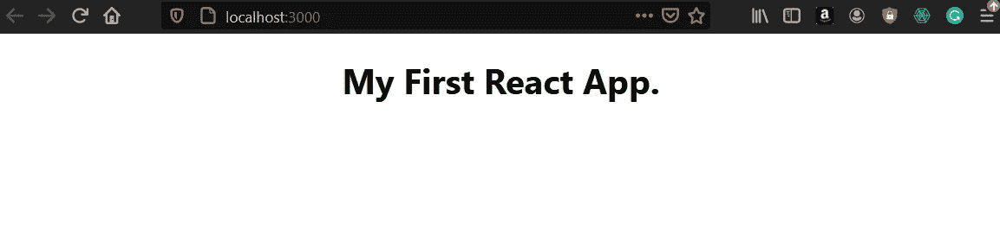

线代表由<hellofunction>引起的变化</hellofunction>

> 功能组件是无状态的，这意味着它们不能记忆或保留并反映数据的变化，响应只反映功能输入的变化。
> 
> 从 React 16.8 版本开始，React 钩子被添加进来，为功能组件提供一些状态。参考:[https://reactjs.org/docs/hooks-intro.html](https://reactjs.org/docs/hooks-intro.html)

## **类组件或有状态组件**

顾名思义，它本质上是有状态的，这意味着它有一些独立的状态，状态通常代表数据。这是一个 JS 类，扩展了 React。组件类，并且必须包含返回 JSX 的呈现方法。

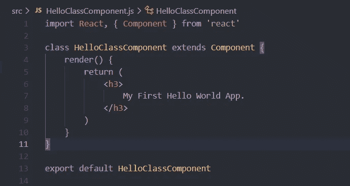

在 sr 文件夹中创建 HelloClassComponent.js

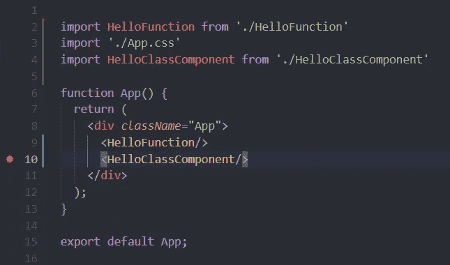

在 App.js 中导入 HelloClassComponent

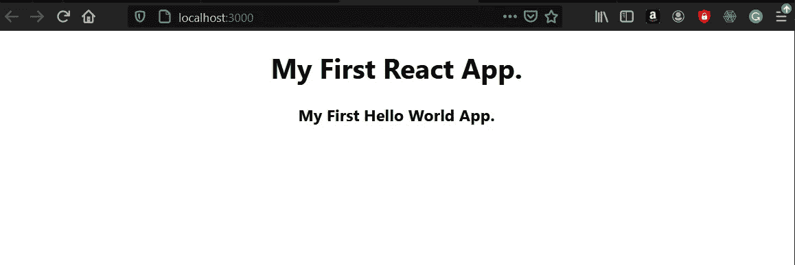

第二行代表由<helloclasscomponent>引起的变化</helloclasscomponent>

# **道具**

Props 是指传递给函数或类组件的参数。道具本质上是不可变的。组件是在考虑可重用性的情况下构建的，所以如果你复制粘贴`<HelloFunction/>` 10 次，你会看到“我的第一个 React 应用”10 次作为输出。

但是你可能想在不同的时间打印不同的文本，因此 props 进入图片，我们只需将文本作为 props 传递给组件，它将由该组件呈现。这将节省大量的时间，因为你不必创建 10 个不同的组件，这是相同的，但不同的数据。

Props 可以作为属性传递给组件的标签。

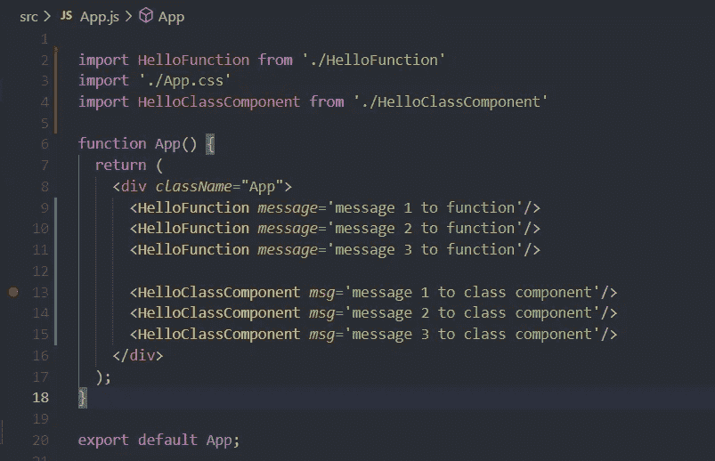

向组件添加属性 msg 和 message。

现在，在传递了 props 之后，需要在组件中处理它。功能组件直接接收函数的参数。

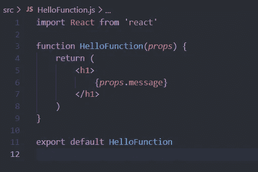

在功能组件中处理道具。

> 花括号{}是计算 JavaScript 表达式的特殊 JSX 语法，因此,`props.message`的值被计算并替换为表达式。

在类组件中，属性是在构造函数中接收的，当我们扩展 React 时，必须从构造函数中调用 super(props)。组件类。

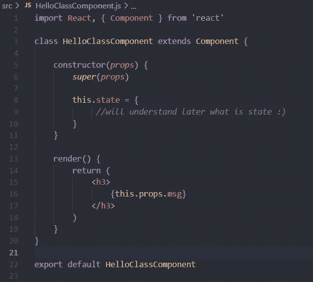

处理类组件中的道具。

> “this”关键字用于访问类组件的 props 对象。

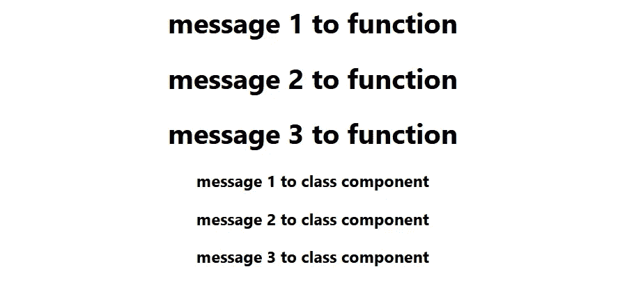

通过道具后输出。

# **状态**

状态在组件中被管理，本质上是不可变的，用于存储可变数据，状态只是影响组件中 UI 的数据。

状态使得 React 成为一个非常强大的工具。理解状态对于 React 非常重要，因为一切都是围绕它旋转的。

在类组件中 State 对象可以在构造函数中初始化，State 是 Json 对象的键值对数据，它一旦初始化就只能通过 **setState 函数来改变。**

> 我们必须在 div 中包含两个 h3 标记的原因是因为在 React 中只能返回一个元素。
> 
> 多余的“div”标签很麻烦，因为它毫无理由地增加了复杂性，因为这个`<React.Fragment>`标签可以用来包含所有元素，而不需要 DOM 的额外节点。
> 
> 参考号:[https://reactjs.org/docs/fragments.html](https://reactjs.org/docs/fragments.html)

让我们添加一个按钮来更改状态值(React 中的事件处理将在下一节中适当解释。)

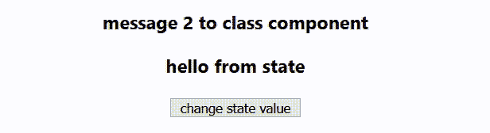

输出

> 状态也可以在函数组件中使用，使用 React 16.8 更新中引入的钩子，你可以在[https://reactjs.org/docs/hooks-intro.html](https://reactjs.org/docs/hooks-intro.html)上找到更多

# **事件处理**

React 中的事件处理非常简单，您可以声明一个需要调用的函数，并将该函数分配给标签中的事件，让我们看看功能组件和类组件的按钮中的 **click** event。

## **在功能组件**中

我们将创建一个新的函数组件 EventFunction.js，它返回一个按钮

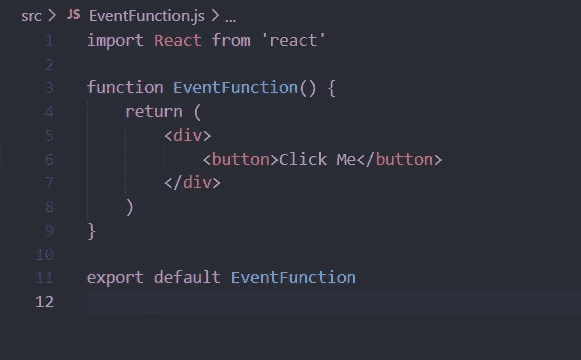

事件函数. js

创建一个新的函数 handleClick()，它将在按钮单击时被调用，然后将按钮标记的属性“on click”赋给“handleClick”

不要忘记在 App.js 文件中导入和添加 EventFunction

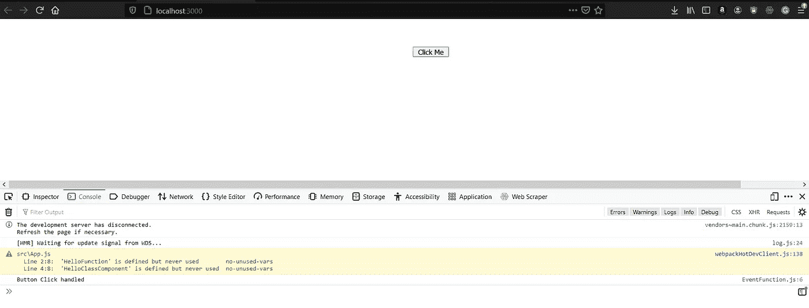

按钮点击处理记录

> 注意:在将函数传递或分配给事件`<button **onClick={handleClick}**>Click Me</button>`时不要加括号， **handleClick** 是对将被分配给 onClick 事件并分别调用的函数的引用，而 **handleClick()** 是在加载时自己调用该函数，因此您会发现在页面加载时已经记录了消息。
> 
> React 也遵循基于 **camelCasing** 命名 convection hense 它的 onclick 而不是 onClick

## **在类组件**

事件处理的过程是相同的，但是要引用 handleFunction，我们必须使用' **this** '关键字。

`**<button onClick={this.handleClick}>Click Me</button>**`

# 事件绑定处理程序

React 类组件中事件绑定的原因完全是由于 JS 中的“this”关键字行为。

简而言之，当我们需要从被调用的函数中访问类上下文(“this”关键字)时，就必须用类上下文本身来调用函数。因此，在将事件处理程序分配给事件之前，我们需要将它们与类本身绑定在一起。

在 src 文件夹中创建一个新文件 EventClassComponent.js，并将其添加到 App.js 中。

**有 3 种方法可以绑定一个函数。**

*   在呈现方法本身中绑定方法。

点击按钮时，消息将变为“点击处理”

> 缺点:对于每个状态变化，render 函数在 React 中被调用，React 又创建一个新的有界函数，并将其分配给事件。随着项目规模的增长，这种开销会很麻烦。

*   使用箭头函数作为类属性

> 改变声明函数的方式，这是 React 文档指南推荐的方法，并且非常简单

*   构造函数本身的绑定

> 但是这里仍然有一个问题，如果你想传递参数给函数呢

*   调用箭头函数体中的事件处理程序

> 注意函数的括号是存在的，通过这个方法你不需要调用事件。绑定(this)函数，甚至可以向函数传递参数。


输出

# 组件生命周期方法

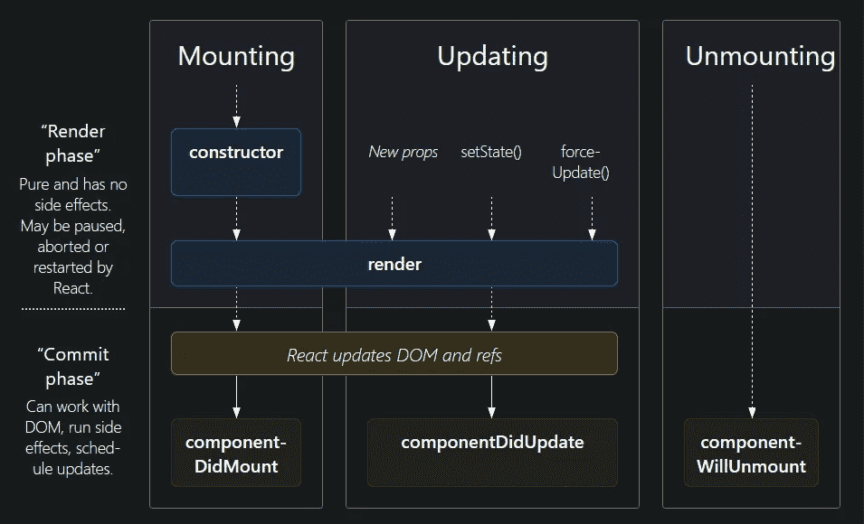

组件生命周期

每个组件都有几个“生命周期方法”,您可以根据组件的生命周期状态，将它们覆盖到运行代码的位置。组件的生命周期可以分为三个部分 1。安装 2。更新 3。卸载

## **安装**

当一个组件的实例被创建并插入 DOM 时

*   构造函数()
*   静态 getDerivedStateFromProps()
*   渲染()
*   componentDidMount()

> **构造函数、呈现函数**和**组件装载函数**通常被覆盖，**构造函数**被覆盖以允许道具和初始化状态和其他变量，**呈现函数**被覆盖以返回 JSX 元素，**组件装载函数**该方法在组件成功装载/加载时被调用，这是发出 HTTP 请求的最佳时机

## **更新**

当道具或状态发生一些变化时，就会触发更新

*   静态 getDerivedStateFromProps()
*   shouldComponentUpdate()
*   渲染()
*   getSnapshotBeforeUpdate()
*   componentDidUpdate()

> **render** 和 **componentDidUpdate** 函数通常会被覆盖， **render** 被覆盖以返回更新后的 JSX 元素， **componentDidUpdate** 该方法在组件成功更新并且可以执行包括 HTTP 请求在内的更新后流程时被调用。

## **卸载**

当组件从 DOM 中移除时。

*   componentWillUnmount()

> 当组件从 DOM 中移除时，调用此方法。用这种方法可以释放变量、取消订阅服务、停止线程。

# *结论*

*React 是一个非常棒的 UI 开发库，* ***它将一直存在，*** *React 非常稳定，并被许多公司列为科技公司，如优步、Airbnb、网飞，当然还有脸书:)，它的灵活性和易于集成使其成为首选。*

我希望这篇文章能帮助你开始 React.js 之旅。

## ***留一拍手*** 👏 ***，跟随更多*** 🔥 ***和*保持学习**🤓

[](https://mayankpatel99.medium.com/node-js-express-a-beginners-guide-edf205316ae9) [## Node.js + Express |初学者指南

### 在 10 分钟内编写第一个 Node.js 服务器应用程序

mayankpatel99.medium.com](https://mayankpatel99.medium.com/node-js-express-a-beginners-guide-edf205316ae9)