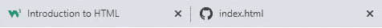
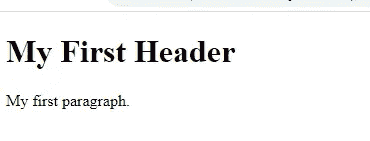
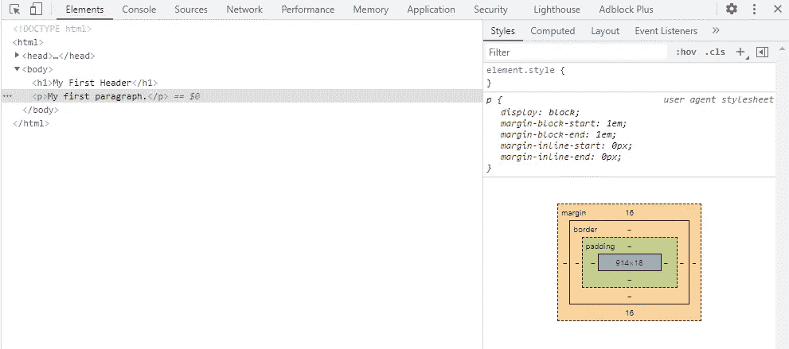
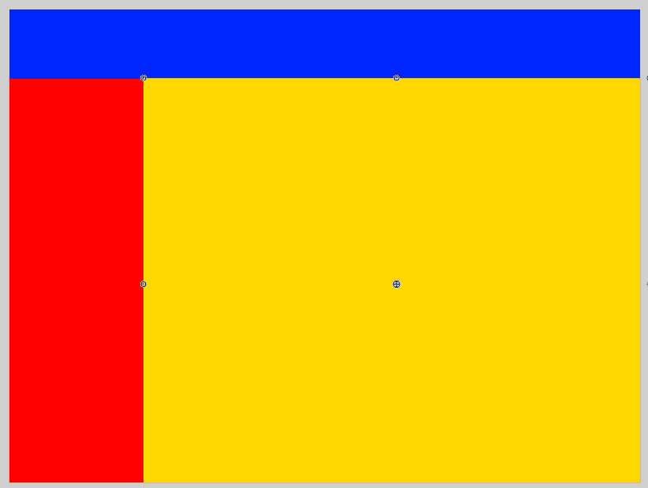
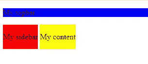
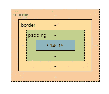
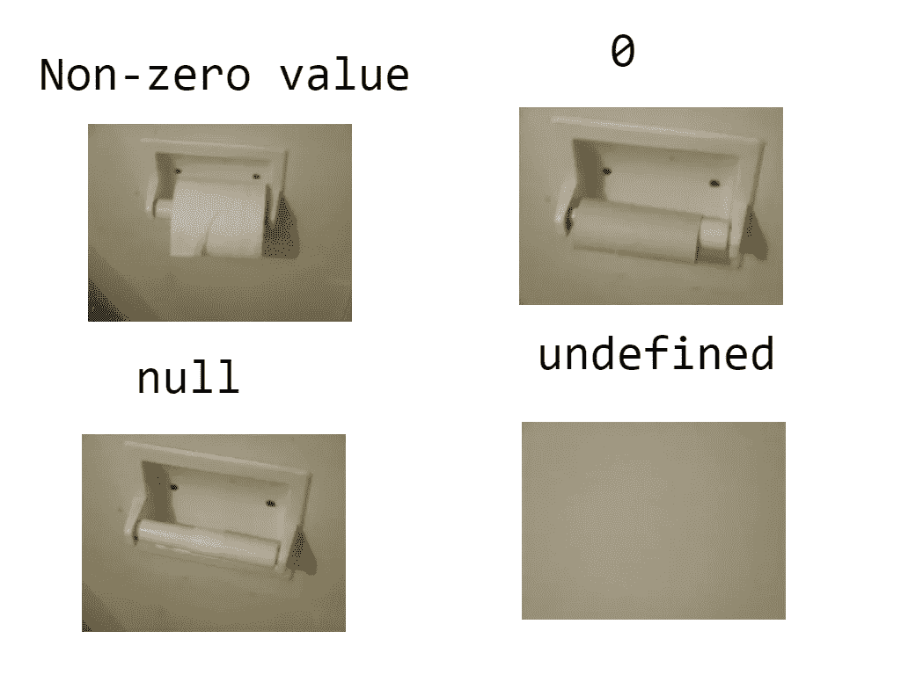

# HTML、CSS 和 JavaScript 开发的完整初学者指南

> 原文：<https://medium.com/codex/a-complete-beginners-guide-to-web-development-in-html-css-and-javascript-556c1c10f131?source=collection_archive---------2----------------------->

## *从零到 Web 开发英雄。*


由 [KOBU 机构](https://unsplash.com/@kobuagency?utm_source=unsplash&utm_medium=referral&utm_content=creditCopyText)在 [Unsplash](https://unsplash.com/s/photos/javascript?utm_source=unsplash&utm_medium=referral&utm_content=creditCopyText) 上拍摄的照片

本文是为那些想先学习 HTML、CSS 和 JavaScript，然后再学习 React 和 NodeJS 等更高级主题的人准备的。

我假设你对编程一无所知。我也将尝试进入为什么，而不仅仅是如何编程网页。如果你想要更深入的知识，或者如果这篇文章没有解释清楚，你可以在 W3Schools 的网站上了解更多。

*在这篇文章的最后，如果你想进入更难的话题，我会给你一些链接。*

# 什么是 HTML

HTML 是超文本标记语言的缩写，是创建网页的标准。HTML 描述了网页的结构，CSS 定义了网页的风格或外观，JavaScript 为网页增加了更多的交互性。

HTML 元素告诉 web 浏览器会发生什么。比如:“这是一段。这是一张桌子，这是一幅图像”。我们使用**标签**和**属性**来做到这一点。

## 标签

HTML 标签由两部分组成(有一些例外)，并且**定义元素**。开始标签和结束标签。标签由三角括号中的单词组成，其中结束标签也有一个斜杠。

在这个例子中，`<p>`和`</p>`是标签，`This is a paragraph`是**内容**。请注意，标签之间的内容本身也可以是新元素。我们把这个叫做**嵌套**。

一个非常基本的 HTML 文档有一些样板代码。让我们看一个例子，看看一切是什么，需要注意什么。

第一行是这些例外之一。`<!DOCTYPE html>`告诉浏览器它正在查看一个 HTML5 文档。它没有结束标签。

如果您仔细查看文档，在我们定义页面开始的`<html>`标签中，您可能会看到我们有一个`<head>`和`<body>`。

HTML 文档的`<head>`定义了我们网页的**元数据**。用户看不到`<head>`中的大部分代码。然而，`<title>`对用户是可见的。Google Chrome、Microsoft Edge、Firefox 和所有其他浏览器都在标签中使用这个标题。



使用 title 元素的 Chrome 选项卡

接下来，`<body>`元素定义了页面的每个可视元素。在其中，我们用`<h1>`定义了一个大标题，并用`<p>`定义了一个简单的段落。

*注意:从开始到结束标签的所有内容以及它们之间的所有内容都是元素。*

## 运行网页

HTML 文档可以使用简单的默认记事本制作，但我更喜欢使用合适的 IDE。一个集成开发环境。它本质上是一个文本编辑器，带有专门针对开发人员的工具，如自动完成和代码高亮显示。

web 开发的好选择有 [Visual Studio Code](https://code.visualstudio.com/) 和 [Notepad++](https://notepad-plus-plus.org/downloads/) 。我现在用学生许可证使用网络风暴，但是对于像这样简单的项目来说，这可能有点多了。

安装其中一个并创建一个名为`index.html`的新文件。

如果您从上面的代码片段中复制代码并将文件保存在某个地方，您只需双击 HTML 文件，在您首选的 web 浏览器中打开它。



你的第一个网页。另外，请注意标签中的标题。

我们可以在没有网络服务器的情况下运行 HTML 文件，因为它提供静态内容。它不需要服务器，因为它没有任何服务器端代码可以运行。

## 属性

正如我前面提到的，元素可以包含标签和属性。但是什么是属性，我们如何添加它们呢？

属性是元素可以拥有的额外属性。根据元素的不同，可以是`style`、`href`、`alt`以及许多其他类型。属性的一个最常见的例子是锚标记。

`<a>`标签用于**超链接**。当你点击它时，你将被转移到另一个网页，例如`https://google.com`。我们可以使用`href`属性添加这些信息。

将这行代码添加到您的`body`元素中，并重新加载页面。你现在应该会看到一个链接，将你带到谷歌。

您还可以为元素添加样式。这使用了`style`属性，在引号之间有一些 CSS 代码。

这些都是 HTML 开发的基础。你可以在这个网站上了解更多信息。您也可以继续阅读本文，因为我们将转到更高级的主题，如基本的 CSS 和 JavaScript 以及更多的 HTML。

## 检查元素

所有主流的 web 浏览器都有工具，供开发人员在遇到意外行为或错误时使用。这些工具被称为**开发者工具**，它们可以通过右击你的网页并点击“Inspect Element”或“Inspect”来访问。一个常见的快捷键是按键盘上的`F12`。



开发工具

第一个选项卡“元素”对于开发 web 页面的前端非常有用。“控制台”选项卡主要用于 JavaScript 和后端开发。其他选项卡对我们来说还没有用，它们与网络和性能有关。

在 elements 选项卡中，我们看到了 HTML 结构的表示。这被称为 DOM，或**文档对象模型**。在谈论 JavaScript 时，这个话题会更频繁地出现。

在图片的右边，我们有检查网页样式和 CSS 的工具。这对网页设计很有用。

**您不能使用开发工具**进行永久更改，但可以进行临时更改。尝试更改一些 CSS 值或删除/更改 DOM 中的元素。如果你重新加载页面，它会再次恢复正常。

## 容器

网页的视觉结构主要由不同的容器或区域组成，其中放置了一些元素。想象一下顶部的一个带有搜索功能的栏，一个带有链接的侧边栏，或者一个放置最重要内容的主容器。这些大多是由`div`元素组成。



样本布局

在左边，我们有一个简单的网页布局。

顶栏、边栏和主要内容方块。

这些都在同一个网页中，在我们的`<body>`元素中。但它们是不同的。所以我们在`<body>`中放置了多个元素，但是我们应该添加什么元素来划分这些内容呢？

`<div>`元素是针对这项工作的。`div`元素是一个不可见的元素，我们可以对它进行样式化来制作我们的容器。**`**div**`**元素定义了一个网页**的一个分部或部分。**

**这大概是我们的骨架，我们的容器列表。我们只需要给它添加一些基本的样式，让它们按照正确的顺序排列。因为，如果你检查这个返回的页面，所有的`div`元素将在彼此之下。**

**一个`div`的`display`有一个值，我们可以使用 inspect 元素来检查这个值。默认值是`block`，这意味着它创建一个跨越父元素整个宽度的块。我们的顶栏应该有这个，但是我们的侧边栏和内容可能会因为是`inline`或`inline-block`而变得更好。**

**使用`style`属性，我们将两个底部元素的`display`值设置为`inline-block`，这样它们就可以相邻存在。默认情况下，我们的顶栏将保持`block`。我们也给所有的元素一个背景色，这样它们看起来就像上面的图片一样。**

****

**我们的风格网页**

**正如您可能已经发现的那样，这些元素并没有很好地对齐。它们会留下缺口。这是由于位于`<div>`元素内部的`<p>`元素的默认`margin`和`padding`值。这意味着我们可能需要更深入地使用 CSS 来设计元素的样式。**

# **使用 CSS 设计网页样式**

**我们已经在代码中使用了一些 CSS，使用了`style`属性。但是正如您可能看到的，如果您使用`style`属性“内联”编写所有样式，那么很快就会变得非常难看。这就是为什么我们可能想转移到 CSS 文件。**

**如果您使用的是 IDE，比如 Visual Studio 代码，那么您可以在与 HTML 文件相同的文件夹中添加一个名为`style.css`的文件。在这个文件中，我们可以定义应用于相同类型的每个元素的样式，或者我们可以使用`classes`和`id`让它应用于某些元素。**

**在 HTML 文件的**头**中，添加下面一行。**

**这将两个文件连接在一起，因此我们可以在 HTML 文件中使用样式表中的样式。现在让我们来看看一些基本的 CSS 以及如何在你的网页上使用它。**

***注意:你可以在你的* `***head***` *中使用一个* `*style*` *元素* ***，而不是一个单独的 CSS 文件。你用同样的方法在一个* `*style*` *元素和单独的文件中编写 CSS。*****

## **基本 CSS 语法**

**CSS 语法非常简单，没有太多变化，尽管有些事情你需要记住。**

```
## CSS 
.h1 {...} /* This is applied to a class called "h1" */
h1 {...}  /* This is applied to the h1 element */
#h1 {...} /* This is applied to an element with "h1" as id */## HTML ##
<h1 class="h1">This is with a class</h1>
<h1>This is without a class or id</h1>
<h1 id="h1">This is with an id</h1>## CSS syntax
element {
    key: value;
    key: value;
}
```

**CSS 使用简写的点或标签来表示类或 id。我们不使用标签，而是使用方括号`{}`来打开和关闭我们想要的内容。**

```
/* Sample styled class */
.large-red-text {
    font-size: 32px;
    font-weight: bold;
    color: red;
}
```

**在括号中，我们定义了我们的风格。这是通过使用**键-值**对来完成的，其中键是数百个标准名称中的一个，值必须有效。你可以在这里阅读不同的价值观和风格。**

**甚至我和其他 web 开发人员仍然需要检查他们写的东西是否没有意义，或者密钥是否有效。很难根据尺寸、重量和颜色来区分 `*font*` *和* `*text*` *这两种风格。但是随着时间的推移会好起来的。***

**带`/* */`的行是注释。这些不会影响样式，有助于可读性。例如，您可以对特定样式的用途进行评论。**

**最后，你可能已经看到我们用分号结束了所有的行。这样做是为了让浏览器知道这是最后一行。你也可以用这种方式把所有的东西都放在一行，但是这样很难读懂。**

## **填充、边距和边框**

**知道填充和边距以及边框属性很有用，但很难真正掌握。如果您正在使用开发人员工具，您可能会看到下面的方块。**

****

**来自 Chrome 上的开发者工具**

**中间的方块是元素，在这种情况下，它是我移除了`margin`和`padding`的`<p>`标签之一。如果有值，它会显示在这里。**

*   **填充是**中的**元素。**
*   **边距在元素的之外**。****
*   **边框在填充和边距之间。**

**您可以使用`border-color`、`background-color`、`padding`、`margin`和`border-width`来检查填充、边距和边框的不同属性，以查看它们对其他元素和自身的反应。**

## **配置**

**定位可以说是 web 开发中最困难的事情之一。尤其是在创建响应式网页时。但是我们现在只讨论基础知识。**

**为了定位，我们需要知道`position` CSS 属性。这可以是 5 个值之一:`static relative fixed absolute sticky`其中`**static**` **是默认值**。**

*   ****相对**相对于其正常位置定位。**
*   ****固定**相对于视窗定位，这意味着即使页面滚动，它也总是停留在同一位置。top、right、bottom 和 left 属性用于定位元素。**
*   ****绝对**相对于最近定位的祖先定位(而不是相对于视口定位，比如固定)。**
*   ****粘性**根据用户的滚动位置定位。粘性元素根据滚动位置在`relative`和`fixed`之间切换。它相对定位，直到在视口中遇到一个给定的偏移位置——然后它“粘”在适当的位置(像`position: fixed`)。**

**[*摘自 W3Schools*](https://www.w3schools.com/css/css_positioning.asp) *。***

**这些看起来很难记住，但是一旦你使用过几次，就会清楚了。让我们看看如何使用它们。**

**这将在网页的右下角产生一个`div`。尝试调整页面大小，它会留在角落里。它停留在那里是因为`position: fixed`。我们还使用了`bottom`和`right`,这样它与角落之间就有了一些空间。我们也可以为此使用`margin`。**

**如果把`position`改成`absolute`，也会这样，但是为什么呢？这与滚动有关。如果你滚动鼠标，一个`fixed`元素将会保留在屏幕上，一个`absolute`元素将会离开屏幕。如果你将`height: 1000px;`添加到另一个元素中，你就可以看到这一点。**

## **颜色；色彩；色调**

**颜色是每个网站的重要组成部分。如果可口可乐罐不是那么漂亮、明亮和红色，谁会认出它们呢？可能是任何人，但颜色仍然是创建网站的一个重要部分。**

**到目前为止，我们已经使用了像`red`、`blue`等颜色，但是有一个完整的列表，你可以在这里找到[。但是具体荷兰国旗红色在哪里呢？它不在那里。这就是为什么我们有更多的方法使用十六进制代码和其他值来添加我们自己的颜色。](https://www.w3schools.com/cssref/css_colors.asp)**

**添加另一种颜色最简单的方法是使用十六进制代码**。十六进制“数字”从 0 到 F，16 个不同的值。如果我们把两个加在一起，比如 FF，我们有 255 个。这正是经典 RGB 十六进制格式中的颜色组成。十六进制中从 0 到 255 的三个值。****

***记住:把 CSS 代码放在* `*head*` *或者你的样式表里面！***

**我们还使用多个类来设计这些元素的样式！只需在`class`属性中添加更多的单词，并将它们添加到样式表中。这是将样式分割成更小的可重用部分的好方法。**

**但是这并不是给网页添加颜色的唯一方法。我们也可以使用 HSL 和全 RGBA 值。你可以在本页上读到。在我的开发生涯中，我比其他人更经常遇到十六进制表示法。如果需要，转换成十六进制也很容易。**

# **使用 JavaScript 为您的网页添加交互性**

**现在我们将进入最困难的部分。互动性。我们的网页可能看起来不太合适，但是如果你已经很好地遵循了，你现在已经有了基本的东西，你应该能够创建一些好的东西。我们还看了一下 web 开发知识的最佳资源之一: [W3Schools](/codex/w3schools.com/html/) 。**

**网页的交互性是在 **JavaScript** 中完成的。JavaScript，简称 JS，是一种**脚本语言**。它提供了比 HTML 和 CSS 加起来更多的功能，比如与按钮交互和操作 DOM。**

**如果您打算通过 NodeJS 进行服务器端开发，这也是提高 web 开发水平的一个非常好的步骤。或者 React 之类的任何前端库。但现在这不重要。**

## **编写您的第一个代码**

**JavaScript 和 CSS 一样，可以在 HTML 文件中完成，也可以在另一个文件中完成，比如一个`.js`文件。在 HTML 中，我们有`<script>`标签。在`<script>`标签之间，你可以写 JS 代码。**

**这一行代码将“打印”或向我们之前见过的开发者工具中的**控制台**写入文本。您可以“记录”任何东西，从特定的数据类型(如对象和数组)到简单的字符串(如数字)。**

**我们调用位于`console`对象内部的`log`函数。我们使用**点符号**来获得嵌套的数据或对象。**

```
object.subObject.subSubObject.func()
```

**我们用括号`()`调用函数。在这些括号中，我们放入我们的参数。 ***我们稍后将进入函数，但这只是为了让你知道*** `***console.log***` **发生了什么。****

**如果您想从外部文件而不是 HTML 内部运行代码，您需要创建一个 JS 文件，并使用`script`标签将其导入 HTML。**

**这通常在`body`元素的底部完成，以减少加载时间。如果尽快加载脚本是有益的，您也可以将它添加到`head`中。**

## **变量**

**我们已经看了一下`console.log`，现在我们将进入真正的编程。我们知道我们可以用`log`函数记录任何东西，它会显示在我们的浏览器控制台中，我们可以使用“Inspect Element”来访问它。**

****变量**是编程必不可少的一部分。他们可以是任何东西。它们可以在程序执行过程中进行更改。当你不知道某物的价值时，拥有它们是很好的。比如用户的名字。**

**变量可以是任何有效的数据类型。在 JS 中，最基本的数据类型是**数字**和**字符串**。字符串是用引号括起来的文本。数字不必被任何东西包围。**

**还有更高级的数据类型，但是我们将在后面讨论它们。**

**变量由`let`、`var`或`const`构成。`let`和`var`差别不大，推荐使用`let`。与`const`不同的是，它是一个不能改变的值。它是一个**常数**。但是从现在开始我们将只使用`let`。**

**无论`yourName`的值是多少，上面的代码都会记录一个问候。如果我们改变`yourName`的值，问候语也会改变。**

**我们在`console.log` 函数的括号之间使用了一个叫做**的字符串连接**。这实质上意味着将两个文本字符串相加形成一个字符串。**

```
"Hello " + "Steven" = "Hello Steven"
```

## **条件语句**

**条件语句是编程的重要组成部分。它允许我们映射代码可以遵循的多条路径。例如:**

**我们在名为`age`的变量中声明年龄。我们使用`>=`检查年龄是否大于或等于 18 岁。如果它不大于或等于 18，我们使用`else`来捕捉所有尚未捕捉到的可能性。**

**条件语句由三部分组成。只有第一部分是必需的，即`if`语句。如果您需要更具体的测试，您可以使用`else if`将多个语句链接在一起。`Else if`对报表做具体的检查，就像`if`一样。`Else`语句简单地捕捉所有其他的可能性。**

**关于条件语句的陷阱和需要注意的地方，你可以看看这个要点。从检查顺序到使用`else if`进行多重检查。**

**我们还没有谈到`if`语句的括号里放什么。我们需要放入的是一个解析为布尔值的语句，所以不是`true`就是`false`。**

**以上是一个`if`语句的一些可能条件的列表。请记住，任何这些都可以包含变量，而不是硬编码的值。**

## **环**

**现在我们已经对条件语句和布尔逻辑有了一定的了解，我们可以继续循环了。**循环将重复执行一部分代码，直到满足一个条件**。**

**根据循环的类型，这将是一次循环的数量已经完成，或一个变量得到某个值。如果现在听起来很奇怪，不要担心，我们将进入最基本的循环。**

**你可能会看到的循环是`while`循环。一个`while`循环将执行一个代码块，直到满足一个条件。这个条件是你必须自己编程的，否则，你会得到一个无限循环。**

**一个常见的例子是简单的计数器。如果你愿意，你可以在循环体中添加`console.log`来看它的运行。我们在循环外定义两个变量，并在循环内改变它们。布尔将保持不变，直到我们改变它。**

**另一种弧线类型是`for`弧线。`for`循环将循环，直到循环了特定的次数。例如，列表中的每一项或字符串中的每一个字母。**

**语法看起来更高级，但不难理解。我们设置一个变量，添加一个条件，并添加我们的增量值。在这种情况下，当循环必须运行时，条件应为`true`。我们使用“索引小于字符串的长度”。**

```
for (
    let i = 0; // set initial number using a variable name
    i < str.length; // Set our condition.
    i++ // Set our incrementer.
)
```

**这里有几个更有效的`for`和`while`循环的例子。**

**这将结束我们关于循环的章节。如果对你来说仍然有点奇怪，不要担心，完全理解循环需要时间和练习，大多数学生都很难理解。**

## **功能**

**函数是分离代码块并重用它们的一种方式，可以选择使用可以改变的变量。语法简单如下:**

```
function funcName(parameters) {
    // Function body
}// Calling the function
funcName(6)
```

**一个函数可以被创建，在创建之后，它可以被调用。如果一个函数`returns`有一个值，你也可以把这个值加到一个变量中。让我们看一些例子。**

**函数只能使用参数中的变量或修改函数外部的变量。一个函数也可以在它的体内调用一个函数。它甚至可以调用自己，也就是所谓的**递归**。在本文中，我们不会讨论递归，但是在函数内部调用函数时，您应该小心无限循环。**

## **更多可变类型**

**我们已经看了很多代码。这似乎已经很难了。接下来会更有趣。我差点忘了包括这一点，但是知道你什么时候成为 JavaScript 开发人员是非常重要的。数组、对象、null 和未定义。**

**JavaScript 有时以神秘的方式工作。但是有些类型的变量我们可能会意外遇到。你可能已经看过了。Null 和 undefined 是看起来相似的变量类型。一个是缺少一个值，另一个是完全缺少一个变量。这里有一个简单的图像给你看。**

****

**从[堆栈溢出](https://stackoverflow.com/questions/5076944/what-is-the-difference-between-null-and-undefined-in-javascript)**

**这里有一个简短的代码片段向您展示。**

**价值是你最不想发现的东西。这可能意味着你的代码放在了错误的地方，一个变量还没有生成，也可能意味着你打错了。我们不会深入探讨这个问题，但是了解一下`null`和`undefined`之间的区别可能是有用的。**

**接下来是数组。数组本质上是可以包含值的列表。这些值可以通过使用**索引**来查询。索引是从 0 到列表末尾的数字。让我们给你看一些代码**

**使用方括号`[ ... ]`创建一个数组。在里面，我们有用逗号分隔的值。值可以是任何东西、函数、数字、布尔值、字符串、对象和其他数组(称为嵌套数组)。**

**我们使用方括号中的索引来获取每一项。如果我们彼此之间有多个数组，那么也会有另一组括号，其中包含另一个数字。我们可以使用循环来记录数组中的每一项。**

**但是我们能用数组做什么呢？还是嵌套数组？我们可以做很多事情，主要是我不会在这里讨论的主题，比如使用它们在 React 中存储元素。但是我们也可以制定一个很好的议程。**

**我们可能希望有更好的方法来得到日期，而不是数字 0 到 6。为此，我们可以使用**对象**。**

**对象在某种程度上是更高级的列表。它们是用 **JSON、JavaScript 对象符号**编写的。*我写了一篇关于 JSON 的文章，你可以在这里找到*[](https://javascript.plainenglish.io/json-in-plain-english-a59fe38c9bea)**但是在这篇文章中我们仍然会进入基础部分。****

***对象是写在括号之间的**键值对**。键必须是字符串，值可以是从数字到对象本身的任何东西。嵌套值的另一个例子。***

***这是我们以对象形式而不是嵌套数组的议程。每天使用数组。***

***您还可以为每天的部分时间使用嵌套对象。***

***正如在这个片段中看到的，对象也可以使用点符号**调用。这更容易写，看起来也更干净。代码可读性在大型项目中很重要，所以使用点符号是一件大事。*****

***这些进阶类型就到此为止，我们继续。***

# ***连接 HTML 和 JavaScript***

***连接 HTML 和 JavaScript 可以通过一些方式来完成。我们已经看了如何连接文件，但是我们还不知道如何在我们的网页上使用 JavaScript 函数。***

***在 HTML 中，我们有可以有一个`onClick`属性的`button`元素。这可能是将 JavaScript 函数连接到 HTML 页面的最简单的方法。你只能这样调用函数，但是有了函数，你可以做任何事情。***

***但是有了这个，我们就不能像我们想的那样操纵 DOM 了。我们可能想要显示一个函数的结果，我们可能想要改变一些我们想要在函数内部使用的变量。***

***现在它可能变得更高级，你可能很难跟上。不要担心，慢慢来。如果你想对 web 开发更加得心应手的话，试着尝试上面的一切。***

***在 JavaScript 中，我们有函数`document.getElementById`。这个函数将返回一个 HTML 元素，如果它有你作为参数传递的 ID。这就是 ID 属性应该总是唯一的原因之一。***

***这个代码片段是一个简单的例子，展示了如何使用输入字段和 JavaScript 向 web 页面添加交互性。您可以保存此页面，并在浏览器中打开它来查看它的工作情况。***

***如果其中一个字段为空，我们可以使用`if`语句添加安全措施，但是为了不离题，我们在这里不这样做。但是这里仍然有很多东西需要打开。***

***首先，我们在 HTML 中定义我们的元素，并使用`id`属性给它们唯一的 id。我们用`type="number"`创建两个输入字段，这样，只能输入数字。我们还添加了一个按钮和一个段落元素来显示两个值之和的答案。***

***在`script`元素中，我们定义了变量，这样我们就可以访问我们的字段。这也可以在函数中完成。我们使用`getElementById`获取字段。***

***在我们制作的`add`函数中，我们得到我们的段落元素并得到我们的答案。由于`value`返回一个字符串，我们需要**将**的值转换成数字。***

***最后，我们将段落的`innerHTML`设置为答案。由于答案是一个数字，我们需要再次将其转换为字符串。***

***`innerHTML`是元素标签之间所有内容的字符串版本。这可能是更多的元素，或者像我们在这里做的简单的文本。***

***如果你在这方面下点功夫，有了这些知识，你现在就可以创建一个工作计算器了。你可能认为你缺乏知识，但现在一切都在这里。***

****另一个很好的练习是创建一个待办事项应用程序。我们知道列表，我们可以使用输入元素添加值，我们可以从脚本中呈现文本。****

****注意，你需要在元素下面有脚本，或者你需要在函数体中寻找元素来使它工作。否则，当它试图查找元素时，不会加载这些元素，从而导致空值。****

# ***结论***

***Web 开发可能看起来很难进入，但是如果你一直跟着做，**你就已经在成为 web 开发人员的路上了**。我也是这样开始的，通过学习 web 开发的三个“支柱”的基础。Javascript、CSS 和 HTML。***

***不过，还有很多东西需要学习。有用于学习风格、响应性网页设计、后端开发等等的框架。***

***在我从事媒体工作的一年半时间里，我已经写了一百多篇与 web 开发相关的文章。初学者的文章，以及更高级程序员的文章。你可以在我的[个人资料](https://mbvissers.medium.com/)或者我的出版物[快速编程](https://medium.com/quick-programming)上查看它们。***

******如果你想支持我，你可以在 Medium 上使用*** [***这个链接***](https://mbvissers.medium.com/membership) ***成为会员，并在***[***Twitter***](https://twitter.com/MVissers4)***上关注我的生活和文章******

***下面是一些帮助您进入更高级的开发主题的链接。我更推荐那些大胆的，因为在我看来，它们是提高你发展技能的好方法，或者它们与你当前的新技能联系得很好。***

*   ***[**关于 jQuery**](https://javascript.plainenglish.io/introductory-guide-to-jquery-ccc98bc047fe) **的文章，一个很好用的 DOM 操纵库。*****
*   ***[节点包管理器](http://npmjs.com)使用 NodeJS 进行后端开发的网站。***
*   ***[](https://mbvissers.medium.com/lets-learn-programming-in-python-b12fbabb6ba4)****Python 入门，一篇学习 Python 编程的文章如果你想了解更多 web 之外的编程知识。*******
*   *****[**自举网站**](https://getbootstrap.com/) **，最知名的网站造型框架。*******
*   *****[阅读更多关于 JavaScript 中的](https://javascript.plainenglish.io/logging-in-the-console-like-a-pro-756660672d2b) `[console](https://javascript.plainenglish.io/logging-in-the-console-like-a-pro-756660672d2b)` [对象](https://javascript.plainenglish.io/logging-in-the-console-like-a-pro-756660672d2b)的信息。*****
*   *****[使用 GatsbyJS](https://betterprogramming.pub/creating-static-webpages-using-gatsbyjs-6884d46c653d) 制作网站，这是一个使用 React 的框架。*****
*   *****[用 NextJS](https://javascript.plainenglish.io/getting-started-with-nextjs-6ce019e35a77) 制作网站，我最喜欢的框架。*****
*   *****[JavaScript 中的匿名函数](https://javascript.plainenglish.io/anonymous-functions-in-javascript-24fb8d2edaf7)。*****
*   *****[所有不同的 JavaScript 循环](https://betterprogramming.pub/all-javascript-loops-f6424cabfcb6)。*****
*   *****[使用 NodeJS](/quick-programming/creating-a-discord-bot-in-javascript-7e92d4bda14e) 用 JavaScript 创建一个 Discord bot。*****

*******非常感谢你，非常感谢你能读到这里。祝您学习编程的旅途愉快，并度过美好的一天。*******