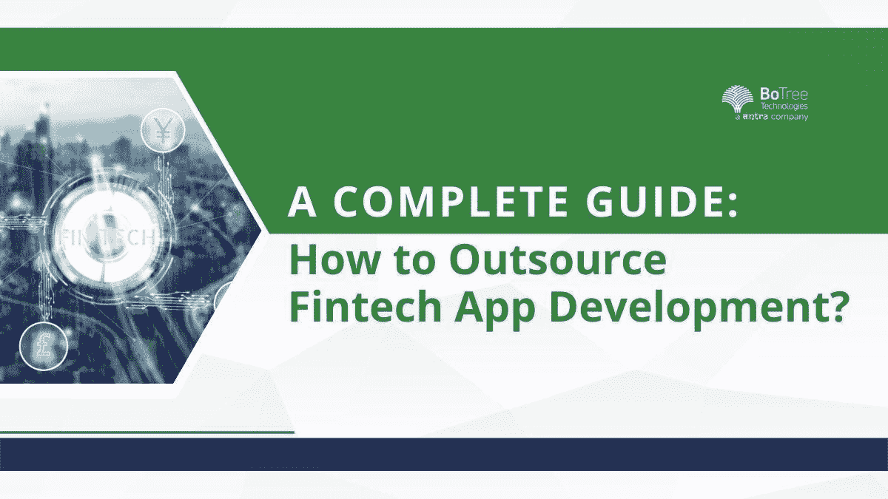

# 完整指南:如何外包金融科技应用？

> 原文：<https://medium.com/codex/a-complete-guide-how-to-outsource-fintech-apps-cd20835e61e5?source=collection_archive---------13----------------------->

金融科技公司正在激增。消费者希望数字金融触手可及。因此，金融科技应用开发正占据中心位置。

金融科技解决方案需要流畅的用户界面和个性化。今天，在一个单一的类别中有几个竞争者。公司如何差异化？他们需要打破常规。

[金融科技应用开发](https://www.botreetechnologies.com/blog/cost-to-build-a-fintech-app/)正在发展。越来越多的应用程序不仅仅是数字钱包，而是充当一站式支付门户。从预订电影票到支付电费，金融科技应用可以做任何事情。

# **金融科技应用类型**

在考虑 FinTech 应用程序开发之前，我们先来看看 FinTech 应用程序的不同类型。聘请最好的金融科技应用程序开发人员取决于客户想要什么类型的应用程序。

各种应用都需要金融科技应用开发服务。一些金融科技应用包括-

*   **数字银行:**
*   数字银行包括无现金支付，加快交易速度，消除去银行分行的麻烦。用户可以在网上获得任何东西。
*   **投资申请:**
*   申请共同基金、投资股票等。，正在成倍增长。人们也可以投资数字黄金，并在以后获利。
*   **个人理财应用:**
*   这些应用程序支持个人理财。许多企业将个人金融应用的金融科技开发外包出去。
*   **加密货币交易所:**
*   区块链正在带来巨大的成果。加密货币交易所使人们能够购买加密货币并在线交易。
*   **数字支付:**
*   像 PayTM 这样的应用程序是数字支付应用程序的典型例子。它允许用户有一个数字钱包，通过合众国际社支付，支付水电费，预订，购物服务，甚至采取贷款和保险。

创建应用程序决定了如何外包[金融科技和银行解决方案](https://www.botreetechnologies.com/case-studies/loan-management-system)。但是外包是如何运作的呢？让我们找出答案。

# **FinTech App 开发外包模式**

当客户希望外包金融科技开发时，可以考虑不同的模式。这些模型为如何外包给金融科技应用开发公司提供了视角。

**模式 1——基于地点的外包:**

外包模式把地点作为一个参数。基于位置的外包有两种类型。

企业可以将金融科技咨询外包给本地供应商。当地的开发机构提供了更多的机会和与公司定期合作的机会。开发人员可以轻松地在现场工作。

企业往往找不到附近的好资源。项目来源国以外的国家有数百家 FinTech 应用开发公司。印度、菲律宾、越南和波兰是提供金融科技开发资源的几个国家。

**模式二——合作型外包:**

在这种模式下，企业可以与印度的 FinTech 应用开发公司签订协议。他们要么提供基于项目的团队，要么提供专门的开发团队。

一个专门的团队只为企业工作。它就像是公司的一个扩展的 It 团队。基于项目的团队处理项目的特定需求。

公司可以选择一种或两种模式。他们可以从国外雇佣专门的团队。一般来说，它是负担得起的，并提供更好的资源。他们可以接触到经验和技能更高的金融科技应用开发者。因此，外包到原产国以外的地方是有意义的。

# **如何外包金融科技应用开发**

在为金融科技解决方案雇佣[企业软件开发公司](https://www.botreetechnologies.com/enterprise-software-development-company)时，企业需要考虑几件事情。雇佣金融科技合伙人没有明确的程序。

以下几点提供了企业如何聘请公司提供金融科技应用开发解决方案的指导原则-

1.  **寻找外包资源:**

*   企业可以在多个地方找到金融科技开发合作伙伴。开始关注在线门户网站。Clutch、GoodFirms 和 Techreviewer 有一个 FinTech 开发公司的列表。Linkedin、Glassdoor、Toptal、Upwork 等。，还将提供要招聘的公司的概况。
*   获取推荐信是个好主意。向业内人士打听一家值得信赖的金融科技[软件开发公司](https://www.botreetechnologies.com/)。一般来说，金融科技专业人士会联系外包金融科技。

**2。进行背景调查:**

*   在最终确定之前，对多家公司进行彻底的背景调查。它包括查看投资组合和以前的金融科技服务案例。浏览他们的开发实践也提供了一个关于公司的好主意。
*   了解该公司有多少名金融科技开发人员。企业应该经常检查和采访将参与他们项目的团队。他们需要有合适的经验和专业知识。

**3。了解数据和合规:**

*   当你选择一家公司外包金融科技业务时，要进行数据和合规检查。公司应遵守 GDPR 和其他标准。数据保护必须是重中之重。在整个过程中，保密始终至关重要。
*   企业应经常检查安全措施。他们必须研究公司如何遵守不同的规章制度。雇佣一个金融科技合伙人意味着雇佣一个会进入金融领域的人。因此，从长远来看，确保数据保护至关重要会有所帮助。

**4。签约 NDA:**

*   该进程最重要的部分之一是签署 NDA。企业必须确保 NDA 是经过深思熟虑的。它应该包括所有的细节。从项目成本、开发团队、维护时间，一切都应该是 NDA 的一部分。
*   NDA 使公司免于任何可能出现的法律问题。虽然这种情况很少发生，但仍有可能发生。NDA 至关重要，因为它耗费了两党一致同意的一切。因此，它将消除任何混乱和灾难。

**5。建立沟通和文化:**

*   企业[外包金融科技公司](https://botreetechnologies.medium.com/top-10-fintech-software-development-companies-2021-de3170dc1607)然后认为他们的工作已经完成。然而，工作现在开始了。他们需要发展沟通和文化。透明度、项目更新、进度测量工具等。，成为这一步的一部分。
*   与外包团队建立一种文化可能具有挑战性。然而，它是必不可少的。团队必须了解企业的工作方式。这将帮助他们以更好的方式与项目的目标保持一致。

## **结论**

金融科技应用开发需求巨大。随着公司转向数字金融，开发解决方案需要合适的合作伙伴。以上文章重点介绍了 FinTech app 的类型，外包的不同模式，以及如何找到合适的 [FinTech app 开发公司](https://www.botreetechnologies.com/fintech-app-development)。

与我们一起开始你的下一个项目吧！ [**今日免费咨询**](https://www.botreetechnologies.com/contact) **。**

*原载于 2022 年 9 月 21 日 https://leadgrowdevelop.com**的* [*。*](https://leadgrowdevelop.com/a-complete-guide-how-to-outsource-fintech-apps/)