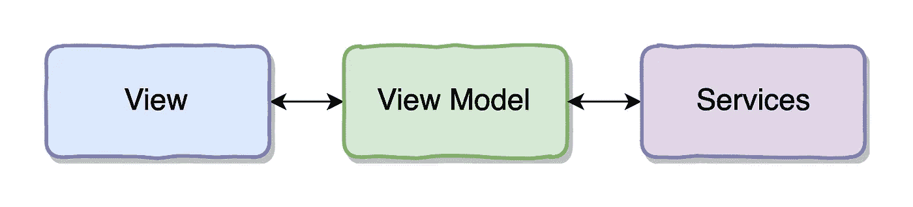
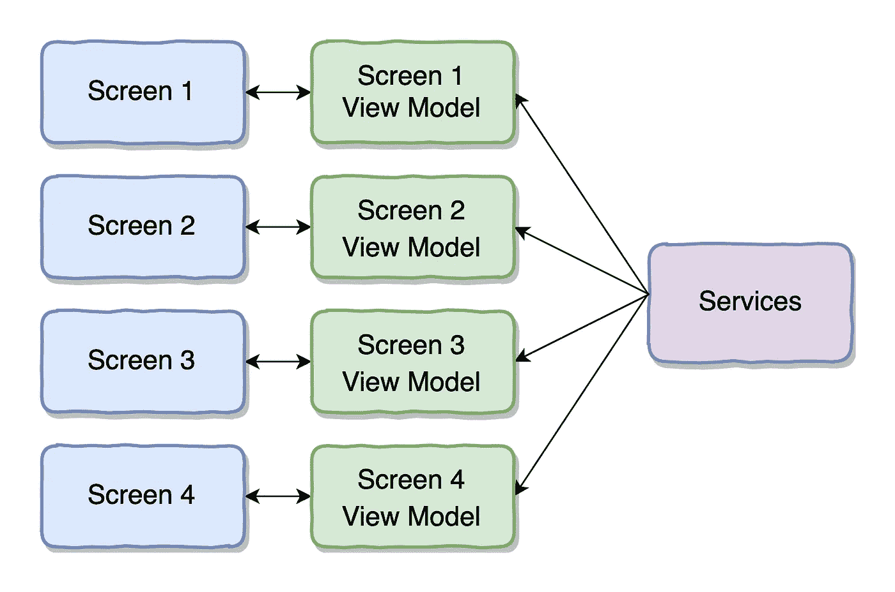
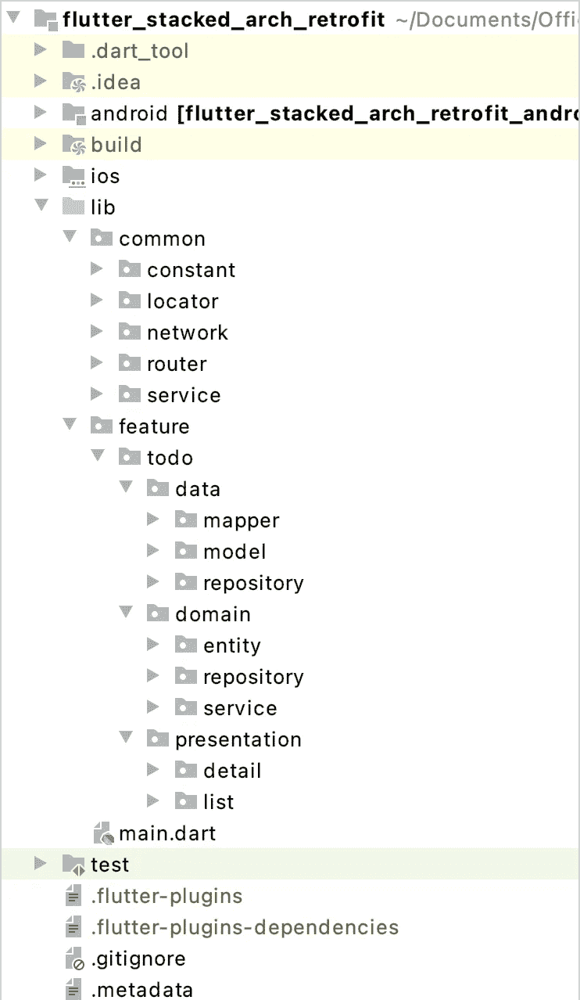

# 构建您的 Flutter 应用程序的完整指南

> 原文：<https://medium.com/codex/a-complete-guide-to-architect-your-flutter-application-a5a4da662549?source=collection_archive---------3----------------------->

# 介绍

回到 2018 年，当我开始学习 Flutter 时，我花了很多精力，因为我发现跨平台开发非常有用和高效。从 Android 应用程序开发背景来看，最初，理解 Flutter 框架以及它如何管理应用程序状态需要一段时间。但是后来，我发现 Flutter 有很大的潜力。

在使用 Flutter 时，我使用了很多状态管理方法，但是由于没有官方推荐的方法，所以很难说哪一种是最好的。

如前所述，来自 Android 背景，我发现[堆栈](https://pub.dev/packages/stacked)插件非常容易用来设计 Flutter 应用程序。在本文中，我将展示如何使用堆叠框架设计和架构 Flutter 应用程序。

# 目标

在本文中，我们将了解如何:

*   使用堆叠插件设置 Flutter 应用程序的基础架构
*   使用依赖注入进行层分离
*   代码生成器，为 DI、routes 和 JSON 解析生成样板代码
*   使用改进的插件进行 API 调用(大多数 Android 开发人员可能对此很熟悉)

除了基本的架构设置，本文还演示了

*   项目结构
*   使用视图模型导航(无上下文)
*   屏幕之间轻松共享数据
*   还有几个…

# 什么是堆叠？

Stacked 是一个由 [FilledStacks](https://www.filledstacks.com/) 社区开发的用于颤振应用的状态管理系统。它有助于管理国家，是 MVVM 风格的建筑。你可以从[这里](https://pub.dev/packages/stacked)下载这个插件，并将其添加到你的 pubspec.yaml 文件中，如下所示:

> 依附关系:^2.0.0

# 它是如何工作的？

架构非常简单。它由 3 个主要部分组成，其他的都取决于你的实现风格。



这些作品是:

*   **视图**:向用户显示 UI。单个小部件也可以称为视图(为了术语的一致性)。在这种情况下，视图不是“页面”,它只是一个 UI 表示。
*   **ViewModel** :管理视图的状态、业务逻辑以及用户交互所需的任何其他逻辑。它通过使用服务来实现这一点
*   **服务**:单一功能/特性集的包装器。这通常用于包装诸如显示对话框、包装数据库功能、集成 API 等。

像 MVVM 一样，每个视图模型都属于一个视图。因此，您可以为每个视图创建一个单独的视图模型，也可以根据您的需求重用视图模型。另一方面，服务是全局声明的，可以由应用程序中的任何 ViewModel 访问。



设计应用程序时，请始终牢记以下原则:

*   每个层组件应该只知道它下面的组件。这意味着，视图有视图模型的信息，但是视图模型应该没有视图的信息。
*   视图不应该直接使用服务。服务应该只能通过 ViewModel 或其他业务层访问
*   视图应该不包含任何逻辑。如果逻辑来自仅支持 UI 的项目，那么我们执行最少的所需逻辑，并将其余部分传递给视图模型
*   视图应该只在其视图模型中呈现状态
*   表示页面视图的小部件的视图模型只绑定到一个视图
*   如果 UI 需要相同的功能，视图模型可以重用
*   视图模型不应该知道其他视图模型

# 使用 DI(依赖注入)的层分离

遵循的最重要的原则是 [**分离顾虑**](https://en.wikipedia.org/wiki/Separation_of_concerns) 。在 View 或 ViewModel 中编写所有代码是一个常见的错误。这些基于 UI 的类应该只包含处理 UI 的逻辑。

# 为什么是 DI？

随着你的应用程序的增长，在某些时候你需要把你的应用程序的逻辑放在独立于你的部件的类中。让您的小部件不存在直接的依赖关系会让您的代码更有条理，更易于测试和维护。

对于 DI，我们使用了 [get_it](https://pub.dev/packages/get_it) 插件，您可以将它添加到您的 pubspec.yaml 文件中，如下所示:

> 获取依赖关系:^6.0.0

# 编码发生器

Flutter 社区太棒了，他们制作了一个代码生成插件(我最喜欢的插件之一:)，减少了编写样板代码的工作量。 [build_runner](https://pub.dev/packages/build_runner) 包提供了一种使用 Dart 代码生成文件的具体方法。文件总是直接在磁盘上生成，并且重建是*增量的。*

所有自动生成的文件都有这些扩展名:

*   g.dart
*   . gr.dart
*   . config .镖

对于代码生成，您需要做几件事情:

*   为自动生成的代码定义文件名。它应该具有带. g.dart 扩展名的原始文件名
*   定义需要生成什么代码。对于函数，它应该有一个$前缀
*   使用 build_runner 工具生成代码

例:我们举一个 TodoEntity 类的例子。您需要在导入下面写入零件文件名(将自动生成):

`part 'todo_entity.g.dart';`

要使用 build_runner 工具生成代码，请在终端上运行下面的命令(路径应该指向您的项目)

`flutter pub run build_runner build`

**注意:**每次在原文件中进行修改时，都需要运行 build_runner 命令进行代码生成。

# 网络电话改造

最初，当我处理网络调用的 [http](https://pub.dev/packages/http) 包时，我真的很怀念以前在 Android 中使用改造库进行 API 调用的乐趣和轻松。幸运的是，有针对 Dart 插件的[改进(再次感谢令人敬畏的 Flutter 社区)可供 API 调用。这与 Android 可用的改造库非常相似。对于示例代码，我在服务层中使用了翻新来进行 API 调用。下面是 TodoApiService 类的示例代码:](https://pub.dev/packages/retrofit)

```
@RestApi()
abstract class TodoApiService {

  factory TodoApiService(Dio dio, {String baseUrl}) = _TodoApiService;

  @GET("todos")
  Future<List<TodoEntity>> getTodos();

  @GET("todos/{id}")
  Future<TodoEntity> getTodoDetail(@Path("id") int todoId);

}
```

像 Android 的改进一样，这个类的代码生成由 Dart 库的改进负责。很简单，对吧！

# 项目结构

为了使事情简单易懂，我在生产应用程序中使用了以下项目结构:



# 使用视图模型导航(无上下文)

我在 Flutter 中最关心的一个问题是，为了导航的目的，我们需要将上下文引用传递给 Navigator。因此，在代码中，我不得不从 ViewModel 返回视图，只是为了导航到一个不同的屏幕，我觉得这不是一个好的选择。我在寻找一些可以通过 ViewModel 导航的东西，发现了 [auto_route](https://pub.dev/packages/auto_route) 插件。在 ExtendedNavigator 的帮助下，您可以设置应用程序的所有路线，并且使用根上下文，我们可以导航到任何所需的屏幕。为了简化，我创建了一个 NavigationService 类来处理应用程序中的路由。下面是我在 ViewModel 中使用的代码，用于导航到 TodoDetailScreen:

```
_navigationService.push(Routes.*todoDetailScreen*);
```

# 最后的想法

使用堆叠框架提供的 MVVM 架构模式，事情变得非常容易编写和理解。有了 DI，每一层都可以很容易地重用和测试。小型应用程序的项目结构看起来很清晰，但是，对于大型企业应用程序，这可能不是最佳解决方案。在下一篇文章中，我将展示我们如何使用 Bob 叔叔的 [Clean Architecture](https://blog.cleancoder.com/uncle-bob/2012/08/13/the-clean-architecture.html) 来构建 Flutter 应用程序。

[](https://github.com/GeekySingh/flutter_stacked_architecture_with_retrofit) [## geeky Singh/flutter _ stacked _ architecture _ with _ reform

### 使用堆叠插件设计 Flutter 应用程序架构指南这个示例演示了如何设置基础插件

github.com](https://github.com/GeekySingh/flutter_stacked_architecture_with_retrofit)