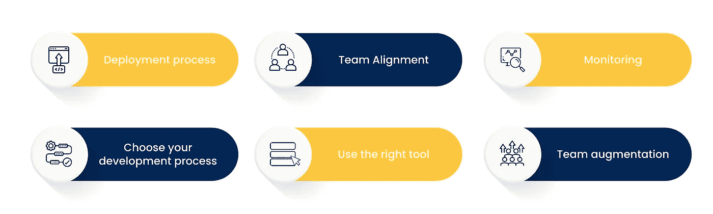

# 雇佣应用开发团队的综合指南

> 原文：<https://medium.com/codex/a-comprehensive-guide-to-hiring-an-app-development-team-4ab9746507bf?source=collection_archive---------7----------------------->

应用开发团队

本指南旨在为您提供雇用应用程序开发团队所需的所有信息。这篇文章将为你提供足够的信息，让你对下一步行动充满信心。

你需要知道的第一件事是，你是雇佣内部团队还是外包团队，还是在印度雇佣应用程序开发人员。内部团队通常是最佳选择，但在选择这条路线之前，有很多因素必须考虑。

如果你是一家小型创业公司，想雇佣整个开发团队进行外包，那么这是值得考虑的。

嗯，你不能完全说雇佣内部团队、外包团队或合同雇佣是你的最佳选择。在你雇佣一个应用程序开发团队之前，有一些事情你需要确定。

1.雇佣一个完整的内部团队的预算

2.你的团队完成这件事的经验

3.远程管理开发团队

4.全职参与项目的可能性

5.准备好解决开发过程中可能出现的任何冲突

6.分清任务的轻重缓急，集中精力按时完成任务

# 移动应用程序开发要求:

用户界面和客户端体验的创建是开发应用程序最重要阶段的第一步，或者更准确地说，是开发应用程序的结构和有用性的第一步。

iOS 和 Android 开发人员的技能现在正被结合起来，以创建可移植的应用程序。以下是你的团队必须具备的一些要求。

*   通过解释结构和线框创建一流的代码。
*   创建和维护优秀的、可重用的、可靠的 Java 代码。
*   确保应用程序以最高水平呈现，并快速响应。
*   修复任何需要修复的错误，包括识别和消除瓶颈。
*   它支持计算机化、关联和代码质量的维护。

在雇佣你的团队之前，上述所有这些都应该被考虑。

# 让我们来了解一下部署一个团队的流程。

部署团队的过程

为了正确理解规模，您需要了解整个项目的基础。我们需要租用资源，并根据项目的需要对它们进行扩展。这些是要遵循的步骤；

**项目分析:**你应该从分析你要做的项目开始。例如，如果项目是开发一个游戏 app，你必须考虑以下步骤。它的过程开始于确定它是什么类型的游戏，它需要的特性，以及它支持的游戏类型。

**团队规模** —在对您的项目进行分析后，将制定一份路线图。实施这些功能所需的团队规模将由路线图指明。在项目开发的早期阶段，需要大量的团队。在项目进行到一半时，如果我们增加了功能，由于其他一些原因，我们减少了团队。

**持续时间** —根据项目需要进行团队部署。然而，团队规模和持续时间是相互依赖的。你越早希望项目完成，团队就越大。

不过，上述各点可能会因情况而异。团队的规模和持续时间经常会有所不同，这取决于所分配项目的额外要求。总是倾向于雇佣额外的团队成员，即使他们不得不在项目之间无所事事。

# 你如何使招聘过程标准化？

招聘流程

## 部署流程

招聘并不总是意味着雇佣更多的人或工作更长的时间。这是关于优化您的工作流程，而这是通过改进您的部署流程来实现的。确保你有一个可重复的过程，每次都在清单的帮助下部署。

当记录和自动化您的部署过程时，重复的任务变得更容易，例如错误修复和维护工作。

部署清单应该像软件开发项目中的应用程序流程图或数据流图一样对待。

## 团队协调

在调整团队之前，您应该考虑组织的业务目标，并使它们与项目目标保持一致。确保您准备好了一份详细说明员工工作流程和任务的行动计划。

这将有助于降低压力水平，确保任务没有重叠，并从长远来看提高效率。

团队每个成员的工作都需要协调一致。项目经理应该能够向团队成员分配最适合他们技能的任务，并使他们与您的目标保持一致。

## 监视

密切关注你的团队，确保工作在给定的时间框架内完成。

## 选择你的发展过程。

如果不遵循工作流程，就无法控制团队内部完成的工作。您可以从各种过程工具和模板中进行选择，这些工具和模板将帮助您确保这一点。

## 使用正确的工具。

当您选择工具时，请确保它符合您的需求，并且具有以正确的方式完成任务的所有必要功能。记住，用正确的工具做正确的工作；否则，就不会从中得到任何好处。

## 团队扩充

这种方法需要从本地或海外雇佣的开发人员中远程增加更多的员工，并将他们整合到内部团队中，或者将他们作为独立的软件开发部门。

# 结论

开发一个成功的应用程序需要优秀的软件开发人员、测试人员、架构师和顾问。

如果你投入时间和金钱雇佣一个专门的开发团队，你可能会享受到上述所有的好处，开发出高质量的应用。

选择可靠的技术合作伙伴可以改变您的应用程序开发前景，并使您能够享受众多优势。在雇佣应用开发团队之前，确保你的议程清晰，并从[顶级 IT 员工扩充公司](https://www.quytech.com/it-staff-augmentation.php)中选择你的员工。

> **相关文章:** [**启动 App 开发**](https://www.thetodayposts.com/why-is-flutter-the-best-choice-for-startup-app-development/)