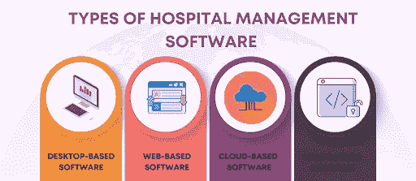
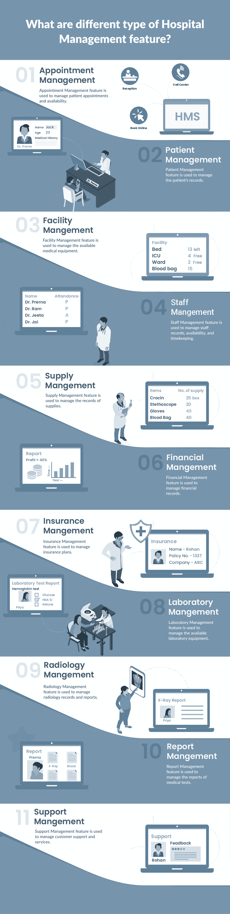
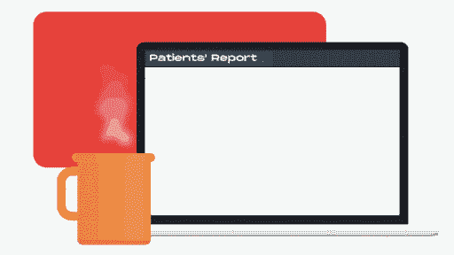
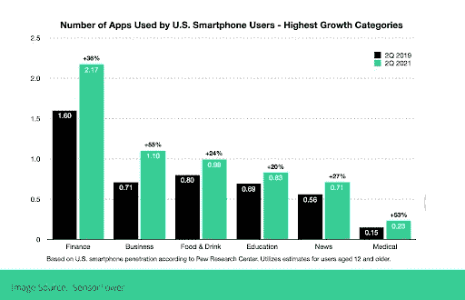
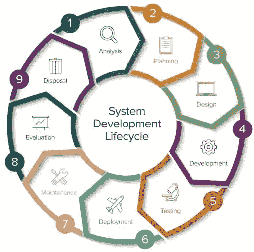
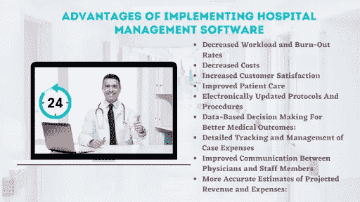

# 医院管理软件开发综合指南

> 原文：<https://medium.com/codex/a-comprehensive-guide-to-hospital-management-software-development-2d5971223c68?source=collection_archive---------1----------------------->

医疗保健行业可能是当今商业世界中最复杂的行业之一。它由数百名玩家组成，每个玩家都在努力确保自己在市场中的地位，并试图将自己与竞争对手区分开来。

然而，将所有参与者团结在一起的是一种实用的管理方法。无论我们谈论患者的需求还是财务方面，一个组织良好的医院管理软件对于更有效地运营医院和医疗中心至关重要。

***正如所说，“管理的工作就是优化整个系统。”——作者 w·爱德华兹·戴明。***

这就是为什么我们看到医疗保健行业对定制软件开发的巨大需求。卫生行业每年投资数百万美元来获得更好的信息和改善其管理系统。

根据 Statista 的报告，健康管理解决方案的全球市场预计到 2025 年将达到惊人的**500 亿美元。**

图片来源:Statista

所以，让我们拓宽视野，了解更多关于医院管理软件开发的知识，比如它的类型、特性，以及它价值数十亿的原因。

# **医院管理软件的类型-快速概述**

来源:[**coder daddy**](https://www.codersdaddy.com/)

## **1。基于桌面/内部部署**

基于桌面的医院管理软件**获得许可并安装在医院的 IT 基础设施内**。内部医院管理系统的本质是高度可定制的。医院可以选择将数据保存在服务器上。

## **2。基于网络的**

基于网络的解决方案是**易于访问**医院管理软件，允许你**使用互联网可用性**。医院管理员、护士、医生、患者、管理人员和员工可以使用他们的安全登录 ID 和密码访问该门户。管理员可以授予和控制用户可以访问门户的哪些部分。

## **3。基于云的**

需要高速接口、极高灵活性和海量数据存储能力的大型医院更喜欢基于云的医院管理软件。此外，它还是由第三方云服务提供商托管的 **SaaS(软件即服务)解决方案**。

## **4。自由开放源码**

开源医院管理软件的用户可以**定制编程代码，**更改默认设置，并集成外部插件以提高系统的核心工作功能和实用性。开源医院管理软件是需要定制解决方案的医院的一个选择。

# **医院管理软件功能**

## 1.预约管理:安排与医生的会面

该功能将使**更容易安排患者与医生的预约**。它可以记录你应该回去的时候见过谁。此外，它还会提供一系列关于医生的信息，比如他们的简介、资质、医学院等等。

喜欢应用程序的人可以通过移动应用程序利用这一功能，用户可以在家里或办公室安排约会。针对这一特殊功能，许多医院正在与印度的一家 [app 开发公司](https://www.pixelcrayons.com/mobile-app-development/) 接洽，希望能为他们开发一款 app，以提升他们的业务。

根据 Statista 的报告，有 53，054 个可用的医疗保健应用程序，比上一季度增长了 6.51%。

图片来源:Statista

## **2。患者管理:照看病史**

这个医院管理系统是管理病人的必备工具。它从以前的就诊或即将到来的预约中捕获并存储他们的病史和信息**。如果这些信息经过组织，医生可以很容易地获取。这也有助于后续工作。**

## **3.设施管理:检查床位、房间和其他资源状况**

**每家医院都需要密切关注其床位、房间、设备和其他资源的状况。这种管理软件有助于跟踪这些关键事实。例如，它可以查看房间的可用性，并确保房间接受新的病人。**

**根据 SensorTower 的数据，在 2021 年 **Q2 奥运会上，医疗和金融类应用的使用率分别增长了 **53%和**36%。****

****

## **4.员工管理:关于员工的所有相关信息**

**该功能有助于组织和优化医院的劳动力。它为你提供他们所有的相关信息，包括工作描述、日程安排、保险数据等等。您还可以使用它来跟踪他们的表现或特定技能。**

## **5.供应管理:跟踪您医院的所有库存**

**有了这个功能，你就可以在一个地方查找**所有医院的库存**。通过跟踪您拥有的耗材类型、它们在您的设施中的位置以及它们需要更换的时间，您将节省时间和金钱，同时确保每样东西都在适当的位置。**

## **6.财务管理:账单、支出等**

****

**此功能跟踪医院运营的财务方面，包括向患者收费、跟踪保险信息、查看预算和支出等。**

## **7.保险管理**

**保险管理功能对医院来说很方便，因为它可以跟踪患者的保险信息。它还可以帮助确定您处理的不同类型的保险涵盖哪些治疗，并帮助简化索赔处理。**

## **8.实验室管理:医学检验、诊断等报告**

**实验室是医院最重要的部门之一。完成医学测试和程序，这对于诊断或治疗患者的病情至关重要。**

**实验室管理功能简化了**实验室的工作流程**，确保样本准时从医院的正确位置到达实验室。它还将确保正确记录和组织结果以备将来参考。**

## **9.放射管理:图像报告**

**放射科是另一个可以帮助**诊断患者**的重要部门，这使得放射科的管理必须精简高效。通过确保医生在需要时可以方便地访问所有患者数据，放射管理功能对此有所帮助。**

## **10.报告管理:所有必要的信息**

**该功能可以跟踪所有的**患者报告**，方便医生在需要时查看。它还可以让医务人员快速查看报告，并在必要时创建新的报告。**

## **11.支持管理:解决疑问的简单方法**

**此功能最适合记录您的医院收到的所有不同的**投诉、问题、**和其他类型的支持请求。它有助于创建更高效的支持工作流，使每个人都可以更轻松地处理这些问题或将其提交给正确的部门。**

# **医院管理软件开发生命周期的阶段**

****

**图片来源:Smartsheet**

## **1.分析:详细检查**

**在这个阶段，特别进行可行性研究，以明确系统开发**目标**。与客户讨论后，详细分析需要开发的功能和特性。**

## **2.规划:决定所有的发展活动**

**设计和创建系统所需的所有活动都已计划好。工作分解结构( **WBS** )反映了众多的系统开发活动。**

## **3.设计:用户界面/UX**

**所有功能和技术要求都通过**逻辑图、数据流图、屏幕设计**文档等进行记录。还将创建一个数据库设计文档，其中包含数据库表、字段等的规格。**

## **4.开发:编码阶段**

**系统开发是在这个阶段进行的，用任何编程语言编写源代码。该计划应针对设计文档中提到的所有功能和技术要求进行验证。**

## **5.测试:检查错误**

**在之前阶段开发的所有组件都将在此阶段进行错误和缺陷测试。将创建一个测试计划，包括将要运行的测试用例的细节，用于测试的测试数据，等等。**

## **6.部署:准备发射**

**成功测试系统后，它被部署到生产服务器。在这一阶段，还要准备用户手册，说明用户应该如何操作系统。用户将接受培训，了解在日常活动中使用该系统时应遵循的程序。**

## **7.维护/支持:定期检查**

**在这一阶段，系统被持续监控错误和缺陷。对错误报告进行分析，以便为系统用户提供解决方案。如果用户遇到任何问题，将通过修复问题或在某些情况下修改现有软件代码来提供支持。**

## **8.进化:成长和发展的范围**

**在这一阶段，系统用新的功能进行更新。还根据用户要求对系统的现有功能进行了修改。这些变化被记录下来，这样任何加入组织的新用户都可以很容易地接受培训。**

## **9.处理**

**这个阶段也被称为“生命的终结”该系统或者被完全关闭并从组织的网络中移除。在关闭或完全删除系统之前，应备份系统中存储的所有数据。如果在备份所有数据后留下任何重要文档，则应将它们转移到新系统中。**

**分析、设计、实现和测试是开发有效医院管理系统的关键阶段。现在让我们看看系统中的基本医院管理软件功能。**

# **实施医院管理软件的优势**

****

## **1.降低工作负荷和消耗率:**

**医院管理软件是减少医院员工工作量的绝佳工具。实施该软件减少了工作量，消除了冗余流程，并提高了效率。**

## **2.降低成本:**

**如果您的医院使用手动数据输入方法，您可能会在这个过程中花费太多的时间和金钱。实施 EHR 系统可以加快占用宝贵工作时间的任务，从而每年为您的医院节省数千美元。**

## **3.提高客户满意度:**

**医院管理软件提高了医院为患者提供更好服务的能力。许多电子健康记录系统允许你更快地检查病人，甚至从软件中打印他们的处方。**

**此外，这可以节省时间，让你的客户体验更加愉快，减少他们产生负面意见的可能性，并可能阻止他们再次光临。**

**Statista 估计，到 2025 年，移动医疗行业将达到 1890 亿美元。**

****

**图片来源:Excellentwebworld**

## **4.改善患者护理:**

**借助医院管理软件，您的医院可以为您的患者提供更高质量的护理。该软件使与整个医院的医生、护士和其他医疗专业人员共享信息变得更加容易，减少了药物处方错误。**

## **5.电子更新的协议和程序:**

**借助医院管理软件，您可以随时更新您的协议和程序文档。在咨询医师后，您可以轻松地即时进行更改，而不必经历重新创建和重新打印新手册的冗长过程。**

## **6.基于数据的决策以获得更好的医疗结果:**

**医院管理软件的实施使您能够访问医学研究数据，这些数据可以帮助您的医生和其他医疗专业人员就如何更好地护理您的患者做出更明智的决策。通过该软件提供的信息，他们可以提供更好的患者护理，并使医院管理层更加知情。**

## **7.案件费用的详细跟踪和管理:**

**医院管理软件给你一个更好的方法来跟踪病例费用。你可以很容易地记录哪些钱花在了哪里，哪些程序比其他程序更昂贵，从而可以更好地制定预算。这些信息有助于控制案例成本，并做出改变以提高底线。**

## **8.改善医生和工作人员之间的沟通:**

**实施 EHR 系统简化了医生和工作人员之间的沟通，使他们能够访问一个集中的区域来共享信息。医生只需点击一个按钮，就可以轻松地向护理人员发送消息，确保他们在必要时能够迅速得到通知。**

## **9.对预计收入和支出的更准确估计:**

**医院管理软件提供了项目收入和费用的准确估计，这让您更好地了解您的医院是如何运作的。您将获得更多关于已接受治疗的患者数量、测试和程序的平均成本以及其他可用于提高医院效率的重要指标的信息。**

# **开发医院管理软件的成本是多少？**

****

**虽然很难精确确定医院管理软件的价格，但一些因素会影响价格。其中包括:**

**1.软件开发过程的持续时间。**

**2.医院管理软件所需的定制和功能数量。**

**3.移动应用程序或基于浏览器的访问需要多大的范围？**

**4.将使用什么类型的数据库和编程语言来构建医院管理软件？**

**5.你的团队成员是谁？**

**6.支持您的医院管理软件所需的硬件基础设施有多大？**

**7.开发医疗保健应用程序的前期成本是多少？**

**8.升级是否有任何年度维护费用或额外费用？**

**然而，根据上述变量的不同，它的范围可以从 **$15，000 到$150，000 或更多**。**

# **最后的想法**

**医院管理软件有助于改善和简化医院和医疗保健管理。在决定一个特定的系统之前，你应该先研究一下哪个软件最能满足你的需求。**

**之后，你可以在印度雇佣一家定制的医疗保健软件开发公司，为你创建专门的医院管理软件。该公司应该精通最新技术，包括人工智能和机器学习，以确保你的系统是可靠的、可扩展的和用户友好的。**

****结账服务:****

## **[Web 应用程序开发服务](https://www.codersdaddy.com/website-app-development-company-agency)、[移动应用程序开发服务](https://www.codersdaddy.com/mobile-app-development)、[印度 UI UX 设计服务](https://www.codersdaddy.com/ui-ux-design-service-company)、[印度 IT 员工扩充服务](https://www.codersdaddy.com/it-staff-resource-augmentation)、[网站维护&支持服务](https://www.codersdaddy.com/website-app-maintenance-support)、[雇佣专门的软件程序员](https://www.codersdaddy.com/hire-developer-engineer-programmer/)、[雇佣印度 Android 应用程序开发人员](https://www.codersdaddy.com/hire-developer-engineer-programmer/android-app)、[雇佣印度 iPhone 应用程序开发人员](https://www.codersdaddy.com/hire-developer-engineer-programmer/ios-iphone-app)、[雇佣印度 PHP 开发人员](https://www.codersdaddy.com/hire-developer-engineer-programmer/php-web)、  [雇佣印度. Net 开发者](https://www.codersdaddy.com/hire-developer-engineer-programmer/dot-net)，[雇佣印度 Laravel 开发者](https://www.codersdaddy.com/hire-developer-engineer-programmer/laravel)，[数字营销服务](https://www.codersdaddy.com/digital-marketing-agency-company-firm)，[印度 SEO 服务](https://www.codersdaddy.com/seo-service-company-agency-firm)，[印度 ORM 服务](https://www.codersdaddy.com/online-reputation-management-service-company)，[印度 SEO 内容写作服务](https://www.codersdaddy.com/content-writing)，[雇佣印度 WordPress 开发者](https://www.codersdaddy.com/hire-developer-engineer-programmer/wordpress-web)，[雇佣印度 Drupal 开发者](https://www.codersdaddy.com/hire-developer-engineer-programmer/drupal)，[雇佣印度 Angular 开发者](https://www.codersdaddy.com/hire-developer-engineer-programmer/angular-js)，**