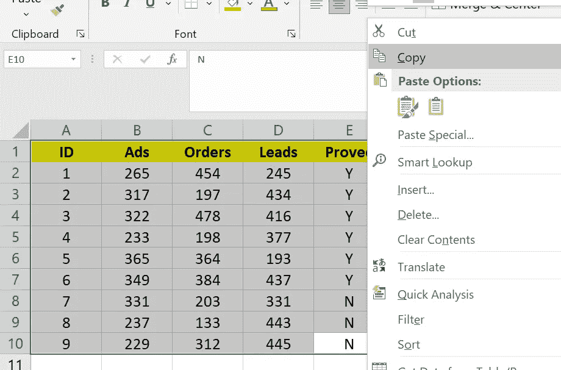

# R 中数据导入的全面总结:从最用户友好到最省时

> 原文：<https://medium.com/codex/a-comprehensive-summary-of-data-import-in-r-from-the-most-user-friendly-to-the-most-time-saving-6c87319b1927?source=collection_archive---------5----------------------->


在 [Unsplash](https://unsplash.com?utm_source=medium&utm_medium=referral) 上由 [Aron 视觉](https://unsplash.com/@aronvisuals?utm_source=medium&utm_medium=referral)拍摄的照片

在这篇短文中，我总结了数据导入的不同技术，并提供了一系列权衡速度和便利性的方法供读者选择。

假设数据文件都存储在文件夹*F:\ BDMA \数据\* 中。对用户最友好的数据导入方法是交互式方法；也就是说，它允许您像常规的文件打开操作一样打开文件夹来定位数据文件。请确保您注意到任务栏上有一个闪烁的窗口，邀请您选择目标文件。

```
df.name=read.csv(file.choose())
```

另一种你输入你所看到的方法是通过复制粘贴。

假设你想从一张电子表格中“直接”复制粘贴。 *read.table* 函数可以帮忙。首先复制选定的单元格。



然后去 R-Studio，把内容贴在那对引号里面。不要调整内容中的任何内容，例如空格、空白、回车。就让它们保持原样吧。

```
df.name=read.table(text=c(“ID Ads Orders Leads Proved
1 265 454 245 Y
2 317 197 434 Y
3 322 478 416 Y
4 233 198 377 Y
5 365 364 193 Y
6 349 384 437 Y
7 331 203 331 N
8 237 133 443 N
9 229 312 445 N
“),header=T)
```

或者，使用 *read.delim.* 令人惊讶的是，这一行代码得到了同样的结果。

```
df.name=read.delim("clipboard")
```

当您必须多次运行相同的代码时，从数据导入到分析，再到结果导出，您希望避免上面的手工操作。您希望选择代码块并单击“运行”，这样他们就可以在您休息的时候照顾好自己。那么您需要使用以下语法方法。

R 用户最常用的文件类型是 csv 格式。Excel 可以将 csv 文件作为带有单个工作表的常规电子表格文件打开。假设你的数据文件存储为*F:\ BDMA \数据\my_data.csv* 。您可以使用内置函数 *read.csv* 将文件导入到 r。

```
df.name=read.csv(“F:/BDMA/data/my_data.csv”, headers=T)
```

请注意，我使用“/”来告诉 R 数据文件的地址/位置，而在 Windows 的文件管理器中使用“\”来描述文件夹和文件。为了避免这种麻烦，我通常选择文件地址，并将 R-Studio 中的所有“\”替换为“/”。

处理斜线切换的另一种方法是使用下面的代码预先指定存储数据文件的工作目录。其中 *wd* 代表工作目录。

```
setwd(“F:/BDMA/data”)
```

您可以使用 *getwd()* 来检查工作目录是否设置正确。然后

```
df.name=read.csv(“/my_data.csv”, headers=T)
```

相应地，使用 *write.csv* 函数将 R-Studio 中的 dataframe 导出回 csv 文件只是一行代码。

```
write.csv(data.name, “new_file_name.csv”, row.names=F)
```

确保您包含了参数*row . names = F*；否则，您只是在文件中添加了一个无用的行 id 列。当您下次从该文件导入时，一个新的 row-ID 列被添加到导入的 dataframe 中，这会使您的代码变得混乱，因为您是通过列 ID 引用变量的。

D ropbox 是我喜欢存储数据文件的一项服务。在 Dropbox 文件夹中，我可以使用 Dropbox 链接导入数据，完全避免使用斜线。Dropbox 会生成一个类似于下图的 URL 链接。*https://www.dropbox.com/z/rs4j7617jlrsk1mu8of/mydata.csv?
dl=0*

要将 *read.csv* 应用于 Dropbox 链接，只需将 Dropbox 链接中的最后一个字符从 0 改为 1。

```
df.name=read.csv(“https://www.dropbox.com/z/rs4j7617jlrsk1mu8of/my_data.csv?dl=1",header = T)
```

ip 文件便于与压缩的 csv 文件一起传输。要在不解压缩的情况下导入 zip 文件，我们可以使用名为 *readr* 的包，并使用用户 *read_csv* 来读取压缩的数据文件。

```
**require**(readr)
df.name==readr:: read_csv(“my_data.zip”)
```

如果一个 zip 文件包含多个 csv 文件，并且您不想将它们全部解压缩，那么您可以使用下面的代码。

```
df.name = read.csv(unz(“zip_file.zip”, “my_data.csv”), header = T, fileEncoding=”UTF-16")
```

如果我们正在处理 xls 和 xlsx 等 Excel 文件，有几个软件包可以帮助你。 *readxl* 就是其中之一。你需要先在电脑上安装 Java，才能使用 *readxl* 。加载后，您可以使用 *read_excel* 函数导入 xls 和 xlsx 文件。

```
**require**(readxl)
df.name=readxl::read_excel(“my_data.xls”)
```

对于 xlsx 文件，我推荐 *openxlsx* 包中的 *read.xlsx* 函数。

```
**require**(openxlsx)
df.name=openxlsx::read.xlsx(“my_data.xlsx”, sheet = 1, skipEmptyRows = T)
```

我发现 *read.xlsx* 无法导入 xls 文件。

关于如何将数据框导出到 Excel，请参考[这篇文章](/geekculture/employing-r-to-serve-excel-spreadsheet-pivot-table-generation-multiple-worksheets-creation-and-6a01751dd767#8bcb-69b2d35433d2)。

uge csv 文件需要很长时间才能导入。如果你有一个巨大的 csv 文件，你甚至不能在 Excel 中打开它，你可以使用 *data.table* 包中的 *fread* 函数，其中“f”代表“快”(不开玩笑)

```
**require**(data.table)
df.name=data.table::fread(“my_data.csv”)
```

对于 read.csv 需要 4 分钟才能导入的 csv 文件， *fread* 在我的电脑上大约需要 14 秒。
相应地，要将大数据文件导出为 csv 文件，可以使用 *fwrite* 。

```
fwrite(df.name,“new.csv_file.csv”)
```

最后，有些文件是以 JSON 格式存储的，这种格式确实超出了本文的范围。谷歌搜索 rjson 包，希望会给你什么你正在寻找。

# — — — — -

这篇文章献给我的学生，他们正为我们的第一次 BDMA 讲座而头疼。第二讲来了…希望这篇文章有帮助。