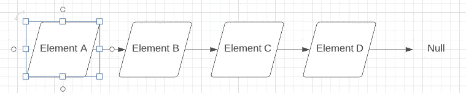
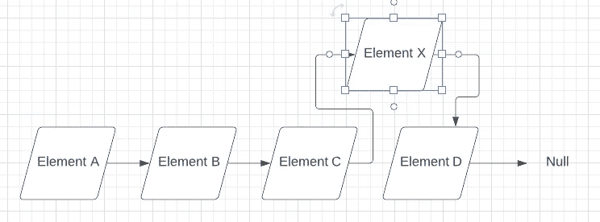
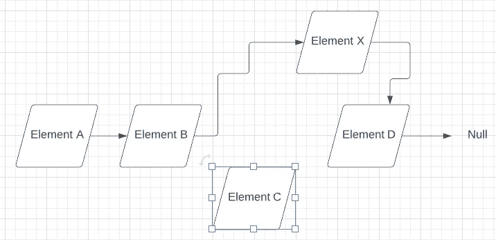

# Java 中嵌套静态类的几个用例

> 原文：<https://medium.com/codex/a-couple-of-use-cases-for-nested-static-classes-in-java-8a115dbcaacf?source=collection_archive---------16----------------------->


照片由 [Vignesh Jayaprakash](https://unsplash.com/@pixtagrammer?utm_source=medium&utm_medium=referral) 在 [Unsplash](https://unsplash.com?utm_source=medium&utm_medium=referral) 上拍摄

只要可以使用匿名类，就可以使用命名的嵌套静态类。但是，只有当您需要从两个或更多地方实例化该类时，这才有意义。

迭代器可能不会出现这种情况，但单链表或双向链表中的节点可能会出现这种情况。

# 链表中的节点

不像`ArrayList`那样用一个后备数组来保存列表的元素，链表用链接的节点来保存元素。

然后，我们可以使用私有嵌套静态类来表示链表中的每个节点。

在单链表的情况下，每个节点只需要保存两件事:元素和指向下一个节点或前一个节点的指针，或者如果它是列表中的最后一个或第一个元素，则为空指针(取决于链接是向前指向还是向后指向)。



显示具有四个元素的链表的图表。

链表的一个优点是在链表的中间插入和删除非常容易。没有必要在后备数组中移动元素。



显示向链表中插入元素的图。

无论哪个方向。



显示从链表中移除元素的图。

链表也有其缺点，但这超出了本文的范围。重要的是，链表的节点可以由嵌套在链表类中的专用类来表示。

这是`SinglyLinkedList<E>`的草稿:

因为`Node<E>`不需要访问封闭类`this`，所以它可以被声明为嵌套的静态类而不是内部类。

# 实现嵌套在测试类中的类

另一个用例是我感谢 Apache NetBeans 的:使用嵌套在测试类中的静态嵌套类来测试抽象类。

当我试图更彻底地了解测试驱动开发(TDD)时，我意识到在大多数情况下抽象类需要被测试。第一次想到这个问题时，我决定在 NetBeans 中尝试一下。

如果让 NetBeans 为一个抽象类生成一个测试类，它可能会包含一个嵌套在测试类中的“Impl”类。例如，如果`SomeClass`是抽象的，并且有一个需要一个或多个参数的构造函数，NetBeans 将包含嵌套在`SomeClassTest`中的`SomeClassImpl`。

但是，NetBeans 不会将这样的 Impl 类标记为静态，也不会提醒您它可以是静态的。但也许您可以将这归因于 NetBeans 不像 Eclipse 或 IntelliJ IDEA 那样“固执己见”——最后一个肯定会让您知道嵌套类何时可以是静态的。

例如，给定这个抽象类，

NetBeans 将为您生成如下内容:

```
package postal;// JUnit imports go herepublic class PostalCodeTest { // Test stub for getCountry() private class PostalCodeImpl extends PostalCode {

        @Override
        public String toString() {
            return "ImplPostal " + this.postalCodeNumber;
        } PostalCodeImpl(int code) {
            super(code, Locale.US);
        }

    }}
```

作为一种良好的形式，您可以在`PostalCodeImpl`声明中添加“`static`”。我非常喜欢这个想法，我也在我的 IntelliJ 项目中使用它，这就是我如何发现我缺少这个特定用例的静态声明。