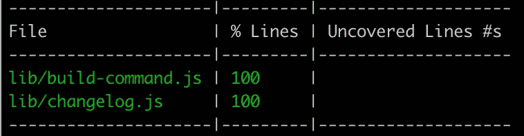

# 关于覆盖率的几句话

> 原文：<https://medium.com/codex/a-couple-words-about-coverage-bb1eee6af9f8?source=collection_archive---------23----------------------->

## 今天我们谈论一种新的覆盖工具🎩ESCover 和更多！


骑着牛，我到家了。我很平静。牛也可以休息。黎明已经来临。在我的茅草屋里，我已经放下了鞭子和绳索。
禅宗十牛

嗨伙计们！

我想你知道代码转换器🐊`[Putout](https://github.com/coderaiser/putout)`有`100%`个测试覆盖。为什么这样问题是编写解析器是一项非常困难的任务，但是不用担心！有一个帮手😏！

# 嘲笑进口！

`[Mock-import](https://github.com/coderaiser/mock-import)`存在了大约一年，当你使用`[EcmaScript Modules](https://nodejs.org/api/esm.html)`的时候，它会用来嘲笑事物。它使用🐊`Putout`并在您最需要的时候将`ImportDeclarations`变为`VariableDeclaration`。所以这样的代码:

```
import {readFile} from 'fs/promises';
```

变成了:

```
const {readFile} = global.__mockImportCache.get('fs/promises');
```

效果惊人！但是`coverage`有一个问题:

*   `nyc`不支持`ESM`；
*   使用装载机时`c8`显示[错误覆盖信息](https://github.com/coderaiser/c8-reproduce)；

考虑到这两个因素。

# 游戏中的🧨新玩家让你无所遁形！

又一个覆盖工具出现了:🎩`[ESCover](https://github.com/coderaiser/escar)`。它也是基于🐊`Putout`。它设置稍后将调用的标记，更改代码:

```
export const sum = (a, b) => {
    return a + b;
};
```

变成这样:

```
export const sum = (a, b) => {
    return __c4['🧨'](5, 4), a + b;
};
```

`__c4`是一个有特殊含义的变量:它提供了一个给出当前指令的行号信息的函数。
以下是一切正常时报告的样子:

```
# CAP version 131..3
# files: 3
# covered: 3# 🌴 ok
```

当事情不对劲时:

```
# CAP version 13# /Users/coderaiser/escover/example/example.js
🧨 should be covered
---
lines:
 ️- 1 at file:///Users/coderaiser/escover/example/example.js:11..3
# files: 3
# covered: 2# 🧨 fail: 1
```

或者像这样:



你可以选择你喜欢的😏。

🎩`[ESCover](https://github.com/coderaiser/escover#escover----)`可以定期使用🎉！
唯一的问题是:它只对`EcmaScript Modules`有效。这是有原因的:对于`CommonJS`你可以使用`[c8](https://github.com/bcoe/c8)`和`[nyc](https://github.com/istanbuljs/nyc)`。但是没有工具显示用`[node loaders](https://nodejs.org/dist/latest-v16.x/docs/api/esm.html#loaders)`改变的文件的覆盖率。

的结果🎩`ESCover`被保存到`coverage/lcov.info`，并在完成后读取。关于保险的几件事:

-☝️ `[*lcov*](https://github.com/linux-test-project/lcov)` *创作于* `*2002*` *，差不多二十年前。-☝️的 Linux 内核开发者创建了它来了解覆盖率的情况。*
-☝️ *lcov 最初是用* `*PERL*` *编写的，具有基于文本的格式。*
【-☝️】*这是有史以来最流行的覆盖格式，受到很多工具的支持(比如* [*套装*](https://coveralls.io/) 、c8 和 nyc *)。*

因此，如果我们用以下代码运行我们的`ESM`应用程序:

```
escover npm test
```

我们将收到类似于以下内容的`coverage/lconf.info`:

```
SF:/Users/coderaiser/escover/lib/transform.js
DA:1,1
DA:3,1
DA:7,1
DA:9,1
DA:10,1
DA:12,1
DA:24,1
DA:25,1
DA:27,1
DA:28,1
DA:29,1
DA:32,1
end_of_record
```

其中:

*   `SF` -是通往源头的路径；
*   `DA` -正在运行的行数和计数；
*   `end_of_record`当前文件条目的最新记录；

对我来说，这真的是人类可读的，非常紧凑的形式。我现在唯一不明白的是:计数器，我看不出我为什么需要它们🤷‍♂️，如果你有理由[就制造一个问题](https://github.com/coderaiser/escover/issues)。它可以在一行代码中添加。

🎩`ESCover`在开发的早期阶段，很多东西会改变，但是它已经在几个项目中使用了，一切都很好🎈。

# 🤷‍♂️:我还能做什么🐊`Putout`？

您可以借助`[ESTrace](https://github.com/coderaiser/estrace#estrace----)`跟踪函数的执行。它提供这样的信息:

```
coderaiser@cloudcmd:~/estrace$ node --loader estrace example/lint.js
..💣 lint([]) 16.05mb file:///Users/coderaiser/estrace/example/lint.js:5
....💣 getFiles([]) 16.05mb file:///Users/coderaiser/estrace/example/lint.js:12
....💥 getFiles 16.06mb file:///Users/coderaiser/estrace/example/lint.js:12
....💣 lintFiles([]) 16.06mb file:///Users/coderaiser/estrace/example/lint.js:22
....💥 lintFiles 16.06mb file:///Users/coderaiser/estrace/example/lint.js:22
..💥 lint 16.06mb file:///Users/coderaiser/estrace/example/lint.js:5
```

并进行下一步的转换。假设你有一个函数:

`const fn = (a) => a`

`EStrace`将替换为:

```
const fn = (a) => {
    try {
        var __estrace_context = __estrace.enter('<anonymous:2>', 'file://hello.js:2', arguments);
        return a;
    } finally {
        __estrace.exit('<anonymous:2>', 'file://hello.js:2', __estrace_context);
    }
};
```

# 🤷‍♂️有什么新规定？

`[@putout/plugin-convert-commonjs-to-esm](https://github.com/coderaiser/putout/tree/master/packages/plugin-convert-commonjs-to-esm#commons)`不再要求你使用`[simport](https://github.com/coderaiser/simport)`。仅内置模块💪(*感谢* `[*@putout/plugin-declare-undefined-variables*](https://github.com/coderaiser/putout/tree/master/packages/plugin-declare-undefined-variables#readme)` *支持原生* `*node.js*` *模块，并会在使用时声明😉*)。

`@putout/plugin-nodejs`得到了一个新规则:`[convert-dirname-to-url](https://github.com/coderaiser/putout/tree/master/packages/plugin-nodejs#convert-dirname-to-url)`。它是做什么的？

变化:

```
import {readFile} from 'fs/promises';
const file1 = join(__dirname, '../../package.json');
```

收件人:

```
import {readFile} from 'fs/promises';
const file1 = new URL('../../package.json', import.meta.url).pathname;
```

这样有助于去掉`EcmaScript Modules`中的`__dirname`。下面是[快稿](https://putout.cloudcmd.io/#/gist/e5169838606cd0cd7b4560000936d084/c9ee791e97c280fd2ebca7c66ec8658d53922846)和[结果](https://github.com/coderaiser/putout/commit/810fb2c05a5f06ae425b5c68ce6850dcb2f53b24)。

# 🦔真实世界使用

我刚刚发现(*我知道他们会的，但是谁知道呢*😅 *…* )即从`[**Stylelint**](https://github.com/stylelint/stylelint/issues/5291#issuecomment-920778090)` [**到*民间所用的*🐊**](https://github.com/stylelint/stylelint/issues/5291#issuecomment-920778090) `[**Putout**](https://github.com/stylelint/stylelint/issues/5291#issuecomment-920778090)` [**将自己的代码库转换为**](https://github.com/stylelint/stylelint/issues/5291#issuecomment-920778090) `[**ESM**](https://github.com/stylelint/stylelint/issues/5291#issuecomment-920778090)` [🎉](https://github.com/stylelint/stylelint/issues/5291#issuecomment-920778090)。

而且`jest`有点问题:**它不认** `**import.meta.url**` **🤷‍♂️** 好吧，那是悲伤的😕，但是嘿！

这是为什么📼`[Supertape](https://github.com/coderaiser/supertape)`存在:**最简单的高速测试。**
非常感谢 **Stylelint** 团队！你所做的太棒了，非常鼓舞人心！

今天就到这里吧！有一个好的编码🎮！

*更多内容请看*[***plain English . io***](http://plainenglish.io/)*。报名参加我们的* [***免费每周简讯***](http://newsletter.plainenglish.io/) *。在我们的* [***社区获得独家写作机会和建议***](https://discord.gg/GtDtUAvyhW) *。*