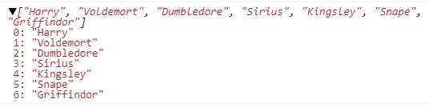

# 数据结构的创造性指南(第一部分)——数组，最美丽的数组

> 原文：<https://medium.com/codex/a-creative-guide-to-data-structures-part-1-array-the-fairest-of-them-all-13491e0e2d5f?source=collection_archive---------18----------------------->


凯瑟琳·拉威利在 [Unsplash](https://unsplash.com?utm_source=medium&utm_medium=referral) 上拍摄的照片

# **简介**

实话实说吧。编程很难。真的很难。

但也可以很有趣。构建一个能让你和来自世界各地的朋友聊天的网络应用程序，一个载有你想购买的所有物品的购物车，或者一个视频游戏，都会给我们一种成就感和满足感。这是我们作为开发人员在职业生涯中一直追求的。

但是编程最困难的部分是学习基础。数据结构允许我们组织和构造我们需要的数据，使我们的程序正常运行。数据结构的薄弱基础就像是建在沙丘顶上的房子。一旦地震或洪水来袭(我们称之为虫子)，那房子就完蛋了。

这篇文章旨在以最简单有趣的方式介绍数据结构和所有的算法。我将尝试使用门外汉或不精通技术的人能够完全理解的定义和术语。

我将从编程中最常用的数据结构——也是最公平的数据结构——数组开始。

# 你为什么称之为阵列，最公平的吗？不是白雪公主！

嗯，这是文字游戏。而**数组**是一个线性数据结构，用于**存储数据**的集合，或者说是*相同*类型的变量的集合。JavaScript 中有一个例外。我稍后会进一步解释。

当您开始作为开发人员的旅程并了解变量和赋值时，例如:

```
*int x = 1;*
```

或者

```
*var name = “John”;*
```

我相信你已经问过自己:“如何在一个变量中存储多个数字或多个名字？并且毫不费力地使用它们？”

这就是数组出现的原因。它需要一个数字列表，或者一个你能想到的名字列表，然后把它们都塞进一个变量里。

这很简单，也很公平。因此它的标题是“最美丽的”

# **创建数组**

让我们一起创建一个数组。并且乐在其中。

假设我们想从《哈利·波特》系列中建立一个强大巫师的列表。只是一个简单的列表。还不需要把它们从最好到最差排序。

下面的语法是我们如何使用 JavaScript 创建这样一个数组的。

```
var wizards = new Array(“Harry”, “Voldemort”, “Dumbledore”, “Sirius”, “Kingsley”, “Snape”, “Griffindor”);
```



上述代码通过[stackblitz.com](https://stackblitz.com/edit/js-arra7s?file=index.js)产生的结果

我们已经创建了一个名为*巫师*的数组，在这个数组中有一个*哈利波特*角色的列表，所有这些都存储在这个名为*巫师*的变量中。

如果我们在命令提示符下运行这个数组，或者在你最喜欢的代码编辑器的控制台上运行，我们会显示出*哈利波特*系列中强大巫师的完整列表，从哈利排在最前面，格里芬多排在列表的最后(同样，我们*只是*做了一个小列表，并没有对谁是最好的进行排名。这有待讨论。)

# 在我们继续之前，有一个关于数组的小花絮…

请注意代码结果屏幕截图，列表从 0 开始。

这是因为数组中的元素使用了一种称为*的从零开始的索引*的技术，这些索引排列在从索引 0 到 N(数组中的项目数)的特定框中

例如:传统的编号列表通常从 1 开始，而不是从 0 开始。你可能会问，为什么会这样？是错别字吗？

不不是的。

看，在数组或链表这样的列表中，我们从 0 开始。因为在计算的早期，像 FORTRAN 这样的老的计算机语言从 1 而不是 0 开始它们的数组，这在当时没有任何意义，因为它感觉像是跳过了一个重要的数字 0，即数组中的第一个元素。直到 C 编程语言出现并解决了这个问题。

还有，我们在和电脑打交道；计算机有一种特殊的语言，涉及二进制数字，或简称为比特，是计算机上最小的数据。位总是有两个值:0 和 1。当我们将数字转换成比特时，比如说从 0 到 3，我们会得到类似模式的序列:00、01、10 和 11。

您可以在本文中了解更多关于 bits 的知识。但是现在，只要知道计算机术语中的编号列表是从 0 开始的。这些数字被称为指数。

# 创建数组的其他方法

创建数组还有许多其他方法。

让我们再创建两个向导数组，并逐行检查它们。

```
var wizards2 = ["Harry", "Hermione", "Ron", "Draco"];var wizards3 = [];var wizards4 = ["Merlin", 100, {}];
```

数组 *wizards2* 初始化了一个包含四个巫师——哈利、赫敏、罗恩和德拉科——的数组列表，总索引为 3；因为在数组中，索引从 0 开始，所以哈利在索引 0，赫敏在索引 1，罗恩在索引 2，德拉科在索引 3。

至于数组 *wizards3，*它没有初始化，因此是我们创建的一个空数组。

至于最后一个数组*魔法 4* ，还记得我在文章开头解释过数组的定义是相同类型变量的集合吗？

这个定义在其他编程语言中仍然适用，然而，在像 *JavaScript* 这样的语言中，数组内容是它们自己特殊类型的对象，这要感谢 *var* 类型。也就是说，你可以在一个数组中添加任何不同类型的元素。

因此，我们应该将数组的定义重新表述为具有不同数据类型的变量的集合，包括对象。

# 我们已经创建了一个数组，现在做什么呢？

所以现在，我们必须给他们打电话。

不，不要像打电话给朋友一样打电话给他们。

我们只是让程序检索存储在我们指定的数组中的数据元素。

比方说，当你看着你的巫师名单时，你想找回伏地魔。你需要执行下面的语法来获取存储伏地魔名字的数据。

第一步是找到伏地魔。不，他不在阿尔巴尼亚。他在*巫师*阵列的索引 1 中。记住，在我们的数组变量*向导*中，我们的索引从 0 开始。

在 *console.log()* 函数中运行这段代码会在输出中显示他的名字。

```
console.log(wizards[1]);> *Voldemort*
```

好吧。给你们来个突击测验，*哈利波特*粉丝们(他们是秘密的网络开发者):

回顾上面的*巫师*数组变量，哈利波特*中哪个*角色因贬低、不尊重、恐吓他的学生而出名？

如果你的答案是斯内普，你确实是正确的！

现在让我们用一段代码来定位斯内普，使用 *console.log()。*

在我们的最后一个例子中，我们在索引 1 处找到了伏地魔，他在索引 0 处紧随哈利之后。在伏地魔之后，我们得到了邓布利多在*索引 2* ，小天狼星在*索引 3* ，金斯利在*索引 4，*，最后斯内普在*索引 5* 。

所以使用我们的 *console.log()* 来定位斯内普，我们将使用正确的语法来得到这个结果

```
console.log(wizards[5]);> *Snape*
```

拥有一个数组最大的好处是你可以很容易地在任何索引上定位元素；即使你有一个空数组，比如我们例子中的 *wizards3* 创建数组的其他方法。

让我们在该数组中添加两个新的向导来证明我的观点。

我想添加的新巫师是金妮和纳威，他们将分别位于索引 0 和 4。让我们检查以下需要添加的代码。

```
var wizards3 = [];
```

还记得上面这个数组吗？您可能还记得，在本文的前面，它被初始化为一个空数组。

接下来的两行代码，正如承诺的那样，将我们的新巫师金妮和纳威分配到了索引 0 和索引 4。

```
wizards3[0] = "Ginny";
wizards3[4] = "Neville";
```

现在，两个向导都被分配了一个位置，现在到了 *console.log()* 显示结果的时候了。

```
console.log(wizards3);
```


通过[stackblitz.com](https://stackblitz.com/edit/js-arra7s?file=index.js)从上述代码得到的结果

正如你在结果输出中看到的，只有金妮和纳威在初始化的魔法数组 3 中占据了索引 0 和索引 4 的位置。意味着你可以在任何时候调用代码中的两个赋值变量，除了未定义的变量。不能调用它们，因为它们会导致未定义的变量错误。

就当是点名吧，你叫到金妮和纳威，他们会用响亮而欢快的声音回应你，“到！”。

但是你试着去叫哈利、罗恩和赫敏，却只得到蟋蟀。因为它们没有被分配给数组中的索引。他们还没有就座

因此，未定义的变量错误。

# **那么，我们对数组有什么了解？**

我们已经学到了关于数组的所有非常重要的东西。

首先，它是一个线性数据结构，用于**存储数据集合。**

一般来说，数组是与 ***相同的*** 类型的变量的集合，但是 *JavaScript* 却不是这样。它们是包含对象的*不同*数据类型的变量集合。

数组中的元素使用一种称为从零开始的索引的技术，这些元素排列在从索引 0 到 N(数组中的项数)标记的特定框中。也就是说，如果我们有一个 4 个巫师的列表，哈利在列表的顶部，德拉科在最底部，那么哈利将位于索引 0，德拉科将位于索引 3。

到目前为止，数组作为数据结构的众多基础之一，在您的代码中实现起来是简单而公平的。下面的[*stackblitz.com*](https://stackblitz.com/edit/js-arra7s?file=index.js)代码用于编写本文和测试所需的代码，可以访问用于演示目的。请随意分叉、下载或复制这个项目。

直到下一期，快乐编码。