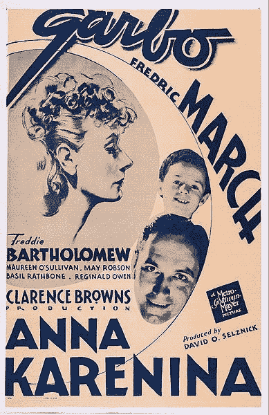

# 一位数据科学家分析了大部头《安娜·卡列尼娜》的文本

> 原文：<https://medium.com/codex/a-data-scientist-analyses-the-text-of-the-tome-anna-karenina-2e24b193d8f7?source=collection_archive---------9----------------------->

几周前，当我在学习 PyTorch 时，我学习了自然语言处理，或 NLP。我学习的课文是列夫·托尔斯泰的巨著《安娜·卡列尼娜》。《安娜·卡列尼娜》是一部不朽的作品，它已经被翻译成了大约 800 页的英文，因为在这部文学作品中有很多词汇，所以很值得看一看这部巨著