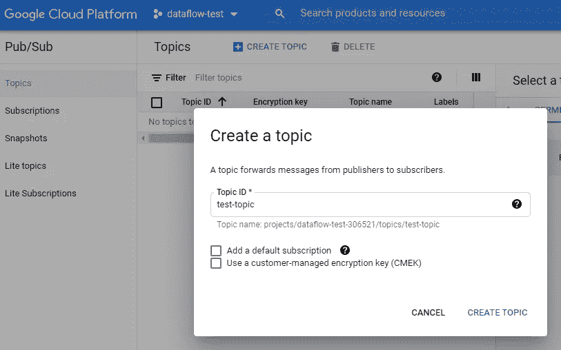

# 数据流之旅:从 PubSub 到 BigQuery

> 原文：<https://medium.com/codex/a-dataflow-journey-from-pubsub-to-bigquery-68eb3270c93?source=collection_archive---------2----------------------->

## 药典

## 利用 Google 云服务和 Apache Beam，用 Python 构建一个定制的流数据管道


如果您需要处理大量的流数据，您通常会发现托管解决方案是最简单的选择。这些流程很少是一致的，构建您自己的解决方案的价格是无法承受的，并且您必须管理架构和代码。有许多托管服务:在 AWS 上你可以使用 [Kinesis](https://aws.amazon.com/kinesis/) ，Azure 有[流分析](https://azure.microsoft.com/en-in/services/stream-analytics/)，IBM 有[流分析](https://www.ibm.com/in-en/cloud/streaming-analytics)，你几乎总能找到一个针对 [Apache Kafka](https://kafka.apache.org/) 服务器的托管解决方案。
我会试着解释如何开始使用谷歌云解决方案:**数据流**

# 介绍

简单介绍一下我们将要使用的谷歌云服务

**Google PubSub** 顾名思义，PubSub 是一个*发布者-订阅者*托管服务。在 PubSub 中，您可以定义一些*主题*(或频道)，其中一些服务(*发布者*)可以插入消息，而其他服务(*订阅者*)可以消费它们。

你应该不需要太多的话来介绍谷歌云最著名的服务:BigQuery 是一个完全可扩展的、快速的、云上的关系数据库。
配合标准 SQL 语言使用，主要用于 BI 分析。

**谷歌数据流**
基于 [**Apache Beam**](https://beam.apache.org/) ，这款谷歌云服务使用相同的代码以批处理或流模式进行数据处理，提供水平可扩展性，以校准所需的资源。

该服务提供了许多现成的[模板](https://cloud.google.com/dataflow/docs/guides/templates/provided-templates)。在它们之间，还有一个遵循我们稍后将详述的同一管道:从 PubSub 读取消息并将它们写入 BigQuery。
每个模板都是用 Java 编写的，可以在 [Github](https://github.com/GoogleCloudPlatform/DataflowTemplates/tree/master/src/main/java/com/google/cloud/teleport/templates) 上找到，然而，我们将看到用 Python 创建的带有自定义操作的管道，以便更好地理解如何自己创建一个管道。

# 把手放在某物或者某人身上

## 步骤 1 —项目准备

**1。创建一个谷歌云项目** 这是开始在谷歌云平台上工作的第一个基本步骤，我就不深究细节了，你可以在这里找到官方指南[。](https://cloud.google.com/resource-manager/docs/creating-managing-projects#console)

**2。创建发布订阅主题和订阅**



正如我们前面介绍的，PubSub 需要一个*主题*来存储我们的消息，直到它们被确认。
您可以简单地从界面创建一个主题。
之后，我们将需要一个将由数据流使用的“拉”订阅。拉意味着我们的用户将是请求数据的一方。

**3。创建一个 BigQuery 数据集和表** 一个*数据集*是 BigQuery 的顶级容器单元，它包含任意数量的表。我们可以使用任何一种[可能的方式](https://cloud.google.com/bigquery/docs/datasets)来创建数据集。
之后就是普通的 SQL 表，在我们的例子中，我们需要一个具有以下模式的表:

```
timestamp:TIMESTAMP,attr1:FLOAT,msg:STRING
```

*补充说明:* BigQuery 是一种“按需付费”的服务，它同时考虑了存储和成本分析。只要有可能，就创建一个时间分区表，这样查询会更有效，这对于流管道特别有用，在这里可以根据*摄取时间*进行分区，可以使用 DATE(_PARTITIONTIME)进行查询。

**4。创建一个云存储桶** 云存储基本上只是一个为你的文件提供存储服务的地方，主要的存储空间叫做*桶*，在这里你可以上传文件或者创建不同的子目录。Apache beam Dataflow runner 使用我们需要的存储桶来存储您的代码、需求和任何临时文件。

我们可以从界面创建一个 bucket，它不必是多区域的，但我建议您在您将运行作业的同一区域中创建它。标准存储类就可以了。

**5。创建一个服务帐户** 我们将需要一个服务帐户，它将作为接收器，写入器，并负责部署生产管道。


您可以通过访问 [*Api &服务/凭证*](https://console.cloud.google.com/apis/credentials) 页面来创建它，在这里您还可以直接授予所需的角色:

*   *“发布/订阅用户”*
*   *“big query 数据编辑器”*
*   *“存储管理员”*
*   *“服务账户用户”*
*   *“数据流管理”*
*   此外，如果您想使用发布者模拟器发送一些测试消息，请添加*“发布/订阅发布者”*

创建之后，我们需要通过访问它的详细页面来创建和下载一个新的 JSON 键。

## 步骤 2 —编写管道代码


我们将使用 apache-beam sdk 用 Python 编写一个管道。[官方编程指南](https://beam.apache.org/documentation/programming-guide/)实际上非常清晰完整，我推荐你阅读，但是对于我们的例子，我们只需要知道几个概念:

**管道**对象由一系列**步骤**组成，这包括读取、写入和修改你的数据。数据以**p 集合**的形式通过各个步骤传递，如果您操作的是批处理管道，则可以是*有界的*，如果是流式管道，则可以是*无界的*。一个 **PTransform** 是你的阶跃函数，它取一些 PCollections，再输出一些。

在流式管道中，**窗口**的概念也非常重要。聚合无限的数据可能会很棘手，这就是为什么您可以定义一些规则来决定如何拆分和分析数据，例如，*固定时间窗口*意味着您的数据将以固定的方式按时间戳拆分；*滑动时间窗口*类似，但窗口会重叠，这样您就不会意外丢失时间窗口边界上两个数据点之间的连接；*会话窗口*适用于特定的用例，在这些用例中，您不知道会有多少数据到达，也不知道会持续多长时间，但您可以识别开始和结束。


下面是 Python 管道的简单编码示例:

您会注意到我们是如何简单地将管道对象定义为 *p* ，然后配置 3 个步骤(*前面加上管道字符“|”*):

*   ReadFromPubSub ，一个来自 beam-gcp 库的 PTransform，可以用主题或订阅名初始化，我选择了后者，使用之前创建的订阅
*   *CustomParse* ，一个自定义的 PTransform，它显示了在管道中集成您的代码是多么容易，它调用上面的*custom parse*类并触发它的 *process* 方法，该方法只是将摄取时间戳添加到被处理的对象中

```
class CustomParsing(beam.DoFn):
    def process(self, element, timestamp=beam.DoFn.TimestampParam):
        parsed = json.loads(element.decode("utf-8"))
        parsed["timestamp"] = timestamp.to_rfc3339()
        yield parsed
```

*   *WriteToBigQuery* ，最后定义的步骤使用了 beam-gcp 库中的另一个 PTrasform，该 PTrasform 直接将上一步返回的数据写入指定的 BigQuery 表

在 Apache Beam 中编写管道就是这么简单，只需一个文件，我们精确地定义了我们的数据处理策略，可以应用任何定制，许多服务已经集成并提供了它们的库。

## **步骤 3——运行管道**

**环境设置:**本地运行管道唯一需要的是 python 环境，您可以根据自己的喜好使用 Virtualenv 或 Docker。
你可以用官方的[模拟器](https://cloud.google.com/sdk/gcloud/reference/beta/emulators/)在本地复制 PubSub，但是 BigQuery 没有直接的替代品，我们的目标是专注于管道，所以对于这两个，我们将直接使用云服务。

设置好环境并准备好 python 文件后，要运行管道，只需使用以下命令运行文件(注意将作为管道选项传递的- streaming 参数):

```
python apache_beam_pipeline_with_custom_transform.py 
--streaming
--input_subscription projects/PROJECT_ID/subscriptions/SUB_NAME
--output_table PROJECT_ID:DATASET_NAME.TABLE_NAME
--output_schema "timestamp:TIMESTAMP,attr1:FLOAT,msg:STRING"
```

## 第四步——测试它

由于我们已经在管道中为 PubSub 和 BigQuery 使用了云服务，为了测试和调试这些步骤，我们只需要一个触发器:在 PubSub 上发布一条消息。

在下面的要点中，我创建了一个简单的 publisher，然后用它向 PubSub 发送 100 万条顺序消息，这些消息将立即被我们仍在运行的管道检索和处理。

# 部署

现在我们的管道已经准备好了，我们只需要上传它，它将开始处理实时数据，您可以使用 GCloud SDK 在本地或在 GCP 供应的机器云外壳中运行以下命令

```
python apache_beam_pipeline_with_custom_transform.py 
--streaming
--runner DataflowRunner 
--project PROJECT_ID 
--region europe-west1 
--temp_location gs://dataflow-test-306521/ 
--job_name dataflow-custom-pipeline-v1 
--max_num_workers 2
```

这个命令将像我们之前做的那样运行管道，但是使用不同的 [**运行器**](https://beam.apache.org/documentation/runners/dataflow/) ，它将在云存储上上传您的文件并部署每个必要的基础设施。在 Google Cloud 中，流作业必须使用 n1-standard-2 或更高的计算引擎机器类型，您可以更改这一点，并按照此[引用](https://cloud.google.com/dataflow/docs/guides/specifying-exec-params)应用其他执行参数。

如果上述命令失败并出现 403 代码，这意味着您可能没有为服务帐户提供正确的 IAM 角色。如果一切按预期运行，将需要几分钟进行设置，您可以按照执行日志进行操作。*警告:*即使您取消 shell 命令，作业仍将在数据流上运行，您需要手动取消或清空它。请注意，您可以停止数据流作业，但不能删除它们，并且每个作业都必须有唯一的名称。


每一步下面显示的时间是墙时间:这一步花费的时间的近似值，这有助于您识别慢的步骤

您的管道现已启动并运行！
您现在可以再次使用 PubSub 模拟器，或者使用真实的发布者测试生产负载，开始发布消息，它们将被处理。

DataFlow 的界面将向您显示每一步的吞吐量和时间，使您能够更好地分析您的瓶颈以及管道的哪一部分可以改进。您还可以使用云监控设置一些[警报策略](https://cloud.google.com/dataflow/docs/guides/using-cloud-monitoring)。

# 结论

虽然这可能不是一个真实的用例，但我想分享一个简单的例子，它通过一点点定制将不同的 GCP 服务交织在一起。
不要忘记，这里的主角是 Apache Beam 和它的 Python sdk，虽然许多供应商提供了他们的官方连接器(参见 [AWS S3 包](https://beam.apache.org/releases/pydoc/2.19.0/apache_beam.io.aws.html))并准备使用模板，但编写定制管道是极其容易的，sdk 让您在每个步骤上都完全自由。

## 费用

关于维护这样一条管道的成本的一点分析。
与许多托管服务一样，数据流也有[按使用付费的定价](https://cloud.google.com/dataflow/pricing)，这取决于您是运行批处理还是流管道(流成本更高)。以下是一些测试的结果，但实际成本会因处理数据的大小和数量而有很大差异。
考虑你可能正在使用的任何其他云服务的成本，如 BigQuery 的流插入成本和每条消息的 PubSub 成本，后者仅在 2M 消息之后开始计费。


运行一个数据流作业，用一个 n1-standard1 工人在 2 小时内接收 100 万个事件，成本为 0.20 美元，但这不足以评估一个真实的使用案例

**边注**，2021 年 5 月 26 日谷歌宣布[*data flow Prime*](https://cloud.google.com/blog/products/data-analytics/simplify-and-automate-data-processing-with-dataflow-prime)应该优化资源使用并增加一些功能。它应该会在今年晚些时候发布