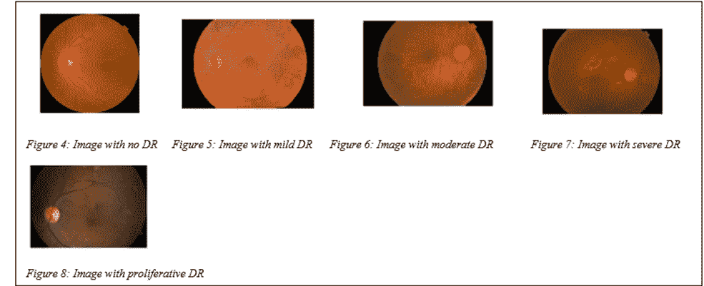

# 糖尿病十年回顾

> 原文：<https://medium.com/codex/a-decade-review-on-diabetic-mellitus-3b6054916617?source=collection_archive---------21----------------------->

# **1。简介**

糖尿病是一种慢性健康状况，是由于胰岛素分泌、胰岛素作用或两者缺陷导致的高血糖和糖尿的临床综合征[1–3]。由于胰岛素分泌、胰岛素作用或两者在碳水化合物、脂质和蛋白质方面的缺陷，存在代谢紊乱[1–3]。未得到控制的糖尿病会导致昏迷、足部神经损伤导致的足部溃疡、血流量减少、糖尿病性昏迷、糖尿病性肾病、肾衰竭、糖尿病性视网膜病变，如果不加以处理，还会因酮症酸中毒或非酮症性高渗综合征而死亡[1–2][4]。据估计，全球受糖尿病影响的人数正在从 1980 年的 1.08 亿增加到 2000 年的 1.51 亿，再到 2014 年的 4.22 亿[4–5]。全球 18 岁以上成年人的糖尿病患病率从 1980 年的 4.7%上升至 2014 年的 8.5%。2000 年至 2016 年间，因糖尿病导致的过早死亡上升了 5%[4]。低收入和中等收入国家的糖尿病发病率比高收入国家增长更快，即 80%的确诊患者来自低收入和中等收入国家。2016 年，有 160 万估计死亡记录是由糖尿病直接导致的[4]。IDF 预测，2030 年将有 5.78 亿糖尿病患者，到 2045 年将上升到 7 亿[5]。几十年来，人们已经了解了不同形式的糖尿病，但在 20 世纪 30 年代，Himsworth 提出糖尿病有两种表型，但在第二届世卫组织专家委员会上提出了分类:1 型、2 型、妊娠糖尿病和其他类型的糖尿病[3][9-11]。1 型糖尿病(胰岛素依赖型糖尿病)是由β细胞的细胞介导的自身免疫破坏引起的[3]。第二，有一些基因更易患 T1DM，例如人类白细胞抗原基因，其具有 T1DM 的高风险，并且环境因素如病毒充当病因[12]。T1DM 在年轻人中更突出，其占全世界 20 岁以下年轻人中所有糖尿病病例的 85%以上。T1DM 病例以每年 3-4%的平均速度增加。2 型(非胰岛素依赖型糖尿病)是一种慢性疾病，约占糖尿病患者的 90–95%[14]。随着年龄的增长，也就是说，人们在 40 岁以后更有可能患 T2DM 病，由于肥胖导致的超重占患 T2DM 病的累积风险的 80–85%[3]，饮食模式改变的西方化生活方式和越来越不活跃的生活方式、家庭背景、多囊卵巢综合征、严重精神障碍、高血压、高脂血症都是与 T2DM 相关的风险因素[3][15]。妊娠期糖尿病(GDM)是在妊娠期间首次检测到的高血糖症。更倾向于 GDM 的种族是非裔美国人、亚洲人、西班牙人、阿拉斯加土著人、太平洋岛民或美洲土著人[18]。8000 万活产婴儿受糖尿病影响，其中 84%受 GDM 影响[5]。当空腹血糖水平在 110-126mg %之间且 HbA1c 在 5.7-6.4%之间时，可诊断为糖尿病前期状态[17]。成功的糖尿病管理需要药物治疗和生活方式改变的平衡方法，如体育锻炼、减肥、戒酒和戒烟[3][17]。有一个既定的糖尿病自我管理教育的护理和管理糖尿病[3]。为了控制糖尿病，我们需要进行饮食管理和生活方式的改变。其次，我们可以使用口服降糖药，如磺脲类药物、甲格列奈类药物、双胍类药物、噻唑烷二酮类药物、α-葡萄糖苷酶抑制剂、DPP-4 抑制剂，用于高危情况下降低血糖并可以进行胰岛素治疗的二型糖尿病患者。[1][17].

图 1 显示，美国、中国、巴西、德国、日本、墨西哥、法国、英国、加拿大、俄罗斯、意大利、西班牙这 12 个国家占 2019 年糖尿病医疗总支出的 80%。这些国家是高收入国家，拥有更发达的卫生基础设施。

图 1:糖尿病卫生支出的帕累托图

因此，从图 2 中我们可以看到未确诊糖尿病患者的百分比，因此我们可以看到非洲和南亚未确诊患者的百分比很高，这些国家都是低收入国家。因此，对于这些国家，我们需要一种经济有效的早期诊断方法来发现糖尿病，以便受糖尿病影响的人可以采取必要的预防措施。

图 2:2019 年未诊断的人口比例

因此，在这个信息时代，数据挖掘已经成为一种有效的方法，可以从大量多样的数据中发现信息。从给定的图 3 中，我们可以看到在不同出版物上发表的关于糖尿病的论文数量，因此我们可以看到该领域正在进行的研究数量。人工智能和机器学习正在改变我们的医疗系统，并扩大糖尿病治疗的范围，从而提高性能，并在未来可用的信息方面为我们提供了一个巨大的机会。

图 3:2010 年至 2021 年发表的论文数量

# **2。回顾**

糖尿病具有悠久的历史，可以追溯到古代。古代的医生已经观察到糖尿病的明显特征，并提出了几种治疗方法。公元前 1550 年，乔治·埃伯斯发现了一种多尿状态。在 5 世纪，印度的保健专家 Charak 和 Sushrut 是最早发现糖尿病患者尿液甜味的人之一。Aretaeus 使用的术语“糖尿病”是从希腊语 syphon [5]引申而来的。利物浦的马修·多布森(Matthew Dobson)在 1776 年写的一篇论文中首次提到了高血糖症，他发现糖尿病患者的血清和尿液尝起来是甜的[6]。此外，他蒸发了尿液，尿液变成了一个白色的蛋糕，闻起来像红糖。然后他得出结论，肾脏分泌的糖不是在器官内产生的，而是存在于血清中[5]。一位训练有素的外科医生约翰·罗洛加上了形容词“mellitus”，意思是蜂蜜。在 19 世纪，他还发明了“动物饮食”作为糖尿病的治疗方法。1815 年，法国化学家米歇尔·谢弗勒证明糖尿病患者尿液中的糖是葡萄糖。1846 年至 1848 年间，伯纳德研究了肝脏的糖原生成作用。在 19 世纪早期，糖尿病的病因还不清楚。但是在 1889 年，当 Oskar Minkowski 和 Josef von Mering 报道这只狗患有由胰腺切除术引起的严重糖尿病时[5][7]。Minkowski 和 von Mering 进行的实验表明，胰腺是维持葡萄糖稳态所必需的内分泌腺[5][7]。弗雷德里克·万津和约翰·麦克劳德因发现胰岛素而获得 1923 年诺贝尔医学奖。到 1923 年 10 月，胰岛素已经在北美和欧洲广泛使用[5]。1982 年，重组人胰岛素问世。1990 年，胰岛素笔输送装置开始流行[7]。

目前，随着人工智能和人工智能的采用，它已被证明是医疗保健的资产，可以在医疗保健的所有领域提供从早期诊断到治疗的重大变化。健康监测软件和智能手机技术为按需医疗服务创造了机会。现在，医学领域正在认识到人工智能仪器的价值，并相信它将彻底改变医疗保健运营和分配的每个阶段。据信，使用人工智能技术，美国医疗保健成本将能够在 2026 年削减 1500 亿美元的年度成本[19]。通过持续的监控和指导，基于人工智能的技术将在帮助个人保持健康方面发挥重要作用，并将确保早期诊断等。与人工智能相关的医疗保健市场预计将稳步增长，到 2021 年将达到 66 亿美元，相当于 40 %的复合年增长率[19]。根据糖尿病相关应用的目的，人工智能方法可以分为三组:探索和发现知识，学习使用信息，以及从结论中提取信息[20]。

2010 年，[21]引入了一种结合 CBR 和本体的技术，使用人工智能创建个性化的糖尿病护理计划。但是为了获得更好的性能，需要一个丰富的 CRB 案例数据库。smart Diab[22]通过整合数据库技术和数据挖掘的各个领域来帮助跟踪、管理和护理 T1DM 患者。他们在[23]中提出了一个模型，其中他们使用一个黑盒来清楚地反映 SVM 的诊断决策，其准确性达到 94%。在 2011 年，论文[25]介绍了一种用于糖尿病决策支持的新型模糊专家方法。在论文[26]中，他们提出了一种设备，该设备为视觉障碍者提供了一种可访问的剂量计算器，该计算器具有基于语音的界面。2012 年，论文[28]提出了一种基于人工神经网络的糖尿病预测系统，该系统使用了泰国 BMC 医院约 2000 名患者的数据集。这项研究表明，消费，吸烟因素是重要的特征。在论文[29]中提出了一种在智能手机上提供糖尿病治疗的模型，该模型已经通过了临床试验，并且得到了人们的积极反馈。使用数据挖掘技术研究了临床试验期间收集的信息，并在不规则血糖水平与患者症状和生活方式行为之间建立了可接受的医学关联。在 2013 年，论文[32]的目标是通过使用神经网络的深刻而有效的方法，以 92.8%的准确率自动识别糖尿病。在 2014 年，论文[34]提出了一种准确率为 99.82%的方法，该方法基于面部块纹理特征，使用 Gabor 滤波器检测糖尿病，然后使用 KNN 和 SVM 进行分类。在 2015 年，论文[35]介绍了一种方法，该方法可以使用 C45 和部分树规则高效地发现基于健康参数预测糖尿病患者风险水平的规则。在 2016 年，论文[37]提出了使用 ANN 预测一个人是否患有糖尿病的软件工具的实现，准确率为 81%。在 2017 年，论文[39]使用了 Pima Indian 糖尿病数据集，进行了 10 次 10 折交叉验证，准确率为 85.5%，在此基础上实施了 ERCT 算法。2018 年，论文[41]提出了一种 5G 智能糖尿病设备，该设备融合了针对糖尿病患者的创新，如可穿戴设备、机器学习和用于传感和分析的大数据。2019 年，论文[44]使用了 Pima Indians 糖尿病数据集，并将随机森林与其他机器学习方法进行了比较，结果表明随机森林具有更好的准确性。在 2020 年，论文[45]使用了安全部队初级卫生保健的数据集，并提出了一个准确率为 98%的模型，表明随机森林分类器比 SVM 更好。2020 年发表的一篇论文[51]提出了一种基于转移学习的彩色眼底 CNN 架构，以识别糖尿病视网膜病变组，并获得了 0 的 Cohens Kappa 分数。8836.在 2020 年的论文[52]中使用 Gabor 滤波器和 ML 技术来分析和检测糖尿病视网膜病变疾病，并且获得了 70.1516%的准确率和 0.862 的加权平均 ROC 值。论文[46]在 2021 年讨论了糖尿病血糖调节领域中基于数据挖掘的诊断和预测解决方案。在 2021 年，在论文[47]中，使用了基于光子学、机器学习和结论性生理特征等技术，并开发了一种诊断方法，以在非常早期的水平上评估糖尿病患者的皮肤异常。

讨论 2010-2021 年关于糖尿病的各种论文

糖尿病视网膜病变的图像。

# 3.参考

[1] Chugh，美国癌症协会(2015 年)。牙科学生临床医学教科书(第 4 版。).艾莉亚出版公司。

[2][https://www.ncbi.nlm.nih.gov/pmc/articles/PMC4478580/](https://www.ncbi.nlm.nih.gov/pmc/articles/PMC4478580/)

[3] Holt，Richard I. G .等，糖尿病教科书。约翰·威利父子公司，2017 年

[4]https://www.who.int/news-room/fact-sheets/detail/diabetes

[5]https://www.diabetesatlas.org/en/

[6] Dobson M .对糖尿病患者尿液的实验和观察。Med Obs Inq 17765 : 298–316 .

[7][https://www.ncbi.nlm.nih.gov/pmc/articles/PMC4707300/](https://www.ncbi.nlm.nih.gov/pmc/articles/PMC4707300/)

8 世界卫生组织(世卫组织)糖尿病专家委员会。第一份报告:技术报告系列 310。日内瓦:世卫组织，1964 年。

[9]世界卫生组织(世卫组织)糖尿病专家委员会。第二份报告:技术报告系列 646。日内瓦:世卫组织，1980 年。

[10]国家糖尿病数据小组。糖尿病和其他类型葡萄糖耐量异常的分类和诊断。糖尿病 1979；28 : 1039–1057 .

[https://www.ncbi.nlm.nih.gov/books/NBK279119/](https://www.ncbi.nlm.nih.gov/books/NBK279119/)

[12][https://www . CDC . gov/diabetes/basics/what-is-type-1-diabetes . html](https://www.cdc.gov/diabetes/basics/what-is-type-1-diabetes.html)

[13][https://www . endocrineweb . com/conditions/type-1-diabetes/type-1-diabetes-risk-factors](https://www.endocrineweb.com/conditions/type-1-diabetes/type-1-diabetes-risk-factors)

[https://www.ncbi.nlm.nih.gov/pmc/articles/PMC2797383/](https://www.ncbi.nlm.nih.gov/pmc/articles/PMC2797383/)

[https://www.ncbi.nlm.nih.gov/pmc/articles/PMC3464757/](https://www.ncbi.nlm.nih.gov/pmc/articles/PMC3464757/)

[16][https://www . diabetes . org/diabetes/妊娠期糖尿病/如何治疗妊娠期糖尿病#:~:text = Treatment % 20 for % 20 estational % 20 diabetes % 20 aims、葡萄糖% 20 testing % 20 和胰岛素%20injections](https://www.diabetes.org/diabetes/gestational-diabetes/how-to-treat-gestational-diabetes#:~:text=Treatment%20for%20gestational%20diabetes%20aims,glucose%20testing%20and%20insulin%20injections) 。

[17][https://www.ncbi.nlm.nih.gov/books/NBK482386/](https://www.ncbi.nlm.nih.gov/books/NBK482386/)

【https://www.webmd.com/diabetes/gestational-diabetes 

[19]https://www.ncbi.nlm.nih.gov/pmc/articles/PMC7325854/

[https://www.ncbi.nlm.nih.gov/pmc/articles/PMC7273319/](https://www.ncbi.nlm.nih.gov/pmc/articles/PMC7273319/)

[21]陈建勋，施-苏俪，张志和.(2010).*糖尿病护理决策支持系统。2010 年第二届工业与信息系统国际会议。*

[22] Mougiakakou，S. G .、Bartsocas，C. S .、Bozas，e .、Chaniotakis，n .、Iliopoulou，d .、Kouris，I .……Nikita，K. S. (2010 年)。 *SMARTDIAB:一种用于对 1 型糖尿病患者进行智能监控、管理和随访的通信和信息技术方法。IEEE 生物医学信息技术汇刊，14(3)，622–633。doi:10.1109/titb . 10101 . 103636363615*

[23]新罕布什尔州巴拉卡特、布拉德利和新罕布什尔州巴拉卡特(2010 年)。*用于糖尿病诊断的可理解支持向量机。IEEE 生物医学信息技术汇刊，14(4)，1114–1120。doi:10.1109/titb。58606.88868688666*

[24]t . Jayalakshmi 和 a . Santhakumaran(2010 年)。*一种利用人工神经网络诊断糖尿病的新型分类方法。2010 年数据存储和数据工程国际会议。*

[25]李长盛，&梅汪卉。(2011).*模糊专家系统在糖尿病决策支持中的应用。IEEE 系统、人和控制论汇刊，B 部分(控制论)，41(1)，139–153。*

[26]拉德法尔、汉密尔顿和明(2011 年)。为视力受损的糖尿病患者计算胰岛素剂量的声控装置。2011 年第 24 届加拿大电气和计算机工程会议。

[27] Al Jarullah，A. A. (2011 年)。*用于诊断 II 型糖尿病的决策树发现。2011 信息技术创新国际会议。doi:10.1109/创新。36800.88686868666*

[28]luanguangrong，w .，rod take，a .，和 Chimmanee，S. (2012 年)。利用神经网络对泰国人进行二型糖尿病危险因素研究并调整神经网络参数。2012 年 IEEE 系统、人和控制论国际会议(SMC)。

[29]蔡怡辉、林玉凤、杨玉春、曾维生(2012 年)。个性化糖尿病远程护理的移动框架。2012 人工智能技术与应用大会。doi:10.1109/taai

[30] Phyo Phyo San，Sai Ho Ling 和 Nguyen，H. T. (2012 年)。使用自适应神经模糊推理系统智能检测 1 型糖尿病儿童的低血糖发作。2012 年 IEEE 医学和生物工程学会国际年会。doi:10.1109/欧洲货币中心。36800.88686868661

[31] Dalakleidi，K. V .、Zarkogianni，k .、Karamanos，V. G .、Thanopoulou，A. C .、Nikita，K. S. (2013 年)。选择二型糖尿病患者心血管并发症风险预测关键特征的混合遗传算法。第 13 届 IEEE 生物信息学和生物工程国际会议。

[32]活女神和辛格(2013 年)。用于糖尿病诊断的数据挖掘方法。2013 年第七届智能系统与控制国际会议(ISCO)。

[33]李，李(2014).使用权重调整投票方法诊断糖尿病。2014 年 IEEE 生物信息学和生物工程国际会议。doi:10.1109/bibe

[34]丁，s .，，张，B. (2014)。基于 Gabor 滤波器的人脸块纹理特征的糖尿病检测。2014 IEEE 第 17 届计算科学与工程国际会议。doi:10.1109/cse

[35]k . sa xena 的 Purushottam 和 r . Sharma(2015 年)。*糖尿病预测系统评价采用 C4.5 规则和偏树。2015 年第四届国际可靠性、信息通信技术与优化会议(ICRITO)(趋势与未来方向)。*

[36]韩，李，罗，s，于，j，潘，李，陈，S. (2015).使用集成学习方法从支持向量机提取规则:在糖尿病诊断中的应用。IEEE 生物医学和健康信息学杂志，19(2)，728–734。

[37] Joshi，s .，& Borse，M. (2016 年)。用反向传播神经网络检测和预测糖尿病。2016 微电子与电信工程国际会议。

[38]k . suman Gali，b . s . r . Geetika 和 h . Ambarkar(2016 年)。一种基于分类器的糖尿病早期检测方法。2016 控制、仪器仪表、通信与计算技术国际会议(ICCICCT)。

[39] Vignesh，N. A .，& Amalarethinam，D. I. G. (2017 年)。用于增强规则覆盖技术的糖尿病诊断规则提取。2017 年世界计算与通信技术大会(WCCCT)。

[40] Vaishali，r .，Sasikala，r .，Ramasubbareddy，s .，Remya，s .，和 Nalluri，S. (2017 年)。基于遗传算法的特征选择和 MOE 模糊分类算法。2017 计算网络与信息学国际会议(ICCNI)。doi:10.1109/ICC ni . 59867

[41]陈，米，杨俊杰，周俊杰，郝俊杰，张俊杰，杨春海(2018 年)。5G-智能糖尿病:利用医疗保健大数据云实现个性化糖尿病诊断。IEEE 通信杂志，56(4)

[42]fatemodokht，h .，& Rafsanjani，M. K. (2018 年)。作为二型糖尿病氏病诊断工具的混合神经模糊系统的开发。2018 年第六届伊朗模糊与智能系统联合大会(CFIS)。doi:10.1109/cfis。36800.86686868661

[43] Prabhu，p .，& Selvabharathi，S. (2019 年)。糖尿病预测的深度信念神经网络模型。2019 第三届国际成像、信号处理与通信会议(ICISPC)。doi:10.1109/ici SPC。36806.88668686666

[44] Benbelkacem，s .，& Atmani，B. (2019 年)。糖尿病诊断的随机森林。2019 计算机与信息科学国际会议(ICCIS)。

[45] A. S. Alanazi 和 M. A. Mezher，“使用机器学习算法预测糖尿病”，2020 年计算和信息技术国际会议(ICCIT-1441)，沙特阿拉伯塔布克，2020 年，第 1–3 页，doi:10.1109/ICCIT-144147971 . 1253546

[46] F. A. Khan，K. Zeb，M. Alrakhami，A. Derhab 和 S. A. C. Bukhari，“使用数据挖掘进行糖尿病的检测和预测:综合综述”，载于 IEEE Access，doi:10.1109/Access . 20025。46617.866363636606

[47] V. Dremin 等人，“通过偏振高光谱成像和机器学习揭示的糖尿病皮肤并发症”，发表在 IEEE 医学成像学报，doi:10.1109/TMI . 10010010115

[48]哈桑，M. K .，阿拉姆，M. A .，达斯，d .，侯赛因，e .，&哈桑，M. (2020 年)。使用不同机器学习分类器的集成进行糖尿病预测。IEEE 访问，1–1。doi:10.1109/访问。59600.88868688661

[49] N. H. Taz，A. Islam 和 I. Mahmud，“用于糖尿病识别的基于集成的机器学习技术的比较分析”，2021 年第二届机器人、电气和信号处理技术国际会议，孟加拉国达卡，2021，第 1–6 页，doi:10.1109/I crest . 5486363636

[【50】https://www.ncbi.nlm.nih.gov/pmc/articles/PMC3491270/](https://www.ncbi.nlm.nih.gov/pmc/articles/PMC3491270/)

[51] Samanta，a .，Saha，a .，Satapathy，S. C .，Fernandes，S. L .，& Zhang，Y.-D. (2020)。在小数据集上使用卷积神经网络自动检测糖尿病视网膜病变。模式识别字母。2020 年 4 月 26 日

[52] Vijayan T，Sangeetha M，A. Kumaravel，Karthik B，基于 Gabor 滤波器和机器学习的糖尿病视网膜病变分析和检测，微处理器和微系统，2020，103353，ISSN 0141–9331，https://doi . org/10.1016/j . mic pro . 2020.103353。