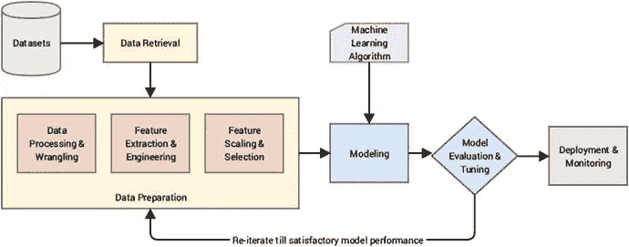

# 对机器学习的深入研究

> 原文：<https://medium.com/codex/a-deep-dive-into-machine-learning-7a32e2dde2db?source=collection_archive---------4----------------------->

照片来自 [Unsplash](http://unsplash.com) 。

机器学习是科技领域的最新流行语之一。这个领域在过去几年经历了一场起义。机器学习工程师的角色确定了你的工作安全水平，因为机器学习是近年来薪酬最高的工作之一。

随着这一技术学科的前景看好，一些人对该领域产生兴趣也就不足为奇了。我相信，读到这里的你，就是这样的人之一。

开始学习机器学习，尤其是当你对它所需要的东西没有很好的基础时，可能会令人生畏。本文将涵盖机器学习的本质，为您提供开始机器学习所需的必要知识和信心。

# 什么是机器学习？

机器学习只是让机器从现有数据中学习模式，并将其应用于新数据。这都是关于从数据中做出推论和预测。

你可以把机器学习比作一个孩子学习识别周围的人。孩子多次看到这些人，观察他们，识别他们的特征，然后，当他再次看到这些人时，他利用从观察这些人中学到的知识来识别谁是谁。

这就是任何机器学习过程的工作流程。我们向机器提供数据，机器研究数据，并发现数据中的模式。当新的和看不见的数据被输入到机器中时，它会根据从以前输入的数据中发现的模式来预测或推断这些数据。

这个向机器输入数据以使其能够从未来看不见的数据中做出推断的过程被称为**训练模型**。机器学习就是**建模**。

机器学习模型是一种算法，它有一套清晰的指令，说明我们的机器应该如何从数据中学习，应该预测什么，以及整体预期的方法。

# 机器学习的类型

机器学习问题可以分为三种不同的类型:

*   监督学习
*   无监督学习
*   强化学习

# 监督学习

如前所述，机器学习模型是根据数据训练的。数据的性质决定了机器学习问题是有监督的还是无监督的。在监督学习中，训练数据被标记，并且目标的值是已知的。

监督学习是指输入值和输出值已知的情况；然后，您使用算法来导出一个将输入与输出相匹配的函数。

为了彻底理解机器学习的概念，想象一下一个老师教学生如何解决一个数学问题。老师知道并且有这道数学题的答案。另一方面，学生应该按照一系列的指示去解决问题并找到答案。学生迭代地解决问题，并被老师纠正，直到他得出正确的答案。只有当学生得出正确答案时，他才停止解决问题。

这就是机器学习的过程。工程师编写了一个算法，通过这个算法，机器可以推导出输入值和输出值之间的关系。机器遵循模型中概述的指令，并尽最大努力提出一个将输入映射到输出的函数。

然后，工程师可以将模型预测的输出与已知的输出进行比较。他检查模型的准确性，如果需要，他微调模型以更好地提高其准确性。由于输入和输出值是已知的，所以这个机器学习过程是受监督的。

监督学习问题可以进一步分为两类:

*   **分类**

分类是一种监督学习问题，其输出是一个类别。分类问题的输出值是不同的类，我们的输出只能属于这些类中的一个。分类问题的例子有垃圾邮件或非垃圾邮件预测、猫或狗预测等。

*   **回归**

回归问题是指输出是一个真实值，可以取连续范围内的任何值。例如体重、身高或工资预测。

# 无监督学习

无监督学习是指在训练数据中有输入但没有输出。在无监督学习中，没有正确的答案，也没有老师。

该模型将研究数据的分布，并深入了解数据的基本结构和呈现方式。

无监督学习可以进一步分为:

*   使聚集
*   异常检测

# 强化学习

强化学习是机器学习的一个分支，涉及让机器做出决策。强化学习采用试错法来决定最佳策略或决策。强化学习问题的一个例子是下棋游戏的模型。

# 机器学习工作流程

要解决任何机器学习问题，以下是基本工作流程:

图片来自 Springerlink。基本 ML 工作流程。

1.  收集数据集

2.提取特征

3.将数据集分成训练集和测试集。

4.在训练集上训练模型

5.在测试集上评估模型

6.微调模型

**参考文献**

为了进一步了解机器学习，这里有一些有用的资源:

[监督和非监督学习](https://machinelearningmastery.com/supervised-and-unsupervised-machine-learning-algorithms/)

[强化学习](https://www.geeksforgeeks.org/what-is-reinforcement-learning/)

[强化学习；完整指南](https://deepsense.ai/what-is-reinforcement-learning-the-complete-guide/)

[机器学习项目工作流程](https://towardsdatascience.com/workflow-of-a-machine-learning-project-ec1dba419b94)

快乐造型！🎉