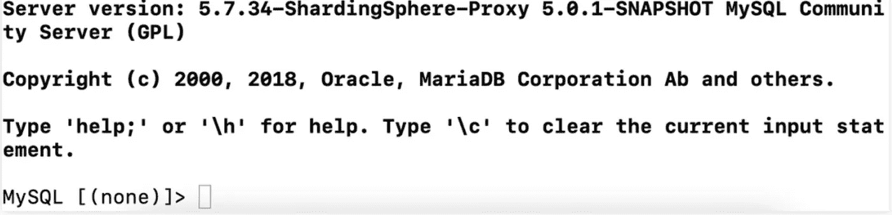
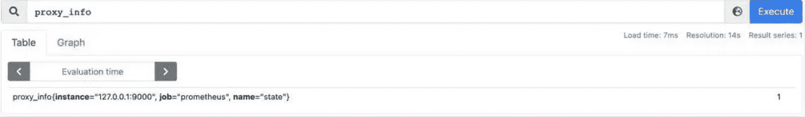
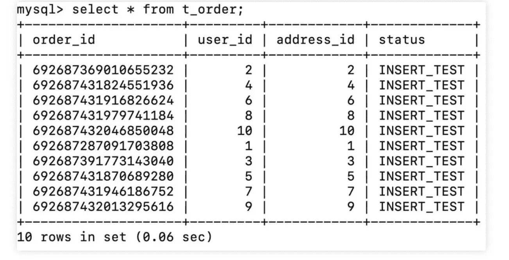
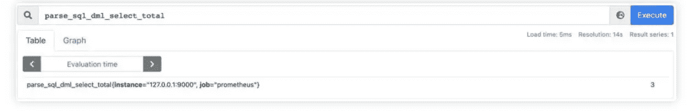
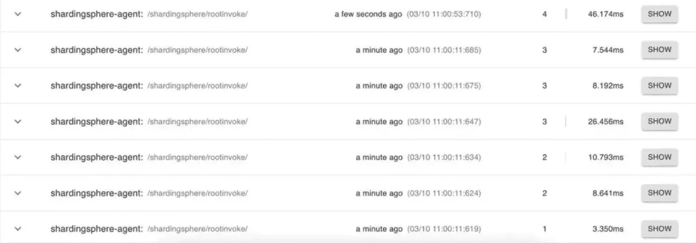
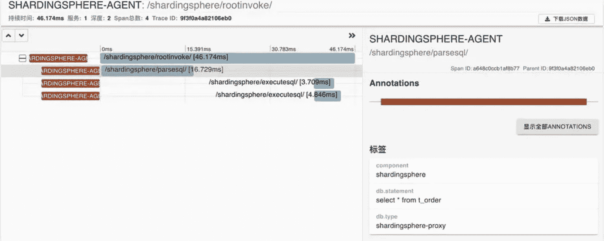
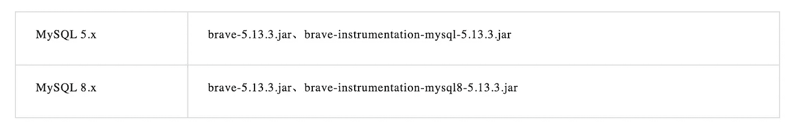
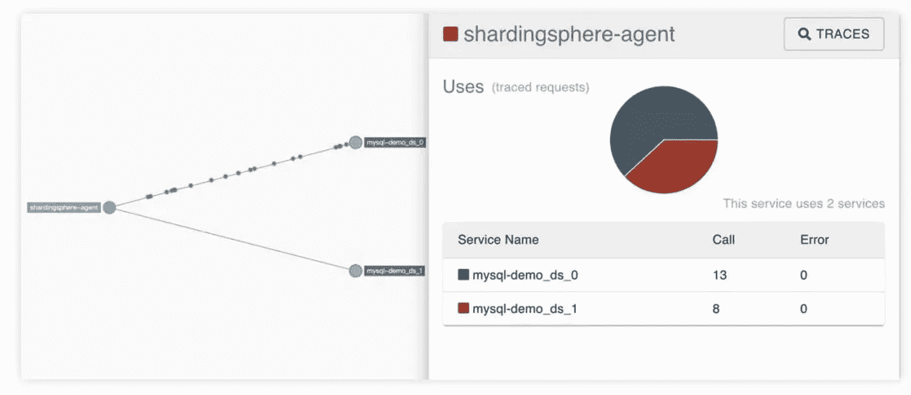

# 深入探究可观察性——Apache sharding sphere 代理

> 原文：<https://medium.com/codex/a-deep-dive-into-observability-apache-shardingsphere-agent-d895b910661a?source=collection_archive---------11----------------------->

[Apache ShardingSphere](https://github.com/apache/shardingsphere) 遵循 Database Plus——我们社区的指导开发理念，创建一个完整的数据服务生态系统，允许您将任何数据库转换为分布式数据库系统，并通过分片、弹性伸缩、数据加密等功能轻松增强它&。

用户经常需要在真实的应用场景中监控 Apache ShardingSphere 的性能，以发现具体的问题。

众所周知，应用性能监控(APM)可以通过收集、存储和分析可观察的数据来监控和诊断系统性能。它还集成了性能指标、跟踪分析、应用程序拓扑映射等功能。

它通过利用跟踪、度量和日志记录从系统操作中检索可观察的数据。Apache ShardingSphere 为用户提供了可观察性功能。

# 目的

Apache ShardingSphere 允许开发人员配置日志输出。当前可观察性特性的主要目标是为用户提供必要的度量和跟踪数据。

# 设计

我们选择了通用代理方法来完美地实现可观察性，使用 [ByteBuddy](https://bytebuddy.net/) (一个代码生成库，允许开发人员在应用程序运行时修改 Java 类(包括任意的),而无需使用编译器和 Java 代理。

我们调整了面向插件的设计，以更好地支持不同框架或系统的度量和跟踪。相应地，允许用户定制该特征或自己开发更多特定于业务的组件。

目前 Apache ShardingSphere 的代理模块支持 [Prometheus](https://prometheus.io) 、 [Zipkin](https://zipkin.io) 、 [Jaeger](https://zipkin.io) 、 [SkyWalking](https://skywalking.apache.org) 和 [OpenTelemetry](https://zipkin.io) 。

# 例子

在下面的实例中，我们在 Apache ShardingSphere-Proxy 上部署了 Prometheus 和 Zipkin observable data 插件，以展示如何使用 Apache ShardingSphere 代理模块。

## **第一步:安装所需软件**

*   `prometheus-2.32.1.linux-amd64.tar.gz` (https://prometheus.io/download)
*   `zipkin-server-2.23.9-exec.jar`(https://zipkin.io/pages/quickstart.html)
*   `apache-shardingsphere-5.1.0-SNAPSHOT-shardingsphere-proxy-bin.tar.gz`
*   `apache-shardingsphere-5.1.0-SNAPSHOT-shardingsphere-agent-bin.tar.gz`
*   MySQL 5.7.34

## **第二步:部署**

*   **端口**

普罗米修斯服务器:9090

Zipkin 服务器:9411

Apache sharding sphere-Proxy:3307

Apache ShardingSphere 代理(Prometheus 插件):9000

**普罗米修斯**

首先，给普罗米修斯添加监控对象。在这种情况下，我们需要将 Apache ShardingSphere 代理端口地址 9000 添加到 Prometheus 配置文件`prometheus.yml`中。

```
vi prometheus.yml
```

在文件中的`static_configs`下添加以下代码:

```
- targets: ["localhost:9000"]
```

然后，启动:

```
./prometheus &
```

**齐普金**

Zipkin 比较好用。通过在 Zipkin 服务器目录中输入以下命令来启动它:

```
java -jar zipkin-server-2.23.9-exec.jar &
```

**Apache ShardingSphere**

要部署 Apache ShardingSphere-Proxy 和 Agent，请参考官方相关的[用户指南](https://shardingsphere.apache.org/)。

假设 Proxy 和 Agent 都在`/tmp`目录下，下面是具体的代理部署步骤:

1.  **修改配置**

修改`agent.yaml`配置文件。

然后，启动 Prometheus 和 Zipkin 插件，并根据上述端口设置将 Prometheus 端口数据更改为 9000:

```
applicationName: shardingsphere-agentignoredPluginNames:- Jaeger- OpenTracing- OpenTelemetry- Loggingplugins:Prometheus:host:  "localhost"port: 9000props:JVM_INFORMATION_COLLECTOR_ENABLED : "true"Jaeger:host: "localhost"port: 5775props:SERVICE_NAME: "shardingsphere-agent"JAEGER_SAMPLER_TYPE: "const"JAEGER_SAMPLER_PARAM: "1"Zipkin:host: "localhost"port: 9411props:SERVICE_NAME: "shardingsphere-agent"URL_VERSION: "/api/v2/spans"SAMPLER_TYPE: "const"SAMPLER_PARAM: "1"OpenTracing:props:OPENTRACING_TRACER_CLASS_NAME: "org.apache.skywalking.apm.toolkit.opentracing.SkywalkingTracer"OpenTelemetry:props:otel.resource.attributes: "service.name=shardingsphere-agent"otel.traces.exporter: "zipkin"Logging:props:LEVEL: "INFO"
```

## **2。添加到启动命令**

修改文件`/tmp/apache-shardingsphere-5.1.0-shardingsphere-proxy-bin/bin/start.sh` ，将代理`shardingsphere-agent.jar`的绝对路径添加到启动脚本中。

**在**之前

```
nohup java ${JAVA_OPTS} ${JAVA_MEM_OPTS} \-classpath ${CLASS_PATH} ${MAIN_CLASS} >> ${STDOUT_FILE} 2>&1 &
```

后

```
nohup java ${JAVA_OPTS} ${JAVA_MEM_OPTS} \-javaagent:/tmp/apache-shardingsphere-5.1.0-shardingsphere-agent-bin/shardingsphere-agent.jar \-classpath ${CLASS_PATH} ${MAIN_CLASS} >> ${STDOUT_FILE} 2>&1 &
```

****3。启动****

**现在我们准备在代理目录下启动它们:**

```
bin/start.sh
```

## ****第三步:测试访问****

1.  ****指标和跟踪数据****

**我们使用由 Apache ShardingSphere-Proxy 提供的默认分片配置场景`config-sharding.yaml`来测试访问和显示数据。**

*   ****使用 MySQL 命令行连接到已启动的 ShardingSphere-Proxy。****

****

*   ****检查 Prometheus 服务器和 Zipkin 服务器中的数据结果****

**通过 Prometheus Web 查询`proxy_info`得到数据结果。**

****

**连接到 MySQL 客户端后查看 Zipkin Web 跟踪信息:**

****

*   ****通过 MySQL 命令行查询数据:****

********

*   ****检查 Prometheus 服务器和 Zipkin 服务器的数据结果****

**通过 Prometheus Web 查询`parse_sql_dml_select_total`数据结果。**

****

**通过 Zipkin Web 查询跟踪信息:**

****

**通过仔细搜索 Span，我们可以检查 SQL 语句`select * from t_order`的跟踪状态。**

****

# ****拓扑映射****

**当我们通过 Zipkin Web 检查依赖关系时，我们无法找到拓扑映射。**

**因此，我们需要配置它们:**

1.  ****下载文件****

**首先，下载下面的 Zipkin 依赖项，并将它们复制到 Proxy 的 lib 目录中。**

****

****2。修改配置****

**配置数据源配置文件`config-sharding.yaml`，它位于代理的`conf`目录下，将下面的配置添加到配置分片的下层数据源对应的 URL 中。YAML `dataSources`节点:**

**MySQL 5.x: `statementInterceptors=brave.mysql.TracingStatementInterceptor`**

**或者 MySQL 8.x: `queryInterceptors=brave.mysql8.TracingQueryInterceptor`**

*   ****重启 ShardingSphere-Proxy****

**在执行与之前相同的访问测试后，我们可以通过 Zipkin Web 查看依赖关系，并看到以下拓扑映射:**

****

# **采样率**

**可观察性插件还允许用户设置不同的采样率，以适应不同的场景。Zipkin 插件支持各种采样率类型配置，包括常数、计数、速率限制和边界。**

**对于具有大量请求的场景，我们建议您选择边界类型，并使用适当的采样率对其进行配置，以减少跟踪数据的收集量。**

```
Zipkin:host: "localhost"port: 9411props:SERVICE_NAME: "shardingsphere-agent"URL_VERSION: "/api/v2/spans"SAMPLER_TYPE: "boundary"SAMPLER_PARAM: "0.001"
```

# **摘要**

**由于 Observibility 插件默认兼容许多常见的监控框架和系统，用户可以轻松地监控和管理 Apache ShardingSphere。**

**今后，我们将继续加强监测能力。**

# **Apache ShardingSphere 开源项目链接:**

**[ShardingSphere Github](https://github.com/apache/shardingsphere/issues?page=1&q=is%3Aopen+is%3Aissue+label%3A%22project%3A+OpenForce+2022%22)**

**[ShardingSphere Twitter](https://twitter.com/ShardingSphere)**

**[切割球松弛度](https://join.slack.com/t/apacheshardingsphere/shared_invite/zt-sbdde7ie-SjDqo9~I4rYcR18bq0SYTg)**

**[投稿指南](https://shardingsphere.apache.org/community/cn/contribute/)**

# **合著者**

****

***平川江***

> **SphereEx 高级中间件工程师，Apache Tomcat & Apache sharding sphere 撰稿人。**

**作为一名开源技术爱好者，平川致力于开发 SphereEx-Console 和 SphereEx-Boot。**

****

***茂林江***

> **SphereEx 高级中间件工程师& Apache ShardingSphere 贡献者。**