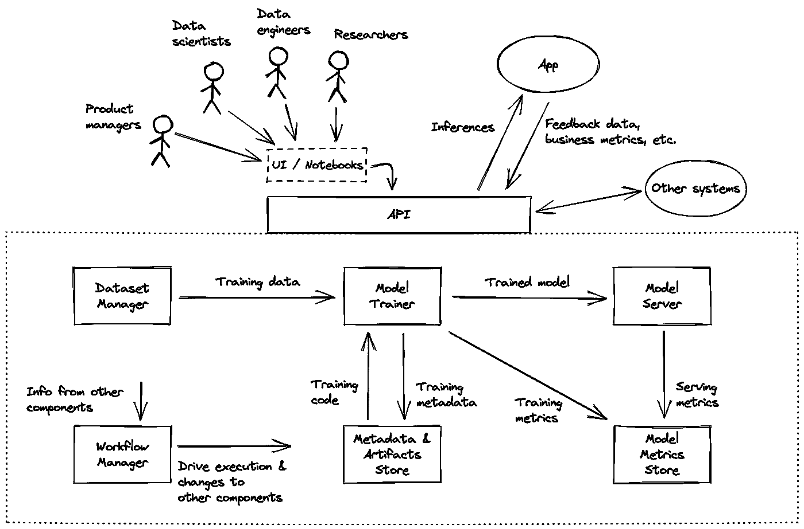

# 工程师视角下的深度学习系统

> 原文：<https://medium.com/codex/a-deep-learning-system-from-an-engineers-perspective-26b5b835417?source=collection_archive---------7----------------------->

## 文章节选

## *出自王驰和唐纳德·司徒华*的 [*工程深度学习系统*](https://www.manning.com/books/engineering-deep-learning-systems?utm_source=medium&utm_medium=referral&utm_campaign=book_wang2_engineering_2_17_22)

**本文介绍了潜在读者希望从这本书中学到什么，以及你为什么应该学习这本书。**

**如果您是一名对将您的技能转移到深度学习系统设计领域感兴趣的软件开发人员，或者是一名希望构建更有效的交付管道的具有工程头脑的数据科学家，请阅读本教程。**

*在[manning.com](https://www.manning.com/books/engineering-deep-learning-systems?utm_source=medium&utm_medium=referral&utm_campaign=book_wang2_engineering_2_17_22)付款时，将 **fccwang2** 输入折扣代码框，可享受[*Engineering Deep Learning Systems*](https://www.manning.com/books/engineering-deep-learning-systems?utm_source=medium&utm_medium=referral&utm_campaign=book_wang2_engineering_2_17_22)25%的折扣。*

*在深度学习领域，模型得到了所有的关注。或许这是正确的，当你考虑到从这些车型开发的新应用程序正在定期上市——让消费者兴奋的应用程序，如人体探测安全摄像头、精确的语音识别电话菜单、多种语言的快速字符识别以及几乎即时的语言翻译，以及有朝一日能够实现完全自主和自动驾驶汽车的高级驾驶员辅助系统。在很短的时间内，深层次的学习领域充满了巨大的兴奋和有希望的潜力等待被充分实现。*

*但这种模式并不是孤立的。为了实现产品或服务，模型需要位于一个系统或平台中(我们可以互换使用这些术语)，该系统或平台通过各种服务和商店来支持模型。例如，它需要一个 API、一个数据集管理器以及工件和元数据的存储。因此，每个深度学习模型开发团队的背后都是一个非深度学习开发团队，他们创建了包含模型和所有其他组件的基础设施。*

*我们在行业中观察到的问题是，负责设计深度学习系统和组件的开发人员通常对深度学习只有粗略的了解。他们不理解深度学习对系统工程的具体要求，所以在构建系统时，他们倾向于遵循通用的方法。例如，他们可能会选择将所有与深度学习模型开发相关的工作抽象给数据科学家，而只专注于自动化。所以他们建立的系统依赖于传统的作业调度系统或商业智能数据分析系统，这些系统并没有针对深度学习训练作业的运行方式进行优化，也没有针对深度学习特定的数据访问模式进行优化。因此，该系统很难用于模型开发，并且模型运输速度很慢。本质上，对深度学习缺乏深刻理解的工程师被要求建立支持深度学习模型的系统。因此，这些开发人员是低效且不适合 DL 系统的工程系统。*

*我们的目标是帮助那些开发者和工程师设计和构建更有效的系统来支持深度学习。这些开发人员——或者希望进入深度学习领域的开发人员——应该了解深度学习系统是如何设计和组装的，以及如何:收集相关需求，将需求转化为系统组件设计选择，并将组件集成在一起，形成一个对所有用户都适用的内聚系统。*

*第一步是从整体上理解支持深度学习模型和深度学习产品开发的系统。这就是我们在这里要看的——一个典型的、通用的深度学习系统及其所有组件。*

*先来一张图。在图 1 中，您将看到一个典型的基本深度学习系统的概述。*

**

*图一。典型深度学习系统的概述，包括支持深度学习开发周期的基本组件。在后面的章节中，我们将详细讨论每个组件，并解释它们是如何融入这个大画面的。*

*所讨论的系统被定义为虚线框内的所有矩形框，以及它的应用编程接口(API)。这些方框分别代表一个系统组件:*

*   *应用编程接口*
*   *数据集管理器*
*   *模特教练*
*   *模型服务器*
*   *元数据和工件存储*
*   *工作流管理器*
*   *模型度量存储*

*在本书中，我们假设它们是微服务。这提供了一个方便的假设，即这些组件可以合理安全地支持具有不同角色的多个用户，并且可以通过网络或互联网轻松访问。然而，这本书不会涵盖微服务如何设计或构建的所有工程方面。我们将重点讨论与深度学习相关的细节。*

## ****托管服务****

*你可能想知道是否需要自己设计、构建和托管所有深度学习系统组件。事实上，他们有开源和托管的替代品。我们希望在您学习了每个组件的基础知识之后，它们如何适应大环境，以及它们如何被不同的角色使用，将帮助您为您的用例做出最佳决策。*

*让我们快速浏览一下系统组件，如图 1 所示。*

## *应用程序界面*

*我们深度学习系统的入口是一个可通过网络访问的应用编程接口(API)。我们选择 API 是因为系统不仅需要支持人类用户界面，还需要支持应用程序和可能的其他系统。*

*虽然从概念上来说，API 是系统的单一入口点，但是完全有可能将 API 定义为每个组件提供的所有 API 的总和，而不需要额外的层来将所有内容聚合在单个服务端点下。在本书中，我们将直接使用每个组件提供的所有 API 的总和，为了简单起见，跳过了聚合。*

## *数据集管理器*

*在可以训练模型之前，已经存在数据。数据集管理器的工作是帮助将数据组织成数据集单元。这些数据集的大小是有限的，并且用描述它们的元数据进行标记，例如，该数据集包含由某种算法编码的图像。数据集的数据和元数据都可以在模型训练期间使用。*

*也许一个特别重要的标注是数据集版本化的支持。由于深度学习是一种垃圾进垃圾出的业务，而数据是深度学习系统产生的几乎所有副作用的来源，因此能够追踪导致不良变化的源头至关重要。*

## *模特教练*

*一旦你有了好的数据，合乎逻辑的下一步就是对它们进行训练以产生一个模型。大部分功能是由 TensorFlow 或 PyTorch 等框架提供的，在本书中我们不打算重新发明。相反，我们将关注如何在资源受限的情况下高效、安全地执行模型训练，并探索高级训练技术，如超参数调整、分布式训练。我们还将讨论对多个模型进行训练并比较其性能的实验。*

## *模型服务器*

*一旦模型被训练，它们可以被用来对训练者以前没有看到的数据进行推断。类似于训练，许多框架提供了使用在同一框架内产生的模型产生推理的功能。同样，在本书中，我们不打算解释如何从模型中产生推论。相反，我们将把重点放在能够为多个模型提供高流量的服务架构上。*

## *元数据和工件存储*

*这是存储训练器代码、推理代码和训练模型以及描述它们的元数据的存储区。这些元数据有助于保持数据集、训练器代码、推理代码、训练模型、推理和度量之间的关系，以在系统中提供完整的可追溯性。某些静态度量，例如模型训练度量，也可以驻留在该存储中。在本书的后面，我们将讨论这个商店对于实验和高级训练技术的重要性。*

## *工作流管理器*

*工作流管理器是将系统内所有执行联系在一起的粘合剂。一个典型的例子是*

1.  *检测新数据集的创建*
2.  *针对新数据集启动模型培训*
3.  *基于通过一些预定义的标准，将训练好的模型部署到模型服务器*

*我们还将讨论该组件如何帮助高级场景，如实验和超参数调优自动化。*

## *模型度量存储*

*与可能存在于元数据和工件存储中的静态模型训练度量相比，模型度量存储保存从服务模型生成的时间序列度量。在本书中，我们不会讨论如何构建商店，但会讨论应该获取的重要指标，并探索可用于存储它们的现有选项。*

*现在你已经知道了组成深度学习系统的组件，你已经准备好开始设计和构建这些组件了！*

*感谢阅读。*