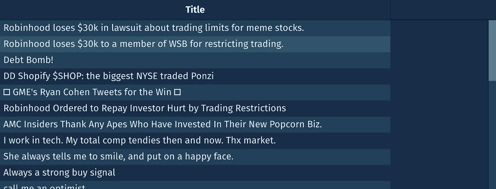
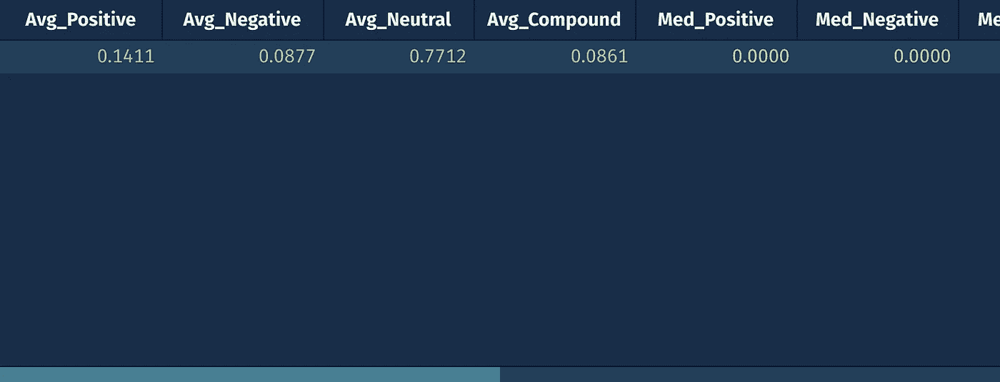

# 一个 DIY 的 Reddit 情绪分析器(关于迷因股票)

> 原文：<https://medium.com/codex/a-diy-reddit-sentiment-analyzer-of-meme-stocks-335fc1dba7f8?source=collection_archive---------10----------------------->

## 使用 Python 将数据从 RSS 拉入 Deephaven

杰克·马尔福德


来源:作者图片

eddit RSS 提要和 Python AI 是一个强大的组合。有了它们，你可以追踪你所关心的话题的情绪趋势。

深海天堂填补了这一空白。你不仅可以探索子编辑的历史，还可以实时跟踪流媒体对话。在本文中，我们提供了一个程序，它将 RSS 提要吸收到 Deephaven 表中，并使用易于定制的 Python 查询执行简单的情感分析。我们打算自己动手编写代码——因为 RSS 提要是标准化的，所以这些方法可以应用于任何 RSS 提要，比如那些来源于维基百科、黑客新闻、CNN 和播客的提要。

继续读下去，看看华尔街赌注以及人们对迷因股票的看法。

# 从 RSS [拉数据](https://docs-staging.deephaven.io/deploy-preview/62fea544f40f63e39c15c61788126fba18c07a99/blog/2022/01/13/reddit-sentiment-analysis/#pull-data-from-rss)

我们如何将数据从一个 RSS 源拉进 Deephaven？Python [feedparser 包](https://pypi.org/project/feedparser/)被广泛使用并得到良好支持。它提供了一个方法`feedparser.parse()`,可以从 RSS 提要中提取数据。我们可以利用这一点将数据导入深水港。在本例中，我们将从[华尔街赌注子编辑](https://www.reddit.com/r/wallstreetbets)中提取信息。

```
import os
os.system("pip install feedparser")import feedparserfeed = feedparser.parse("[https://www.reddit.com/r/wallstreetbets/new/.rss](https://www.reddit.com/r/wallstreetbets/new/.rss)")
```

这为我们提供了当前 RSS 文件的快照。要查看 RSS 提要的所有条目，我们可以查看`feed.entries`变量。

```
for entry in feed.entries:
    print(entry)
```

# 创建实时表[](https://docs-staging.deephaven.io/deploy-preview/62fea544f40f63e39c15c61788126fba18c07a99/blog/2022/01/13/reddit-sentiment-analysis/#create-a-real-time-table)

现在我们可以看到来自 RSS 提要的解析数据。为了将这些数据存储到 Deephaven 中，我们可以使用 [DynamicTableWriter](https://docs-staging.deephaven.io/deploy-preview/62fea544f40f63e39c15c61788126fba18c07a99/core/docs/reference/table-operations/create/DynamicTableWriter/) 创建一个表并写入其中。

我们可以从 RSS 提要中选择任何属性来编写。对于这个例子，我们将只写每个条目的标题。

```
from deephaven import DynamicTableWriter, Types as dhtcolumn_names = ["Title"]
column_types = [dht.string]table_writer = DynamicTableWriter(column_names, column_types)for entry in feed.entries:
    title = entry["title"]
    table_writer.logRow([title])rss_table_titles = table_writer.getTable()
```



来源:作者图片

# [分析数据](https://docs-staging.deephaven.io/deploy-preview/62fea544f40f63e39c15c61788126fba18c07a99/blog/2022/01/13/reddit-sentiment-analysis/#analyze-the-data)

有了包含来自 RSS 提要的标题的 Deephaven 表，我们可以利用数据收集有意义的见解。情感分析是分析文本数据最简单的方法之一。

在 Reddit feeds 上执行情感分析可以让你分析特定人群在讨论什么。例如，您可以分析世界新闻子栏目，了解人们对当前全球事件的感受。你也可以说得更具体。可以分析视频游戏上的子主题来查看当前对游戏行业的情绪。如果有现场活动，例如 E3，并且您想要获取正在发生的事情的实时信息，这可能特别有用。

[Python NLTK 包](https://www.nltk.org/)有几种执行情感分析的方法。对于这个例子，我们将使用内置的`[SentimentIntensityAnalyzer](https://www.nltk.org/api/nltk.sentiment.vader.html?highlight=sentimentintensityanalyzer#nltk.sentiment.vader.SentimentIntensityAnalyzer)`类。这个类有一个`[polarity_scores](https://www.nltk.org/api/nltk.sentiment.vader.html?highlight=sentimentintensityanalyzer#nltk.sentiment.vader.SentimentIntensityAnalyzer.polarity_scores)`方法，返回给定字符串的情感分数。我们将使用一个 Deephaven 更新查询来将这个方法应用到我们的表中。

由于`polarity_scores`方法返回一个 Python 字典，我们将用一个返回列表的自定义函数包装它。这将使在 Deephaven 查询中使用这些值变得更加容易。我们还需要将方法调用转换为`org.jpy.PyListWrapper`类型。这将使 Deephaven 识别返回的列表。

```
os.system("pip install nltk")import nltk
nltk.download('vader_lexicon')
from nltk.sentiment import SentimentIntensityAnalyzerdef *classifier_method*(classifier):
    def *method*(strn):
        sentiment = classifier.polarity_scores(strn)
        return [sentiment["pos"], sentiment["neu"], sentiment["neg"], sentiment["compound"]]
    return methodcustom_polarity_scores = classifier_method(SentimentIntensityAnalyzer())rss_table_analyzed = rss_table_titles.update("Sentiment = (org.jpy.PyListWrapper)custom_polarity_scores(Title)",
    "Positive = (double)Sentiment[0]",
    "Neutral = (double)Sentiment[1]",
    "Negative = (double)Sentiment[2]",
    "Compound = (double)Sentiment[3]"
)
```


来源:作者图片

现在我们有了一个包含我们情感分析的专栏。下一步是生成统计数据。以下查询计算每个值的平均值、中值和标准偏差，以及正分数大于负分数的帖子的百分比。

```
from deephaven import Aggregation as agg, as_listagg_list = as_list([
    agg.AggAvg("Avg_Positive = Positive", "Avg_Negative = Negative", "Avg_Neutral = Neutral", "Avg_Compound = Compound"),
    agg.AggMed("Med_Positive = Positive", "Med_Negative = Negative", "Med_Neutral = Neutral", "Med_Compound = Compound"),
    agg.AggStd("Std_Positive = Positive", "Std_Negative = Negative", "Std_Neutral = Neutral", "Std_Compound = Compound"),
])rss_table_analyzed_statistics = rss_table_analyzed.aggBy(agg_list)
rss_table_analyzed_positive_percent = rss_table_analyzed.update("PositiveCount = Positive > Negative ? 1 : 0")\
    .aggBy(as_list([agg.AggSum("PositiveCount"), agg.AggCount("TotalCount")]))\
    .update("PositivePercent = PositiveCount / TotalCount")
```



# 根据自己的兴趣定制[](https://docs-staging.deephaven.io/deploy-preview/62fea544f40f63e39c15c61788126fba18c07a99/blog/2022/01/13/reddit-sentiment-analysis/#tailor-to-your-own-interests)

这个例子只是触及了 RSS 提要中丰富信息的皮毛。Deephaven examples repo 包含一个[更复杂的示例](https://github.com/deephaven-examples/rss-sentiment-analysis)。我们提供了这段代码和扩展示例，作为使用 Deephaven 和您感兴趣的 RSS 提要的起点。如有任何问题或反馈，请联系 [Gitter](https://gitter.im/deephaven/deephaven) 或我们的 [Github 讨论](https://github.com/deephaven/deephaven-core/discussions)。我们希望收到您的来信。