# 链表的虚拟指南:第 1 部分

> 原文：<https://medium.com/codex/a-dummys-guide-to-linked-lists-part-1-44469f35f65a?source=collection_archive---------11----------------------->


Unsplash 上 [JJ 英](https://unsplash.com/@jjying?utm_source=unsplash&utm_medium=referral&utm_content=creditCopyText)的照片

读者你好！数据结构是计算机科学中最基本的概念之一。它们本质上决定了我们在软件应用程序中保存和管理数据的方式。

您可能遇到过的一些常见数据结构是**数组、堆栈和哈希表**。它们中的每一个都有不同的实现，并且在不同的场景中表现良好。

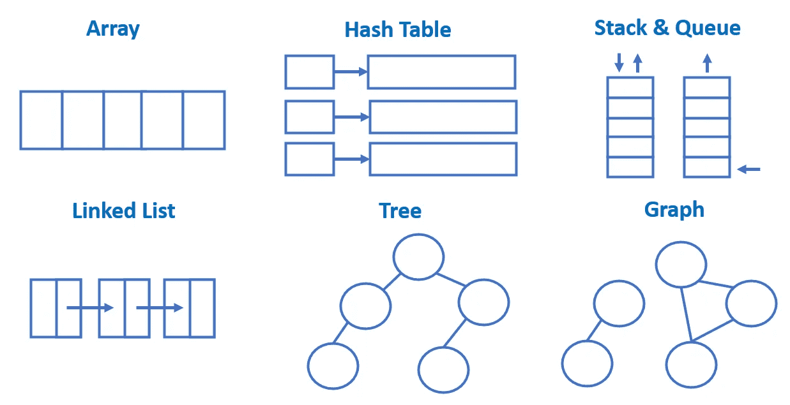

公共数据结构

在这篇文章中，我将和你分享一个叫做**链表**的数据结构。它构成了更复杂结构的基础，如散列表和树。

我的目标是**建立/加强你对链表的基本理解**。在编写任何与链表相关的代码之前，对它的构造块了如指掌是很重要的。

我假设您已经接触过基本的编程概念，如数组和变量赋值。关于指针和内存表示的知识将是有益的(但不是必需的)。

我们开始吧！🏃

# **什么是链表？**

## **线性与非线性数据结构**

像数组一样，链表是一种线性数据结构。线性数据结构是指其元素按顺序排列*。*

*另一方面，**非线性**数据结构的元素不以任何顺序排列，即*非顺序*。*

*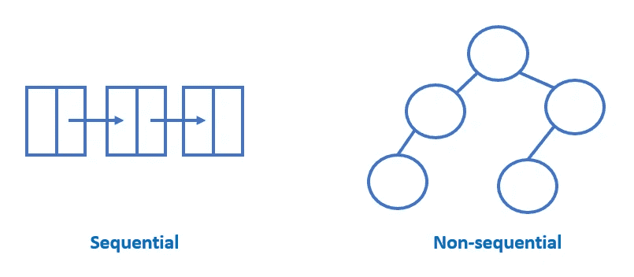*

*线性(左)与非线性(右)数据结构*

## *记忆表征*

*链表与数组的不同之处在于它在内存中存储数据的方式。与数组不同，链表中的元素不需要一个挨着一个放置。*

*为了帮助你理解上面的陈述，我神奇地创建了自己的编程语言，实现了`Array`和`LinkedList`。*

```
*# For demonstration purposes only
# Both array and linked_list stores numbers 1 to 5array = Array<1, 2, 3, 4, 5>linked_list = LinkedList<1, 2, 3, 4, 5>*
```

*在引擎盖下，当五行的`array`被创建时，五个内存块将被分配给它。这些内存块是**连续的**，这只是一种正式的说法，它们是*挨着*。*

*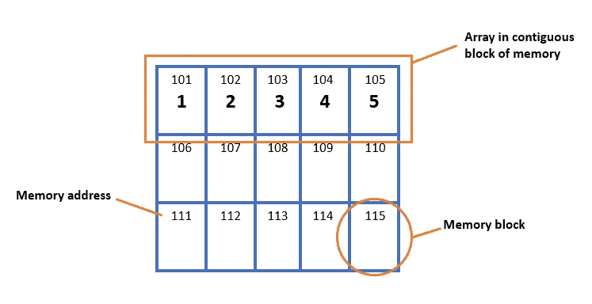*

*内存中数组的简化表示*

*另一方面，当`linked_list`被创建时，它的元素将分散在内存池中。分配给`linked_list`的内存块不必是连续的。*

*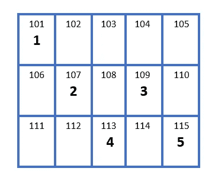*

*内存中链表的简化表示*

*一个数组有一个连续的内存块，因为它的大小必须在**编译时**确定，也就是在程序运行之前。当程序运行时，它不能自由伸缩。在正式术语中，数组是一个静态数据结构。*

*另一方面，链表的大小不必预先确定。它可以自由生长和收缩。在**运行时**，即程序运行时，可以向其添加新的内存。这使得链表成为一个动态数据结构。*

## *节点和指针*

*等等…如果一个链表的元素分散在内存中，那它是怎样一种数据结构呢？一点“结构”都没有！*

*与数组不同，链表存储的不仅仅是感兴趣的数据。链表的每个元素被称为一个**节点**。一个节点由两部分组成:一部分保存数据，另一部分保存一个**指针**。*

*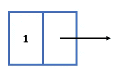*

*带有指针的节点(用箭头表示)*

*指针只不过是一个指向特定内存块的**地址。你可以把它想象成你家附近的一个门牌号。鲍勃的家位于鲍勃街 101 号。101 是指向鲍勃房子的指针。***

*链表中的节点通过指针依次相互连接。这形成了一个节点链，这就是链表的意义。在下面的例子中，节点 1 有一个指针 107，因为它指向位于内存 107 上的节点 2。*

*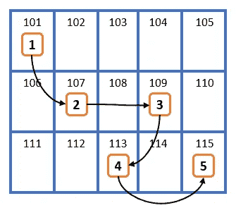*

*内存中指针链表的简化表示*

*这看起来更像一个数据结构！如果我从第一个元素开始跟踪我的链表，我将能够通过跟随指针的**来访问其后的每一个元素。这感觉就像是儿童的“连接点活动”!***

## ***头和尾***

*现在我们知道了链表是如何表示的，那么我们如何使用它呢？具体来说，在下面的代码中，变量`linked_list`的赋值是什么？*

```
*# For demonstration purposes onlylinked_list = LinkedList<1, 2, 3, 4, 5>*
```

*与数组不同，我们不能直接访问链表中的元素。而是需要从**头节点**开始，一个节点一个节点*的进入链表。**

*头节点是链表的第一个节点。当我们创建一个链表时，我们必须被赋予一个**头指针**，它只是一个指向头节点的指针。没有它，你将不能访问链表中的数据。*

*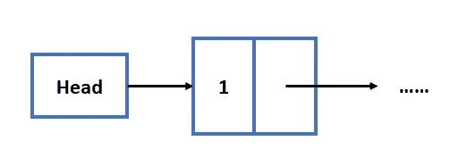*

*头指针指向头(第一个)节点*

*你可以把头部指针想象成你的手握着一串项目。如果你松手(即失去头部指针)，你将失去你所有的项目！*

*同时，链表的最后一个节点称为**尾节点**。尾节点的特殊之处在于它**不指向任何东西**。在一些编程语言中，这可以解释为指向**空值**，或者一个**空值指针**。*

*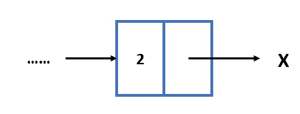*

*尾节点指向空*

# ***链表升级***

*结合上面的概念，我们最终可以创建我们的第一个链表。这是链表最简单的变体，被称为**单链表**。*

*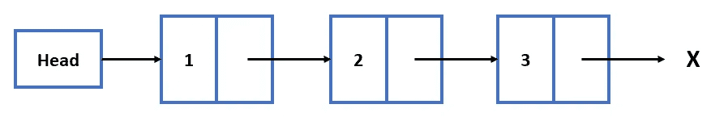*

*单向链表*

*看了上面的链表，怎么改进？它的局限性是什么？*

## ***双向链表***

*注意*单链表中箭头*的方向。*

*指针是单向的。一个节点只有指向下一个节点的指针，没有指向前一个节点的指针。因此，我们只能在一个方向上向前移动，这限制了我们遍历列表的灵活性。*

*为了支持双向移动，我们可以对列表节点进行升级。不是只存储指向下一个节点的指针，这个节点还会存储一个指向前一个节点的**指针。***

*有两个指针的节点创建一个**双向链表**。在双向链表中，我们可以灵活地从一个节点向前和向后移动到另一个节点。注意头节点的“前一个指针”指向 null。*

*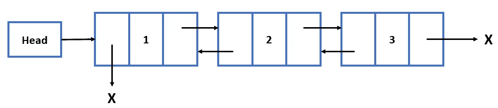*

*双向链表*

## ***尾指针***

*要访问单链表中的一个节点，我们必须**从头指针指向的头节点**开始。如果我们希望访问尾节点，我们需要一个接一个地遍历节点，直到结束。*

*如果清单非常长，这可能会非常昂贵！*

*为了解决这个问题，我们可以在链表中添加另一个入口点。其实加一个指向尾节点的**尾指针**是很常见的！有了它，我们可以在前面和后面输入一个链表。*

*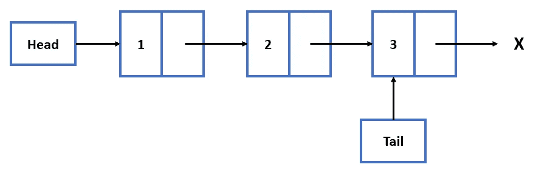*

*带尾指针的单链表*

*尾指针也可以添加到双向链表中，这使得链表**可以适应不同的需求。尾指针在优化几个链表操作时非常有用，我们将在本系列的第 2 部分讨论这一点。***

## ***循环链表***

*老实说，我以前从来没有用过循环链表，但它仍然值得一提。它是链表的高级变体，其中**尾节点指向头节点**而不是 null。*

*在循环双向链表的情况下，头节点也有一个指向尾节点的指针。*

*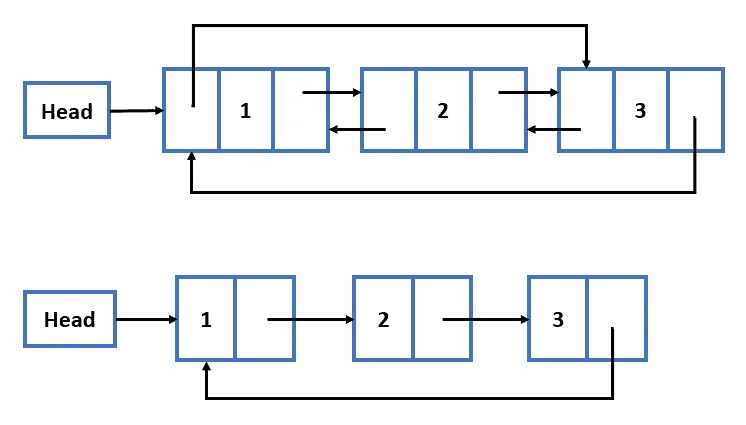*

*双圆形(顶部)和单圆形(底部)*

# *最后的想法*

*在本文中，我解释了链表的构造块以及它们可以接受的升级。*

*链表比数组更复杂，因为它涉及指针。可以想象，使用链表需要你在处理这些讨厌的指针时进行创造性的思考。*

*但是不用担心！别担心——在本系列的第 2 部分中，我将深入探讨使用指针对链表执行的操作(添加节点、删除节点等)。*

*希望你和我一样激动，敬请期待！*

*感谢您的阅读。和平✌️！*