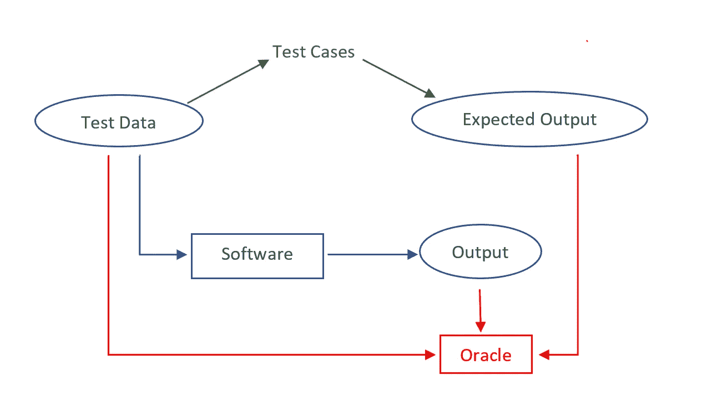

# 关于软件测试的一些基本事实

> 原文：<https://medium.com/codex/a-few-basic-facts-about-software-testing-6919905b6bbb?source=collection_archive---------40----------------------->

约翰·施诺布里奇在 [Unsplash](https://unsplash.com/s/photos/softwre-quality-assurance?utm_source=unsplash&utm_medium=referral&utm_content=creditCopyText) 上的照片

# **什么是软件测试？**

软件测试是一种验证软件产品的工件和功能是否满足其预期需求的方法，因为它对于软件应用程序的有效性能至关重要。

# 为什么需要软件测试？

软件测试是经济高效开发的一个非常重要的需求。预测试可以节省时间和成本。这是因为试图在不测试的情况下降低成本会导致软件应用程序的不当设计。

通过 SDLC 阶段从头到尾开发软件是一个非常有效和重要的过程，即使它需要一些时间来执行适当的测试和故障排除。尽管测试自动化减少了时间，但是它只能在不随时间改变需求的软件上进行，并且不能在开发期间的任何时候开始。测试自动化应该在手动测试被执行并且比较稳定的时候开始。

## **验证和确认**

软件在不可预测的环境中正常运行并最小化错误率的能力导致了验证和确认的想法。

验证是测试软件是否正确构建并实现其目标而没有任何错误的过程。必须进行验证，以确保软件满足其实际需求。检查产品有效性的过程称为验证。也就是说，评估系统以满足客户在最可能和最现实的环境中的操作需求。要为软件构建测试，首先必须理解软件做什么，需要做什么。此后，多种验证和确认方法，如检查、设计讨论、静态分析、测试和运行时验证，应贯穿整个开发周期。软件测试是唯一可以测试整个系统的调试技术，包括网络、设备、编译器、处理器、操作系统和其他连接的软件、链接器、加载器等。在上述方法中。它也是一种在开发策略(如敏捷)中记录期望的系统行为的方法。

# **如何运行测试？**

在执行测试之前，软件的条件或状态应该被设置为对输入有意义。为了运行测试，第一步是生成测试数据。它们也被称为被测软件的输入。然后，应该用先前生成的测试数据和获得的预期输出来编写测试用例。接下来必须执行单个测试用例。那么必须观察被测试软件的行为。称为 Oracle 的机制检查软件输出的准确性，并将实际输出与预期输出进行匹配。在自动化测试中，上述所有阶段都是自动执行的，并最终给出一个可视化的报告。最后，应该通过关闭数据库和文件句柄、删除添加的数据和恢复删除的数据等方式来拆除软件

# **测试类型**

软件测试可以根据不同的测试活动进行分类。

## 根据被测试软件分区的大小，测试可以分为

**单元测试:**孤立地测试单个组件。

**集成测试:**测试包或子系统

**系统测试:**测试集成系统以及组件之间的交互。

## 根据用于测试的过程，它可以分为

**先测试:**先写测试再写代码通过测试。

**测试之后:**检查现有代码是否通过测试。

**迭代:**测试是在开发过程中迭代完成的。大部分时间花在测试上。

## 根据目的，测试可分为

**功能测试:**根据功能需求对软件进行验证。

**安全测试:**识别软件的漏洞和威胁，确定其免受漏洞攻击。

性能测试:确定一个系统在响应和稳定性方面的表现。

**可用性测试:**根据用户体验测试系统，确定系统的用户友好程度。

**可用性测试:**检查软件是否运行了一段指定的时间，并收集这段时间内的故障。