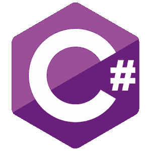

# 关于关键字的一些 C#技巧

> 原文：<https://medium.com/codex/a-few-c-tricks-about-keywords-70eeef551506?source=collection_archive---------1----------------------->

## 你知道这些 C#关键词吗，以及如何像专业人士一样使用它们？

C#就像任何其他编程语言一样:你首先学习基础知识，然后，随着你越来越熟练，你会发现还有大量的特性有待发掘和尝试！:)

我觉得这是 C#众多帮助**优化**的关键词的典型情况…