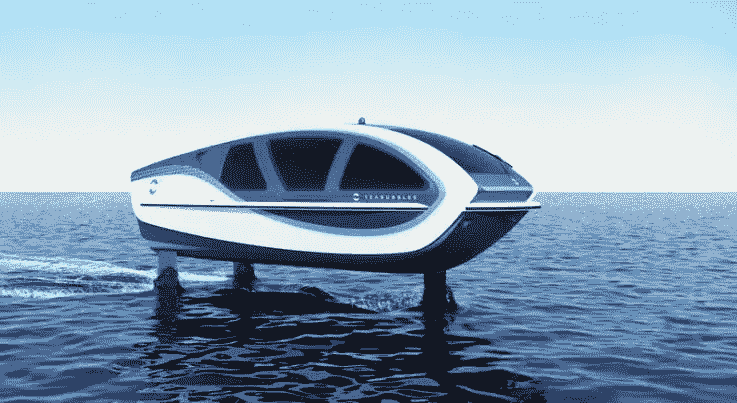

# 氢动力飞行双体船 SeaBubble 的首次亮相

> 原文：<https://medium.com/codex/a-first-look-at-the-seabubble-the-hydrogen-powered-flying-catamaran-80525d0f4b59?source=collection_archive---------4----------------------->

## 一个有价值的增加到水翼艇的世界

[海上泡泡(由海上泡泡组成的媒体)](https://www.seabubbles.com/app/uploads/2022/01/IMAGE_COM_SBB-737x403.jpg.webp)

在本月的戛纳游艇节上，SeaBubble 首次以全尺寸形式亮相。海洋泡泡船是[海洋泡泡船](https://www.seabubbles.com/)的 Alain Thébault 和 Anders Bringdal 的创意，海洋泡泡船是一种空气推进的双体船，依靠氢燃料电池和锂离子运行…