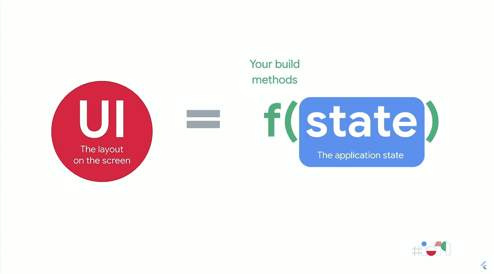

# 没有设定状态的颤动

> 原文：<https://medium.com/codex/a-flutter-without-setstate-1c82ed78b24e?source=collection_archive---------1----------------------->

所以我一直在想`setState()`在扑。这也许是颤振中最重要的方法。它是刷新您的小部件的方法，使您可以实际看到变化。

但问题是:你实际上并不需要`setState()`。嗯，你总是需要在某个地方调用`setState()`或者一个相关的方法，但是你实际上并不需要直接调用它。您可以使用状态管理来实现…