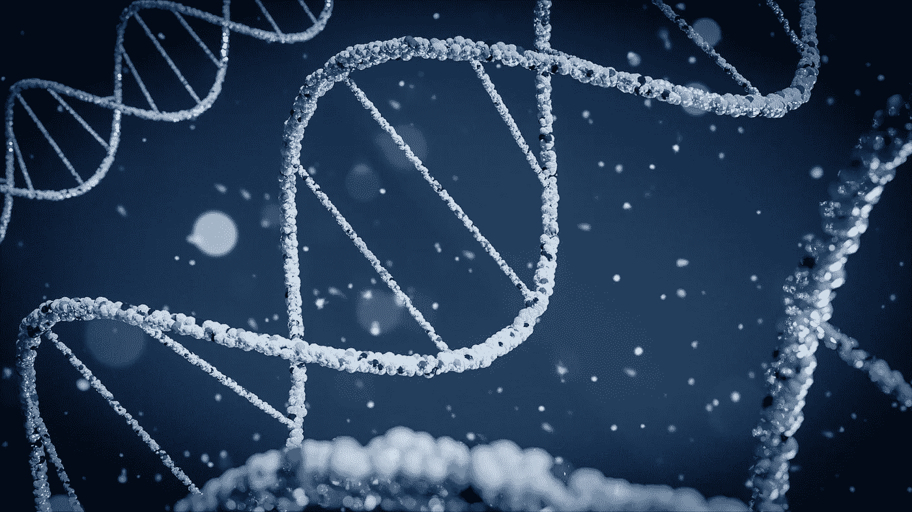
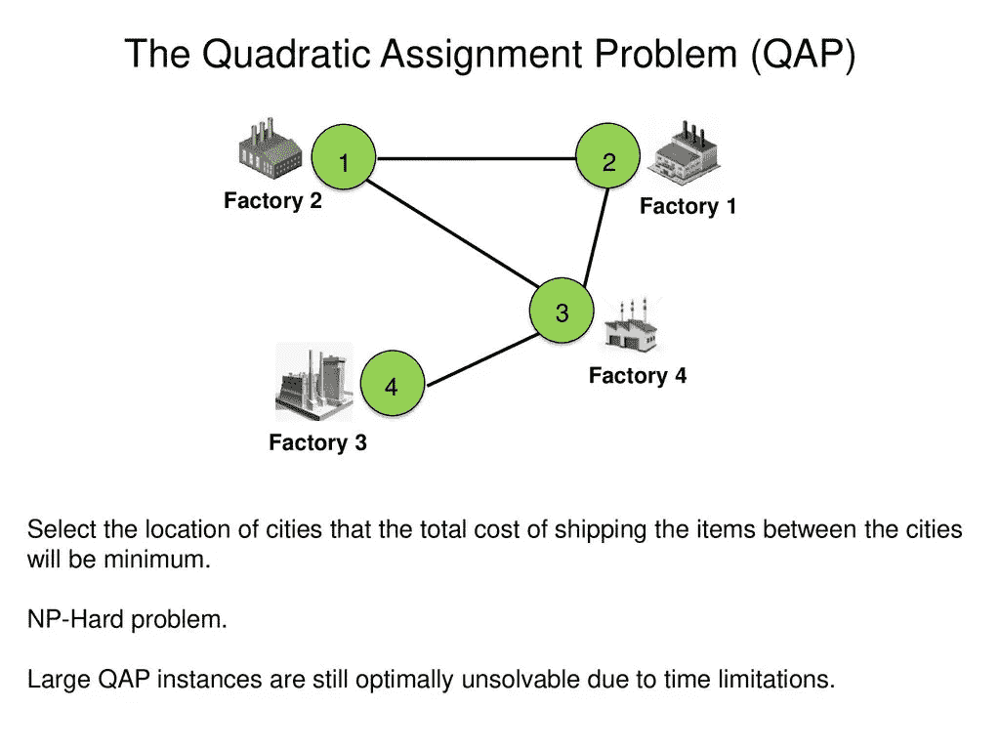
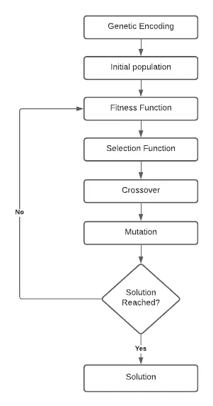
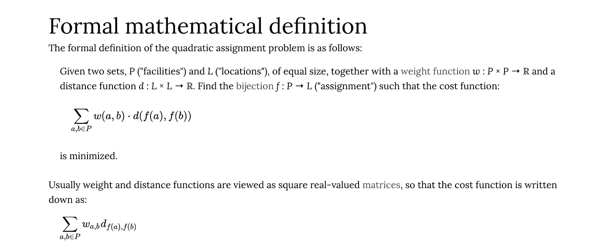

# 求解二次分配问题(QAP)的遗传算法

> 原文：<https://medium.com/codex/a-genetic-algorithm-for-solving-quadratic-assignment-problems-qap-43b8eb82d798?source=collection_archive---------2----------------------->

> 遗传算法是一种生物启发的随机元启发式算法，用于组合搜索和优化，我向你保证，这比听起来容易。



[Braňo](https://unsplash.com/@3dparadise?utm_source=unsplash&utm_medium=referral&utm_content=creditCopyText) 在 [Unsplash](https://unsplash.com/s/photos/dna?utm_source=unsplash&utm_medium=referral&utm_content=creditCopyText) 上拍照

# 介绍

我目前参加了一个人工智能班，学到了很多东西，但没有一个比遗传算法更吸引我的兴趣。

在这篇文章中，我写了我用遗传算法解决二次分配问题(QAP)的经验。如果读者对什么是 g as 和 QAP 有一些基本的了解，那就太好了，因为，虽然我谈了一些我对 GA 和 QAP 的理解，但本文的重点将是我构建 GA 解决方案的经验和方法。

我使用 Python 编程语言构建了这个解决方案，因此如果您对 Python 或编程的一般工作原理有所了解，这也是很好的。

本文中的所有代码都可以在这个[资源库](https://github.com/ifedavid/GA-for-QAP)中找到。

有了这些，我们就可以开始了。

# 二次分配问题

二次分配问题是我们今天在计算机科学中遇到的一些困难问题之一，当我说困难时，我的意思是它可能需要我们今天拥有的最新的高端计算机来找到解决方案。

为了通俗地解释 QAP，我想让您想象有 5 个位置，并且您有这 5 个位置之间的距离值。我还想让你想象一下，有 5 个设施，每个设施都有一个流量/重量值(例如，两个设施之间运送的人数)。现在，我们有 5 个位置和 5 个设施，我们的想法是根据这些位置之间的距离和这些设施之间的流量/重量，找出将这 5 个设施放置在这 5 个位置的最佳方式，从而节省最佳成本。

很自然，如果你想手工或强力完成这项工作，你需要尝试所有设施和位置的所有可能组合，大约 120 种组合，这听起来并不坏，但想象一下，如果你必须对 100，000 个位置和设施进行这项工作。这就是问题所在。

坦率地说，我们还没有造出能解决这类问题的计算机，我们也还没有想出一种能给我们一个明确答案的快速算法。



图像源——二次分配问题的新型超启发式算法 Tansel Dokceroglu 博士

多年来，一些真正聪明的人创造了许多技术来解决这些问题。其中一些技术比其他技术更好，其中大多数仍然比你的日常排序算法花费更长的时间，但这是我们目前所拥有的，也是我们将继续努力直到突破发生。

有几种技术可以用来解决 qap，但我们感兴趣的是遗传算法。

输入—遗传算法。

> 你必须了解什么是 QAP，所以如果你还不知道 qap 是如何工作的，我真的建议你查看这个 [***链接***](https://neos-guide.org/content/quadratic-assignment-problem#formulation)**，它详细解释了 QAP，甚至允许你运行一些例子。**

# ***遗传算法***

*正如我前面提到的，遗传算法是生物启发的随机元启发式算法，用于组合搜索和优化。*

*这个定义意味着气体是:*

*   *灵感来自基于**遗传学和自然选择**原理的生物学。*
*   *涉及 r **和随机过程**(随机的)。*
*   *一种与问题无关的技术，可以应用于**广泛的问题**(元启发式)。*
*   *高效解决需要**搜索和优化**的问题，例如 QAPs。*

*遗传算法打算如何解决 QAP 是，它从随机的可能的解决方案开始，随机选择可能是最好的解决方案，试图将它们组合起来形成一个更好的解决方案。它一遍又一遍地随机这样做，直到找到答案(也许)。*

*这个想法是，像自然选择一样，“进化”会在连续几代之后找到问题的最优解。*

*在我看来，它们只是进行试错的一种奇特方式。*

*GA 涉及:*

*   ***群体**——可能的解决方案的集合。*
*   ***染色体—** 一种可能的解决方案*

**

*图片来源——我！*

*遗传算法涉及的阶段包括:*

1.  *基因编码。*
2.  *人口创造。*
3.  *体能测评。*
4.  *选择。*
5.  *交叉。*
6.  *突变。*

*我将讨论解决 QAP 问题的每个阶段及其实现。*

# *遗传编码*

*遗传编码简单地指的是我们在编程时如何表现我们的染色体。这是我们整个大会的基调。基于你试图搜索或优化的内容，不同的问题有不同的基因编码。*

*对于 QAP，对于输入大小 N，我们尝试将设施点 N 映射到位置 N，最好的方法是使用一个数组或列表，其中索引代表位置，任何索引的值都是设施点。*

*这也是一个一对一的问题，所以我们只能将一个设施分配给一个位置。我用下面的例子进一步解释*

```
*chromosome = [5, 2, 3, 1, 0, 4]*
```

*从上面的例子中，我们的问题/输入大小是 6。我们的位置指数为 0-5，设施指数为 0-5。所以在位置 0，我们有设施 5，在位置 1，我们有设施 2，以此类推。*

*这就是基因编码。接下来是生成我们的初始种群。*

# *创建初始群体*

*创建初始种群很简单。您希望创建一个可能的解决方案集合。这就是全部了。*

*有很多方法可以做到这一点，但我做的是创建一个染色体列表，随机值从 0 到 N-1，随机索引，没有重复的值。这样，我可以随机收集染色体。*

*下面是一些示例代码和输出。*

*我将一个包含染色体和适合度分数的列表添加到我的群体中。下面是我在问题/输入大小为 6，人口大小为 20 的情况下运行它时的输出。*

```
*Initial Population -[[[0, 3, 2, 4, 5, 1], 0], [[2, 1, 3, 5, 4, 0], 0], [[5, 3, 0, 4, 1, 2], 0], [[4, 0, 2, 1, 5, 3], 0], [[1, 4, 3, 5, 0, 2], 0], [[3, 4, 1, 5, 2, 0], 0], [[2, 0, 1, 5, 4, 3], 0], [[2, 0, 4, 1, 5, 3], 0], [[0, 1, 2, 4, 3, 5], 0], [[2, 3, 5, 1, 0, 4], 0], [[2, 1, 3, 5, 4, 0], 0], [[2, 4, 1, 5, 3, 0], 0], [[2, 5, 0, 4, 3, 1], 0], [[5, 2, 4, 3, 1, 0], 0], [[0, 4, 3, 1, 5, 2], 0], [[4, 2, 3, 1, 5, 0], 0], [[0, 1, 4, 5, 3, 2], 0], [[2, 4, 0, 3, 5, 1], 0], [[1, 4, 0, 5, 2, 3], 0], [[4, 3, 1, 0, 2, 5], 0]]*
```

# *健康评估*

*染色体的适合度表示"*如何适合*或者"*如何好*"解决方案与所考虑的问题有关。在 QAP 的正式定义中，有一个计算解决方案的成本函数的公式。这个成本函数是我们用来计算我们的适应值的。最终，具有最小适应值的解决方案是最适合的。*

*以下是正式定义和成本函数公式:*

**

*图片来源—维基百科*

*用简单的英语术语来说，这意味着为我们染色体中的每个 A 和 B 计算位置 A 和 B 之间的距离乘以设施 A[i]和 B[i]之间的权重/流量的总和。*

*下面是示例代码和输出，用于计算我们之前创建的初始种群中所有染色体的适合度。*

*我创建了一个助手函数来帮助获取位置之间的距离值和设施之间的流量。距离和流量是随机生成的。范围 0 到 20 之间的距离和范围 0 到 4 之间的流量。*

*这个函数的输出与我们上面生成的人口类似—*

```
*Population after cost function -[[[0, 3, 2, 4, 5, 1], 213], [[2, 1, 3, 5, 4, 0], 223], [[5, 3, 0, 4, 1, 2], 240], [[4, 0, 2, 1, 5, 3], 242], [[1, 4, 3, 5, 0, 2], 189], [[3, 4, 1, 5, 2, 0], 213], [[2, 0, 1, 5, 4, 3], 228], [[2, 0, 4, 1, 5, 3], 231], [[0, 1, 2, 4, 3, 5], 218], [[2, 3, 5, 1, 0, 4], 187], [[2, 1, 3, 5, 4, 0], 223], [[2, 4, 1, 5, 3, 0], 268], [[2, 5, 0, 4, 3, 1], 220], [[5, 2, 4, 3, 1, 0], 206], [[0, 4, 3, 1, 5, 2], 230], [[4, 2, 3, 1, 5, 0], 200], [[0, 1, 4, 5, 3, 2], 237], [[2, 4, 0, 3, 5, 1], 221], [[1, 4, 0, 5, 2, 3], 165], [[4, 3, 1, 0, 2, 5], 219]]*
```

*从输出中，我们看到每个染色体都有各自的适应值。*

> ***注意—** 在创建适应度函数时，并非所有问题都有特定的公式可以帮助解决。有时候你必须考虑所有相关的变量，自己想出一些东西。要了解如何定义一个好的适应度函数，请点击 [***这里***](https://towardsdatascience.com/how-to-define-a-fitness-function-in-a-genetic-algorithm-be572b9ea3b4)*

# *选择*

*选择的想法是得到一些特殊的解决方案，我们可以用它来产生其他的解决方案。用通俗的英语来说，我们希望从整个群体中找到一些解决方案，我们可以用它们来培育新的解决方案。*

*我们将使用选择函数选择的解决方案可以被视为父代，我们将在交叉和变异后获得的解决方案可以被视为子代。*

*有很多选择方法，它们都有各自的优缺点，这取决于你要解决的问题类型或者你希望你的算法有多快。对于这个 GA，我决定使用锦标赛选择方法。*

*对于锦标赛选择，您希望从 N 号群体中随机选择 k 条染色体。这可以通过对 N 号群体进行随机排序并选择前 k 条染色体来完成。所以在这个阶段，你已经选择了 k 条染色体，但不要从你的 n 号群体中删除 k 条染色体。你现在要做的是从 k 条染色体中获得最合适的染色体，就这样。*

*下面是一些示例代码和输出。*

*我运行了两次选择函数，结果是这样的—*

```
*Parent 1 - 
[[2, 3, 5, 1, 0, 4], 187]Parent 2 - 
[[3, 4, 1, 5, 2, 0], 213]*
```

> ***注** —点击 了解更多选拔方式[](https://www.tutorialspoint.com/genetic_algorithms/genetic_algorithms_parent_selection.htm)*

# **交叉**

**交叉阶段也处理获得后代染色体。这个想法是从选择函数中获得 2 条染色体，并找到一种方法将它们“交配”在一起，形成新的染色体。**

**在编写遗传算法时，有几种交叉方法可供选择，这也取决于你试图解决的问题和你希望遗传算法运行的速度。我决定采用改进的均匀交叉方法，因为我发现它最容易实现。**

**对于均匀交叉，其思想是在随机抛硬币的基础上交换特定指数的值。所以如果你的硬币是 1，你什么都不用做，如果是 0，你在那个特定的索引上交换亲代染色体的值。**

**现在，因为我们的问题是一对一的问题，我们总是希望我们的染色体中有唯一的值。但是在交叉后，我们可能在后代染色体中有重复的值，所以我修改了均匀交叉方法来处理后代染色体中的重复。**

**我将展示一些关于我如何处理副本的示例代码，但我想提一下，我以前从未在任何地方见过这种方法，我想写一篇关于它的研究论文，所以如果你有兴趣和我一起做这件事，请[给我发电子邮件](mailto:ionigbinde22@gmail.com)。**

**下面是一些示例代码和输出**

**我通过在每个染色体中找到它们并在染色体之间转换它们来处理副本。因此，如果 4 和 2 在染色体 1 中是重复的，我将它们从染色体 1 中移除，并添加到染色体 2 中。染色体 2 中的重复也是如此。这是一个修改，我只是想出了飞行，还没有足够的测试，所以小心你如何使用它😅**

**这是输出的样子—**

```
**Offspring 1 after crossover - 
[[3, 5, 1, 0, 4, 2], 0]Offspring 2 after crossover - 
[[3, 1, 5, 2, 0, 4], 0]**
```

**我在交叉后重置了适应值，这样当我变异并将其添加到后代池中时，它会作为一个新的种群重新开始。**

> ****注** —了解更多交叉方法[此处](https://www.tutorialspoint.com/genetic_algorithms/genetic_algorithms_crossover.htm) *。***
> 
> **点击了解更多关于 QAP 的穿越方法[。](http://sersc.org/journals/index.php/IJAST/article/view/1569/1214)**

# **变化**

**生物学上的突变仅仅意味着 DNA 基因的改变。所以这里的想法很简单。这有点像交叉，所以有时，人们不会在他们的遗传算法中这样做，但与交叉和选择一样，有几种方法可以用来变异特定的染色体。**

**对于我的 GA，我决定使用交换突变方法，交换染色体中 2 个随机索引的值。**

**非常简单。**

**下面是一些示例代码和输出:**

**这是输出的样子—**

```
**Offspring after mutation - switched 4 and 5 at index 1 and 4.
[[3, 4, 1, 0, 5, 2], 0]Offspring after mutation - switched 4 and 0 at index 4 and 5.
[[3, 1, 5, 2, 4, 0], 0]**
```

> ****注** —点击 *了解更多变异方法[。](https://www.tutorialspoint.com/genetic_algorithms/genetic_algorithms_mutation.htm)***

# **把所有的放在一起**

**我们已经定义并实现了 GA 的所有阶段，剩下的就是将它们组合在一起并使其工作。**

**这里有一个简单的算法来说明这一切是如何工作的:**

1.  **生成初始群体**
2.  **获得群体中每个染色体的适合度**
3.  **使用选择函数获得合适的父代**
4.  **使用交叉函数获得新的后代**
5.  **变异后代。**
6.  **将 5 中的后代转移到后代池**
7.  **重复步骤 3 到 6，直到后代池的大小与初始种群的大小相同**
8.  **计算整个后代池的适合度。**
9.  **如果达到停止标准，则停止，否则重复步骤 1 至 8。**

**就是这样！当我开始的时候，感觉非常困难，但是在一天结束的时候，它只是一堆功能一起工作。反正大部分事情都是这样。**

**以下是我的示例代码和输出:**

**在我们之前创建的群体上运行 1000 次迭代后，这就是我们得到的输出。**

```
**Solution for iteration - 0
[[0, 3, 4, 5, 2, 1], 127]Solution for iteration - 4
[[2, 3, 1, 4, 5, 0], 123]Solution for iteration - 5
[[4, 3, 2, 0, 1, 5], 116]Solution for iteration - 8
[[3, 4, 0, 2, 5, 1], 111]Solution for iteration - 172
[[0, 4, 2, 5, 3, 1], 110]
Final solution after 1000 iterations = 
[[0, 4, 2, 5, 3, 1], 110]**
```

**我们能够在不到一秒的时间内得到最佳结果。当然，随着问题变得越来越大，这将花费更多的时间，但是它并不像强力解决方案那样花费大量的时间和空间**

# ****结论****

**在实际的研究案例中，人们通常在大输入规模上测试这些算法，并运行 10 万次迭代以确保它们有效。但这只是我在我的房间里，所以我想这是可行的。**

**这是我的嘎德 QAP 咆哮结束。**

**感谢您的阅读！😄**

# **参考**

**以下是在我的构建和写作过程中帮助我的所有资源。**

**GA 上的资源-**

**[](https://pub.towardsai.net/genetic-algorithm-ga-introduction-with-example-code-e59f9bc58eaf) [## 遗传算法介绍及示例代码

### 遗传算法、优化和 Python 代码示例实现的介绍

pub.towardsai.net](https://pub.towardsai.net/genetic-algorithm-ga-introduction-with-example-code-e59f9bc58eaf) [](https://towardsdatascience.com/an-illustrated-guide-to-genetic-algorithm-ec5615c9ebe) [## 遗传算法图解指南

### 一步一步的遗传算法教程，并附有插图

towardsdatascience.com](https://towardsdatascience.com/an-illustrated-guide-to-genetic-algorithm-ec5615c9ebe) [](https://www.tutorialspoint.com/genetic_algorithms/genetic_algorithms_introduction.htm) [## 遗传算法-简介

### 遗传算法是一种基于遗传学和自然科学原理的搜索优化技术

www.tutorialspoint.com](https://www.tutorialspoint.com/genetic_algorithms/genetic_algorithms_introduction.htm) [](https://www.researchgate.net/post/What-is-3-ary-tournament-selection) [## 什么是 3 元锦标赛选择？

### 什么是遗传算法中的 3 元锦标赛选择，有人能用算法解释一下吗？获得有关您的…

www.researchgate.net](https://www.researchgate.net/post/What-is-3-ary-tournament-selection) [](https://towardsdatascience.com/how-to-define-a-fitness-function-in-a-genetic-algorithm-be572b9ea3b4) [## 如何在遗传算法中定义一个适应度函数？

### 在我以前的文章中，我已经解释了遗传算法的基础知识。它出版后，我得到了许多…

towardsdatascience.com](https://towardsdatascience.com/how-to-define-a-fitness-function-in-a-genetic-algorithm-be572b9ea3b4) 

[https://www.toptal.com/algorithms/genetic-algorithms](https://www.toptal.com/algorithms/genetic-algorithms)

QAP 资源

[](https://neos-guide.org/content/quadratic-assignment-problem#formulation) [## 二次分配问题

### 摘要:二次分配问题(QAP)的目标是将(n)个设施分配给…

neos-guide.org](https://neos-guide.org/content/quadratic-assignment-problem#formulation) [](/sandstreamdev/the-genetic-algorithm-in-solving-the-quadratic-assignment-problem-9bde6ead47ab) [## 求解二次分配问题的遗传算法

### 二次分配问题是组合优化领域中的基本问题之一

medium.com](/sandstreamdev/the-genetic-algorithm-in-solving-the-quadratic-assignment-problem-9bde6ead47ab)**