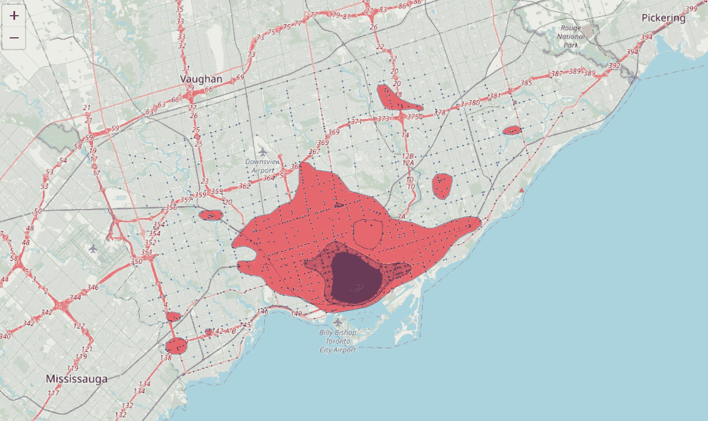

# 地理空间数据科学简介

> 原文：<https://medium.com/codex/a-gentle-introduction-to-geospatial-data-science-ce4291feb67d?source=collection_archive---------1----------------------->

## 熟悉空间数据、位置智能、热点图、GeoPandas 以及更多主题。


在 [Unsplash](https://unsplash.com?utm_source=medium&utm_medium=referral) 上由 [Brett Zeck](https://unsplash.com/@iambrettzeck?utm_source=medium&utm_medium=referral) 拍照

你有没有想过像汉堡王、亚马逊、Lenskart 等最成功的公司是如何做到的？决定他们在一个国家或一个城市的实体店位置？这是一个基于直觉的随机过程，还是有人口统计、销售趋势、交通、天气等的潜在分析？？

你知道吗，预测像[沃尔玛](https://en.wikipedia.org/wiki/Walmart)这样的巨型连锁店下个季度的收入是可能的？是的，地理空间数据科学使我们能够以令人难以置信的方式使用技术。在本文中，我们将熟悉这个蓬勃发展的数据科学领域。

# 什么是空间数据？

> “没有地理，你将一事无成。”—吉米·巴菲特

让我们从地理空间数据科学中最基础的概念开始，即空间数据。空间数据是关于地理特征的位置和形状以及它们之间关系的信息。就地理位置而言，我们通常使用[(纬度，经度)](https://www.latlong.net/)坐标来表示。另一方面，形状取决于数据的类型，即矢量数据和栅格数据。矢量数据通过存储在 shapefiles(.而光栅数据是存储在像素网格中的类似图像的数据(例如卫星图像)。存储空间数据的另一种格式是 GeoJson。如果你想让自己熟悉这个，可以访问 [geojson.io](http://geojson.io) 这是一个非常直观的使用地图界面编辑 geojson 数据的工具。以下是表示为多边形的空间数据示例:-

在这里，您可以看到 GeoJson 文件如何使用地理位置坐标来存储此类形状。

通常在数据科学中，我们训练一个模型，将数据的一些特征作为输入，并预测一些标签。在地理空间数据科学中，要素引用地理位置，因此可以放在地图上。我们称这样的数据为空间数据。

# Python 中 Geopandas 的空间分析

现在，让我们从空间数据科学家的角度出发。如果您不熟悉 Python 编程语言，您可以在本文的后续章节中自由浏览所有的图形输出和分析。

虽然我们使用 python 中的 Pandas 库对大多数类型的数据进行预处理，但构建在 Pandas 库之上的 GeoPandas 库可以帮助我们预处理空间数据。听起来很有趣？想开始使用 GeoPandas 吗？推荐使用 Anaconda 发行版自带的 Jupyter 笔记本或者 [Google Colab。](https://colab.research.google.com/)要安装 GeoPandas 库并在 Jupyter 笔记本中使用它，请在 anaconda 提示符下键入以下命令。

```
conda install -c conda-forge geopandas
```

对于在 Google Colab 中的安装，您可以使用下面提到的命令运行单元。

```
!pip install git+git://github.com/geopandas/geopandas.git
```

## 读取 Geopandas 中的数据

我将使用来自 [Kaggle](http://kaggle.com) 的[CORD-19(新冠肺炎 ORDC)](https://www.kaggle.com/charlieharper/spatial-data-for-cord19-covid19-ordc) 的空间数据来演示如何使用 Geopandas 读取空间数据。您可以通过访问[数据集页面](https://www.kaggle.com/charlieharper/spatial-data-for-cord19-covid19-ordc)并点击页面右上角的“新建笔记本”按钮来进行同样的练习。笔记本将在数据集所在的文件夹中打开，您可以开始编写代码来读取和分析数据。

请注意，我正在读取的数据的扩展名为。shp 即 shapefile。Shapefiles(。shp)是最常见的空间数据文件格式。如果您从互联网上下载了一个数据档案，并希望使用 shapefile(.shp)来读取数据，shapefile 附带的所有其他文件(shx，。prj，。dbf)必须位于同一文件夹中，您才能使用 GeoPandas 读取 shapefile。

> 注意:GeoPandas 也有一些内置的数据集，您可以使用它们来解决问题。如果您在 ipython 笔记本中运行**geo pandas . datasets . available**，可以找到这些数据集的列表。使用内置数据集的一个例子可以在[这里](https://geopandas.org/gallery/plotting_with_geoplot.html)看到。

## 案例研究:公民的幸福

现在，让我们尝试使用 GeoPandas 分析一些地理上重要的数据集。每年，联合国可持续发展解决方案网络都会发布一份《世界幸福报告》,根据幸福指数(根据一个国家在 6-7 个幸福参数上的表现计算的分数，如人均 GDP、健康预期等)对各国公民的幸福水平进行排名。).我将使用来自 [Kaggle](http://kaggle.com) 的【2021 年世界幸福报告和[到 2020 年的国家人口](https://www.kaggle.com/eng0mohamed0nabil/population-by-country-2020)数据集来分析各国的幸福，并试图找出哪些因素使一个国家幸福或不幸福，以及这些因素以何种方式影响幸福。

通过使用 Geopandas 可视化这些数据，我们发现，更幸福的国家通常人口更少，孩子更少，公民年龄更大。根据计算幸福指数的过程，其他一些因素也很重要，我们没有在这里分析，因为这只是一个介绍。这些包括腐败、社会支持、人均 GDP 和生活自由。你可以把它作为自己的一项任务，对这些参数做一个空间分析，发现一些更重要的结论:)。

## 数据可视化地图



热图示例

在 Python 中，我们使用[follow](https://pypi.org/project/folium/)包来创建交互式地图，如 **MarkerCluster、Bubble Map、Heatmap、Choropleth Map 等**。当我们必须显示数据中某些要素的地理聚类时，会使用热图。例如，在新冠肺炎空间分析中，我们可以制作几个案例的热图，并找出哪个城市属于热点。另一个例子是对实体店位置进行战略规划，我们可以使用热图来描绘更高密度的销售区域。以下生成热图的代码片段摘自 GeoPandas 的[官方文档页面。](https://geopandas.org/docs/user_guide/mapping.html)

可视化数据的另一种有用的地图类型是 Choropleth 地图(其中每个形状的颜色基于相关变量的值的地图)。使用 GeoPandas 可以轻松创建它。

有了这么多的知识，你现在也可以试一试，并想象 MarkerCluster、气泡图、流程图等。在一些数据上。所以，祝你努力成功:)！

# 什么是位置智能？

位置智能是许多行业用来解决实时问题的概念。我们可以将位置智能定义为从地理空间数据分析中获得的洞察力。这些见解可以是通过在空间数据中发现的趋势和关系得出的任何可操作的信息。从消费者行为到环境因素，这些趋势和关系随处可见。

位置智能的一个最好的使用案例可以在墨西哥汉堡王的《交通堵塞的弥天大谎》中看到。墨西哥的城市见证了世界上最严重的交通堵塞。汉堡王把这种情况视为一个巨大的机会。他们使用实时空间数据来联系客户，即使在交通高峰时段也是如此，这使得人们可以在交通堵塞时下单并提货。看看这个关于交通堵塞的短片吧

嗯，这就是汉堡王如何成为墨西哥第一和最受欢迎的快餐应用程序。位置智能在不久的将来有很大的创造性利用空间，并且发展迅速。它对企业进行市场调查的方式产生了明显的影响。

# 地理空间数据科学的未来？

到目前为止，我们已经看到了地理空间数据科学的一些东西，但是这项技术的未来有多好呢？

根据[对来自不同企业的数百名思想领袖](https://go.carto.com/ebooks/state-spatial-data-science-2020)的全球调查，近 68%的组织可能会在未来几年增加对地理空间数据科学的投资，这解释了为什么这项技术值得学习。地理空间数据科学被证明在建设弹性城市、追踪生物多样性、智能农业、抗击致命疾病等方面是有用的。因此，我认为计算地理最终会成为一种新常态。

# 结论

地理空间数据科学是数据科学的一个分支，包括位置分析、卫星图像、遥感、投影系统分析、栅格和矢量数据。如果你是一个数据科学爱好者，你必须考虑在这个领域做至少一个案例研究，因为它很少被学习者研究，并将为你的投资组合增加一些独特性。地理空间数据科学仍有待更深入的探索。

> 我希望这篇文章很有见地，请通过 mangeshgupta402@gmail.com[联系我。](mailto:mangeshgupta402@gmail.com)