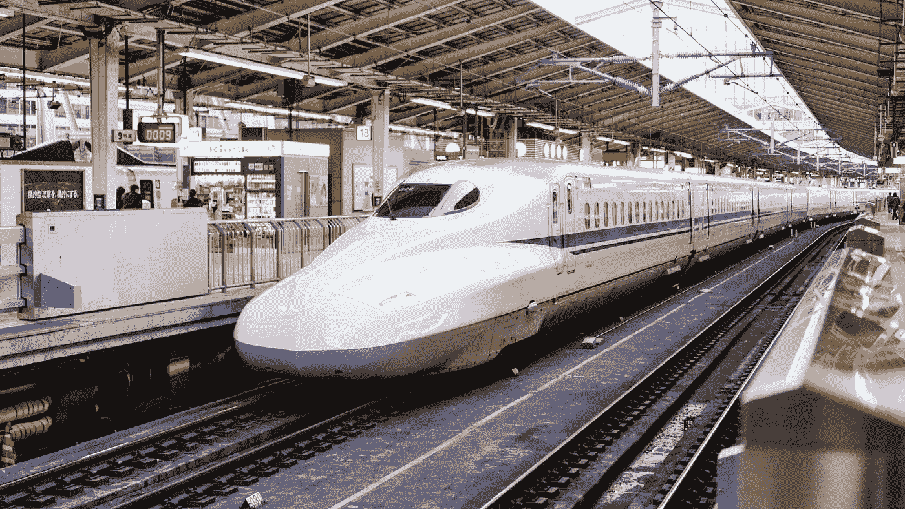

# 未来一瞥:仿生学作为技术

> 原文：<https://medium.com/codex/a-glimpse-of-the-future-biomimicry-as-technology-16002390c97f?source=collection_archive---------16----------------------->

Fikri Rasyid 在 [Unsplash](https://unsplash.com/?utm_source=unsplash&utm_medium=referral&utm_content=creditCopyText) 上拍摄的照片

## 珍妮·本尤斯在她 1997 年的书《仿生:受自然启发的创新》中引入了“仿生”一词。根据 Benyus 的说法，人类的旅程始于农业革命，随着科学革命而加速，发展到工业革命，最后是石化和基因工程革命。虽然今天我们可以合成生产我们需要的任何东西，我们可以篡改遗传密码，但我们欺骗自己进入了一种虚假的自主意识，不承认我们仍然受自然法则的支配，就像所有形式的生命一样。这些法律规定，一个物种不能以牺牲其环境为代价获取所有的资源，而不在此过程中破坏其自身的群落。我们需要学习大自然在其进化过程中积累的智慧，并利用其设计和过程。

Benyus 将仿生分为三个层次，从浅到深仿生。用她自己的话说:

***①。以自然为模型。仿生学是一门新的科学，它研究自然的模型，然后模仿或从这些设计和过程中获得灵感来解决人类的问题，例如，受树叶启发的太阳能电池。***

***2。以自然为尺度。仿生学使用生态标准来判断我们创新的“正确性”。经过 38 亿年的进化，大自然学会了:什么是有效的。什么是合适的。持久的。***

***3。大自然是导师。仿生学是一种看待和评价自然的新方式。它引入了一个时代，这个时代不是基于我们能从自然世界中提取什么，而是基于我们能从自然世界中学到什么。***

从 20 世纪 70 年代起，以自然为模型的想法开始兴起。美国物理学家和系统理论家弗里乔夫·卡普拉(Fritjof Capra)在他的著作**‘The Turning Point(1982)’**中解释了 20 世纪初物理学的新发现****如何给我们的世界观带来了深刻的变化；从笛卡尔和牛顿的机械论观点到整体的生态观点*** *”。*
对卡普拉来说，日益复杂的金融、健康、环境和社会问题表明需要一种****的新的现实视野；我们的思想、观念和价值观发生了根本性的变化。*****

**由于生物系统的多样性和复杂性，仿生学可以应用于从建筑、农业、经济到工业设计的无数领域。**

## **一些仿生的例子**

**在北京 2008 年夏季奥运会上，国家游泳中心举办了游泳、跳水和花样游泳比赛。该建筑通常被称为“水立方”或“艾斯·库伯”，其外墙由 4000 个不同大小的蓝色充气垫子组成，这些垫子由乙烯四氟乙烯(ETFE)制成，这是一种氟基塑料，模仿肥皂中的泡沫图案。气泡收集太阳能加热游泳池，并帮助调节温度。迄今为止，它仍然是仿生建筑中最令人印象深刻的例子之一。**

**撒哈拉森林项目首次在 2009 年哥本哈根联合国气候谈判 COP 15 上提出。对卫星图像的研究表明，沙漠边缘的植被生长边界每年都在来回移动。该项目旨在使用仿生设计来模拟允许植被生长的条件，创建一个基础设施，将盐水引入内陆，同时建立一个包含发电技术和温室的结构，在该地区建立经济活动。其第一个试点设施建于卡塔尔，并于 2012 年投入使用，项目正在约旦和突尼斯开发。**

**福冈正信(1913–2008)是一位日本农民和哲学家，他介绍了“自然耕作”或“无为而治”的方法，这是一种基于承认生态系统的复杂性并加以利用的不用犁、不用杀虫剂的耕作方法。对福冈来说，土壤耕作是不必要的，使用机器、化肥、堆肥和除草也是不必要的。在 21 世纪初，许多人发现福冈拒绝机械化不适合现代农业生产，然而，最近联合国粮食及农业组织(粮农组织)得出结论，许多传统的工业化农业做法是不可持续的，并忽视了生态系统的要求。福冈的原则现在被用于尊重生物多样性、减少对化学品和机械设备的依赖、增加土壤和环境健康的新型农业。**

**西日本铁路的新干线子弹头列车以超过 240 公里/小时的速度行驶。最初设计时，高速在离开隧道时会产生声波冲击波，干扰附近的居民。工程师们寻找一种方法来解决这个问题，而不降低速度或使用额外的能源。他们观察到翠鸟喙的形状有助于它们划破空气并潜入水中而不溅起水花，因此他们重新设计了火车的前部，以模仿翠鸟喙的形状。通过这种方式，他们设法消除了声波冲击，使火车行驶速度提高了 10%。**

**珍妮·本尤斯共同创立了非营利的仿生研究所([https://biomimicry.org/](https://biomimicry.org/))来帮助教育人们关于仿生的知识。**