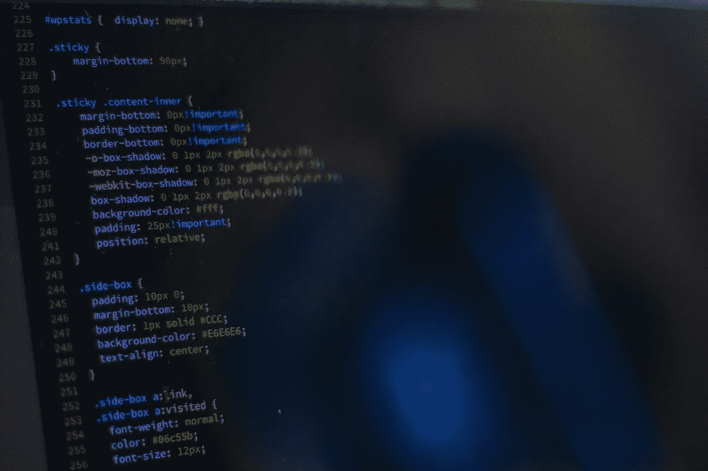
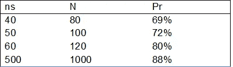

# 一群学生创造了信息论的历史，成功地应用了集合成形理论并证实了理论预测

> 原文：<https://medium.com/codex/a-group-of-students-made-the-history-of-information-theory-managing-to-apply-set-shaping-theory-2cdcd76240c6?source=collection_archive---------11----------------------->

照片由来自 [Pixabay](https://pixabay.com//?utm_source=link-attribution&utm_medium=referral&utm_campaign=image&utm_content=1839877) 的 [Pexels](https://pixabay.com/users/pexels-2286921/?utm_source=link-attribution&utm_medium=referral&utm_campaign=image&utm_content=1839877) 拍摄

集合成形理论是一种新的理论，其理论预测承诺革命性的结果。问题是它们是理论上的预测，由于信息的概念很难用数学方法形式化，缺乏实际应用代表了这一理论的最大危险。

关于这个理论的信息，我建议你阅读下面这篇文章，在这篇文章中，我用一种简单的方式解释了这个新方法:

[https://medium . com/codex/as-one-riemann-idea-it-is-revolutionary-information-theory-set-shaping-theory-熵编码-f9e0549e9c29](/codex/as-one-riemann-idea-it-is-revolutionizing-information-theory-set-shaping-theory-entropy-coding-f9e0549e9c29)

**集合成形理论的预测**

这个预测很容易解释；给定一个集合，我们称之为 X，其中所有的序列都可以通过将一个 A 面的骰子滚动 N 次来生成，还有一个大小相等的集合，它包含的序列平均可以用较少的比特数来编码。

在这一点上，你可能想知道这怎么可能。一个随机序列不能被压缩，为了理解这个结果，我们必须知道序列的编码这个术语是什么意思。

编码消息是用代码字代替符号的消息。

在信息论中，编码序列也代表压缩序列。

另一方面，集合成形理论认为压缩消息是编码消息加上码字列表。实际上，压缩的消息由所有不独立于序列的信息来识别。因此，码字列表代表了编码随机序列的低效率。

根据这一理论，这种低效率可以通过将随机生成的序列转换成更长但更容易编码的新序列来消除。

熵编码的低效率在下面的文章中详细解释:

[https://level up . git connected . com/the-efficiency-of-entropy-coding-set-shaping-theory-fcbf 1 CCB 40 BC](https://levelup.gitconnected.com/the-inefficiency-of-entropy-coding-set-shaping-theory-fcbf1ccb40bc)

你可以理解许多研究人员在这种没有任何实验证实的预测面前的怀疑态度。然而，这一切都变了；事实上，一群学生成功地应用了这一理论，并开发了以下统计实验来验证这一预测。

文章“**集合成形理论在霍夫曼编码中的实际应用”**发表在 arxiv:

https://arxiv.org/abs/2208.13020

他们还分享了使用的 Matlab 文件。

[https://www . mathworks . com/MATLAB central/file exchange/115590-test-SST-Huffman-coding](https://www.mathworks.com/matlabcentral/fileexchange/115590-test-sst-huffman-coding)

我还建议在下面的文章中描述这个结果对香农第一定理的影响。

[https://www . academia . edu/88056303/results _ of _ the _ practical _ application _ of _ set _ shaping _ theory _ on _ Shannon _ s _ first _ theory](https://www.academia.edu/88056303/Consequences_of_the_practical_application_of_set_shaping_theory_on_Shannon_s_first_theorem)

**统计实验**

步骤 1)生成随机序列。

步骤 2)计算生成的随机序列的编码极限(零阶经验熵)。

步骤 3)所生成的序列被变换成长度为 N + 1 的更长的序列，因此具有加号。

步骤 4)应用霍夫曼编码，并用码字替换符号。

步骤 5)将编码的变换序列的长度与编码极限进行比较。

步骤 6)对编码序列进行解码，并应用逆变换，以便获得初始序列。如果获得的序列与初始序列不同，则报告错误。这样，我们检查使用的函数是否是 biunivocal。

步骤 7)重复这些步骤统计上显著的次数。

步骤 8)计算变换编码序列的长度小于对初始编码序列计算的编码极限的概率。

本演示详细描述了数据压缩实验。

[https://www . academia . edu/88055617/Description _ of _ the _ program _ used _ to _ validate _ Theory _ results _ of _ the _ Set _ Shaping _ Theory](https://www.academia.edu/88055617/Description_of_the_program_used_to_validate_the_theoretical_results_of_the_Set_Shaping_Theory)

报告“集合成形理论在霍夫曼编码中的实际应用”一文中的结果。

Ps =可以使用比初始序列 x 的编码极限(零阶经验熵)更少比特数的唯一可解码码(霍夫曼编码)对变换序列 f(x)进行编码的概率。

ns =符号数

N =序列的长度

获得的结果证实了理论预测。

> 这样，我们得到了一个以前认为不可能的结果。事实上，一个随机序列可以被转换成一个新的，更长的序列，可以用更少的比特编码，概率大于 50%。

这并不意味着能够减少随机序列的长度，因为从实用的角度来看，压缩序列是由其编码(用码字替换符号)和码字列表唯一定义的。事实上，接收消息的人也必须接收代码字来跟踪原始消息。