# JavaScript 中的基本数组方法指南

> 原文：<https://medium.com/codex/a-guide-to-basic-array-methods-in-javascript-d1ace4feb509?source=collection_archive---------6----------------------->

Ronald Cuyan 通过 Unsplash 拍摄的照片

能够遍历、改变和检查数组是任何编程语言的重要基础。在本文中，我探索并概述了 array 对象可用的基本方法，每个使用 JavaScript 的程序员都应该知道这些方法。

## 目录:

*   添加到数组:`unshift()`，`push()`
*   从数组中移除元素:`shift()`，`pop()`
*   改变数组的顺序:`sort()`，`reverse()`
*   检查数组:`indexOf()`、`lastIndexOf()`、`includes()`

# 添加到阵列

`unshift()` —将一个或多个元素添加到数组的开头，并返回数组的新长度。这个方法是**破坏性的**，意味着原始数组会被修改。

[点击此处](https://developer.mozilla.org/en-US/docs/Web/JavaScript/Reference/Global_Objects/Array/unshift)查看更多关于 MDN 网络文档的信息。

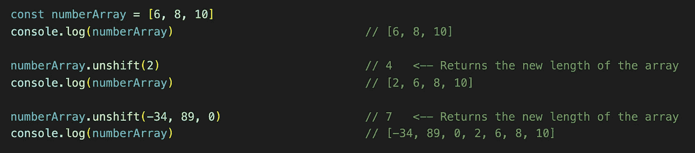

使用 unshift()方法，可以将一个或多个元素添加到数组的前面。

`push()` —将一个或多个元素添加到数组的末尾。返回值将是数组的新长度。这个方法是**破坏性的**。

点击此处查看更多关于 MDN 网络文档的信息。

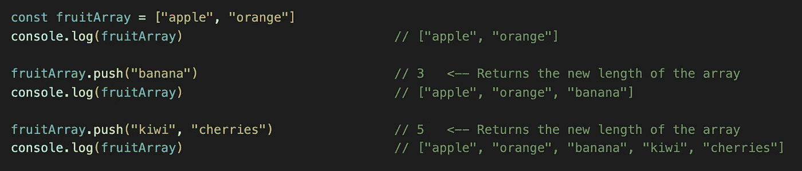

使用 push()，可以将元素添加到数组的末尾。返回值将是数组的新长度。

# 从数组中移除元素

`shift()` —仅移除数组的第**个**元素，并返回移除的元素。这个方法不接受参数，并且是破坏性的。如果没有可从数组中移除的元素，该方法将返回`undefined`。

[点击此处](https://developer.mozilla.org/en-US/docs/Web/JavaScript/Reference/Global_Objects/Array/shift)查看更多关于 MDN 网络文档的信息。

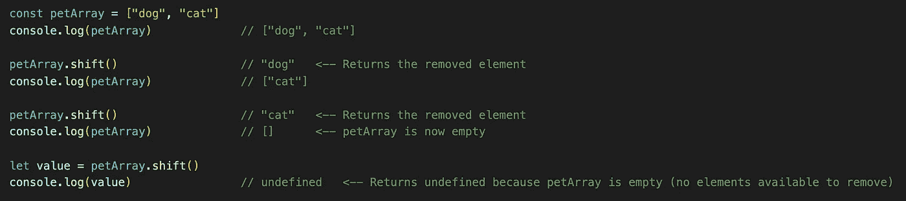

`pop()` —该方法移除或“弹出”最后一个元素**。这个方法不接受参数，并且是破坏性的。这是一种返回移除元素的破坏性方法。**

[点击此处](https://developer.mozilla.org/en-US/docs/Web/JavaScript/Reference/Global_Objects/Array/pop)查看 MDN 网络文档的更多信息。

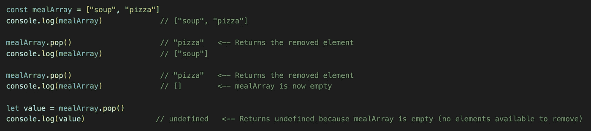

# 更改数组的顺序

`sort()` —该方法通过将元素转换成字符串并按字母顺序排序来对元素进行排序。此方法是破坏性的，将永久改变给定数组的顺序。

[点击此处](https://developer.mozilla.org/en-US/docs/Web/JavaScript/Reference/Global_Objects/Array/sort)查看 MDN 网络文档的更多信息(强烈推荐)。

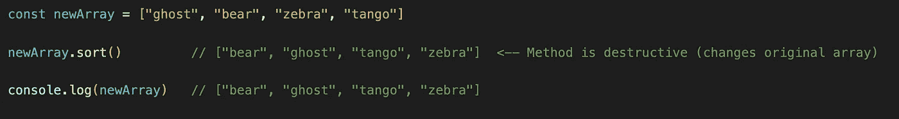

sort()方法是破坏性的，会改变原始数组的顺序

因为有一个字符串转换，所以当将此方法应用于一个数字数组时，您会得到意外的结果。要纠正这种行为，添加一个回调函数`sort()`，它将比较传入的数值。这个回调函数通常以两种方式之一编写:

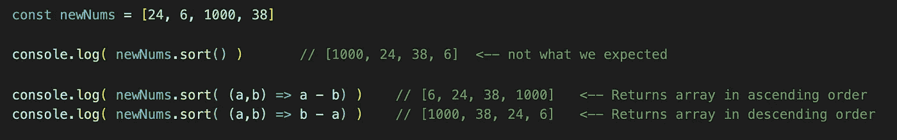

如果您的数组包含数字，请使用上述回调函数之一进行正确排序。上面的回调函数使用了箭头函数符号。

`reverse()` —此方法将反转给定数组中元素的顺序。此方法是破坏性的，即它将永久更改数组的顺序，并且不接受参数。

[点击此处](https://developer.mozilla.org/en-US/docs/Web/JavaScript/Reference/Global_Objects/Array/reverse)查看更多关于 MDN 网络文档的信息。

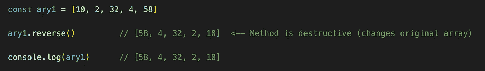

reverse()方法将物理上反转给定数组的当前顺序。

# 检查阵列

`indexOf()` —此方法返回数组中给定元素的索引值。此外，它可以接受一个索引号的第二个参数，并且它将只查看从该索引号开始和之后的元素。如果在同一个数组中有两个相同的元素，这很有用。

[点击此处](https://developer.mozilla.org/en-US/docs/Web/JavaScript/Reference/Global_Objects/Array/indexOf)查看更多关于 MDN 网络文档的信息。

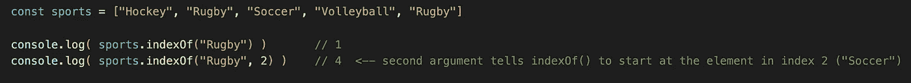

使用可选的第二个参数只查看从提供的索引号开始或之后的元素。

`lastIndexOf()` —此方法将返回数组中给定元素的最后一个索引。如果有一个或多个匹配，将返回该元素的最后一个索引。如果不匹配，返回值为`-1`。

此外，`lastIndexOf()`区分大小写，因此当`"Rugby"`可能在我们的`sports`数组中时，`sports.lastIndexOf("rugby")`将返回`-1`。

[点击此处](https://developer.mozilla.org/en-US/docs/Web/JavaScript/Reference/Global_Objects/Array/lastIndexOf)查看更多关于 MDN 网络文档的信息。

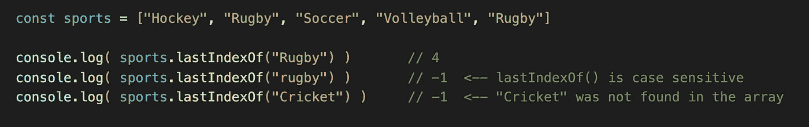

小心，lastIndexOf()是区分大小写的！

`includes()` —该方法接受一个参数，如果元素出现在数组中，则返回布尔值`true`，否则返回布尔值`false`。此方法也区分大小写。

[点击此处](https://developer.mozilla.org/en-US/docs/Web/JavaScript/Reference/Global_Objects/Array/includes)查看更多关于 MDN 网络文档的信息。

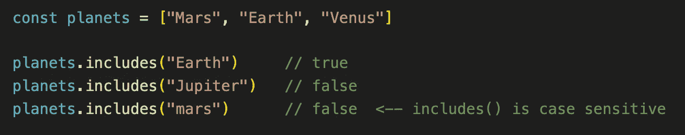

includes()方法区分大小写，如果给定的元素存在，它将返回一个布尔值。

## 奖金

下一个在技术上是属性而不是方法，但它仍然是 JavaScript 中数组可用的最重要的工具之一。

`length` —返回接收器数组中元素的数量。它**不**包含括号，`length`不`length()`，不改变原数组。

除了它的基本用途，`length`属性通常用于通过方括号符号`[]`访问数组的最后一个元素。

[点击此处](https://developer.mozilla.org/en-US/docs/Web/JavaScript/Reference/Global_Objects/Array/length)查看更多关于 MDN 网络文档的信息。

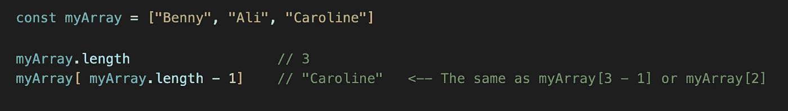

记住:长度是属性而不是方法，所以它不需要括号。

# 结论

这些只是 JavaScript 中数组对象可用的少数基本方法。一旦你有了这些，还有很多更高级的方法可以将数组遍历提升到新的高度。要查看这些方法的完整列表，请单击上面的任何 MDN web doc 链接，您会看到它们列在最左侧的垂直栏中。