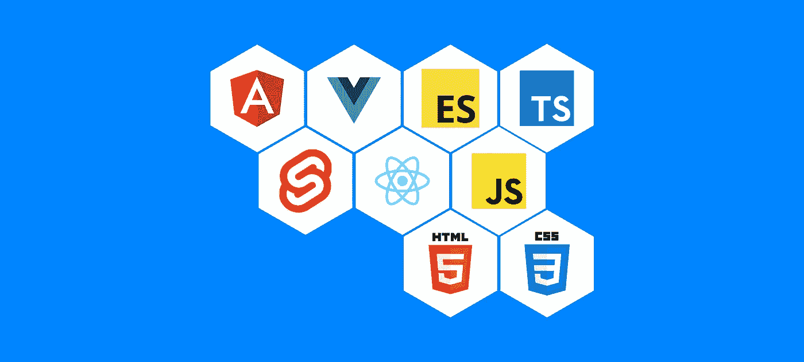

# 选择下一个前端的指南

> 原文：<https://medium.com/codex/a-guide-to-choosing-your-next-front-end-3c9423d14647?source=collection_archive---------1----------------------->

对不起，如果我没有包括你最喜欢的前端的东西

我已经写了很多关于角度和反应的帖子，并且得到了很多反馈。因此，我想快速回顾一下，看看我们如何选择我们的前端将在什么环境中完成？在如何构建前端的数百种选择中，我们如何做出决定？嗯，希望我能对此有所启发，并帮助你以公正的方式做出决定。