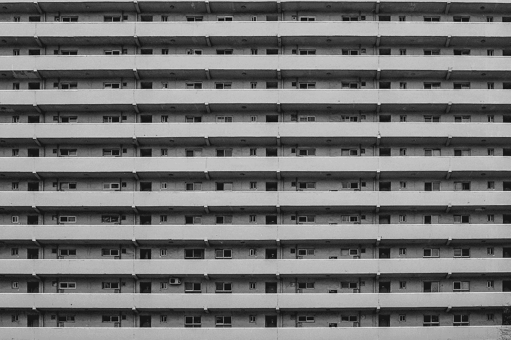
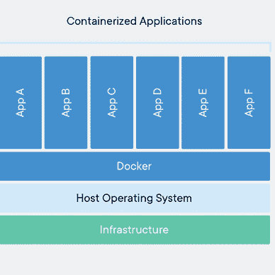
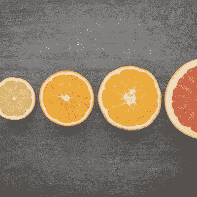
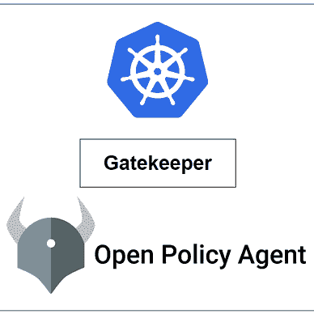

# Docker 多阶段构建指南

> 原文：<https://medium.com/codex/a-guide-to-docker-multi-stage-builds-290ff7bd04ec?source=collection_archive---------1----------------------->

## 一篇关于多阶段构建的文章



在 [Unsplash](https://unsplash.com?utm_source=medium&utm_medium=referral) 上 [insung yoon](https://unsplash.com/@insungyoon?utm_source=medium&utm_medium=referral) 的照片

Docker 图像是由一系列层构建而成的。每一层代表图像 docker 文件中的一条指令。除了最后一层，每一层都是只读的。

构建图像最具挑战性的事情之一是减小图像尺寸。在本文中，我们将讨论如何优化 docker 图像的大小。

让我们为一个简单的 golang 应用程序创建一个定制的 docker 图像。

```
# app.go

package main

import (
    "fmt"
    "time"
    "os/user"
)

func main () {
    user, err := user.Current()
    if err != nil {
        panic(err)
    }

    for {
        fmt.Println("user: " + user.Username + " id: " + user.Uid)
        time.Sleep(1 * time.Second)
    }
}
```

现在，让我们编写一个 **Dockerfile** 来打包 golang 应用程序:

```
# Dockerfile

FROM ubuntu   # Base image 
ARG DEBIAN_FRONTEND=noninteractive   
RUN apt-get update && apt-get install -y golang-go    # Install golang
COPY app.go .                                         # Copy source code                 
RUN CGO_ENABLED=0 go build app.go                     
CMD ["./app"] 
```

接下来，创建一个 **docker 映像**并从该映像运行一个容器:

```
# Create image from the Dockerfile
>>  docker build -t goapp .
...
Successfully built 0f51e92fe409
Successfully tagged goapp:latest

# Run a container from the image created above
>> docker run -d goapp

04eb7e2f8dd2ade3723af386f80c61bdf6f5d9afe6671011b60f3a61756bdab6
```

现在，' **exec** '到我们之前创建的容器中:

```
# exec into the container
>> docker exec -it 04eb7e2f8dd sh

# list the files
~ ls
app  app.go  bin  boot  dev  etc  home  ...

# run the application 
~ ./app
user: root id: 0
user: root id: 0
user: root id: 0
user: root id: 0
user: root id: 0
...
```

我们可以看到，在构建应用程序之后，容器中有了`**app**`工件。如果我们检查帮助我们构建应用程序工件的图像大小:

```
>> docker images goapp

REPOSITORY                  TAG       IMAGE ID       CREATED        SIZE
goapp                       latest    0f51e92fe409   16 hours ago   870MB
```

图像大小是' **870MB'** ，但是我们可以使用多阶段构建来缩小它。对于多阶段构建，我们将在 docker 文件中使用多个`**FROM**` 语句。每条`**FROM**` 指令可以使用不同的基础，并且它们中的每一条都开始了构建的新阶段。我们可以通过在最终图像中留下所有不想要的东西，有选择地将工件从一个阶段复制到另一个阶段。为了展示这是如何工作的，让我们将上一节中的`**Dockerfile**` 修改为使用多阶段构建。

我们将把我们的`**Dockerfile**` 分为两个阶段。一个是**构建阶段**，它将帮助我们构建我们的应用程序并生成工件。然后我们只需要**将工件从构建阶段复制到另一个阶段，并创建一个微小的产品映像**。

```
# Dockerfile
# named this stage as builder ----------------------
FROM ubuntu AS builder         
ARG DEBIAN_FRONTEND=noninteractive   
# Install golang
RUN apt-get update && apt-get install -y golang-go   
# Copy source code
COPY app.go .                                             
RUN CGO_ENABLED=0 go build app.go

# new stage -------------------
FROM alpine
# Copy artifact from builder stage                   
COPY --from=builder /app .   
CMD ["./app"]
```

现在，构建图像并检查图像大小:

```
>> docker build -t goapp-prod  .

Successfully built 61627d74f8b8
Successfully tagged goapp-prod:latest

>> docker images goapp-prod

REPOSITORY   TAG       IMAGE ID       CREATED         SIZE
goapp-prod   latest    61627d74f8b8   5 minutes ago   8.92MB  # <---
```

正如我们所看到的，图像大小已经大大减少。是时候检查我们是否可以从我们创建的映像运行容器了。

```
# create docker container
>> docker run goapp-prod

user: root id: 0
user: root id: 0
```

**太好了！**我们能够使用我们创建的小制作图像，而且效果非常好。

> *如果您觉得这篇文章很有帮助，请点击* ***跟随*** *👉* *和* ***拍手*** *👏* *按钮帮助我写更多这样的文章。
> 谢谢🖤*

## 👉所有关于 Linux 的文章


[Md 沙米姆](/@shamimice03?source=post_page-----290ff7bd04ec--------------------------------)

## 所有关于 Linux 的文章

[View list](/@shamimice03/list/all-articles-on-linux-1339e15e3304?source=post_page-----290ff7bd04ec--------------------------------)12 stories

## 👉关于 Kubernetes 的所有文章


[Md 沙米姆](/@shamimice03?source=post_page-----290ff7bd04ec--------------------------------)

## 关于 Kubernetes 的所有文章

[View list](/@shamimice03/list/all-articles-on-kubernetes-7ae1a0f96f3b?source=post_page-----290ff7bd04ec--------------------------------)24 stories

## 👉所有关于头盔的文章


[Md 沙米姆](/@shamimice03?source=post_page-----290ff7bd04ec--------------------------------)

## HelmーSeries

[View list](/@shamimice03/list/helmseries-6e2076d48ba8?source=post_page-----290ff7bd04ec--------------------------------)11 stories