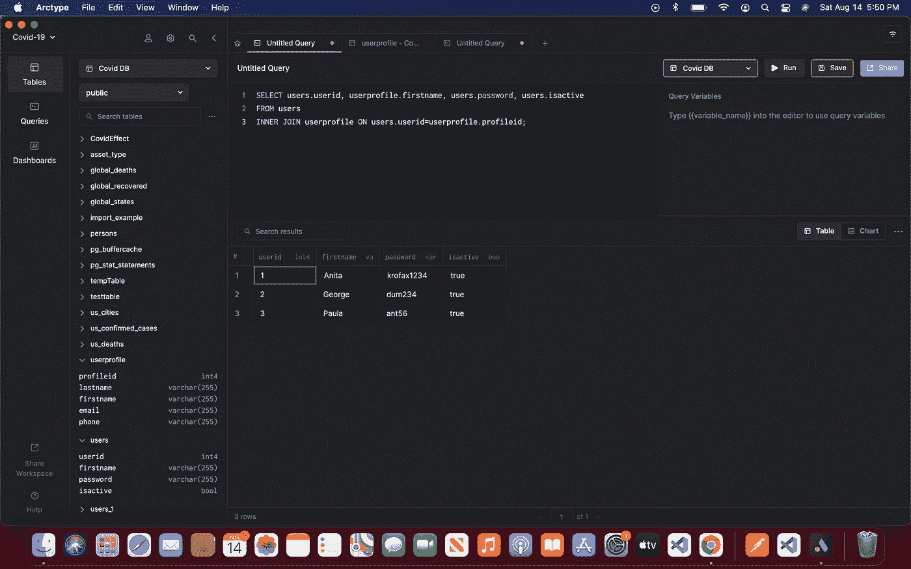
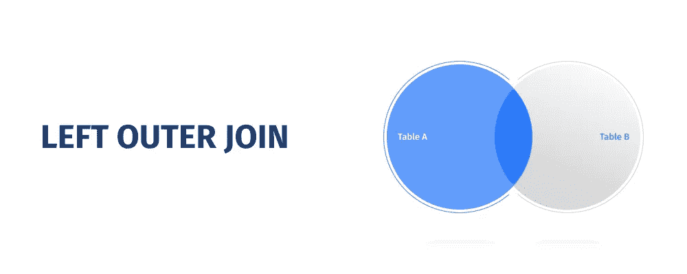
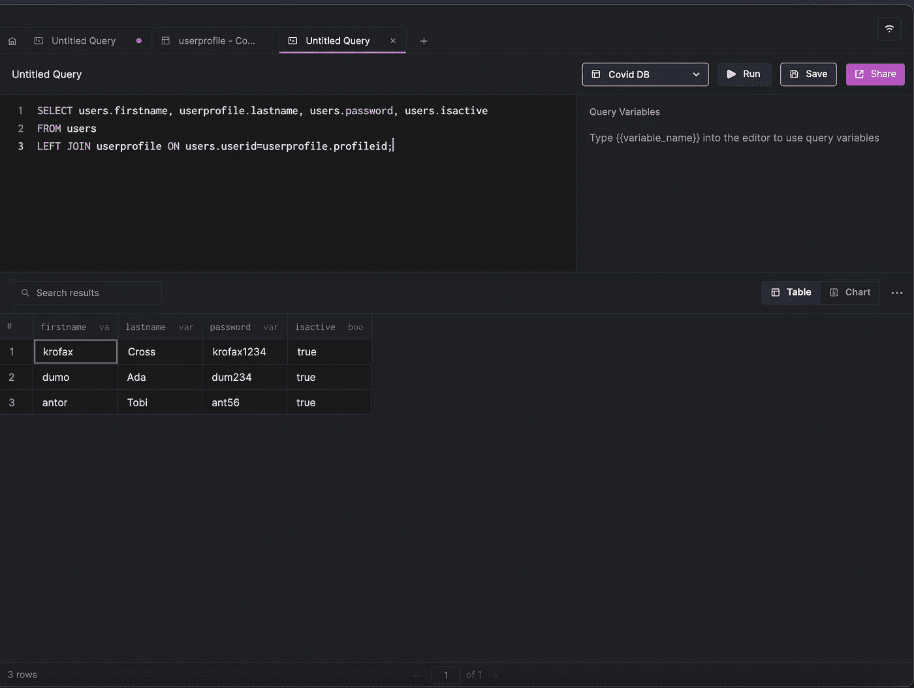
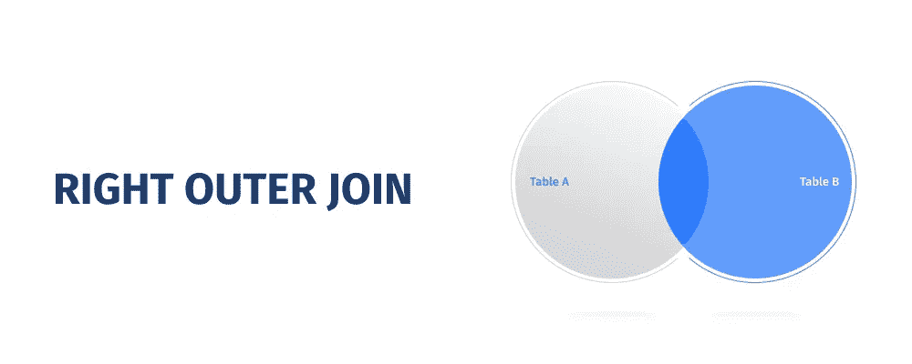
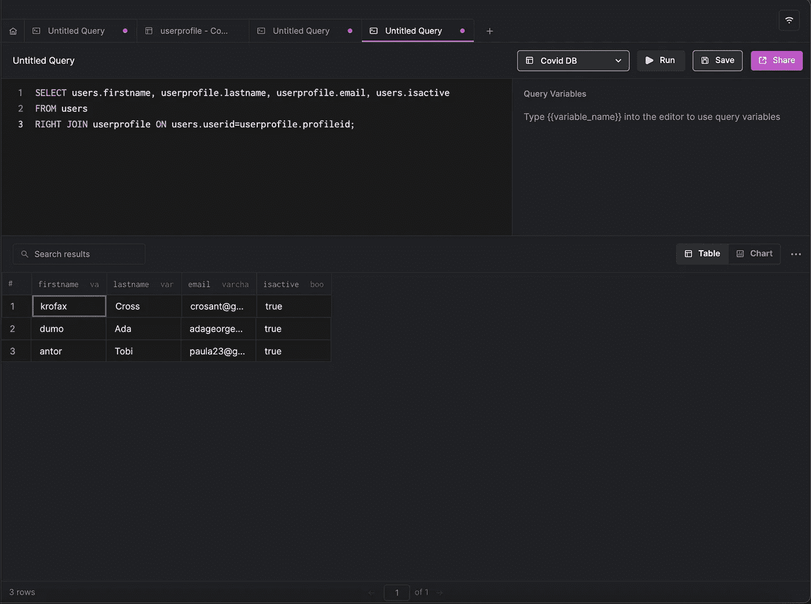
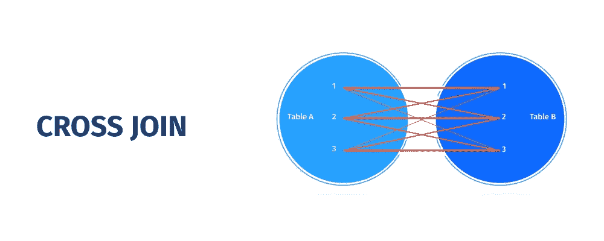
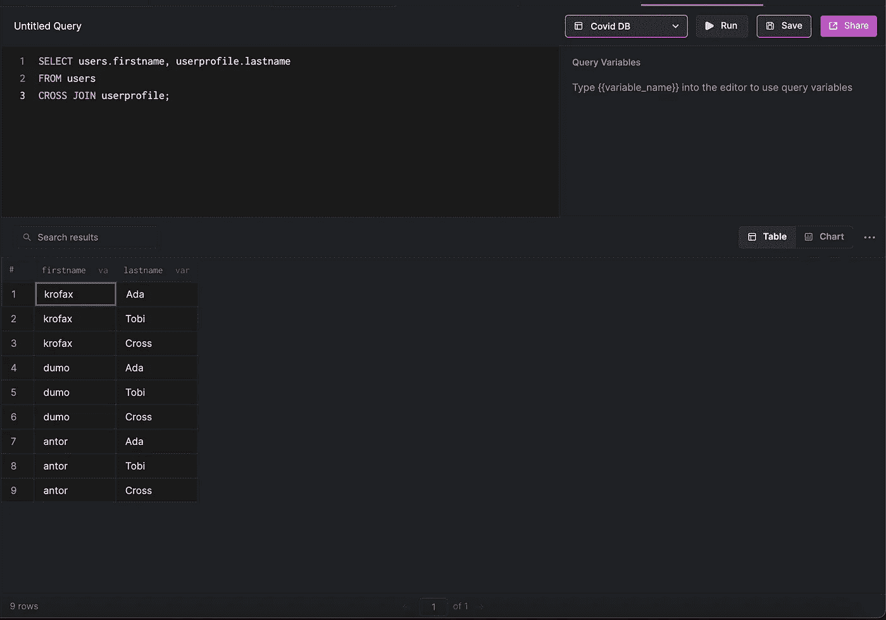
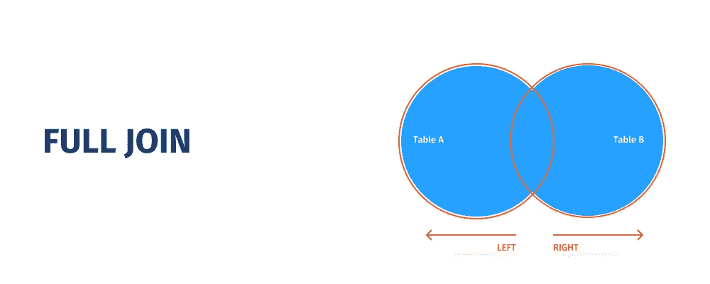
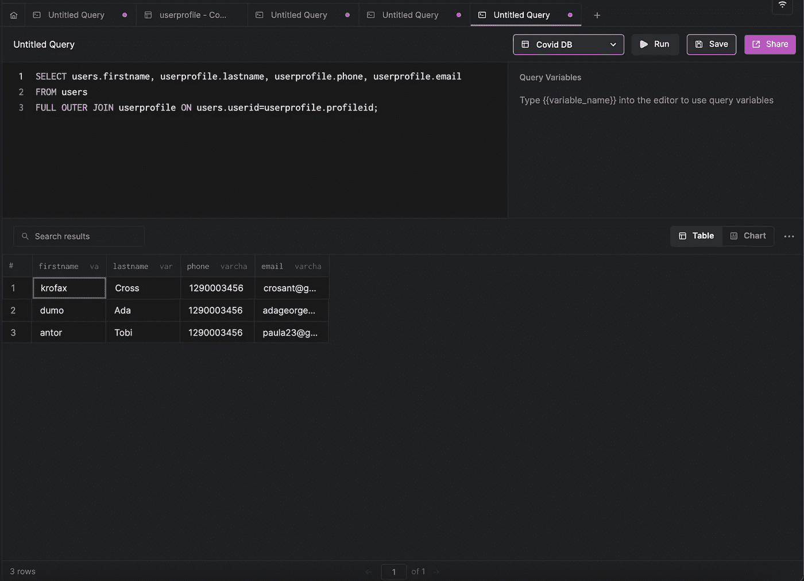

# MySQL 联接指南

> 原文：<https://medium.com/codex/a-guide-to-mysql-joins-7d1423fdaffd?source=collection_archive---------22----------------------->


照片由[迈克尔·泽兹奇](https://unsplash.com/@lazycreekimages?utm_source=medium&utm_medium=referral)在 [Unsplash](https://unsplash.com?utm_source=medium&utm_medium=referral) 上拍摄

# 介绍

**在单个查询中，利用连接从多个表中获取数据。**在 MySQL 中，JOINS 聚合来自多个表的数据，并将其作为一个结果。关系数据库中的每个表都包含唯一的或公共的数据，并且每个表都是逻辑连接的。联接用于从共享一个公共字段的表中获取数据。

## **MySQL 中的 JOINS 是什么？**

在 MySQL 中，`JOIN`语句是一种基于数据库中几个表的公共字段值来连接这些表之间的数据的技术。相同的列名和数据类型通常作为公共值出现在被链接的表中。连接键或公共键指的是共享列。`SELECT`、`UPDATE`和`DELETE`命令都可以使用连接。

## 连接入门

MySQL 联接类型指定了查询中两个表的链接方式。内部连接、外部连接和交叉连接是 MySQL 支持的三种类型的连接子句。左连接和右连接是两种不同类型的外部连接。为了更直观地展示连接是如何操作的，我们需要[创建一个新的模式](https://docs.arctype.com/managing-tables/creating-a-table)并插入一些样本数据。

```
CREATE TABLE Users (
    UserID int,
    UserName varchar(255),
    Password varchar(255),
    isActive boolean
);

CREATE TABLE Userprofile (
    ProfileID int,
    LastName varchar(255),
    FirstName varchar(255),
    Email varchar(255),
    Phone varchar(255)
);
```

接下来我们要做的是向其中插入一些数据。您可以向表中插入任意数量的用户。

```
INSERT INTO Users
	(UserID, UserName,Password, isActive)
VALUES
	(1,'krofax','krofax1234', true);

INSERT INTO userprofile
	(profileid, lastname, firstname, email, phone)
VALUES
	(1,'Ada', 'George', 'adageorge@gmail.com','1290003456');
```

# MySQL 内部连接子句

使用内部联接只检索常见的匹配记录。INNER JOIN 子句将从表 A 和表 B 中检索的记录限制为满足连接要求的记录。这是最常用的连接类型。检查下面的文氏图，以便更好地理解内部连接。


以下是 MySQL 内部连接的语法:

```
SELECT 
	columns
FROM 
	tableA 
INNER JOIN tableB
	ON tableA.column = tableB.column;
```



## MySQL 外部连接

与内部联接相比，外部联接会产生不匹配的记录以及匹配的行。如果关联表中的行不匹配，将显示空值。MySQL 有两种不同形式的外部连接:MySQL 左连接和 MySQL 右连接。让我们更详细地看一下它们。

## MySQL 左连接子句

左连接允许您从表 A 和表 B 中获取所有符合连接条件的条目。对于表 A 中不符合条件的记录，将显示空值。检查下面的文氏图，以便更好地理解左连接。



以下是 MySQL 左连接的语法:

```
SELECT 
	columns
FROM 
	tableA
LEFT JOIN tableB
	ON tableA.column = tableB.column;
```



**注意:**`LEFT JOIN`关键字返回左表(客户)中的所有记录，即使右表(订单)中没有匹配项。

## MySQL 右连接子句

因此，右连接允许您从表 B 和表 A 中获取所有符合连接条件的条目。对于表 B 中不符合条件的记录，将显示空值。为了更好地理解右连接，请参见下面的文氏图。



以下是 MySQL 右连接的语法:

```
SELECT 
	columns
FROM 
	tableA
RIGHT JOIN tableB
	ON tableA.column = tableB.column;
```



**注意:**`RIGHT JOIN`关键字返回右表(雇员)中的所有记录，即使左表(订单)中没有匹配的记录。

## MySQL 交叉连接子句

MySQL 交叉连接，通常称为笛卡尔连接，从每个表中返回所有可能的行组合。如果没有提供额外的条件，则通过将表 A 中的每一行乘以表 B 中的所有行来获得结果集。检查下面的维恩图以了解有关交叉连接的更多信息。



你认为你什么时候会需要这种加入？例如，假设您的任务是找到产品和颜色的所有可能组合。在这种情况下，交叉连接非常有用。

**注意:** `CROSS JOIN`可能会产生相当大的结果集！

以下是 MySQL 交叉连接的语法:

```
SELECT 
	columns
FROM 
	tableA
CROSS JOIN tableB;
```



# 加入的技巧

在 MySQL 中，连接允许您执行单个连接查询，而不是许多简单的查询。因此，您将获得更高的速度、更低的服务器开销以及 MySQL 和您的应用程序之间更少的数据传输。与 SQL Server 不同，MySQL 没有用于完全外部连接的独特连接类型。但是，您可以组合左外部联接和右外部联接，以获得与完全外部联接相同的效果。

```
SELECT 
	* 
FROM 
	tableA
LEFT JOIN tableB 
	ON tableA.id = tableB.id
UNION
SELECT 
	* 
FROM 
	tableA
RIGHT JOIN tableB 
	ON tableA.id = tableB.id
```



使用 MySQL 联接，您还可以联接两个以上的表。

```
SELECT 
	*
FROM 
	tableA
LEFT JOIN tableB
	ON tableA.id = tableB.id
LEFT JOIN tableC
	ON tableC.id = tableA.id;
```



## 为什么联接有用？

*   **快了很多**。在单个查询中，联接允许您从两个或多个链接的数据库表中获取数据。连接非常有价值，因为它们比逐个运行查询来获得相同的结果节省了时间。
*   **MySQL 更高效**。利用连接的另一个优点是 MySQL 性能更好，因为[连接是通过索引](https://arctype.com/blog/mysql-index-performance/)执行的。
*   **使用联接降低了服务器负载**。因为您执行一个查询，所以您会得到更好更快的结果。

# 结论

任何分析师或 DBA 都必须牢固掌握连接，并在日常工作中自由使用它们。这正是 Arctype for MySQL 派上用场的时候。即使对于复杂的连接子句，其复杂的代码完成功能也可以完美地工作。Arctype for MySQL 将为您提供一个完整的 JOIN 子句，因此您不必记住数百个列名或别名。它丰富的功能使得创建复杂的查询和管理连接条件变得轻而易举。