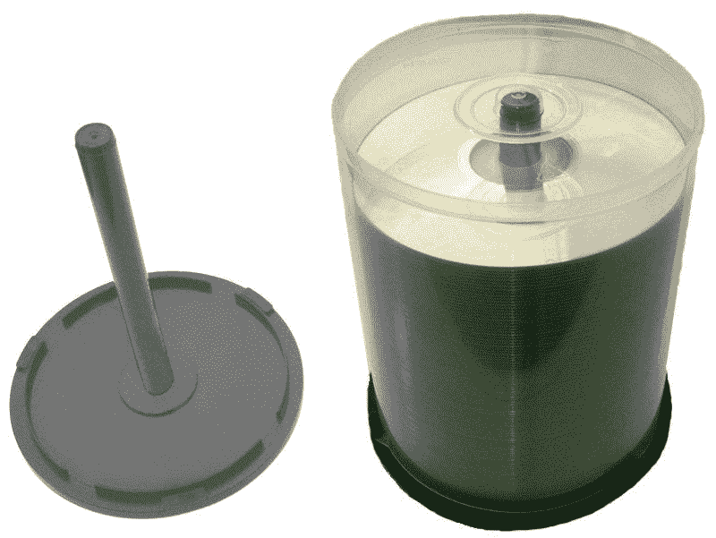
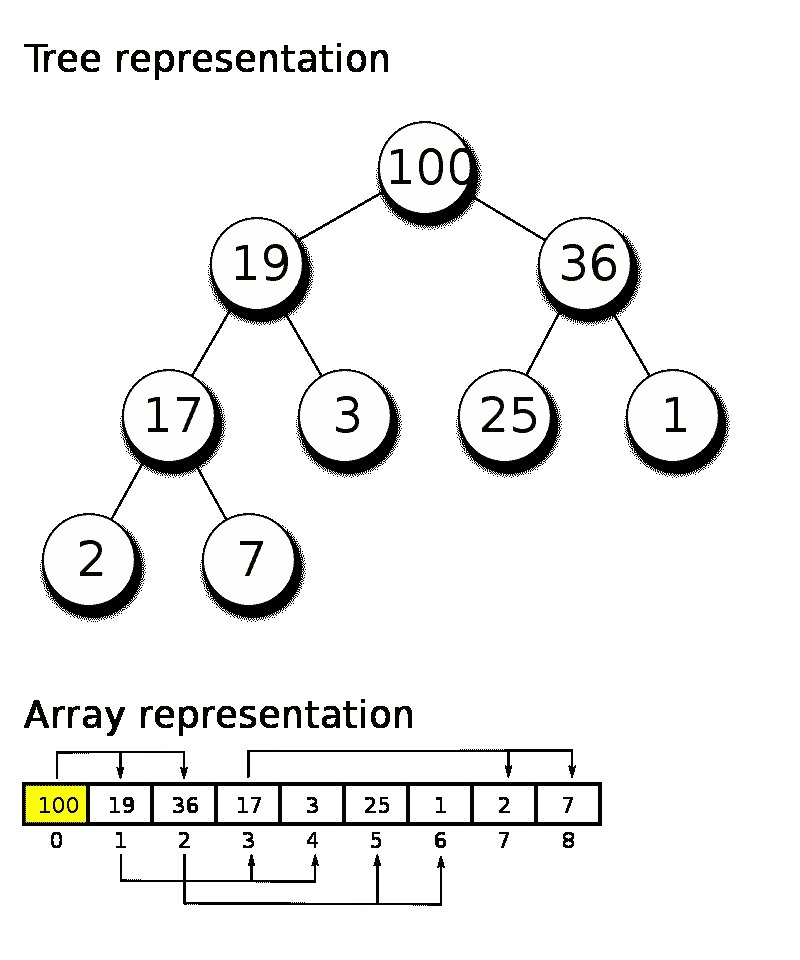

# C 语言中的指针指南

> 原文：<https://medium.com/codex/a-guide-to-pointers-in-c-15379a2d44ce?source=collection_archive---------4----------------------->


照片由[你好我是尼克](https://unsplash.com/@helloimnik?utm_source=medium&utm_medium=referral)在 [Unsplash](https://unsplash.com?utm_source=medium&utm_medium=referral)

在 C 和 C++编程领域，指针是开发人员的必备工具。许多现代编程语言将指针的功能从开发人员的直接控制中抽象出来，而是自己处理它。在低级语言中，开发人员能够直接与内存交互。**从根本上说，指针只是指向内存中某个位置的地址。**

# 变量如何存储在内存中

c 将所有变量存储在某种内存中。这可能在堆栈、堆或其他形式的内存中。然而，除非它们存储在寄存器中，否则它们将有一个内存地址。事实上，这是 c 语言中使用类型的主要原因。**变量的类型在声明时告诉编译器在堆栈上为变量分配多少内存。这就是为什么 C 有这么多类型，比如 char，short，int，long 等等。这些类型的确切大小取决于编译器；不过一般来说，char 是一个字节，short 是两个字节，int 是四个字节，long 是八个字节。我怀疑 C 没有本地 boolean 类型的原因是因为单个位是不可寻址的，而 boolean 最小只能是一个字节。普通的变量声明和定义如下:**

```
int sum = 0;
```

我们告诉编译器在堆栈上分配四个字节，并在内存中设置这些字节的值，这样，当被视为一个整数时，该整数的值为 0。请理解，内存的每个单元(一个字节)都是可单独寻址的。这意味着任何占用超过一个字节的数据都必须以某种方式拆分。对于整数，这是非常直观的；只需将数字写成二进制，并将连续的字节视为连续的数字。然而，对于像 floats 这样的数据类型，情况就不同了(我们甚至不会提到像 structs 这样的定制数据类型)。此外，即使是整数也不是那么简单，因为有符号整数使用一种称为二进制补码的系统来表示正负整数。

```
float cash = 5.25f;
```

浮点数通常以二进制存储在科学记数法中，在四个字节以内。一位用于符号，然后(通常但不总是)八位用于指数，剩余的 23 位用于有效值，也称为尾数。因此，虽然整数 5 可以存储为`00000000 00000000 00000000 00000101`，但是浮点数 5.25 可以存储为`01000000 10101000 00000000 00000000`。整数可以简单地解释为二进制补码整数`00000000000000000000000000000101`，但是浮点必须解释为`0`表示正，`1000000 1`表示-2 的指数，`01010000000000000000000`表示尾数 525。这不是很明显。首先，二进制中的所有尾数都将以 1 开头，所以没有必要存储它。有很多聪明的策略被用来解释一个浮动的价值，我建议[你继续研究](https://www.log2base2.com/storage/how-float-values-are-stored-in-memory.html)，如果你感兴趣的话。

我的主要观点是简单地让你明白，你存储在变量中的数字不是简单地复制粘贴到一个内存地址中；它们必须以某种方式编码，并在访问时被解码。如果您想继续研究这种编码和解码，Python 提供了一种简单的方法:

格式字符见 [Python 文档](https://docs.python.org/3/library/struct.html)

# 使用指针

C 语言中有几个与指针相关的操作符，主要有两个:地址操作符`&`和取消引用操作符`*`。注意，这些操作符在 C 语言中用于其他事情；然而，当用作左一元运算符时，这些符号表示地址或取消引用。左一元运算符是接受一个操作数的运算符，表示在它的左边。为了在 C 中声明一个指针，你只需在你想指向的类型的右边添加一个`*`。以下是声明整数指针的正确方法:

```
int* pointer;
int * pointer;
int *pointer;
```

看你个人喜好了；我更喜欢用 C++写`int* pointer`，用 C 写`int *pointer`，两者都有好处；然而，这是一个简单的风格选择，只要你始终如一，任何都可以。类似于你声明了一个变量而没有定义它，一个新声明的指针将会有一个垃圾值，这个值就是之前在内存中的值。这就是事情开始变得棘手的地方，但是指针只是一个花哨的整数。一个**指针存储一个内存地址，是一个整数。这意味着指针本身只是一个整数，因此，指针有自己的内存地址。**就像《盗梦空间》一样，可以有指针对指针的指针。

指针存储内存地址。指针指向存储在该地址中的值，因此得名。你也可以说指针引用了这个值。为了获得存储在内存地址的值，必须取消对指针的引用:

`int value = *pointer;`

由于指针被声明为类型`int *`，编译器知道它是一个指向整数的指针。当我们在指针上使用解引用操作符时，编译器知道如何找到值；基础整数。请记住，指针中存储的地址只是内存中底层值的第一个地址。**之前我们提到声明一个 int 在内存中分配四个字节。指向该整数的指针将存储第一个字节的地址。编译器可以找到所有四个字节，因为它们是顺序分配的，int 类型告诉编译器要查看多少字节。**

请注意，您也可以通过执行`*pointer = 5;`来写入底层整数，例如。这就是说将指针引用的值设置为 5。如果你做了`pointer = 5;`，那将意味着设置指针指向内存地址 5。总而言之，要获取或设置声明指针的值，请使用`*pointer`。要获取或设置由声明的指针存储的内存地址，只需使用`pointer`。现在，让我们展示如何实际指向变量:

```
float x = 0.0f;
float *p = &x;// *p = x = 0.0f while p = &x = 0x6aff (or some memory address)*p = 5.0f;// *p = x = 5.0f
```

为了指向一个变量，你需要设置指针指向变量的内存地址。这是通过使用地址操作符`&`完成的，它返回其操作数的内存地址。**一旦一个指针指向一个变量，你就可以用那个指针修改变量的值。**回想一下，变量只是内存中字节数组的别名；指针可以修改这些字节。指针可以根据需要多次重定义。如果你想创建一个指向指针的指针，这很简单:

```
char z = 'z';
char *single = &z;
char **double = &single;// We can set z to 'a' one of three ways:
z = 'a' // ||
*single = 'a' // ||
**double = 'a'// We can also tell single to point to a new char one of two ways:
char y = 'y';single = &y; // ||
*double = &y;
```

您可能想要创建指向指针的指针，这是有原因的，稍后我们将深入探讨这些原因。

## **用** `**const**` **带指针**

在 C 语言中，尤其是在 C++中，有时你想使用一个常量数据类型的指针。有时候你也想使用一个常量指针。这可能会令人困惑，坦率地说，这不是最好的符号，但它非常简单:

```
int a = 0;
const int b = 1;const int *pointer = &b; // A pointer to a constant variable
int *const pointer = &a; // A constant pointer to a variable
const int *const pointer = &b; // Both
```

关键字`const`修改直接在它右边的内容；当它在类型的左边时，意味着类型是常量。当它在指针名称的左边时，意味着指针是常量。这可能是一种很好的记忆方式。在 C 中，类型只是告诉编译器如何解释一个值。这意味着很容易创建未定义的行为。例如，除非 C 编译器明确禁止，否则可以简单地创建一个指向常数值的非常数指针并修改它。然而，一般来说，最好使用带有常量值的常量指针，以确保没有意外的修改。

如果你的指针是常量，那么你不能改变它的值。所以，它只能指向一个地址。如果它指向一个常量，那么您不能使用指针来修改基础值，但是您可以将指针指向一个不同的常量值。

对于大型数据(如结构),将指向结构的指针传递给函数而不是结构本身可以提高性能。这是因为，如前所述，指针只是一个整数。您可以简单地传递 struct 对象的内存地址，而不是在函数内部创建一个新对象并复制它的所有数据。使用 const，您可以(大部分)确保这些数据不会被修改。

## 数组和其他运算符

在 C #中，数组元素存储在连续的内存地址中。要创建整数数组，有几个符号选项:

```
(1) int list[5];
(2) int list[] = {0, 0, 0, 0, 0};
(3) int *list = {0, 0, 0, 0, 0};
```

所有这些都可以用来“创建列表”。然而，它们有很大的不同。

1.  `int list[5];`
    这个符号创建一个大小为五的整数列表。它将在堆栈上分配 20 个连续的字节。这是因为有五个整数，每个整数占用四个字节。它们将保留先前在这些位置的任何垃圾值。
2.  `int list[] = {0, 0, 0, 0, 0);`
    这使用一个初始化列表来创建数组。由于该列表被认为是详尽的，所以方括号中不需要大小。这将在堆栈上分配 20 个连续的字节，并用提供的整数填充它们。
3.  `int *list;`
    这就是事物变化的地方；这一行不创建数组。但是，它创建了一个潜在数组的访问点。让我告诉你我的意思。

```
int list[] = {1, 2, 3, 4, 5};
int *pointer = list;
```

现在，指针和列表是彼此的别名。要在堆栈上创建数组，需要使用方括号符号。然而，这只是告诉编译器分配空间；基本上，我们的变量`list`只是一个 int 指针。现在是时候引入更多的指针操作了。您可能熟悉许多语言的数组索引:`list[2] = 6;`；这个符号只是一种速记。以下三个模块都是等效的:

```
int list[] = {5, 6, 7};
```

```
int list[3];list[0] = 5;
list[1] = 6;
list[2] = 7;
```

```
int list[3];*list = 5;
*(list + 1) = 6;
*(list + 2) = 7;
```

**下标操作符** `**x[a]**` **只是** `***(x + a)**`的一个更简洁的符号。这是如何工作的？同样，指针的类型告诉 C 如何使用它。对于一个指向 T 类型的指针，当你给这个指针加 1 时，编译器获取指针的值(某个 T 的内存地址)并增加一个 sizeof(T)。以 int 为例，加一等于加四。

一个简单的方法是使用一个空指针。`void`在 C 语言中是一个奇怪的类型，意思是零或者什么都不是。如果一个函数不返回任何东西，它实际上会返回 void。如果它不带参数，它实际上带 void。在 C #中，可以创建空指针。这些可能很无聊，但是可以做一些非常有用的事情。一个空指针可以访问一个数组的单个字节，绕过 C 前面提到的类型解码。让我们看看下面的例子，它也与前面的例子相同:

```
int arr[3];
void *list = (void *)arr;*(int *)list = 5;
*(int *)(list + 4) = 6;
*(int *)(list + 8) = 7;
```

注意强制转换的使用。您可以将指针强制转换为不同的类型，就像您可以强制转换任何其他变量一样。那么这段代码在做什么呢？让我们一行一行地来:

1.  这将创建一个名为“arr”的指针，指向 12 个顺序分配的内存字节。编译器期望这些字节包含三个整数。
2.  我们创建一个指向 void 的指针，名为“list ”,并将其设置为等于第一个元素的内存地址，并将其转换为一个 void 内存地址。

下面几行都写着“将这个地址的值，解释为一个 int 指针，设置为下面的整数”。但是请注意，我们必须手动添加四个或八个，因为 list 在这个上下文中是一个空指针。还要注意所涉及的[操作顺序](https://en.cppreference.com/w/c/language/operator_precedence)。以下是一些有用的操作顺序，其中`===`表示“相当于”:

```
*list++; === *list; list += 1;
*list--; === *list; list -= 1;*++list; === *(list += 1);
*--list; === *(list -= 1);++*list; === (*list) += 1;
--*list; === (*list) -= 1;*(int *)list; === *((int *)list);
(int *)*list; === (int *)(*list);*list[x]; === *(list[x]);*list.x; === *(list.x);
*list->x; === *(list->x);
```

注意，对于所有的左一元运算符，优先级是相同的，但是运算是从右向左执行的。对于右一元运算符，它们优先于左一元运算符，如`*`；然而，在后缀递增和递减的情况下，虽然首先执行该操作，但是那些操作首先返回值，然后递增/递减。所以是原始值被解引用。确保记住顺序，如果你不得不不时查看[备忘单](https://en.cppreference.com/w/c/language/operator_precedence)，也不要感到不舒服。

这也是第一次引入箭头运算符。如果你熟悉结构和联合，你知道你可以使用下面的符号访问它们的成员(假设我们有一个预定义的`struct animal`):

```
struct animal cat = // some initializationcat.name = "Sarah";
```

箭头操作符是点操作符的指针版本。

```
struct animal *pointer = &cat;cat.name = "Sarah"; // ||
pointer->name = "Sarah";
```

这适用于获取和设置值。如果你理解指针如何指向一个值，这应该是非常直观的。写`pointer->x`相当于写`(*pointer).x`；然而，与下标操作符类似，它只是一种更简洁的符号。特别是因为点操作符比取消引用操作符具有更高的优先级，需要括号。

## 用线串


照片由[德里克故事](https://unsplash.com/@derekstory?utm_source=medium&utm_medium=referral)在 [Unsplash](https://unsplash.com?utm_source=medium&utm_medium=referral) 上拍摄

就像许多语言一样，字符串只是 C 语言中的字符数组。在 C 语言中，字符串有一个至关重要的方面你必须理解。首先，让我们展示一些创建字符串的等效方法:

```
char str[] = {'H', 'i', '\0'};
char *str = "Hi";char str[3];
str[0] = 'H';
str[1] = 'i';
str[2] = '\0';
```

与其他语言类似，有一个双引号符号可以很容易地构造字符串。但是，您必须意识到 C 中的字符串必须以称为空字符的字符' \0 '结尾。**C 中的字符串以空终止**。这是因为，与 Java 或 Python 等语言不同，C 语言中的数组不跟踪自己的大小。为了在 C 中迭代一个数组，你要么需要单独跟踪大小，要么在数组的末尾有一个可识别的终端。从技术上讲，只要您自己跟踪大小，就不需要在字符串中包含空终端。但是，如果您打算在 C 中使用任何内置函数来处理您的字符串，它们必须以空字符结束，否则 C 将一直读取内存，直到遇到随机的空字符，或者出现故障。使用引号符号会自动添加一个空终端。请记住，这意味着您的字符串需要一个额外的字符大小。

## 循环

利用这些知识和我们之前讨论过的操作符，我们可以遍历数组。假设我们想自动创建一个包含 100 个整数的数组。我们可以按以下方式来做:

```
const int size = 100;
int numbers[size];for(int *p = numbers; p < numbers + size; ++p) *p = 1;
```

这将创建一个 100 的数组。创建一个新的指针来修改通常是一个好主意。否则，您将修改指向数组开头的那个。循环中的条件可以是几样东西。您可以跟踪已经发生了多少次迭代，并简单地将其保持在大小以下。但是，由于我知道指针是如何工作的，所以我知道数组的最后一个元素在`numbers + size — 1`；回想一下，这相当于`numbers[size — 1]`。一旦我们的伪指针传递了那个值，我们就在数组之外了。然而，我们也可以使用下面的循环来代替:

```
for(int i = 0; i < size; ++i) numbers[i] = 1;
```

这应该看起来更熟悉，而且在大多数情况下，没有理由不使用这种符号。遍历一个字符串是同样执行的；但是，回想一下，字符串是以 null 结尾的。这是前一种符号真正闪耀的地方:

```
char *str = "Hello World!";
for(char *p = str; *p != '\0'; ++p) printf("%c", *p);
```

这个循环只是一个字符一个字符地打印出字符串。我们知道一旦到达无效终端就应该停止。同样，我们也可以使用下面的循环:

```
for(int i = 0; str[i] != '\0'; ++i) printf("%c", str[i]);
```

注意，以这种方式构造的字符串是字符串文字，在 c 中是不可移植的。这意味着 p 和 str 应该真正属于`const char *`类型。如果修改它们，会导致未定义的行为。还要注意`printf`和`scanf`中的字符串与其他类型的行为不同。

```
const char *str = "Hello World!";
printf("%s", str);const char c = 'c';
const char *letter = &c;
printf("%c", *letter);
```

当你使用`%s`时，C 正在期待一个`char *`。然而，当你使用`%c`时，C 正在期待一个`char`。这意味着在某些情况下，您需要取消引用，而在其他情况下，您不需要。记住，解引用一个字符串会给出该字符串中的第一个字符。

```
char str[255];
scanf(" %s", str);int num;
scanf(" %i", &num);
```

注意，`scanf`使用一个内存地址来存放输入的值。这意味着，由于字符串已经是一个内存地址，您只需输入字符串名称；但是，对于其他类型，必须使用地址运算符。**请注意，我在 scanf 的开头包含了一个空格，因为它将捕获所有空格或不捕获空格，这防止了需要刷新缓冲区的问题。**还要注意，在 c 中数组不能调整大小。这意味着如果你将输入放入一个字符串，你必须提前分配足够的空间(称为缓冲区)。您只能通过创建新的数组来修改数组的大小，因为数组必须是顺序的，并且数组周围的内存被其他东西占用。

# 堆栈和堆内存



公共领域，[https://commons.wikimedia.org/w/index.php?curid=36294](https://commons.wikimedia.org/w/index.php?curid=36294)

在这篇文章中，我非常频繁地提到了堆栈。是时候讨论一下 c 中的内存类型了，首先，我来说说寄存器。CPU 有寄存器，在计算进行的同时保存数据。这种记忆快得令人难以置信，但却少得令人难以置信。如果您经常使用某个值，您可以使用`register`关键字告诉 C，它可以通过将该值放入寄存器来提高性能。请注意，编译器可能会也可能不会将其放入寄存器中。下面是一个寄存器变量的例子:

```
// Sums up the elements of a list
int sum_up(const int* list, const int size) 
{
    register int sum = 0; for(const int* p = list; p < list + size; ++p) sum += *p; return sum;
}
```

这里的`sum`的值是不断修改的，所以尝试使用一个寄存器可能是有意义的。寄存器可以快得令人难以置信；然而，由于它们不在主存中，寄存器变量没有内存地址。这意味着您不能创建指向它们的指针。

现在，到堆栈和堆上。如果你熟悉数据结构，你应该知道栈和堆的结构名。堆栈是一种后进先出(LIFO)的数据结构。想象主轴上有一叠 CD。您只能通过将 CD 放在堆栈的顶部来将其添加到堆栈中。您只能取出顶部的 CD。因此，您添加的最后一张 CD 必须是您移除的第一张 CD。这就是堆栈的全部内容；一个奇特的列表，限制了如何添加和删除元素。运行程序时，程序会创建堆栈帧。假设您启动了主函数，然后调用了一个调用函数的函数。这些功能都有自己的记忆。当被调用时，函数有自己的堆栈框架和自己的内存。由于后进先出原理，这种记忆通常很快。它也很小，这使得查找存储在其中的变量更容易。

但是，如果使用大数据，堆栈的有限大小是一个问题。不仅如此，一旦函数终止，它的堆栈框架关闭，内存被操作系统释放。堆是系统内存的主要部分。堆也是另一种数据结构；它是一种特殊类型的二叉树，满足几个要求:

1.  在最小堆中，每个子堆必须小于等于其父堆。在 max-heap 中，每个子级必须大于或等于其父级。

在堆内存中创建的变量会一直存在，直到被移除或程序关闭。为了在 C 中与堆内存交互，必须包含`stdlib.h`。在这个库中有四个有用的函数:`malloc`、`calloc`、`realloc`和`free`。



作者:凯罗特——自己的作品，CC BY-SA 4.0，[https://commons.wikimedia.org/w/index.php?curid=99968794](https://commons.wikimedia.org/w/index.php?curid=99968794)

在堆内存中创建的变量会一直存在，直到被移除或程序关闭。为了在 C 中与堆内存交互，必须包含`stdlib.h`。在这个库中有四个有用的函数:`malloc`、`calloc`、`realloc`和`free`。

## `mallo` c

[malloc](https://www.tutorialspoint.com/c_standard_library/c_function_malloc.htm) 的声明为`void *malloc(size_t size)`。为了保持泛型，它返回一个空指针。`size_t`是一种类型，表示您正在使用的特定编译器支持的最大可能无符号整数类型。这只是用来允许最大可能的内存大小。

size 是您希望在堆上按顺序分配的大小，以字节为单位。假设我们想在堆上创建一个整数数组。我们可以用下面的代码做到这一点:

```
int *list = (int *)malloc(sizeof(int) * 5);
```

这将在堆上创建一个由五个 int 组成的数组。`sizeof`操作符简单地返回给定类型的字节大小。由于 malloc 返回一个 void 指针，我们必须将结果转换成一个 int 指针。从这里开始，我们可以像往常一样使用这个数组。除了，在最后，我们应该释放内存。

如果您的系统内存不足或者无法分配内存，malloc 将返回 NULL(即 0)。原则上，在对一个指针做任何事情之前，你需要检查它是否为空。然而，这种情况很少发生。`malloc`是内存分配的缩写。

## 自由的

[自由](https://www.tutorialspoint.com/c_standard_library/c_function_free.htm)的宣言是`void free(void *ptr)`。它接受一个空指针(所以任何类型的指针)。请注意，在这种情况下，C 将隐式地将任何指针转换为空指针。因此，我们可以通过简单地做以下事情来释放我们之前制作的列表:

```
free(list);
```

在一个简单的程序中，这是不必要的。但是，在较大的程序中释放内存是非常重要的；否则，可能会发生内存泄漏，并最终导致崩溃。如果您传入一个空指针—一个值为空的指针—什么也不会发生。如果你双倍释放内存或者释放堆栈上分配的内存，那会导致不确定的行为。

## 卡洛克

[calloc](https://www.tutorialspoint.com/c_standard_library/c_function_calloc.htm) 的声明为`void *calloc(size_t nitems, size_t size)`。这与 malloc 的行为类似，只是它将所有分配的值都设置为 0，而 malloc 没有。这意味着 malloc 更快，但 calloc 对于某些安全目的是必不可少的，以防止敏感的垃圾值永久存在。无论如何，当您打算将值设置为 0 时，这也很有用。它的不同之处还在于它接受两个参数:项目的数量和每个项目的大小。

calloc 将再次返回一个必须强制转换的空指针，如果它不能分配内存，它将返回 NULL。似乎 calloc 代表明确分配，尽管还没有达成共识。如果你想在堆上创建一个四个零的数组，这里有两种方法。首先，使用 malloc:

```
const unsigned int count = 1000;
int *list = (int *)malloc(sizeof(int) * count);for(unsigned int i = 0; i < count; ++i) list[i] = 0;
```

使用 calloc:

```
const unsigned int count = 1000;
int *list = (int *)calloc(count, sizeof(int));
```

## realloc

[realloc](https://www.tutorialspoint.com/c_standard_library/c_function_realloc.htm) 的声明是`void *(void *ptr, size_t size)`。这个函数试图调整现有数组的大小。如果`ptr`为空，那么这将与 malloc 的行为完全一样。如果`size`为 0，并且`ptr`指向一个非空数组，那么它将会像 free 一样返回空值。如果请求失败，它将返回 NULL。

这主要是在分配后修改数组的大小。注意，在内部，它将简单地创建一个新数组并复制数据。如果增加数组，新元素将像 malloc 一样未初始化。如果缩小数组，数据将从末尾被剪切掉。很直观地，realloc 代表重新分配。假设我们想在堆上创建并增长一个字符串。

```
char *str = (char *)malloc(2);str[0] = 'a';
str[1] = '\0';printf("%s\n", str); // Results in "a"
```

因为一个字符的大小是一个字节，所以我可以简单地把字符数放在 malloc 中。然后，我可以根据自己的需要设置每个角色。现在，让我们将字符串扩展为“abc”。

```
str = (char *)realloc(str, 4);printf("%s\n", str); // Still results in "a", as our string is:
                     // {'a', '\0', something, something}str[1] = 'b';
str[2] = 'c';
str[3] = '\0';printf("%s\n", str); // Prints out "abc"
```

请注意，我们也可以缩短字符串:

```
str = (char *)realloc(str, 3);// Be sure to add a null terminal again
str[2] = '\0';printf("%s\n", str); // Prints out "abc"
```

一旦我们完成了，我们可以调用`free(str)`，或者潜在的`str = (char *)realloc(str, 0)`来清理我们的记忆。

## 堆内存和指针的必要使用

如果您想使用函数来修改存在于函数之外的数据(假设它不是全局数据),您有两种选择:要么从函数返回新值并对其赋值，要么通过指针传入值并修改它:

```
int increment(int i) { return i + 1; }...int i = 0; // stack integer
int *j = (int *)calloc(1, 4); // heap integeri = increment(i);
*j = increment(*j);
```

或者

```
void increment(int *i) { *i += 1; }...int i = 0; // stack integer
int *j = (int *)calloc(1, 4); // heap integerincrement(j);
increment(&i);
```

对于更大的数据，如字符串或结构，通常最好通过指针传递并直接修改它。您不希望复制所有的数据，对于堆中的某些数据，赋值可能会很困难。

这是一种需要在堆上使用数据的情况。考虑以下处理堆栈指针的函数:

```
char *doubleString(const char *str, unsigned int size)
{
    const unsigned long doubleSize = size * 2 + 1;
    char result[doubleSize]; for(unsigned long i = 0; i < doubleSize - 1; ++i) 
    { 
        result[i] = str[i % size];
    } result[doubleSize - 1] = '\0'; return result;
}
```

这段代码不起作用，因为我们在堆栈上分配了结果字符串。一旦我们返回了指针，堆栈就被清空，所指向的内存地址也不再被分配。因此，如果我们想在函数中创建一个数组，并在函数结束后继续使用该数组，就必须使用堆:

```
char *doubleString(const char *str, unsigned int size)
{
    const unsigned long doubleSize = size * 2 + 1;
    char *result = (char *)malloc(doubleSize); for(unsigned long i = 0; i < doubleSize - 1; ++i) 
    { 
       result[i] = str[i % size];
    } result[doubleSize - 1] = '\0'; return result;
}
```

使用完内存后，请务必再次释放内存！内存崩溃很难调试和诊断。我们最不需要的就是更多的软件由于内存泄漏而崩溃。我推荐使用 [Valgrind](https://valgrind.org/) 来确保你生成的任何产品代码都不会泄漏内存。

# 结论

你有它！指针并不太复杂，不是吗？对于 C 开发人员来说，它们是非常有用的——事实上是必不可少的——工具。指针对于在 C 语言中使用字符串、数组和堆内存是必需的，同时也为堆栈内存提供了实用工具。它们还可以提高效率，因为它们可以避免不必要地将数据复制到函数中或从函数中复制出来。如果你坚持练习，你最终会对指针以及如何使用它们进行迭代有一个直观的理解。祝你在 C 开发之旅中好运。

如果你感兴趣，我正在创建一种叫做 [Sea](https://github.com/DavidMacDonald11/Sea-Programming-Language) 的语言，它是 C 编程语言的变体，语法更类似于 Python。我在记录我的过程，这样你甚至可以[创造你自己的语言](https://davidjmacdonald.medium.com/list/how-to-create-a-programming-language-0ee2bcc7bccd)！

## 额外收获:C++引用

本文主要讨论的是 C 语言，它是 C++的基础。C 中的许多特性在 C++中也能工作；但是，C++往往有更好的做事方法。例如，你可以在 C++中使用 malloc 和 free 话虽如此，还是用`new`和`delete`比较好。如果你确实使用 C 风格的分配，一定要坚持。只对用 new 创建的对象调用 delete，只对用 malloc 创建的对象调用 free。

C++有一个美丽的特性，叫做引用，非常类似于指针。引用是另一个变量的别名；更准确地说，引用被绑定到内存地址。因此，引用不能为空，也不能被重新分配。

```
int i = 0;int* iPoint = &i; // Pointer to i
int& iRef = i; // Reference to i
```

引用可以完全用作变量；它不需要被取消引用。引用如此重要有两个主要原因:它们比指针更容易使用，也更安全，因为它们不能为空。

引用的最佳用途之一是作为常量参数。以下两个代码块基本上是等效的:

```
void func(const int* ptr);int i = 0;
func(&i);void func(const int& ref);int i = 0;
func(i);
```

在 C #中，取消引用也称为间接引用。这就好像你在使用一个指针的时候翻转了两次，就好像它是一个引用；你需要“翻转”一次来谈论地址，然后翻转回来谈论价值。

通过引用，您可以避免(或隐藏)间接性。在许多情况下，C++编译器只是用指针来定义引用，所以间接引用是隐藏的；这简化了语法。但是，引用可以独立定义，在这种情况下，它们可以避免间接引用，并且可以获得多种性能优势。因为你避免了间接操作，你也就避免了多重操作。由于引用不能为空，编译器不需要(你也不需要)检查它是否为空。如果您对更多优化感兴趣，请查看这个[讨论](https://stackoverflow.com/questions/6167285/may-a-reference-be-more-efficient-than-a-pointer)。