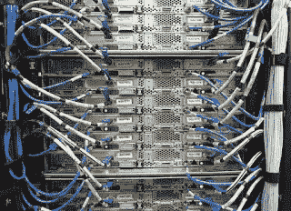

# 计算机网络的历史

> 原文：<https://medium.com/codex/a-history-of-computer-networking-b94f596fe20?source=collection_archive---------3----------------------->

[**计算机联网**](https://mayhemcode.blogspot.com/2021/06/a-history-of-computer-networking.html) 是指一组计算机或设备相互连接，以共享资源并与其他设备进行通信。

# 什么是计算机网络？

目前世界人口约为**76 亿**，如果我们看到连接到互联网的设备数量约为 500 亿，那么**每个人都在使用约 6 台连接到互联网的设备**。自从第一次使用计算机网络以来，这个数字还在增加。由于计算机网络的力量，一切都在变得自动化，并且有能力进行交流和自我管理。

你不能仅仅通过搜索主题并在几毫秒内得到结果来阅读这篇文章。只需点击几下鼠标，你就可以使用谷歌、YouTube 和观看其他内容，这一切都是因为强大的网络——互联网。互联网是网络的网络，其中连接到网络的每个设备都可以访问互联网上的任何内容。

对于每一项成就，我们都需要经历许多失败和考验。那么让我们来看看计算机网络的起源和演变，以及它为什么被创造出来。以及它是如何发展成具有这些巨大功能的互联网的。

# 计算机网络时间线

在计算机和网络出现之前，唯一的通信方式是通过发送信息的电报，如莫尔斯电码、密码或克雷塞电码。不久，它就演变成了使用电缆的电信，电缆是由亚历山大·格雷厄姆·贝尔发明的。计算机出现后，我们需要一个网络来处理它们。让我们看看事件的时间线。

年份可能不准确，但非常接近

*   **1836–1840**:这是交流的最初阶段，人们认为应该有一种相互交流的机制**电报**是这一时期他们用来交流的唯一方法
*   **1858–1866**:**电缆通信**在这些年得到了发展。城镇和城市之间架设了通讯电缆。但这仅限于少数几个地方。
*   **1875–1880**:亚历山大·格雷厄姆·贝尔发明的电话设备被考虑并被接受为一种通信设备。这是计算机网络的第一步。
*   1957 年:美国成立了一个被国防部称为**高级研究计划局(ARPA)** 的机构，用于在苏联发射第一颗人造卫星 Sputnik 时发展美国的计算机技术。

有关网络时间表的更多信息，请访问

# 计算机网络时间线

在计算机和网络出现之前，唯一的通信方式是通过发送信息的电报，如莫尔斯电码、密码或克雷塞电码。不久，它就演变成了使用电缆的电信，电缆是由亚历山大·格雷厄姆·贝尔发明的。计算机出现后，我们需要一个网络来处理它们。让我们看看事件的时间线。

年份可能不准确，但非常接近

*   **1836–1840**:这是交流的最初阶段，人们认为应该有一种相互交流的机制**电报**是这一时期他们用来交流的唯一方法
*   1858-1866 年 : **电缆通信**在这些年得到了发展。城镇和城市之间架设了通讯电缆。但这仅限于少数几个地方。
*   **1875 年至 1880 年**:亚历山大·格雷厄姆·贝尔发明的电话设备被认为是一种通信设备。这是计算机网络的第一步。
*   **1957** :美国成立了一个被国防部称为**高级研究计划局(ARPA)** 的机构，用于在俄罗斯或苏联向太空发射第一颗卫星 Sputnik 时发展美国的计算机技术。

有关互联网历史和时间表的更多信息，请访问

[https://mayhemcode . blogspot . com/2021/06/a-history-of-computer-networking . html](https://mayhemcode.blogspot.com/2021/06/a-history-of-computer-networking.html)

*原载于 2021 年 6 月 23 日 https://mayhemcode.blogspot.com**T21*[。](https://mayhemcode.blogspot.com/2021/06/a-history-of-computer-networking.html)