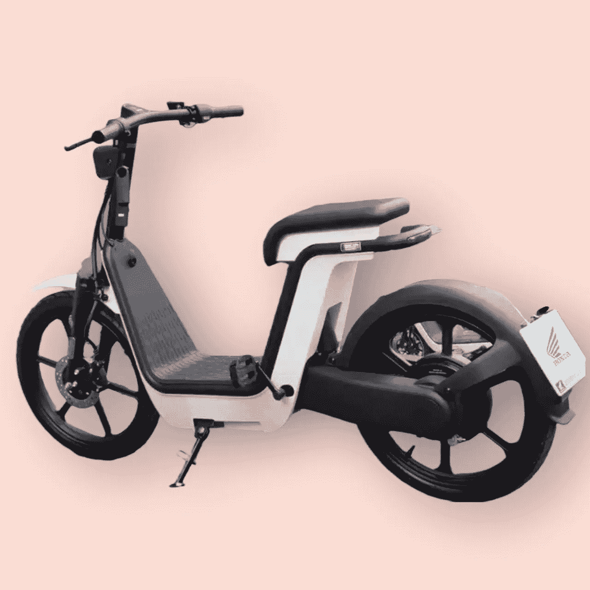

# 本田和无印良品合作生产了这款电动滑板车！

> 原文：<https://medium.com/codex/a-honda-muji-collaboration-turned-out-this-electric-scooter-54bd1f4619ee?source=collection_archive---------1----------------------->

## 上市的最新电动汽车

[本田的 MS01(本田媒体)](https://redirect.viglink.com/?format=go&jsonp=vglnk_166202544719611&key=76239cd054e44491885c2c206d3029f7&libId=l7iv12hj0102gvbw000DLbxf9rawo&loc=https%3A%2F%2Femailtuna.com%2Fmuji.com%2F4004213&v=1&out=https%3A%2F%2Fwww.muji.us%2Fstore%2F%3Futm_source%3Dnewsletter%26utm_medium%3Demail%26utm_campaign%3Dwk12_rebranding%26utm_content%3Dh1%26utm_source%3DMUJI%2BUSA%2BNewsletter%26utm_campaign%3D01b01394ed-EMAIL_CAMPAIGN_2021_03_18_10_14%26utm_medium%3Demail%26utm_term%3D0_7afad3f9a8-01b01394ed-284974165%26goal%3D0_7afad3f9a8-01b01394ed-284974165%26mc_cid%3D01b01394ed%26mc_eid%3D9e06777c6b&ref=https%3A%2F%2Fwww.google.com%2F&title=Simplicity%20in%20our%20packaging.%20-%20MUJI%20Email%20Archive&txt=%20%20)

当我第一次看到本田最新推出的 MS01 电动滑板车时，我最喜欢的是它的简单，没有真正的花里胡哨。它看起来像一种极简的交通工具，可以脚踏或仅依靠电力。当我潜入水中…