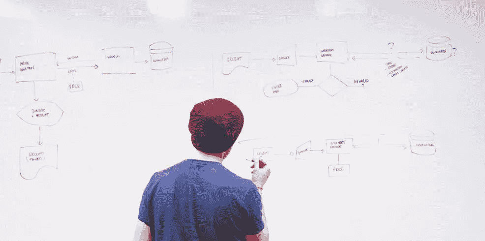

# 过度思考和过度工程

> 原文：<https://medium.com/codex/a-how-to-on-overengineering-and-overthinking-88a53a7fe435?source=collection_archive---------1----------------------->

## 软件工程

## 如何成为一名更有责任感的工程师

布雷特·塞勒斯·佩克斯的照片

# 鸭带

意大利艺术家 Maurizio Cattelan *，*通过简单的[用鸭子把香蕉粘在墙上](https://news.artnet.com/market/maurizio-cattelan-banana-art-basel-miami-beach-1722516)解决了他的一些问题，而我在我的职业生涯中一直是一名软件工程师，这就像艺术一样，有时可能会涉及到鸭子胶带。

我主要用 Java 工作，我喜欢它。它可能不是编写*【less】*代码的最佳工具，但它擅长于一切。

作为一名软件工程师和架构师，经过十年的编程和工作，我意识到了一些常见的陷阱。我喜欢认为我从错误中吸取了教训，但是真的有人能这么说吗？

你会犯同样的错误。不过没关系——每个人都会犯错误，无论是在生活中还是在软件工程中。

# 建筑软件

假设我们正在开发一个**聊天应用**。对我们来说很简单。

你希望能够**注册**和**登录**和**发送** **简单的** **短信**。为了这个例子——或者出于某种(不)神圣的原因——你决定反对所有的电话宣传，你正在建立一个只用于网络的聊天应用。

让我们来看看，你有一个前端和一个后端。所谓的“*后端*”——我指的是现在常见的——它只是前端 ie 的一个*后端。服务于用户界面的应用编程接口，你将有一组微服务在后面，通常包括你的核心业务微服务，消息服务等。也许是专用缓存集群或分布式缓存，也许是计费服务。*

这些只是一些后端，但是后端不能存储数据吧？因此，您还添加了至少一个数据库，可能还会添加一些 NoSQL。

照片由[启动股票照片像素](https://www.pexels.com/@startup-stock-photos/)

一段时间后，您可能需要一些用于监控、指标和警报的东西，然后，您还会添加一些用于分析的东西。当你开发了所有这些，你可能会有一个巨大的前端，或者如果你够狡猾，你开发了多个(前端微服务)，你一起为他们服务。

我不会深入讨论所有的集群、复制和故障转移之类的东西，比方说，现在是 90 年代，我们不关心高可用性和故障转移。

但是现在——让我们看看在我们的前端和后端服务上，单独关于代码构建了什么。当第一次考虑你的用例时，**一个聊天应用程序**，你可能认为你需要一个或两个代表用户的类，一个用于消息，一个用于联系人，如此而已，对吗？

这很公平——如果你现在想想，大概就是这样。

但是，这里有一个陷阱——我们开始开发 API，然后我们添加实体模型并使用 ORM。显然，您不希望向您的前端公开这一点，所以您添加了一个 DTO 模型，用于在 API 上发送和接受用户数据。

聊天信息也是如此。您还可以识别系统中的一些其他实体，并为这些实体创建多个模型。

这只是普通的好的旧数据建模。然后是职责分离，您希望存储库处理数据访问内容，为逻辑本身提供服务，然后是用于公开端点的 API REST 控制器。

同步还是异步？锁定还是不锁定？也许是数据库上的一些程序因为性能的原因？多线程？…

您还可以在后端服务中添加一些缓存组件和服务，可能还会添加一些调度程序。另外，REST 不是最适合消息传递的，对吗？—实时数据的网络套接字，我们开始了。

> **WebSocket** —名词
> 
> 1.WebSocket 是一种计算机通信协议，通过单一 TCP 连接提供全双工通信通道

然后，您希望遵循软件设计、数据和安全性方面的最佳实践，因此您开始创建工厂、管理器、事务处理、回滚、JWT 令牌授权码和 OAuth2 流。

在所有这些之后，您的代码、服务和整个平台都非常出色。

然而，停机时间还是会发生。但是你修补了它，对吗？也许用一些鸭子胶带。

自动化和脚本——或者软件世界中的鸭带。

这个故事可以继续下去。

要涵盖所有这些内容，将需要数周的时间才能完成，更不用说实施和设置所有内容了——所有这一切都是由一个想法或一个问题引起的

> "我希望能够注册、邀请和发送简单的纯文本消息."

我建议每个人都去学习所有这些概念。构建过于复杂的系统。

作者截图

就像很多人已经说过的那样——解决它。拥抱它。

但是，有一点我怎么强调都不为过——**从你的错误中吸取教训，开始用简单的术语思考**——解决问题最简单的方法是什么。

> **以简单的方式解决问题，提出特色和解决方案，这就是艺术。**

简化您的整个微服务生态系统，不要将解决方案应用于问题。

在你创建两个、三个或十个以上的 DTO 模型，或者所有独立的工厂、接口和实现，或者所有其他微服务、缓存、数据库、网关等等之前，问问并挑战自己和他人**这真的需要吗**。

我已经看到并且仍然看到其他人，包括我自己——堆积了如此多的类、方法、工厂、管理器、缓存、数据库、前端和后端，这可能是最重要的事情——**想简单**。

**软件是一种工具，用于解决给定的问题**。遵循最佳实践不是为了“*正确*”——而是为了解决问题并使之变得容易。

> **软件** —名词
> 1。告诉计算机如何工作的一组指令。

感谢您的阅读！🎉