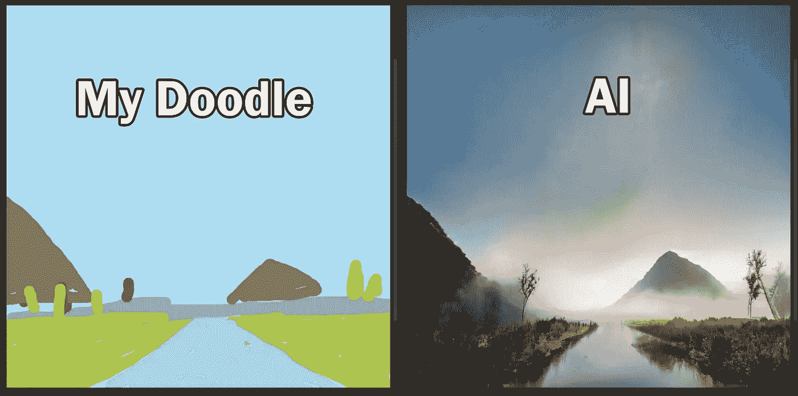

# 人工智能把你最基本的涂鸦变成了一幅令人瞠目结舌的画

> 原文：<https://medium.com/codex/a-i-turns-your-rudimentary-doodle-into-a-jaw-dropping-painting-37f9365e8ef6?source=collection_archive---------4----------------------->

图片作者[作者](/@jimclydemonge)

所以你很好奇人工智能是如何把你简单的笔触和涂鸦变成照片般逼真的场景的？

恩，英伟达宣布了它的[画布](https://www.nvidia.com/en-us/studio/canvas/)桌面应用程序，它可以帮助艺术家甚至是非创作者将他们的创作愿景带入生活。

但是在我进入细节之前，请花一点时间来欣赏这个人工智能能够做到的疯狂的现实场景…