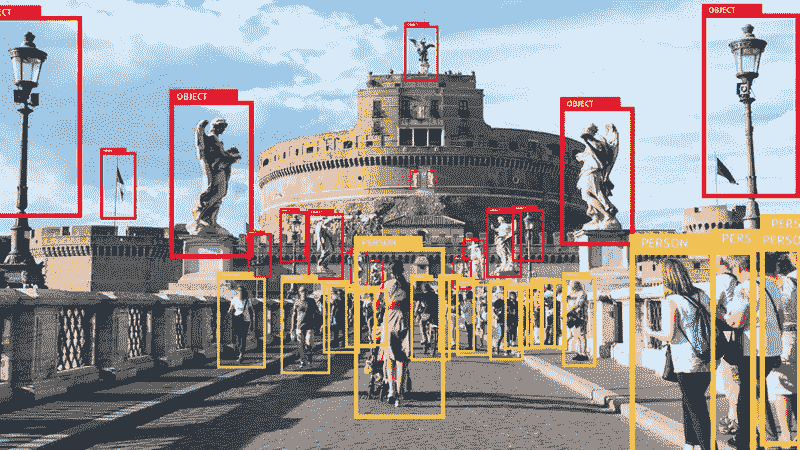

# 使用 Prodigy 进行计算机视觉项目时，需要记住的一件重要事情是

> 原文：<https://medium.com/codex/a-key-thing-to-remember-while-using-prodigy-for-your-computer-vision-projects-8f24cdc76aad?source=collection_archive---------10----------------------->

## 计算机视觉的图像标注

## 在使用 prodigy 进行图像注释时，请记住这一点

边界框注释—图像注释的一个例子

## 开始之前

这篇短文是在使用**图像注释工具**——**神童**——由…