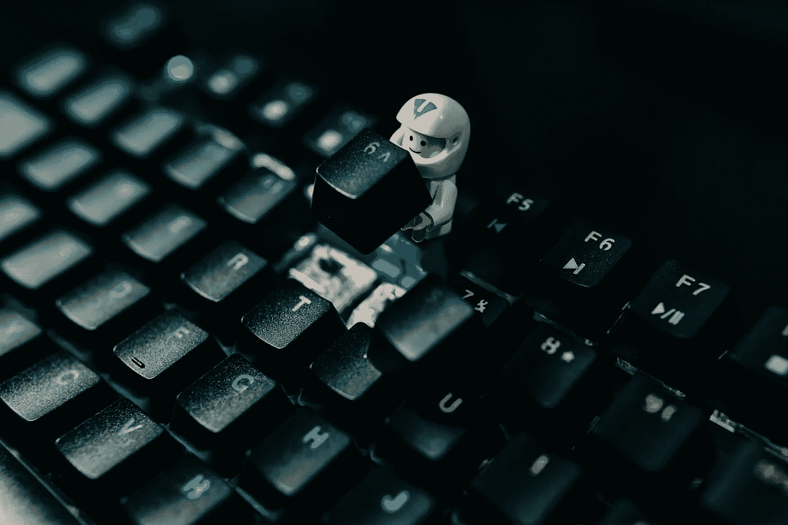

# 一点点健康的电脑偏执狂

> 原文：<https://medium.com/codex/a-little-bit-of-healthy-computer-paranoia-66ea6cbd1110?source=collection_archive---------15----------------------->

肯·苏亚雷斯在 [Unsplash](https://unsplash.com/s/photos/computer-security?utm_source=unsplash&utm_medium=referral&utm_content=creditCopyText) 上的照片

## 我只是想分享一些我为保持网络安全所做的事情。

谈到计算机安全，我是个门外汉。我很清楚，有很多人比我聪明得多，比我有经验，甚至可能比我更偏执。在这篇文章中，我试图总结我从比我了解的人那里学到的东西…