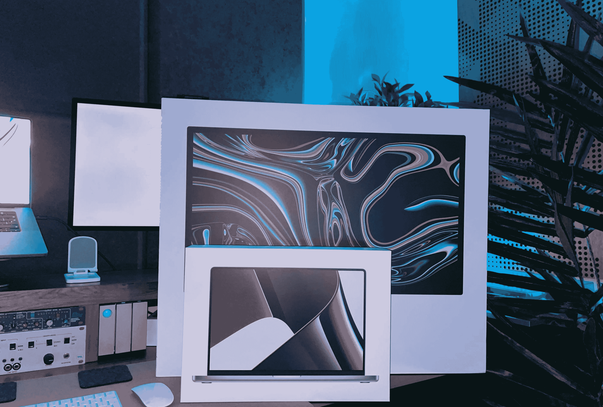
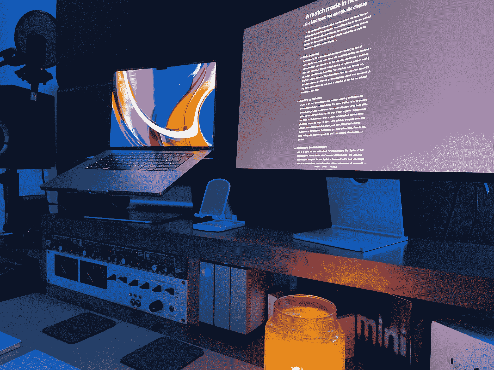
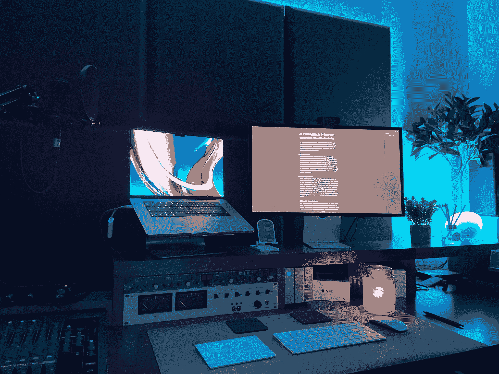

# Studio Display 和 MacBook Pro —天作之合

> 原文：<https://medium.com/codex/a-match-made-in-heaven-590f355b065f?source=collection_archive---------7----------------------->

## MacBook Pro 和 Studio display 是完美的搭档

图片由作者提供

你可以吃没有薯条的鱼，但谁会呢？你可以喝不加奎宁水的杜松子酒，但这是不可想象的。你可以在没有奶油的烤饼上涂果酱。你明白我的意思，只是因为你可以选择其中之一而不选择另一个，并不意味着你应该这样做。M1 MacBook Pro 和 Studio Display 也是如此。

## 起初

2021 年 11 月，当新的 MacBooks 发布时，我们都被苹果通过 M1 芯片和新的迭代所取得的成就震惊了——即 Pro & Max 版本的 SOC 处理器。作为独立的机器，有奇妙的。我面前现在就有一个，我正在做，我们什么都不缺。Thunderbolt 端口、SD 卡插槽、MagSafe 充电和 HDMI 端口，如果你也需要的话。数小时的电池续航时间，以及最华丽的键盘。然后是屏幕，哦，天哪，这个屏幕是别的东西，一会儿再看。但事实证明，这只是故事的一半。

 [## 我刚刚经历了一场周末恋情

### 我想我可能正式爱上了工作室的展示

medium.com](/codex/i-just-had-a-weekend-affair-c35c2e4caba1) 

## 使骨头变得丰满

因此，我们都忙于日常事务，用 MacBooks 来创造我们选择的挑战。选择 14 英寸或 16 英寸涵盖了所有需求、预算和要求。我知道很多人选择了 14 英寸，因为它更轻、更便携。我选择了较大的兄弟，以获得最大的屏幕，如果我想，仍然是移动的。我上周写了很多关于屏幕如何捉弄你的文章。它只是一台 16 英寸的笔记本电脑，但感觉足够大，可以用来创作和编辑。即使在复杂的工作流程上，比如多层 Photoshop 文档，或者 Premiere Pro 中的时间轴，也不会感到局促。迷你 LED 面板把你吸引住了，在上面工作完全是一种嗡嗡声。我们拥有了我们需要的一切…或者说，我们有吗？

## 欢迎来到工作室展示

图片由作者提供

所以到了今年三月，Peek 表演活动。在那个春天，最大的明星是 Mac 工作室，那里有最新的 M1 芯片 Ultra。但是，最让我感兴趣的是 Mac Studio 附带的东西 Studio Display。到了三月份，我知道我要去买一台 Mac。出于各种原因，我已经将范围缩小到 16 英寸的 MacBook，但我一直在想，从长远来看，更小的显示屏是否是一个错误。然后，嘿，转眼间，我的梦想实现了，我现在可以同时拥有两个世界的优点了。我的决定已经为我做出了 MacBook Pro 和显示器现在在篮子里，我是一个快乐的小创造者。

 [## 大小——并不完全像人们所说的那样！

### 大屏幕还像以前那么重要吗？

medium.com](/codex/size-not-all-its-cracked-up-to-be-a7cd7689a8ca) 

## 现实

我的 Mac 实际上在展示前 10 天就到了，我也很喜欢从它那里得到的东西。然后，上周末，我的工作室展示出现了。我必须有耐心，不能马上打开它，因为我想把它拍成视频——太好了，不能错过，嗯！我知道，我知道…

我第一次连接上它，正在拍摄一个视频。我立刻喜欢上了我所看到的，但是，可以理解的是，我的注意力被转移了，因为我要拍摄、编辑和上传视频。只是在我那天的工作结束后，我才开始坐下来专心思考。

## 获胜者是

图片由作者提供

毫无疑问，我们，用户和消费者，是赢家。如你所见，我的 MacBook 没有翻盖模式。当然不。它太漂亮了。我让他们并排坐在一起，在双显示器设置中工作。这是我觉得最有成效的一次。周日，我把工作室拆开，重新布置了一下——我讨厌杂乱，喜欢整洁的工作环境。我以为我了解视网膜屏幕，因为我现在只在 MAC 电脑上工作了十年或更长时间，但这两个面板将它带到了一个全新的水平。

众所周知，工作室展示实际上是在考虑 Mac 工作室的情况下制作的。但是 MacBook Pro 和 Studio Display 放在一起也不算太寒酸，我告诉你。

## 真是千钧一发

现在有时间反思一下，在显示器的整体质量上有一个赢家，那就是 MacBook。黑色更黑，颜色更丰富，一切都更有活力。我向你保证，我是在吹毛求疵，但我想尽可能给你最诚实的评价。听着，你可以，也将会，非常愉快地工作。如果你想移动和创造，相信我，没有什么能阻止你。你不能用质量代替移动性。但是，在你需要坐在办公桌前的日子里，这个工作室的展示是惊人的。能够在这两者之间转换是——嗯，我说不出话来。有了这两个苹果生态系统的最新成员，我的工作和创造力已经上升到了一个全新的水平。他们并不便宜，但我打算让他们自食其力，并从一开始就偿还我。

 [## 闭环系统

### 以及苹果断裂的供应链

medium.com](/codex/the-closed-loop-system-f1b2ee23a151) 

当我在这个工具包上编辑我的第一个视频时，我利用了工作室显示器上的额外空间，但是一旦我进行了颜色分级，我就检查两个屏幕上的输出。太酷了。我发现了以前可能会忽略的细微差别。我对任何视频的颜色都不满意。我喜欢我所看到的。

未来看起来五彩缤纷！

**原载于 2022 年 5 月 17 日 https://www.talkingtechandaudio.com/blog****的** [**。**](https://www.talkingtechandaudio.com/blog)