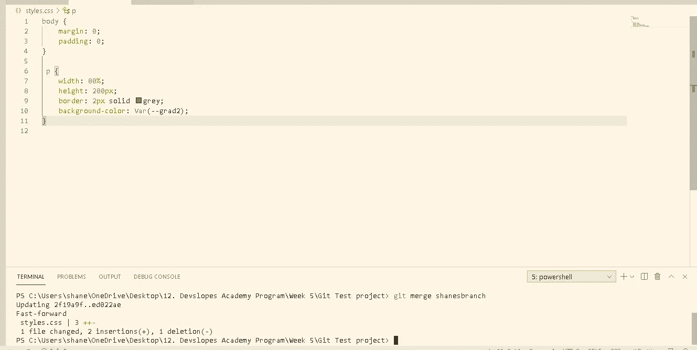

# 学习一些 Git 版本控制基础知识的迷你教程

> 原文：<https://medium.com/codex/a-mini-tutorial-to-learn-a-few-git-version-control-basics-e517603f7da1?source=collection_archive---------9----------------------->

## 更轻松、更轻松地开始。

如果您第一次尝试为您的专业或个人项目学习一些基本的 Git 版本控制并面临困难，您并不孤单。简单明了地说，Git 一开始有点令人困惑。

但这一定要令人困惑吗？

当我第一次坐下来学习在 web 开发项目中使用 git 版本控制时，我感到窒息、困惑和无法执行。术语不适合我，我需要从文档中解脱出来。

只有当我开始在终端中输入命令，并停止阅读技术解释时，我才开始获得一些理解。我将这种终端混搭方法浓缩成一个小指南，在这里列出。

将 git 命令串在一起并混合到终端中，对一个假项目进行版本控制，这很有趣。看着你的自信增长。然后，您可以自由直观地了解命令是如何连接的，而不用担心破坏您的项目或担心红色终端错误文本的爆炸。

在这个简单的指南中，您将编写几行最少的 HTML 和 CSS，然后开始在您的终端中执行一系列 Git 命令行，以熟悉在项目中使用它们。

通过这种方式，您不必立即阅读大量的文档，您可以轻松地在命令终端中编写 git。

我们假设第一步您已经安装了 Git。让我们跳进来。

1.  **打开你的 IDE** (我用的是 VS 代码)。
2.  **开始一个新的 HTML/CSS 项目**(注意:在你的项目文件夹中需要你的 HTML 和链接的 CSS 文件)。
3.  **在你的 html 中添加一个段落标签对，并写入一些文本**(如下例)。

加载了示例项目文件集合的“我的 IDE”视图。您只需要 index.html 和 styles.css 表

4.在你的 CSS 文件中，用一些声明写一个段落选择器。我还放置了一个空白和填充的 body 标签，但这是可选的。

CSS 表中带有几个声明的段落选择器也显示了一个可选的带有边距和填充声明的正文选择器。

5.如果您还没有打开终端，请打开终端。

6.编写 **git init** 并点击 enter 键(这将初始化您的第一个存储库)。

7.**更改您的一个选择器值。**我决定将我的段落宽度从 100%改为 80%。

8.编写 **git add。**或写下 **git add — all** 并点击回车。这一步列出了两个选项，您可以从中选择达到相同效果的选项。这是将所有适用文件添加到存储库暂存区域的一种方式。上面显示的破折号实际上是两个连续的破折号，更清楚的例子见下图)。

9.编写**git Commit-m " Your message here "**这将把更改保存到您的存储库中。自定义消息，仔细总结您的更改，以便更直观地使用。

到目前为止，我们已经做出了更改，并提交(保存)到存储库中。到目前为止，您只对主要分支进行了更改。接下来，我们将创建包含变更的分支，并将它们与原始分支重新组合。

10.在终端中写下 **git 分支**并点击回车。这将显示到目前为止您拥有的所有分支。主(main)旁边的星号表示您有一个分支，就是您原来的主分支。

主(主要)分支显示为参考

11.在终端中写入 **git 分支*Branch _ Name _ Here*T7。你想叫它什么都可以。**

12.接下来，再次编写 **git 分支**。现在，您应该将您的新分支视为一个选项。注意星号仍然在母版上。那是因为我们还没有转到我们的新分公司。让我们接下来做那件事。

13.在终端中写入**git check out*Branch _ Name _ Here***。您刚刚切换到新的分支机构。

14.接下来，再次编写 **git 分支**。原始主分支和新创建的分支显示为选项。请注意，星号现在出现在您的新分支上。

15.现在您已经在新的分支上，对 CSS 样式进行更改。我添加了一个基于变量的背景色，你不需要模仿它。任何变化都可以。

在新分支的段落标签上添加背景色

16.接下来写 **git add — all** 或 **git add。**将新分支机构中的变更添加到临时区域中。

17.接下来写 **git commit -m“在这里添加您的变更摘要”**您现在已经成功地在您的新分支上保存了变更。

旁注:看到它如何让你知道有多少插入和删除了吗？

18.现在我们已经更改了新的分支，我们在新的分支上，让我们切换回原来的主分支。编写 **git 结帐主机**

请注意，代码已经回复到主分支版本

19.现在，让我们用一个 merge 命令将新分支中的变更引入到主分支中。**写 git 合并*Branch _ Name _ Here***

20.现在看一下代码。请注意，您在新分支上所做的更改现在会反映在您的主分支上。您可以编写 **git 分支**并确认您实际上仍然在主分支上。

请注意，在新分支上所做的更改现在是主分支的一部分了。

21.让我们总结一下，删除多余的分支。**写 git Branch-d*Branch _ Name _ Here***

22.现在检查你有多少分支机构。写下 **git 分支**你会注意到只剩下主分支。

恭喜你，这应该给你一个简单的 git 命令的基本工作知识，以便在你的下一个项目中实现。

祝你的编程工作好运！