# 现代数据仓库工具:dbt &分析工程导论

> 原文：<https://medium.com/codex/a-modern-data-warehousing-tool-dbt-introduction-to-analytics-engineering-d4245d868e3c?source=collection_archive---------1----------------------->

## 利用 Docker 创建自己的实验室模拟英语教学。什么是分析工程。dbt 简介。ETL 和 ELT 有什么区别？

# 介绍

我已经用新工具开会三个星期了。在以新的工作范围开始新的工作后，我需要学习新的技术。我已经知道了一些工具，但在这段时间里，我对它们更加熟悉了。例如，我在开始工作之前就知道 Docker，但在此之前我并没有怎么使用它。然后，我习惯了 Docker，并开始用它做所有的事情😋

在这个故事中，我们将基于 Docker 创建自己的实验实验室来模拟 ELT 过程。我将使用 dbt 的[官方培训项目中使用的相同数据。但是会有区别，我会用 PostgreSQL 代替红移，雪花等。因为我不想花太多时间解释它们是什么，以及我们如何创建帐户等。其实我们的实验室会简单一点。我们将从源 AWS S3 读取数据，然后将数据加载到我们的 PostgreSQL 数据仓库中，该数据仓库是我们在实验室中使用 Docker 创建的。因此，我们将能够在本地数据仓库中使用 DBT。此外，我开始准备回购收集我的 dbt 笔记。您可以通过下面的链接访问它。我相信我会加强回购，但我不知道我是否会为我学习的每个 dbt 模块写一篇论文。](https://courses.getdbt.com/courses/fundamentals)

[](https://github.com/mebaysan/DBT-Training) [## GitHub - mebaysan/DBT-Training:我创建了这个 repo 来遵循 DBT 的官方培训路径

### 我创建了这个回购遵循 DBT dbt 基础 1-dbt-基础文件夹的官方培训路径是为…

github.com](https://github.com/mebaysan/DBT-Training) 

好的，首先让我们谈谈核心术语。我会把自己通过阅读理解的观点写出来。所以请不要评价我，如果你不同意我的观点，请记住；我不是说我知道最好的或者我的观点是不可讨论的等等。😇

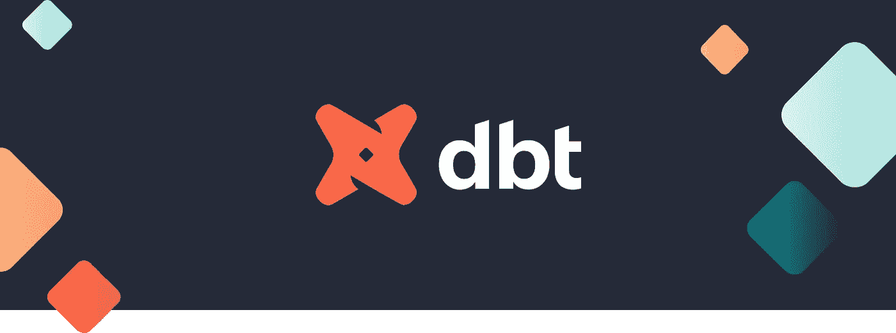

[图片来自 DBT](https://blog.getdbt.com/)

# 什么是 ELT，ELT 和 ETL 有什么区别？

首先，让我们从解释什么是 ETL 开始。ETL 是提取、转换和加载数据的过程。它从从数据源提取数据开始，继续将数据加载到另一个数据源进行转换，然后转换加载的数据。ELT 与 ETL 只是略有不同。ELT 的意思是提取、加载、转换。我们首先将数据从源数据库加载到我们的数据仓库，然后对其进行转换以供最终使用。我知道 ETL 是一个传统的过程，ELT 比 ETL 更现代一点，现在应用得更多。

ELT 通过转换数据仓库中加载的数据来减少我们的暂存步骤，而不是 ETL。

# 什么是分析工程？

我想我可以把分析工程描述为数据工程师和数据分析师之间的桥梁。基本上，他们在数据仓库中对数据集建模，为数据分析师等最终用户提供干净的数据集。在小型团队中，分析工程师的职责由数据分析师和数据工程师共同承担。如今，现代数据团队雇佣分析工程师。

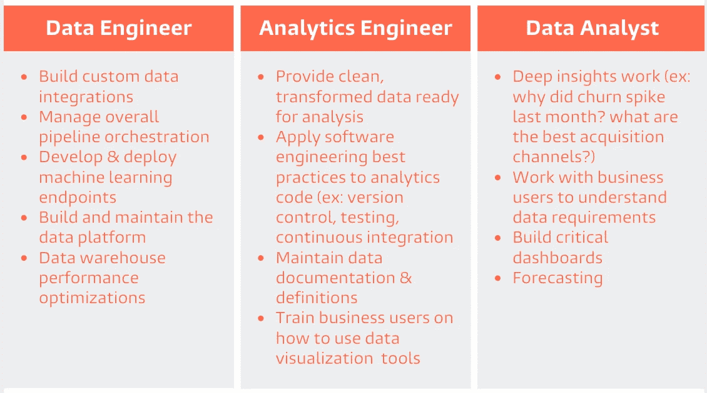

[图片来自 dbt](https://www.getdbt.com/what-is-analytics-engineering/)

如果你想深入了解分析工程，你应该查看下面的链接。

[](https://www.getdbt.com/what-is-analytics-engineering/) [## 什么是分析工程？

### 分析工程师向最终用户提供干净的数据集，以一种让最终用户能够回答以下问题的方式对数据进行建模…

www.getdbt.com](https://www.getdbt.com/what-is-analytics-engineering/) 

# 现代数据仓库工具:dbt

dbt 让我们有机会将软件工程最佳实践应用到我们的数据建模过程中。我们可以对数据转换过程进行版本控制。

[](https://www.getdbt.com/) [## dbt -转换仓库中的数据

### dbt 是一个数据转换工具，使数据分析师和工程师能够转换，测试和记录数据在…

www.getdbt.com](https://www.getdbt.com/) 

我们可以通过`select`语句转换数据仓库中的数据。

> [dbt 执行](https://docs.getdbt.com/docs/introduction) `[ELT](https://docs.getdbt.com/docs/introduction)` [中的](https://docs.getdbt.com/docs/introduction) `[T](https://docs.getdbt.com/docs/introduction)` [(提取、加载、转换)过程——它不提取或加载数据，但它非常擅长转换已经加载到您的仓库中的数据。](https://docs.getdbt.com/docs/introduction)
> 
> -官方 dbt 文件

开始尝试 dbt 吧！

# 创建实验码头实验室

实际上，我不会一步一步地解释这一部分。您可以使用下面的链接访问实验室资源。我更愿意解释实验室的主要逻辑和这个项目的主要组成部分。

[](https://github.com/mebaysan/DBT-Training/tree/main/1-dbt-Fundamentals) [## DBT-培训/1-dbt-main mebaysan/DBT 基础-培训

### 在学习本课程时，我使用了 dbt CLI 而不是 dbt Cloud。我选择 PostgreSQL 作为仓库，而不是…

github.com](https://github.com/mebaysan/DBT-Training/tree/main/1-dbt-Fundamentals) 

本实验室有 4 个核心文件:`loader_script.py`、`requirements.txt`、`Dockerfile`和`docker-compose.yml`。

文件正在为我们的实验室执行 EL、提取和加载过程。基本上，它从 CSV 文件中读取数据，然后将数据加载到我们已经在`docker-compose.yml`文件中创建的数据仓库中。

[](https://github.com/mebaysan/DBT-Training/blob/main/1-dbt-Fundamentals/lab/loader_script.py) [## DBT-培训/loader_script.py 在梅贝桑/DBT-培训

### 此文件包含双向 Unicode 文本，其解释或编译可能与下面显示的不同…

github.com](https://github.com/mebaysan/DBT-Training/blob/main/1-dbt-Fundamentals/lab/loader_script.py) 

在`docker-compose.yml`文件中，我们准备了实验室。Docker 首先创建一个名为`WarehouseDB`的 PostgreSQL 数据库。然后启动`loader`服务，将数据加载到`WarehouseDB`中。

[](https://github.com/mebaysan/DBT-Training/blob/main/1-dbt-Fundamentals/lab/docker-compose.yml) [## DBT-Training/docker-compose . yml at main mebaysan/DBT-培训

### 此文件包含双向 Unicode 文本，其解释或编译可能与下面显示的不同…

github.com](https://github.com/mebaysan/DBT-Training/blob/main/1-dbt-Fundamentals/lab/docker-compose.yml) 

`loader`服务从`Dockerfile`开始构建。首先，它安装需求，然后启动到`WarehouseDB`的加载过程。最后，它创建了 3 个模式；`transformed`、`jaffle_shop`和`stripe`。然后，将数据加载到`jaffle_shop`和`stripe`中。

[](https://github.com/mebaysan/DBT-Training/blob/main/1-dbt-Fundamentals/lab/Dockerfile) [## DBT ----在梅因梅拜桑/DBT 的培训/档案----培训

### 此文件包含双向 Unicode 文本，其解释或编译可能与下面显示的不同…

github.com](https://github.com/mebaysan/DBT-Training/blob/main/1-dbt-Fundamentals/lab/Dockerfile) 

我们可以通过使用 Docker 创建的实验室来模拟我们的 ELT 程序。为此，我在`lab`文件夹中定位我的终端。

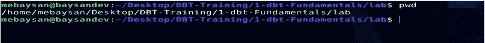

作者图片

我可以执行下面的代码来运行实验室。

```
docker-compose up -d
```


作者图片

现在，如果我连接到`WarehouseDB`数据库，我可以看到我们的加载器服务创建的模式。

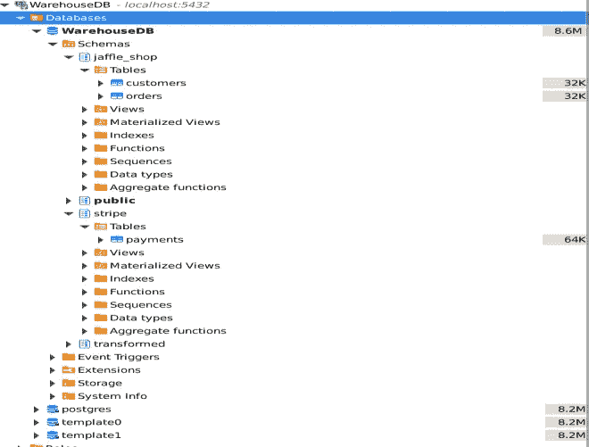

作者图片

现在，让我们开始与 dbt 会面。

# dbt 的第一步

有几种[安装 dbt 的方法](https://docs.getdbt.com/dbt-cli/install/overview)。我选择使用 pip 来安装它。然后，我可以使用 dbt CLI 创建一个空的 dbt 项目。

```
dbt init
```

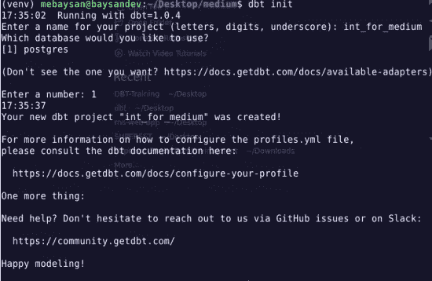

作者图片

我们在下图中看到由`dbt init`命令创建的默认文件。

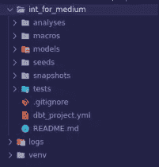

作者图片

## 核心 dbt 组件

`dbt_project.yml`文件保存了我们的 dbt 项目的核心设置。

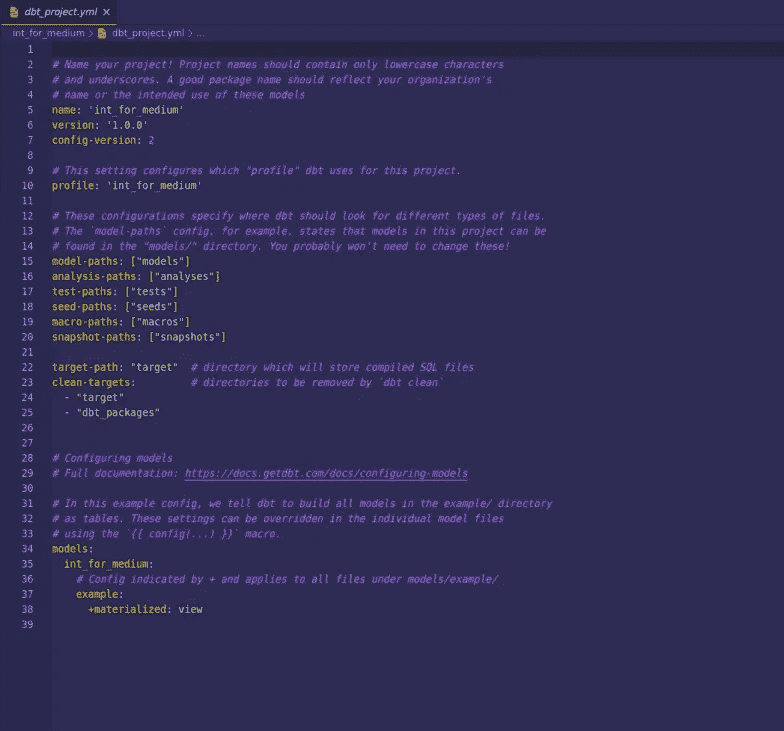

作者图片

文件夹存放着我们的模型。在这个文件夹中，我们用`SELECT`语句编写 SQL 模型。然后 dbt 在这个文件夹下查找，并将数据转换到数据仓库中。在本教程中，我们将只使用`models`。

我们还有另一个非常重要的文件，它保存了 dbt 的数据库凭证。该文件位于`~/.dbt/profiles.yml`中。在这个文件中，我们必须设置我们的数据库凭证，并且我们可以很容易地在生产和开发环境之间进行转换。

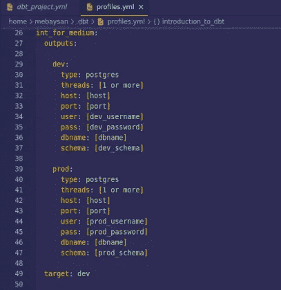

作者图片

现在，我要为我们的`WarehouseDB`更改这个文件。

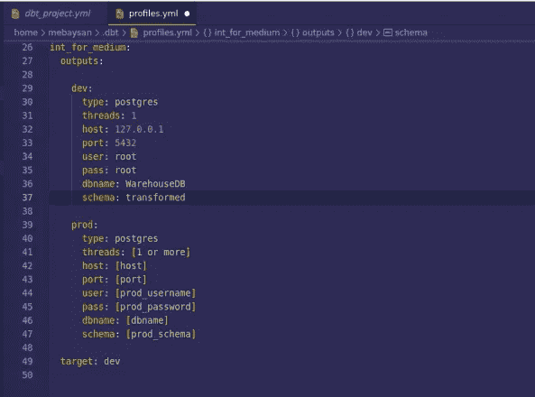

作者图片

dbt 自动将转换后的数据加载到我们在该文件中设置的模式中。

## 创建我们的第一个 dbt 模型

我将在`models`文件夹下创建一个基本的`sql` SQL 文件:`first_model.sql`。我们将创建一个模型来运行下面的纯 SQL 查询。

```
select 
o."STATUS" as "ORDERSTATUS", p."PAYMENTMETHOD", p."STATUS" as "PAYMENTSTATUS", count(o."ID") as "ORDERCOUNT"
from jaffle_shop.orders o 
left join stripe.payments p on o."ID" = p."ORDERID" 
group by o."STATUS",  p."PAYMENTMETHOD", p."STATUS"
```

该查询返回以下结果。

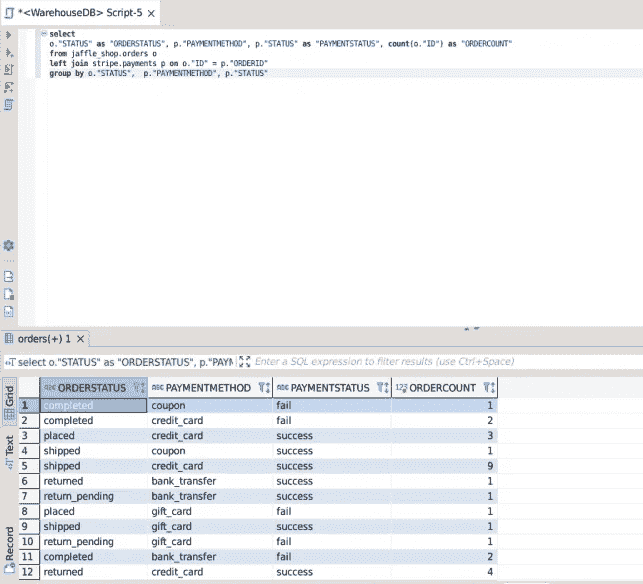

作者图片

在 dbt 模型中，我们使用通过使用`WITH`子句创建的临时表。我们在下面看到了对我们的`first_model.sql`模型的查询。

```
with orders as (select * from jaffle_shop."orders"),payments as (select * from stripe."payments"),final as (selecto."STATUS" as "ORDERSTATUS", p."PAYMENTMETHOD", p."STATUS" as "PAYMENTSTATUS", count(o."ID") as "ORDERCOUNT"from orders oleft join payments p on o."ID" = p."ORDERID"group by o."STATUS",  p."PAYMENTMETHOD", p."STATUS")select * from final
```

然后我们运行`dbt run`来运行所有的转换模型。

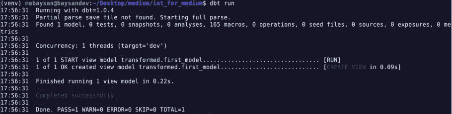

作者图片

dbt 将所有模型转换成视图。我们可以在我们的`WarehouseDB`数据库中的`first_model`视图下看到我们的转换模型。

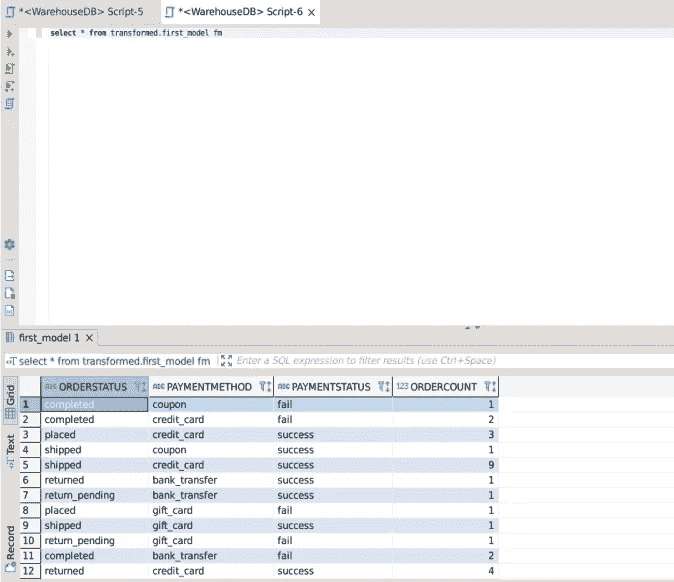

作者图片

## 更改 dbt 型号的配置

如果我们想将我们的模型加载到一个表中，我们需要在模型文件的顶部使用`config`。

```
{{
config(
materialized = "table"
)
}}...
```

现在，我在执行了`dbt run`之后查看数据库。

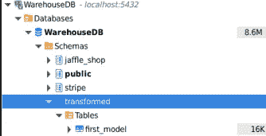

作者图片

可以查看[这里](https://docs.getdbt.com/reference/model-configs)了解 dbt 车型上的其他配置。

## 参考 dbt 模型

我们可以通过使用`{{ref('model')}}`在不同的 dbt 模型中使用 dbt 模型。我要改进我的模型。

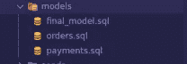

作者图片

在`orders.sql`中，我从`orders`表中提取一些列来创建我的最终模型。

```
selecto."ID", o."STATUS" as "ORDERSTATUS"from jaffle_shop."orders" o
```

在`payments.sql`中，我从`payments`表中提取所需的列来创建我的最终模型。

```
selectp."PAYMENTMETHOD", p."STATUS" as "PAYMENTSTATUS", p."ORDERID"from stripe."payments" p
```

然后，我创建了`final_model.sql`。在这个文件中，我使用了上面创建的模型。

```
with orders as (select * from {{ref('orders')}}),payments as (select * from {{ref('payments')}}), final as (selecto."ORDERSTATUS", p."PAYMENTMETHOD", p."PAYMENTSTATUS", count(o."ID") as "ORDERCOUNT"from orders oleft join payments p on o."ID" = p."ORDERID"group by o."ORDERSTATUS",  p."PAYMENTMETHOD", p."PAYMENTSTATUS")select * from final
```

我们看到数据通过使用我们创建并加载到仓库中的模型进行了转换。


作者图片

# 最后

希望你喜欢。我很喜欢写作。学习新事物对我来说是如此的愉快。尤其是，如果我可以用它们来赚钱🙃我对 dbt 很陌生。我会继续学习 dbt。我还将扩展我创建的回购，以遵循官方的 [dbt 培训计划](https://courses.getdbt.com/collections)。您可以使用下面的链接访问回购。

[](https://github.com/mebaysan/DBT-Training) [## GitHub - mebaysan/DBT-Training:我创建了这个 repo 来遵循 DBT 的官方培训路径

### 我创建了这个回购遵循 DBT dbt 基础 1-dbt-基础文件夹的官方培训路径是为…

github.com](https://github.com/mebaysan/DBT-Training) 

问候