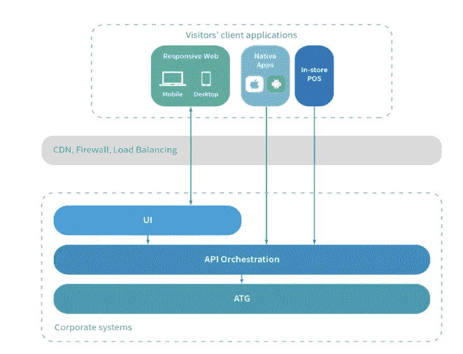

# 现代用户界面和移动应用程序的重新设计将零售商推向未来

> 原文：<https://medium.com/codex/a-modern-ui-and-mobile-app-redesign-launches-retailers-into-the-future-3fe3fca8b1c0?source=collection_archive---------27----------------------->

文章最初发布在 [Grid Dynamics 博客](https://blog.griddynamics.com/?utm_source=medium&utm_medium=referral&utm_campaign=modern_UI_and_mobile_app_redesign_article)

## 由[马克斯·马丁诺夫](https://blog.griddynamics.com/author/max-martynov/)

如今，每个零售商都必须支持移动设备才能具有竞争力，但我们的客户走在了潮流的前面。他们希望为喜欢移动设备的青少年客户群提供真正棒的移动体验。他们意识到，他们必须升级现有的网站和移动应用程序架构，以实现向未来的飞跃。这个客户求助于 Grid Dynamics，该公司以其在移动优先的电子商务平台重建方面的记录而闻名。通过使用这里描述的工程实践，我们一起成功地将这个客户端的 UI 和移动应用程序提升到了一个全新的水平。

# 成功的用户界面平台迁移的成功方法

五大理念对该项目的成功至关重要:

1.  从遗留平台中提取前端，用一个轻量级、可伸缩的应用程序替换它，该应用程序仍然与现有的后端系统完全集成。
2.  设计丰富的用户体验。一个流畅的，交互式的，快速加载的。
3.  通过卓越的测试和架构实践，开发出稳定易用的移动应用。
4.  实施 CI/CD 管道以自动化 QA 流程并缩短上市时间，同时保持高质量标准。
5.  积极参与项目，确保高标准的成功完成。

既然要点已经提出来了，让我们按顺序逐一讨论。

# 我们如何构建一个能够承受高峰流量的前端

我们的客户知道他们必须构建一个新的 UI 来创建一个架构上合理的、可伸缩的平台。将 UI 层从 ATG 中分离出来，让它在云上运行，可以提供更好的可伸缩性和性能。平台迁移的一个重要目标是构建一个可以轻松扩展的 UI，通过部署在云上来满足他们不断增长的负载。

然后，我们构建了一个 API 编排层，以便新的数字商店可以与所有第三方系统和 ATG web 服务一起工作。这使得我们的客户能够在不放弃他们喜欢的 ATG 后端和网络服务的情况下改进他们的网络用户界面。该解决方案架构如下所示:

除了提高可伸缩性，我们还想减少负载以提高站点性能。我们这样做的一个方法是使用无状态架构。无状态服务器在会话期间为每个用户提供相同的页面，而不是特定的页面。这大大减轻了服务器的压力。为了进一步降低负载，我们利用内容交付网络(CDN)将缓存的信息存储在比客户的中央系统更靠近客户的服务器上。这些旨在提高可伸缩性和降低负载的变化确保了站点性能，即使在节假日高峰期也是如此。

# 打造丰富的用户体验

我们客户的顾客用手机购物，他们需要高质量、身临其境的参与。在当今时代，购物者期望在所有设备上获得无缝、高质量的体验，因此必须保持高标准。

从 ATG 中提取 UI 层使我们能够构建一个现代的、响应性的、自适应的 web 应用程序，无论设备的大小或质量如何，它都能够无缝地进行调整(有关我们如何构建响应性 UI 的详细解释，请查看我们的博客文章)。帮助移动购物者的另一个实现是用于结账的单页应用程序。这导致消费者更快地结账(从而降低挫折感)，提供与本地应用同等水平的用户体验。移动设备上的性能也提高了，因为不重新加载页面减轻了互联网连接的压力。这种整体改进的应用程序带来了更高的转换率，这是我们客户在平台迁移中的主要目标之一。

我们决定同时使用客户端和服务器端渲染。增加窗口部件和互动页面的数量可以让用户对网站保持兴趣。客户端呈现适用于用户敏感的页面，因为它更适合呈现这些页面并使它们保持最新。服务器端渲染仍然用于静态页面，如主页或产品页面，因为它对搜索引擎优化性能更好，加载速度更快。

# 稳定移动应用

该客户以前的开发人员开发了一款昂贵、华而不实但不稳定的应用。10%的用户会话以崩溃告终，削弱了所有酷的新功能。这种不稳定性是由带有严重技术债务的糟糕的代码库、缺乏单元测试和总体质量控制差造成的。结果是代码难以维护且更新成本高昂。需要一种新的方法来解决这些潜在的问题。

在考虑了几个选项后，我们选择了 VIPER 和 Android 组件(分别针对 iOS 和 Android)作为我们的应用程序架构策略。这些方法将应用程序组件分成不同的层，创建小的、划分好的、易于测试的单元。这使我们能够将有问题的遗留代码与新功能的开发代码隔离开来，从而提高稳定性。

我们决定使用极限编程(XP)，这是一种敏捷软件开发框架，旨在生产更高质量的软件。所有代码在提交到构建之前都经过了同行评审，这有助于在 bug 进入生产之前将其删除。我们还实现了一个 CI/CD 管道，它在短开发周期内建立了自动化的快速构建。实施这些措施后，事故率在六个月内从 10%降至 0.03%。

然而，我们关注的不仅仅是稳定性。对于用户来说，一个应用的响应时间和一般的有用性可能是最先注意到的事情——而第一印象是至关重要的。看起来迟钝的应用程序令人沮丧，让消费者大倒胃口。因此，我们在改造应用程序时重点关注了这些元素。最重要的是，我们确保应用程序快速响应。我们完成的应用程序非常稳定，超出了用户的预期。

# 确保网站的质量

原生应用并不是项目中唯一需要达到质量标准的部分。该网站也需要大量测试，以确保代码没有错误和其他缺陷。我们知道，每一个因为缺陷而失去的顾客都意味着零售商收入的损失，而且这种损失会很快累积起来。我们利用现代质量工程实践来确保快速修复错误，限制暴露和潜在的损害。这包括实施 CI/CD 管道以及著名的测试实践，例如:

*   单元测试:分解代码的每一部分，检查它是否按预期工作
*   回归测试:确保新的变化和更新不会导致先前安装的特性不能正常工作
*   集成测试:测试 UI 和后端之间的集成即使在最复杂的场景下也是稳定和流畅的

# 采取主动

工程学中一个不被重视的部分是采取主动。最好的工程师不只是做他们被告知的事情，他们拥有项目以确保成功。在研究了我们客户的网站后，我们意识到在他们的 ATG 平台上很难满足他们的需求。我们向客户提议考虑将 ATG 平台迁移到一个新的用户界面上，这个用户界面是可扩展的，可以部署到云上。这是一件大事。客户现场的许多人都是以前开发团队的成员。我们的改变实质上是消除了他们几个月来的辛勤工作。实现这一点需要我们致力于项目，客户必须灵活并愿意改变。他们一致认为这是一个明智的决定。

# 结果如何？

我们的平台在年底的假期前上线，取得了令人印象深刻的结果。对于可伸缩性来说，黑色星期五是一个麻烦的日子，但它安然无恙。在网络星期一，销售额同比增长了 30%。数字销售持续快速增长，全渠道体验被认为是其增长的关键原因。我们客户投资移动用户的赌博在很大程度上获得了回报。

# 外卖

可扩展性和创造优质用户体验的问题是每个在线零售商必须处理的问题。事实上，随着在线流量的持续上升，这些问题正在加剧。有时候，与其零敲碎打地解决问题，不如从头开始。

从过时的架构(如 ATG)到基于开源技术的云部署的可扩展应用程序的平台转换可以同时解决许多问题。我们的平台化是几个改进领域的核心。可扩展性得到了提升，全渠道平台提高了用户预期，原生移动应用变得稳定。他们的新用户界面很现代，更新快，容易使用，比支付 ATG 的许可费还便宜。重新搭建平台并不容易。这是一个漫长的、多步骤的过程，需要质量工程。但是好处是值得的:伟大的工程很重要！[如果您对贵公司的这一解决方案更感兴趣，请联系我们](https://www.griddynamics.com/contact?utm_source=medium&utm_medium=referral&utm_campaign=modern_UI_and_mobile_app_redesign_article)！