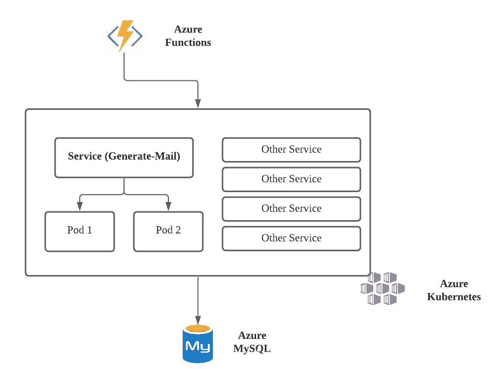
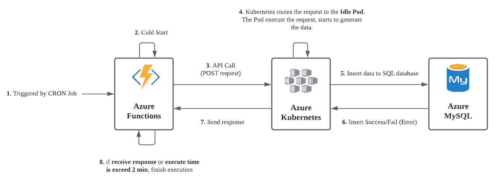
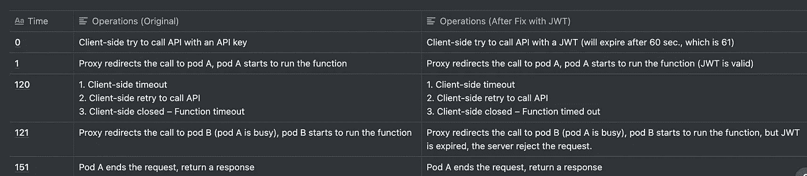
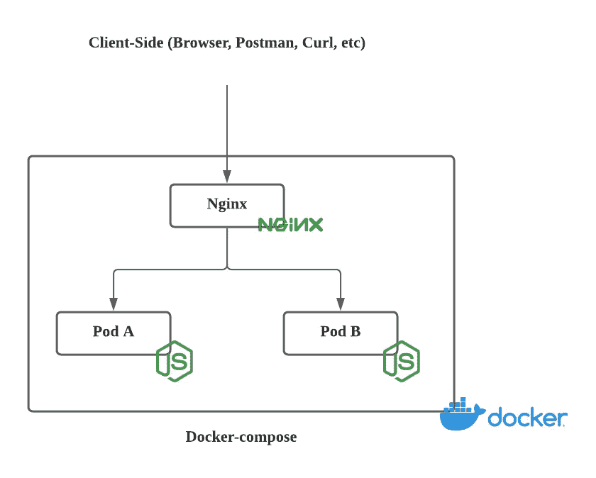
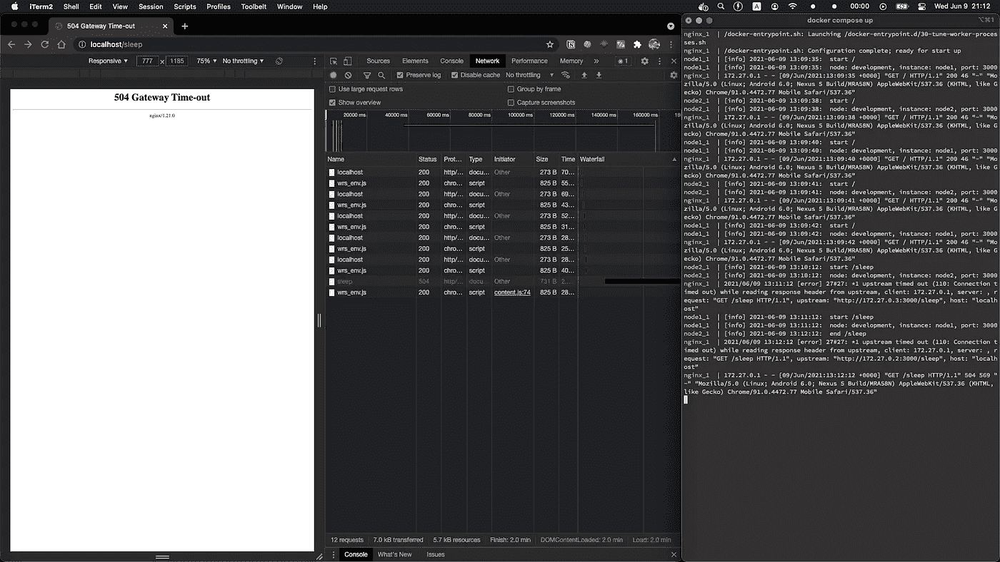

# Nginx 的一个神秘 Bug

> 原文：<https://medium.com/codex/a-mysterious-bug-with-nginx-7e19d3d4eea9?source=collection_archive---------5----------------------->


由[凯文·Ku](https://unsplash.com/@ikukevk?utm_source=medium&utm_medium=referral)在 [Unsplash](https://unsplash.com?utm_source=medium&utm_medium=referral) 上拍摄的照片

我在 API 维护过程中遇到了一个神秘的 API bug，这是由于客户端在使用 **Nginx** 时意外超时造成的，在本文中，我将谈谈:

```
* Before we dive in
    - The Overview of the Service
    - The Workflow of API
* So, What is the bug?
* How to reproduce?
* How to solve it?
    - Minimize the Request Time
    - Kubernetes Routing
    - Event-Driven Queue
    - API Authentication
* Why does it happen?
    - Why timed out?
    - Why does timed out cause another server to run the request?
    - Can we adjust the timed-out?
* Summary
* References
```

# 在我们开始之前

## 服务概述

在深入研究这个 bug 之前，这里有一个我们服务的简单概述，让你知道这个 API 是如何工作的:



*   **Azure 函数**:该函数每天都会触发 API([Cron job](https://en.wikipedia.org/wiki/Cron))。
*   **服务(Generate-Mail)**:API 提供者，一旦调用 API，就会开始检索用户的信息，然后生成临时数据，用于以后发送用户邮件。
*   **Azure MySQL** :存储临时数据。

更详细的解释:

```
- [Azure Function](https://azure.microsoft.com/en-us/services/functions/): A serverless solution in Azure, it’s like a single-runnable function on the cloud. — [Azure Kubernetes](https://azure.microsoft.com/en-us/services/kubernetes-service): A container-orchestration system, it can automating deployment, scaling and management, etc. — Service: Our backend service that provides API service. — Pod: Like a single VM, it’s like a replica of the service. — [Azure MySQL](https://azure.microsoft.com/en-us/free/mysql/search/): same as MySQL but it’s run on the cloud.
```

## API 的工作流程

让我们来看看 API 工作流程:



1.  由 CRON 作业触发的函数
2.  [冷启动](https://azure.microsoft.com/en-us/blog/understanding-serverless-cold-start/):这是无服务器应用的一个行为，总而言之，你的功能需要时间启动(比如分配内存)。
3.  API 调用。
4.  Kubernetes 将请求路由到**空闲 Pod** 。Pod 执行请求，开始生成数据。
5.  将数据插入 SQL 数据库。
6.  插入成功/失败(错误)
7.  发送响应。
8.  如果函数收到响应或者执行时间超过 2 分钟，结束执行:`2 min`可以在 [Azure](https://docs.microsoft.com/en-us/azure/azure-functions/functions-scale) 上配置。
9.  另一个服务(电子邮件发送服务)将使用临时数据发送电子邮件。(我们将跳过这一部分，专注于 bug 是如何产生的)

# 那么，什么是 bug 呢？

有一天早上，我发现我收到了来自我们服务部门的`2`封邮件，每个人包括客户都收到了 2 封邮件。让我们做一些自上而下的调查。

*   发邮件服务:这是一个生产者-消费者的关系，根本原因应该在生产者一方，而不是这一部分。
*   Azure 函数日志(简化):API 似乎被很好地触发了(我们知道由于执行时间很长，函数会超时)。

```
2021-05-30 22:01:05 Executing 'Functions'
2021-05-30 22:01:05 Queue trigger function 
2021-05-30 22:01:06 Run POST API request 
2021-05-30 22:03:05 Timeout
2021-05-30 22:03:05 Executed 'Functions' (Failed, Duration=120000ms)
```

*   Azure Kubernetes 日志(Pod A):好的，看起来 API 调用正确。

```
2021-05-30 22:01:06 Start API request with API key 
2021-05-30 22:02:06 Send 123 emails out 
2021-05-30 22:02:07 End API request
```

*   天蓝色库伯内特原木(B 舱)

```
2021-05-30 22:03:06 Start API request with API key 
2021-05-30 22:04:09 Send 123 emails out 
2021-05-30 22:04:09 End API request
```

我们知道 Pod A 已经在运行 API 请求，但是为什么 Pod B 同时也在运行请求呢？

# 如何繁衍后代？

为了挖掘这个错误，我试图重现它，看看它是否只是一个罕见的情况，我用相同的参数、头、API 键调用了 API，它确实在 Pods A 和 B 中调用了两次！

如果这不是一个罕见的情况，一切似乎都很顺利，那么应该是什么问题呢？我们可以假设:

*   一些原因导致 Azure 函数重试请求。
*   让 Kubernetes(或者更准确地说，Kubernetes 内部的 **Nginx** 重试。
*   API 本身就有缺陷。

甚至错误的根本原因也很难说，但它确实对我们的客户产生了巨大的影响(没有人希望重复的邮件填满他们可怜的邮箱，尤其是已经充满大量垃圾邮件的邮箱)。第一要务是:**修复那个 bug** ！

# 怎么解决？

问题很清楚:**让 API 请求只发生一次**，我们在试图重现它的时候有一些线索，所以让我们考虑不同的方面:

## 最小化请求时间

如果是 API 请求时间过长导致客户端(Azure 函数)超时，那么我们只需要减少执行时间。然而，该服务与来自其他内部服务的多个 API 调用相结合，加上我们仍然不知道 API 对客户端的响应应该有多短，这样做太冒险了。

## Kubernetes 路由

Kubernetes 帮助我们以一种简单的方式路由 API 请求，但是在这种情况下，也许这也是一个根本原因？工作流和日志显示，如果我们只有一个 pod，那么只能在一个 pod 中调用 API(即使有人想再次调用，pod A 也很忙，因此应该阻塞请求，并告诉客户端服务器端很忙)。

然而，**我们不能保证我们服务的高可用性**，这意味着如果 API 调用发生在 Pod A 关闭时，没有人能够处理 API 请求。

## 事件驱动队列

为了确保一件事情只由一个实例处理，队列可以很容易地解决消费者-生产者问题。我们可以通过在 Azure Function 和 Kubernetes 之间添加一个队列来稍微改变一下工作流，当一个请求生成时，将其发送到一个队列，Kubernetes 使用其中的数据来确保只有一个 pod 接收到请求。

虽然这是一个干净的解决方案，但我们需要更多地关注通过添加新服务来修复 2 个服务，这将需要很多时间。

## API 认证

回到开始，如果我们让请求发生两次，但禁止一次执行，会怎么样？**过期的密钥？**[**JWT(JSON Web Token)**](https://jwt.io/)**！**

JSON Web Token 是一个提议的互联网标准，用于创建带有可选签名和/或可选加密的数据，其有效负载包含断言一些声明的 JSON。使用私有秘密或公共/私有密钥对令牌进行签名。— [维基](https://en.wikipedia.org/wiki/JSON_Web_Token)

我们需要的是 JWT 的一个标准字段— `exp`(到期时间)，JWT 将到期，在`exp`之后，该请求将被视为无效请求，不予处理。

我们只对 Azure 函数中的 API 键做了微小的改动，让服务器能够用 JWT(已经内置)处理请求。

对其工作原理的详细解释(假设:请求执行时间= 150 秒，函数超时= 120 秒):



好在 bug 已经修复了，但是挥之不去的调试过程推动着我们去寻找根源，对吧？既然范围太大找不到根本原因，那就做一个删减版来找为什么会发生。

# 为什么会这样？

你可以用这个 GitHub 库找到所有代码并自己运行它们。首先，我们使用两个带有 Nginx 的容器作为负载均衡器来模拟与上面相同的工作流(但是经过了简化):



在`docer-compose.yml`中，我们为我们的服务器定义了 Nginx 和 2 个实例(称为 node1、node2)

在`nginx.conf`中，我们赋予 2 台服务器同等的权重:

在 app.ts 中，我们定义了 2 个 API:

*   我们使用一个空的 URL 来进行健康检查

*   `/sleep`会休眠 120 秒然后发送消息给客户端

你可以看到一段时间后(2 分钟)，客户端得到一个超时，Nginx 也向每个服务器发送一个请求。



让我们来看看日志:

这里我们发现了一些东西，Nginx 得到了一个*上游超时*，这意味着它认为这个服务器不能处理请求，然后它应该转向另一个服务器寻求帮助，但事实上，服务器只是很忙，但仍在处理原始请求，这就是为什么我们得到重复数据！

我们可以把它分成三部分:

1.  为什么超时了？
2.  为什么超时会导致另一个服务器运行请求？
3.  我们能调整超时吗？

## 为什么超时了？

超时是为了防止客户端无休止地等待服务器，客户端可以把它作为一个信号，这个服务器没有运行或有麻烦，它不能解决我的请求。

## 为什么超时会导致另一个服务器运行请求？

使用 Nginx 时，一旦当前服务器无法处理请求，请求就会被路由，也就是说，请求会转到另一个服务器。更具体地说，`nginx.conf`用`upstream`定义我们的一组服务器:

```
upstream node-app {
        server node1:3000 weight=1;
        server node2:3000 weight=1;
    }
```

> ***如果在与服务器通信的过程中出现错误，请求将被传递到下一个服务器*** *，以此类推，直到所有运行正常的服务器都被尝试。如果无法从任何服务器获得成功的响应，客户端将收到与最后一个服务器通信的结果。—* [*Nginx*](http://nginx.org/en/docs/http/ngx_http_upstream_module.html#upstream)

## 我们能调整超时吗？

我们可以将`proxy_read_timeout`添加到比你的请求时间更长的`Nginx.conf`中，API 现在可以继续处理它的请求并正确地返回给客户端。

> `*proxy_read_timeout*` *定义从代理服务器读取响应的超时。仅在两次连续读取操作之间设置超时，而不是针对整个响应的传输。如果代理服务器在此时间内没有传输任何内容，则连接关闭。—* [*Nginx*](http://nginx.org/en/docs/http/ngx_http_proxy_module.html#proxy_read_timeout)

就是它，我们变通，终于找到了根本原因！

# 摘要

因此，下一次当使用 Nginx 作为服务器的负载平衡器时，记得检查 API 的超时时间，如果 API 执行时间超过 60 秒，请尝试减少超时时间或将`proxy_read_timeout`添加到 Nginx 配置中。

现在，我要回去在 Nginx 中再次修复这个问题……

# 参考

[](https://stackoverflow.com/questions/18740635/nginx-upstream-timed-out-110-connection-timed-out-while-reading-response-hea) [## NGINX:从上游读取响应头时，上游超时(110:连接超时)

### 我将 Puma 作为上游应用服务器运行，将 Riak 作为我的后台数据库集群。当我发送一个请求…

stackoverflow.com](https://stackoverflow.com/questions/18740635/nginx-upstream-timed-out-110-connection-timed-out-while-reading-response-hea) [](https://superuser.com/questions/746028/configuring-nginx-to-retry-a-single-upstream-server) [## 配置 nginx 重试单个上游服务器

### 感谢给超级用户贡献一个答案！请务必回答问题。提供详细信息并分享您的…

superuser.com](https://superuser.com/questions/746028/configuring-nginx-to-retry-a-single-upstream-server)  [## 小心 HTTP 请求自动重试

### 在本帖中，我将讨论我们最近遇到的一起由于 HTTP 协议令人惊讶的行为而导致的事件。我会…

blogs.oracle.com](https://blogs.oracle.com/ravello/beware-http-requests-automatic-retries)  [## 模块 ngx _ http _ 代理服务器 _ 模块

### ngx_http_proxy_module 模块允许将请求传递到另一个服务器。示例配置位置/ {…

nginx.org](http://nginx.org/en/docs/http/ngx_http_proxy_module.html)