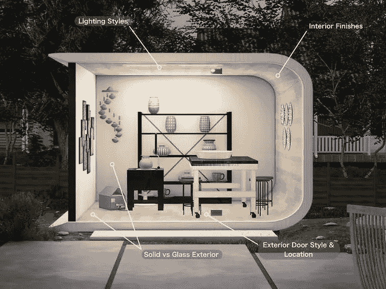

# 建造房屋的新方法:用回收塑料进行 3D 打印

> 原文：<https://medium.com/codex/a-new-way-to-build-homes-3d-printing-with-recycled-plastic-9467f9f4fc44?source=collection_archive---------7----------------------->

## 最佳创新

[3D 打印空间(媒体由 Azure Printed Homes 提供)](https://static.wixstatic.com/media/875fe3_ede3fddfb546454b85e7a8d175ea85ed~mv2.jpg/v1/fill/w_756,h_566,al_c,q_85,usm_0.66_1.00_0.01,enc_auto/unnamed-2.jpg)

我们都知道，我们的世界面临的一个主要问题是如何处理所有的塑料垃圾。似乎每天都有关于海洋生物或垃圾填埋场塑料垃圾超载的悲剧事件的新报道。但是如果我们能利用这些塑料垃圾做些有意义的事情呢？什么…